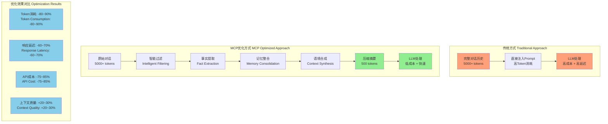
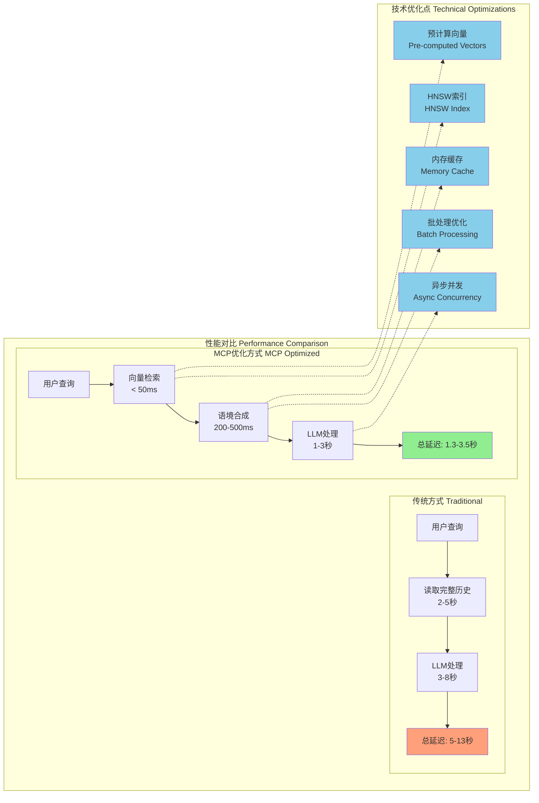
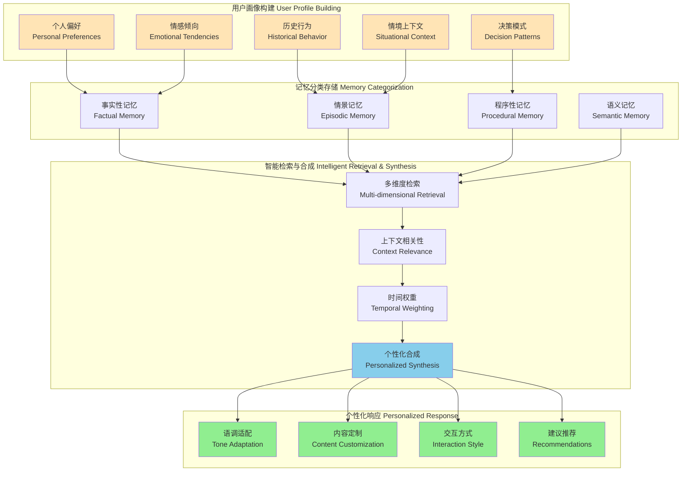
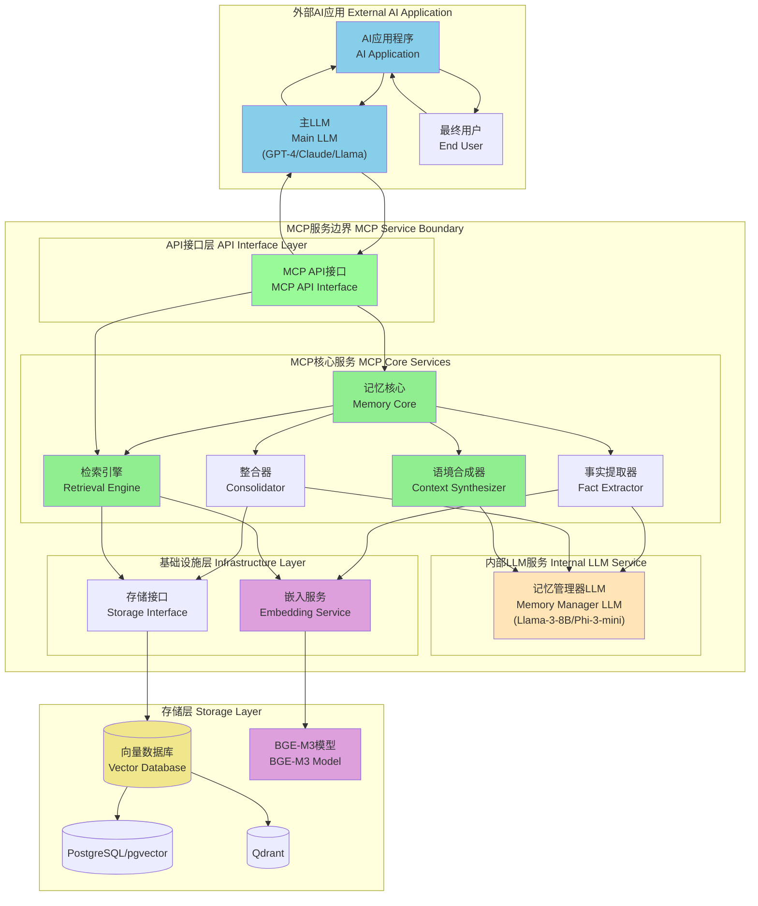
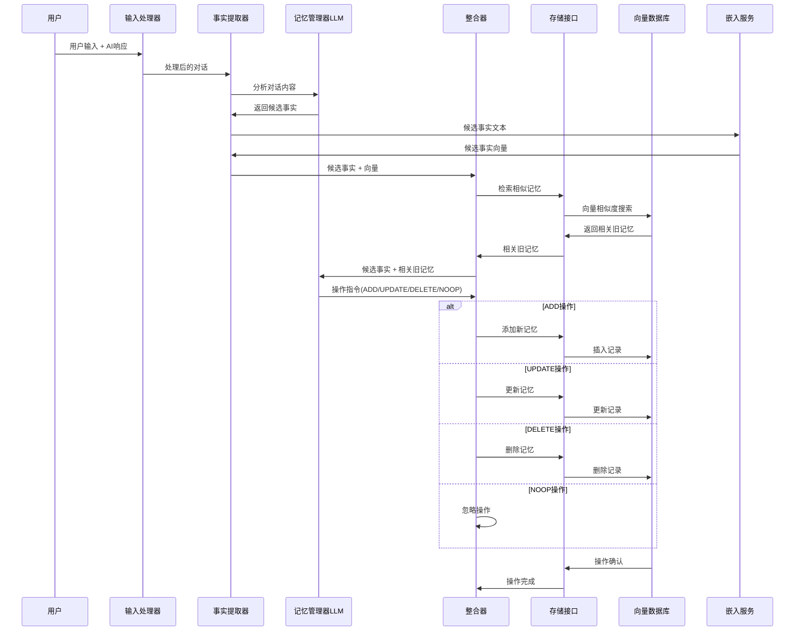
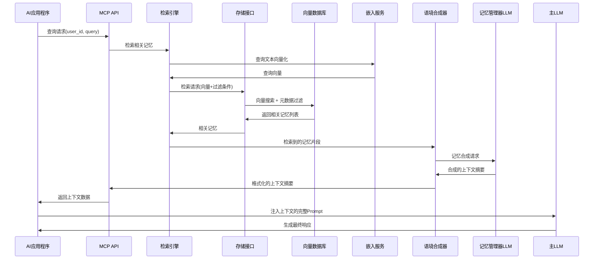
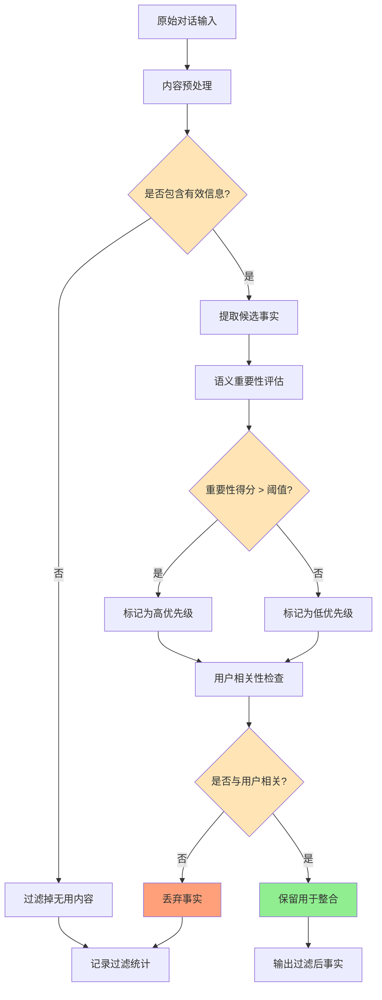
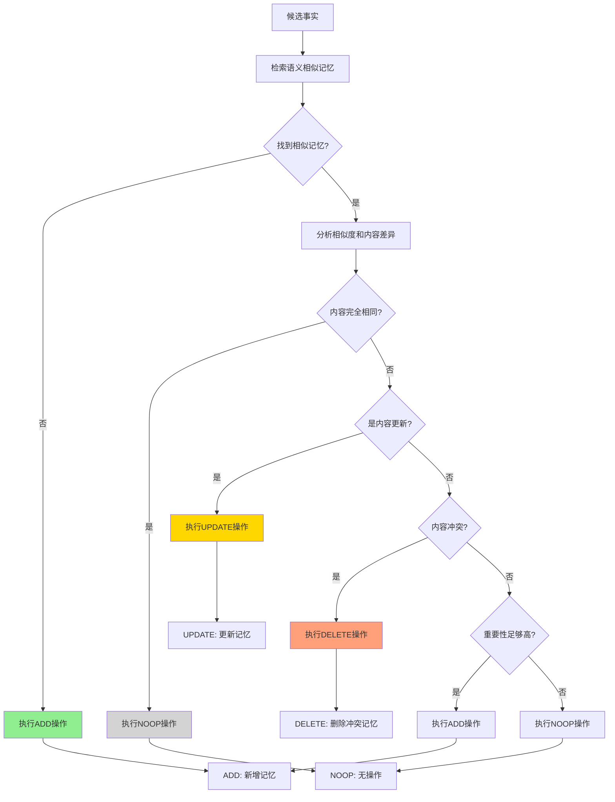
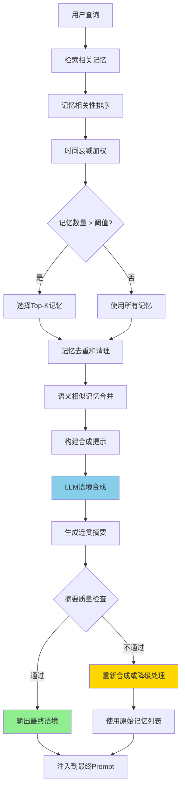
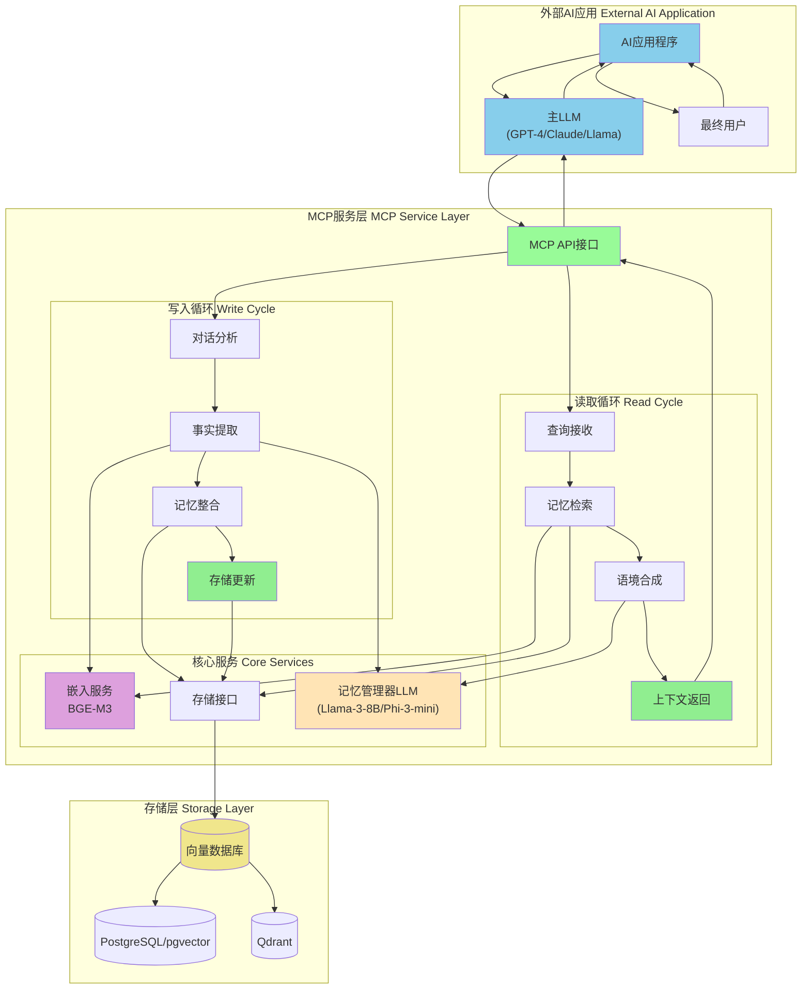

# 本地记忆语境化与持久化 (MCP) 工具技术设计文档 (扩展版 V2)

## I. 执行摘要：构建本地记忆语境化与持久化 (MCP) 层的必要性

### 1.1 问题陈述：健忘的 AI 代理
当前的大语言模型 (LLM) 应用在本质上是无状态的，其交互能力受到有限上下文窗口的根本性制约 [1]。这种“一次性”的交互模式导致了诸多深层次问题，严重限制了 AI 从简单的“工具”向智能“伙伴”的进化。具体而言，这些问题体现在多个层面：

**用户体验的断裂**：用户被迫在每次对话中反复重申个人偏好（"我喜欢简洁的回答"）、项目背景（"我们正在讨论的是上周那个项目"）和历史指令（"记住，输出格式要用 Markdown"）。这种重复不仅效率低下，更严重破坏了对话的流畅性和沉浸感，让用户感觉自己面对的是一个患有严重短期记忆丧失症的机器，而非一个智能体。

**运营成本的失控**：随着对话历史的线性增长，为维持上下文而消耗的 token 数量呈爆炸式增加，直接导致 API 成本和响应延迟的攀升 [2, 3]。在长对话场景下，上下文 token 的成本甚至可能超过生成 token 本身，形成一种不可持续的经济模型。这使得需要长期、连续交互的应用（如个性化教育、心理咨询、长期项目助理）在商业上变得难以实现。

**智能深度的局限**：仅仅通过暴力扩展上下文窗口长度，并不能从根本上解决这一核心问题。研究和实践均表明，当上下文长度超过一定阈值后，模型会出现显著的"注意力衰减"或"迷失在中间"现象 [4, 5, 6]。这意味着模型难以有效定位和利用长篇输入早期的关键信息，最终依然会遗忘重要细节，例如忘记初始设定的角色、忽略关键约束条件，或丢失用户画像的关键部分。这种现象揭示了一个基本事实：我们需要一种远比简单存储聊天记录更智能、更高效的机制，来构建真正具备长期、可靠记忆能力的 AI 系统。这不仅仅是工程问题，更是实现更高层次人工智能的认知科学问题。

### 1.2 解决方案：MCP 工具
本文档旨在设计一个受 mem0.ai 架构启发的、完全本地化的记忆语境化与持久化 (Memory Contextualization and Persistence, MCP) 工具。该工具作为一个智能记忆层，旨在将非结构化的、混乱的对话数据，通过 LLM 自身的智能，转化为一个结构化、持久化且能够自我演进的知识库，供 AI 代理使用 [3, 7]。其核心目标是通过智能化的记忆管理，实现以下关键价值：

**大幅降低 Token 消耗**：通过智能压缩和提炼对话历史，用一段高度浓缩的上下文摘要替代冗长的原始聊天记录，仅将最相关的信息注入提示词。这种"信号"与"噪音"的分离，预计可削减高达 80-90% 的 prompt token 消耗，从根本上改变成本结构 [4, 5, 8]。这意味着，原本需要 5000 token 上下文的对话，现在可能只需要 500 token 的精炼记忆就能达到甚至超越原有的效果。

#### Token 消耗优化架构图


**降低延迟并提升响应速度**：用户体验对延迟极为敏感。一次亚 50 毫秒的向量数据库查找，远快于让 LLM 实时处理数千甚至数万 token 的完整上下文。通过预先处理和检索记忆，MCP 工具能够显著降低 p95 延迟，为实时、流畅的交互体验提供保障 [3, 5]。这对于需要即时反馈的应用场景（如实时客服、动态游戏 NPC）至关重要。

#### 响应速度优化架构图


**增强响应质量与个性化**：通过维持跨会话的持久化记忆，AI 代理能够记住用户的偏好、历史决策、特定背景乃至情感倾向。这使得 AI 从一个通用的、无差别的工具，转变为一个能够与用户共同成长的个性化伙伴，提供真正具有连续性和同理心的交互体验 [2, 8]。例如，一个记得用户上次项目进展的 AI 助手，可以在新会话开始时主动询问："上次我们讨论到项目 A 的第三阶段，现在进展如何？"

#### 个性化增强架构图


### 1.3 核心原则与范围
本设计将遵循 mem0.ai 所体现的 foundational principles，并在此基础上进行本地化实现，确保系统的健壮性与实用性：

**智能过滤 (Intelligent Filtering)**：并非所有信息都值得记忆。信息过载是记忆系统的大敌，存储不相关的“噪音”不仅会增加存储成本，更会严重干扰后续的检索精度。系统必须利用 LLM 的语义理解能力，从对话中提取出有价值的“信号”，即原子化的事实，并评估其重要性 [2, 9]。例如，在一次对话中，“今天天气真好”通常是噪音，而“我下周要去北京出差”则是需要被记录的信号。

**动态整合 (Dynamic Consolidation)**：记忆不是静态的数据转储，而是一个动态演进的知识库。为了防止记忆变得“陈旧”或产生内部矛盾，系统必须能够根据新的信息对现有记忆进行新增 (ADD)、更新 (UPDATE)、删除 (DELETE) 或忽略 (NOOP) 操作，以保持其准确性和时效性 [2, 5]。这模仿了人类记忆的巩固和遗忘过程，确保记忆库是一个鲜活的、反映最新状态的知识体系。

**语境合成 (Contextual Synthesis)**：在响应生成阶段，系统不会将检索到的原始记忆片段直接堆砌到提示词中。这种做法效率低下且增加了主 LLM 的认知负荷。相反，它会利用一个专门的 LLM 将这些记忆合成为一段简洁、连贯的摘要，实现一种“即时上下文生成”(Just-in-Time Context Generation)，为最终的 AI 代理提供高质量、低 token 占用的上下文 [5, 8]。

本地优先与可插拔架构 (Local-First and Pluggable)：为满足日益增长的数据隐私、主权和合规性需求（如 GDPR），整个技术栈，包括嵌入模型和向量存储，都将在本地环境中运行。存储后端被设计为可插拔模块，支持在 PostgreSQL/pgvector 和 Qdrant 之间灵活切换，以适应不同的生产环境需求和性能偏好 [9]。

## II. 基础概念与系统架构
### 2.1 架构哲学：超越 RAG 与聊天历史
为了构建一个真正有效的记忆系统，必须在概念层面将其与两种常见的技术路径——检索增强生成 (RAG) 和简单的聊天历史记录——明确区分开来。

记忆 vs. RAG：RAG 是一种强大的技术，擅长从一个静态、外部的知识库中检索事实以增强 LLM 的回答 [10]。我们可以将其类比为 AI 的“语义记忆”（Semantic Memory），即关于世界的一般性知识，比如“法国的首都是巴黎”。然而，RAG 在本质上是无状态和非个人的。它不知道提问的用户是谁，用户之前问过什么，或者上一次交互的结果是成功还是失败。它仅仅是针对当前查询的信息检索器。相比之下，本 MCP 工具所定义的"记忆"提供了至关重要的**"情景记忆"(Episodic Memory)**。它追踪并存储与特定用户相关的事件、偏好、历史决策和对话的演进过程，从而构建一个动态的、与特定用户绑定的知识图谱 [2, 3, 10]。简单来说，如果 RAG 是让 AI 拥有了一座图书馆，那么记忆就是让 AI 拥有了一本关于‘你’的、持续更新的私人日记。前者提供了广博的知识，而后者则赋予了 AI 个性化和同理心。

记忆 vs. 聊天历史：将原始的聊天记录直接存储并作为上下文提供给 LLM，是一种极其低效且不可扩展的方法。这如同保留每一次会议的完整录音，而不是整理出简洁的会议纪要 [9]。对话中充满了冗余、口语化表达和非核心信息，即“噪音”。MCP 架构的核心理念是利用 LLM 的智能，从这些噪音中提取出有价值的“信号”——即原子化的、自包含的结构化事实 [9]。这种方法将非结构化的对话流转化为一个可查询、可维护的结构化知识库，从而实现了从“数据存储”到“智能记忆”的跃迁。我们可以将其比作一个高效的 CRM 系统与一堆杂乱无章的名片之间的区别。

### 2.2 AI 记忆的五大架构支柱 (改编自 mem0.ai)
本 MCP 工具的设计将围绕 mem0.ai 所提出的五大架构支柱展开，这为构建一个生产级的记忆系统提供了坚实的理论框架 [9]。

LLM 驱动的事实提取 (LLM-Powered Fact Extraction)：这是记忆系统的入口和质量保障的第一环。系统的首要任务是利用一个 LLM 对会话进行深度分析，从中提取出原子化的、有意义的事实。这个过程决定了记忆库的基础质量，高质量的提取是后续所有操作的前提。

用于语义相似性的向量存储 (Vector Storage for Semantic Similarity)：提取出的事实被转换成高维向量嵌入，并存储在专门的向量数据库中。这使得系统能够超越传统的关键词匹配，基于语义的相似性来进行高效的记忆检索，从而理解用户的真实意图，即使措辞完全不同。

用于关系建模的图存储 (Graph Storage for Relationships - 未来工作)：mem0.ai 的增强版 Mem0g 引入了图数据库，用于存储实体（如人、地点、项目）及其之间的关系（如“隶属于”、“偏好”、“位于”）[1, 6, 9]。这使得系统能够进行更复杂的多跳推理，回答那些需要连接多个离散记忆才能得到答案的问题（例如，“用户A在项目X中提到的那位同事B，他的技术专长是什么？”）。在本设计中，这将作为未来重要的增强方向被明确标识。

混合检索智能 (Hybrid Retrieval Intelligence)：一个成熟的记忆系统不仅仅依赖于向量相似度。它会像一个侦探一样，结合多种信号来做出判断。例如，它会综合考虑记忆的时间近因性（最近的记忆更重要）、元数据过滤（只看这个用户的记忆）和系统预设或模型动态评估的信息重要性评分，来检索最相关、最精确的记忆。

生产级的灵活基础设施 (Production-Ready, Flexible Infrastructure)：系统的设计必须具备高度的灵活性和弹性，以应对不断变化的技术和业务需求。通过定义清晰的抽象层（如存储接口），实现核心组件（如向量数据库）的可插拔替换，从而避免供应商锁定，并允许根据成本、性能或数据隐私需求进行灵活的技术选型 [9]。

### 2.3 高层系统图与数据流
本 MCP 工具的架构由一系列协同工作的组件构成，形成一个闭环的记忆处理与应用流程。

#### 2.3.1 MCP服务架构图


#### 2.3.2 组件定义

输入处理器 (Input Processor)：接收最新的对话轮次，通常包含用户的提问和 AI 助手的回答。

记忆核心 (Memory Core)：系统的"大脑"，负责执行记忆的生命周期管理。

事实提取器 (Fact Extractor)：由一个"记忆管理器 LLM"驱动，负责从输入中提取候选记忆。

整合器 (Consolidator)：同样由"记忆管理器 LLM"驱动，对候选记忆与现有记忆进行比较，并决定执行 ADD, UPDATE, DELETE, NOOP 中的哪一种操作。

存储接口 (Storage Interface)：一个抽象层，负责与后端选择的向量数据库（PostgreSQL/pgvector 或 Qdrant）进行通信。

检索引擎 (Retrieval Engine)：当新的用户查询到来时，该引擎根据查询内容向存储接口发起检索请求。

语境合成器 (Context Synthesizer)：接收检索到的记忆片段，并利用"记忆管理器 LLM"将其合成为一段简洁、连贯的上下文摘要。

#### 2.3.3 数据流处理

整个系统的数据流可以被描述为一个双循环过程：记忆的"写入"循环和"读取"循环。

**写入循环（记忆更新）流程图:**


**读取循环（语境生成）流程图:**


#### 2.3.4 核心原则实现流程

**智能过滤 (Intelligent Filtering) 流程:**


**动态整合 (Dynamic Consolidation) 决策流程:**


**语境合成 (Contextual Synthesis) 处理流程:**


#### 完整MCP服务调用架构图


### 2.3.5 MCP服务定位说明

**MCP服务的正确定位**：MCP工具是一个专门为AI大模型提供增强上下文的**后端服务**，而不是面向最终用户的应用。其工作模式如下：

1. **调用方**：AI应用程序中的大模型（如GPT-4、Claude、Llama等）
2. **服务功能**：接收用户查询，返回相关的记忆上下文摘要
3. **返回内容**：格式化的上下文信息，直接注入到大模型的prompt中

### 记忆管理器LLM详细说明

**记忆管理器LLM**是MCP系统内部使用的专门模型，负责以下核心任务：

#### 功能职责
1. **事实提取**：从对话中识别和提取值得记忆的原子化事实
2. **记忆整合**：决定对新事实执行ADD/UPDATE/DELETE/NOOP操作
3. **语境合成**：将检索到的记忆片段合成为连贯的上下文摘要

#### 推荐模型选择
- **本地部署**：Llama-3-8B-Instruct、Phi-3-mini、Qwen2-7B-Instruct
- **云服务**：GPT-4o-mini、Claude-3-Haiku、Gemini-1.5-Flash
- **选择标准**：成本效益、响应速度、结构化任务处理能力

#### 为什么需要专门的LLM
- **任务专一性**：处理结构化的记忆管理任务，不需要通用对话能力
- **成本优化**：使用小模型降低运营成本
- **响应速度**：小模型推理更快，提升用户体验
- **本地部署友好**：便于完全本地化部署，保护数据隐私

**关键注意**：记忆管理器LLM是MCP服务的内部组件，用户和外部AI模型都不会直接与其交互。

### 2.3.6 MCP服务API调用示例

#### 典型调用流程
```python
# AI应用程序调用MCP服务的示例
import requests

class MCPClient:
    def __init__(self, mcp_service_url):
        self.base_url = mcp_service_url
    
    def store_conversation(self, user_id, conversation):
        """存储对话到记忆系统（写入循环）"""
        response = requests.post(
            f"{self.base_url}/memory/store",
            json={
                "user_id": user_id,
                "conversation": conversation,
                "session_id": "session_123"
            }
        )
        return response.json()
    
    def get_context(self, user_id, query):
        """获取相关上下文（读取循环）"""
        response = requests.post(
            f"{self.base_url}/memory/context",
            json={
                "user_id": user_id,
                "query": query,
                "max_memories": 5
            }
        )
        return response.json()

# 在AI应用中的使用方式
mcp_client = MCPClient("http://localhost:8000")

# 1. 用户与AI对话后，存储对话
conversation = {
    "user_input": "我是一个素食主义者，每天需要130g蛋白质",
    "ai_response": "作为素食主义者，您可以通过豆类、坚果等获得蛋白质..."
}
mcp_client.store_conversation("user_42", conversation)

# 2. 新对话开始时，获取相关上下文
user_query = "推荐一些高蛋白的素食食谱"
context_data = mcp_client.get_context("user_42", user_query)

# 3. 将上下文注入到主LLM的prompt中
enhanced_prompt = f"""
根据以下用户的背景信息来回答问题：

{context_data['context_summary']}

用户问题：{user_query}
"""

# 4. 调用主LLM生成回答
main_llm_response = call_main_llm(enhanced_prompt)
```

#### MCP服务返回的数据格式
```json
{
  "success": true,
  "context_summary": "用户是素食主义者，每日蛋白质目标为130g。偏好通过天然食物获取营养，关注健康饮食。",
  "relevant_memories": [
    {
      "content": "用户是素食主义者",
      "confidence": 0.95,
      "created_at": "2024-01-15T10:30:00Z"
    },
    {
      "content": "每日蛋白质目标130g",
      "confidence": 0.90,
      "created_at": "2024-01-15T10:30:00Z"
    }
  ],
  "metadata": {
    "user_id": "user_42",
    "query_time": "2024-01-20T15:45:00Z",
    "memories_found": 2
  }
}
```

## III. 技术栈选择：LlamaIndex vs 自定义实现

在实现MCP工具时，我们面临一个重要的技术选择：是使用成熟的LlamaIndex框架，还是基于mem0.ai的设计自定义实现。

### 3.1 LlamaIndex集成方案

**LlamaIndex的优势**:
- **成熟的生态**: 完整的RAG和记忆管理解决方案
- **丰富的集成**: 支持多种向量数据库和LLM
- **内置优化**: 查询优化、缓存机制、批处理等
- **社区支持**: 活跃的社区和持续更新

#### 3.1.1 基于LlamaIndex的MCP架构

```mermaid
graph TB
    subgraph "外部AI应用 External AI Application"
        APP[AI应用程序]
        MAINLLM[主LLM<br/>(GPT-4/Claude/Llama)]
        USER[最终用户]
    end

    subgraph "LlamaIndex-MCP服务层 LlamaIndex-MCP Service Layer"
        API[MCP API接口]
        
        subgraph "LlamaIndex核心组件 LlamaIndex Core"
            IDX[Index管理<br/>Index Manager]
            QE[查询引擎<br/>Query Engine]
            RE[检索器<br/>Retriever]
            PM[Prompt管理<br/>Prompt Manager]
        end
        
        subgraph "记忆管理扩展 Memory Extensions"
            MEM[记忆管理器<br/>Memory Manager]
            FACT[事实提取器<br/>Fact Extractor]
            CONS[整合器<br/>Consolidator]
        end
    end

    subgraph "LlamaIndex基础设施 LlamaIndex Infrastructure"
        EMB[嵌入模型<br/>Embedding Model]
        VDB[向量存储<br/>Vector Store]
        LLM_SVC[LLM服务<br/>LLM Service]
    end

    %% 调用关系
    USER --> APP
    APP --> MAINLLM
    MAINLLM --> API
    
    API --> IDX
    API --> QE
    IDX --> RE
    QE --> PM
    
    RE --> MEM
    MEM --> FACT
    MEM --> CONS
    
    IDX --> EMB
    QE --> EMB
    RE --> VDB
    FACT --> LLM_SVC
    CONS --> LLM_SVC
    
    style IDX fill:#87CEEB
    style QE fill:#87CEEB
    style MEM fill:#FFE4B5
    style API fill:#98FB98
```

#### 3.1.2 LlamaIndex实现示例

```python
from llama_index.core import VectorStoreIndex, Document
from llama_index.core.memory import ChatMemoryBuffer
from llama_index.core.storage.chat_store import SimpleChatStore
from llama_index.vector_stores.qdrant import QdrantVectorStore
from llama_index.embeddings.openai import OpenAIEmbedding
import qdrant_client

class LlamaIndexMCPService:
    def __init__(self):
        # 初始化向量存储
        self.client = qdrant_client.QdrantClient(path="./qdrant_data")
        self.vector_store = QdrantVectorStore(
            client=self.client, 
            collection_name="mcp_memories"
        )
        
        # 初始化嵌入模型
        self.embed_model = OpenAIEmbedding()
        
        # 创建索引
        self.index = VectorStoreIndex.from_vector_store(
            self.vector_store,
            embed_model=self.embed_model
        )
        
        # 初始化记忆管理
        self.chat_store = SimpleChatStore()
        self.memory = ChatMemoryBuffer.from_defaults(
            token_limit=3000,
            chat_store=self.chat_store
        )
    
    def store_conversation(self, user_id: str, conversation: dict):
        """使用LlamaIndex存储对话记忆"""
        # 创建文档
        doc = Document(
            text=f"User: {conversation['user_input']}\nAI: {conversation['ai_response']}",
            metadata={
                "user_id": user_id,
                "type": "conversation",
                "timestamp": datetime.now().isoformat()
            }
        )
        
        # 添加到索引
        self.index.insert(doc)
        
        # 更新聊天记忆
        self.memory.put(ChatMessage(role="user", content=conversation['user_input']))
        self.memory.put(ChatMessage(role="assistant", content=conversation['ai_response']))
    
    def get_context(self, user_id: str, query: str, max_memories: int = 5):
        """使用LlamaIndex检索上下文"""
        # 创建查询引擎
        query_engine = self.index.as_query_engine(
            similarity_top_k=max_memories,
            filters=MetadataFilter(key="user_id", value=user_id)
        )
        
        # 执行查询
        response = query_engine.query(query)
        
        return {
            "success": True,
            "context_summary": str(response),
            "source_nodes": [
                {
                    "content": node.text,
                    "confidence": node.score,
                    "metadata": node.metadata
                } for node in response.source_nodes
            ]
        }
```

### 3.2 技术方案对比

| 特性维度 | LlamaIndex方案 | 自定义实现方案 |
|---------|----------------|----------------|
| **开发效率** | 高。丰富的预构建组件 | 低。需要从零开发核心组件 |
| **定制化程度** | 中。框架约束下的定制 | 高。完全按照mem0.ai设计实现 |
| **记忆管理** | 基础。主要是文档存储和检索 | 高级。ADD/UPDATE/DELETE/NOOP智能整合 |
| **向量数据库支持** | 优秀。支持20+种向量数据库 | 有限。需要手动实现适配器 |
| **LLM集成** | 优秀。支持50+种LLM | 有限。需要手动实现调用逻辑 |
| **本地部署** | 支持。可配置本地模型 | 优秀。完全本地化设计 |
| **内存效率** | 中。框架开销较大 | 高。针对性优化 |
| **学习曲线** | 中。需要学习LlamaIndex概念 | 高。需要理解mem0.ai核心机制 |
| **维护成本** | 低。依赖框架更新 | 高。需要自行维护所有组件 |

### 3.3 混合方案建议

考虑到项目需求和复杂性，建议采用**渐进式混合方案**：

#### 阶段一：LlamaIndex快速原型
- 使用LlamaIndex快速构建MVP版本
- 验证核心概念和用户需求
- 快速迭代和功能验证

#### 阶段二：逐步替换核心组件
```python
class HybridMCPService:
    def __init__(self):
        # 继续使用LlamaIndex的基础设施
        self.vector_store = QdrantVectorStore(...)
        self.embed_model = OpenAIEmbedding()
        
        # 自定义实现mem0.ai的核心逻辑
        self.fact_extractor = CustomFactExtractor()
        self.memory_consolidator = CustomConsolidator()
        self.context_synthesizer = CustomContextSynthesizer()
    
    def store_conversation(self, user_id: str, conversation: dict):
        # 使用自定义事实提取器
        facts = self.fact_extractor.extract(conversation)
        
        # 使用自定义整合器
        for fact in facts:
            operation = self.memory_consolidator.decide_operation(fact)
            self._execute_operation(operation)
    
    def get_context(self, user_id: str, query: str):
        # 使用LlamaIndex检索
        retrieved_memories = self._retrieve_with_llamaindex(query)
        
        # 使用自定义合成器
        context = self.context_synthesizer.synthesize(retrieved_memories, query)
        return context
```

### 3.4 推荐方案

**建议采用LlamaIndex作为基础框架**，原因如下：

1. **快速落地**：可以在几天内构建出可用的原型
2. **稳定性**：经过大量项目验证的成熟框架
3. **扩展性**：可以在LlamaIndex基础上实现mem0.ai的特定功能
4. **维护成本**：降低长期维护和升级的复杂性

**核心实现策略**：
- 使用LlamaIndex的向量存储、嵌入和检索能力
- 在其基础上实现mem0.ai的智能记忆管理功能
- 保持mem0.ai的核心设计理念（事实提取、智能整合、语境合成）

### 3.5 基于LlamaIndex的具体实现架构

#### 3.5.1 核心组件映射

| mem0.ai组件 | LlamaIndex对应组件 | 实现方式 |
|-------------|-------------------|----------|
| **事实提取器** | Custom Transformer | 继承BaseTransformation实现 |
| **记忆整合器** | Custom Node Processor | 自定义节点后处理器 |
| **语境合成器** | Custom Response Synthesizer | 继承BaseSynthesizer |
| **向量存储** | VectorStoreIndex | 直接使用，支持多种后端 |
| **嵌入服务** | BaseEmbedding | 使用HuggingFaceEmbedding |
| **检索引擎** | VectorIndexRetriever | 直接使用，配置过滤器 |

#### 3.5.2 完整实现示例

```python
from llama_index.core import VectorStoreIndex, Document, Settings
from llama_index.core.node_parser import SimpleNodeParser
from llama_index.core.extractors import TitleExtractor
from llama_index.embeddings.huggingface import HuggingFaceEmbedding
from llama_index.llms.ollama import Ollama
from llama_index.vector_stores.qdrant import QdrantVectorStore
from llama_index.core.response_synthesizers import BaseSynthesizer
from llama_index.core.schema import NodeWithScore
from typing import List
import qdrant_client

class MemoryFactExtractor:
    """基于LlamaIndex的事实提取器"""
    
    def __init__(self, llm):
        self.llm = llm
    
    def extract_facts(self, conversation: str, user_id: str) -> List[dict]:
        prompt = f"""
        分析以下对话，提取关键事实。每个事实应该是原子化的、自包含的。

        对话内容：
        {conversation}

        请返回JSON格式的事实列表，每个事实包含：
        - fact: 事实内容
        - type: "Factual" 或 "Episodic" 
        - user_id: "{user_id}"
        """
        
        response = self.llm.complete(prompt)
        # 解析JSON响应并返回事实列表
        return self._parse_facts_response(response.text)

class MemoryConsolidator:
    """记忆整合器"""
    
    def __init__(self, index: VectorStoreIndex, llm):
        self.index = index
        self.llm = llm
    
    def consolidate_memory(self, new_fact: dict) -> str:
        """决定对新事实的操作：ADD/UPDATE/DELETE/NOOP"""
        
        # 检索相似记忆
        retriever = self.index.as_retriever(similarity_top_k=3)
        similar_memories = retriever.retrieve(new_fact['fact'])
        
        if not similar_memories:
            return "ADD"
        
        # 使用LLM决策
        prompt = f"""
        比较新事实与现有记忆，决定操作类型：

        新事实：{new_fact['fact']}

        相似记忆：
        {[node.text for node in similar_memories]}

        返回操作类型：ADD/UPDATE/DELETE/NOOP
        """
        
        response = self.llm.complete(prompt)
        return response.text.strip()

class ContextSynthesizer(BaseSynthesizer):
    """基于LlamaIndex的语境合成器"""
    
    def synthesize(
        self,
        query: str,
        nodes: List[NodeWithScore],
        **kwargs
    ) -> str:
        # 提取记忆内容
        memory_contents = [node.node.text for node in nodes]
        
        # 合成上下文
        prompt = f"""
        将以下记忆片段合成为连贯的用户背景信息：

        记忆片段：
        {memory_contents}

        当前查询：{query}

        请生成简洁的背景摘要。
        """
        
        response = self._llm.complete(prompt)
        return response.text

class LlamaIndexMCPService:
    """完整的MCP服务实现"""
    
    def __init__(self):
        # 配置Settings
        Settings.llm = Ollama(model="llama3.1:8b")
        Settings.embed_model = HuggingFaceEmbedding(
            model_name="BAAI/bge-m3"
        )
        
        # 初始化向量存储
        client = qdrant_client.QdrantClient(path="./qdrant_data")
        vector_store = QdrantVectorStore(
            client=client,
            collection_name="mcp_memories"
        )
        
        # 创建索引
        self.index = VectorStoreIndex.from_vector_store(vector_store)
        
        # 初始化组件
        self.fact_extractor = MemoryFactExtractor(Settings.llm)
        self.consolidator = MemoryConsolidator(self.index, Settings.llm)
        self.synthesizer = ContextSynthesizer(llm=Settings.llm)
    
    def store_conversation(self, user_id: str, conversation: dict):
        """写入循环：存储对话到记忆系统"""
        
        # 1. 事实提取
        conversation_text = f"User: {conversation['user_input']}\nAI: {conversation['ai_response']}"
        facts = self.fact_extractor.extract_facts(conversation_text, user_id)
        
        # 2. 记忆整合
        for fact in facts:
            operation = self.consolidator.consolidate_memory(fact)
            
            if operation == "ADD":
                # 添加新记忆
                doc = Document(
                    text=fact['fact'],
                    metadata={
                        "user_id": user_id,
                        "type": fact['type'],
                        "timestamp": datetime.now().isoformat()
                    }
                )
                self.index.insert(doc)
            
            elif operation == "UPDATE":
                # 更新逻辑（需要实现节点更新）
                pass
            
            elif operation == "DELETE":
                # 删除逻辑（需要实现节点删除）
                pass
            
            # NOOP - 无操作
    
    def get_context(self, user_id: str, query: str, max_memories: int = 5):
        """读取循环：获取相关上下文"""
        
        # 1. 检索相关记忆
        retriever = self.index.as_retriever(
            similarity_top_k=max_memories,
            filters=MetadataFilter(key="user_id", value=user_id)
        )
        
        nodes = retriever.retrieve(query)
        
        # 2. 语境合成
        context_summary = self.synthesizer.synthesize(query, nodes)
        
        return {
            "success": True,
            "context_summary": context_summary,
            "relevant_memories": [
                {
                    "content": node.node.text,
                    "confidence": node.score,
                    "metadata": node.node.metadata
                } for node in nodes
            ]
        }
```

#### 3.5.3 LlamaIndex集成优势

1. **开箱即用的组件**：向量存储、嵌入模型、LLM集成
2. **丰富的数据连接器**：支持多种数据源和格式
3. **灵活的查询引擎**：支持复杂的检索和推理模式
4. **内置优化**：缓存、批处理、异步处理等
5. **社区生态**：丰富的插件和扩展

#### 3.5.4 实施建议

- **第一阶段**：使用纯LlamaIndex实现基础版本
- **第二阶段**：在关键组件中集成mem0.ai的高级功能
- **第三阶段**：根据性能需求进行针对性优化

## IV. 核心组件：嵌入子系统

基于LlamaIndex的嵌入子系统可以大大简化实现复杂性，同时保持高度的灵活性。

### 3.1 模型选择：BAAI/bge-m3

经过综合评估，本设计选择 BAAI/bge-m3 作为本地嵌入模型。做出这一决定的理由如下：

卓越的性能：bge-m3 在多个权威的 embedding 评测基准（如 MTEB）中表现出顶尖水平，能够提供高质量的语义表示，确保检索的准确性。

多功能性 (Multi-Functionality)：这是 bge-m3 的一个决定性优势，为系统的未来演进提供了保障。它同时支持三种检索模式：密集检索（dense retrieval，用于语义相似性）、稀疏检索（sparse retrieval，生成词权重，类似 BM25，用于关键词精确匹配）和多向量检索（multi-vector retrieval，一种平衡性能和效果的折衷方案）[11]。虽然本设计的初始版本将主要使用密集检索，但选择 bge-m3 为未来实现更先进的混合检索（结合语义和关键词）奠定了坚实的基础。例如，当用户查询中包含特定的产品型号或代码片段时，稀疏检索能提供比纯密集检索更高的精度。

多语言与多粒度支持：该模型支持超过 100 种语言，并且能够处理从短句到长达 8192 token 的长文档，这为处理多样化的对话内容提供了极大的灵活性 [11]。

开源与许可友好：bge-m3 采用 MIT 许可证，非常适合在本地化、可商用的项目中使用，无任何法律风险。

### 3.2 本地模型管理

为了实现真正的本地化部署，必须对模型文件进行有效的本地管理，避免在每次应用启动时都从网络下载。

下载与缓存：推荐使用 sentence-transformers 库或直接使用 huggingface_hub 库来下载模型。这些库提供了强大的缓存机制，会将模型文件下载到本地的一个指定目录（默认为 ~/.cache/huggingface）。在首次运行后，模型将从本地缓存加载，实现离线运行。为了实现更严格的版本控制和在无网络环境中部署，最佳实践是预先将模型下载到项目内的特定目录。

```python
from transformers import AutoModel, AutoTokenizer

model_name = "BAAI/bge-m3"
local_model_path = "./models/bge-m3"

# 下载并保存模型和分词器到本地指定路径
model = AutoModel.from_pretrained(model_name)
tokenizer = AutoTokenizer.from_pretrained(model_name)

model.save_pretrained(local_model_path)
tokenizer.save_pretrained(local_model_path)
print(f"Model and tokenizer saved to {local_model_path}")
```

离线加载与推理：在应用中，应直接从本地路径加载模型，确保系统在没有网络连接的情况下也能正常工作。FlagEmbedding 库是使用 bge-m3 的推荐方式，因为它能更好地支持其全部功能。

```python
from FlagEmbedding import BGEM3FlagModel

# 从本地路径加载模型
# 确保在生产环境中使用绝对路径或通过配置管理路径
local_model_path = "./models/bge-m3"
embedding_model = BGEM3FlagModel(local_model_path, use_fp16=True) # 使用 fp16 加速
```

### 3.3 实现：嵌入生成服务

为了在整个应用中高效、统一地使用嵌入模型，需要将其封装为一个服务。

服务类设计：设计一个 EmbeddingService 类，采用单例模式。该类在应用启动时初始化一次模型，并将模型实例保存在内存中，避免了重复加载大型模型（bge-m3 大约 2.27 GB）所带来的巨大开销。

```python
import torch
from FlagEmbedding import BGEM3FlagModel
from typing import List

class EmbeddingService:
    _instance = None
    _model = None

    def __new__(cls, *args, **kwargs):
        if not cls._instance:
            cls._instance = super(EmbeddingService, cls).__new__(cls)
        return cls._instance

    def initialize(self, model_path: str, device: str = None):
        if self._model is None:
            if device is None:
                device = 'cuda' if torch.cuda.is_available() else 'cpu'
            print(f"Initializing embedding model on device: {device}")
            # 推荐使用 FlagEmbedding 加载 bge-m3
            # use_fp16=True 在兼容的 GPU 上能显著提升速度，同时精度损失很小
            self._model = BGEM3FlagModel(model_path, use_fp16=True, device=device)
            print("Embedding model initialized.")

    def embed(self, texts: List[str]) -> List[List[float]]:
        if self._model is None:
            raise RuntimeError("EmbeddingService has not been initialized. Call initialize() first.")

        # 使用 model.encode 方法生成密集向量
        # 该方法内部已处理好批处理和设备传输，效率很高
        embeddings = self._model.encode(texts, return_dense=True, return_sparse=False, return_colbert_vecs=False)['dense_vecs']
        return embeddings.tolist()

# 使用示例
# 在应用启动时
embedding_service = EmbeddingService()
embedding_service.initialize(model_path="./models/bge-m3")

# 在需要生成嵌入的地方
texts_to_embed = ["User's daily protein target is 130g.", "User is planning a trip to Japan in October."]
vectors = embedding_service.embed(texts_to_embed)
```

性能考量：FlagEmbedding 和 sentence-transformers 的 encode 方法都支持批处理，即将一个文本列表一次性传入。这比单条文本循环调用效率高得多，因为它能充分利用 GPU 的并行计算能力。在 EmbeddingService 的实现中，embed 方法直接接收一个文本列表，正是为了利用这一特性。

## IV. 核心组件：记忆核心与存储后端

记忆核心的基石是其存储后端。本设计要求支持两种主流的本地向量存储方案：PostgreSQL/pgvector 和 Qdrant。为了实现这一目标，首先需要定义一个统一的存储抽象层。

### 4.1 存储抽象层

设计一个抽象基类 (ABC) VectorStore，它定义了所有存储后端必须实现的通用接口。这种设计模式是实现“生产级的灵活基础设施”这一支柱的关键，它将上层业务逻辑（记忆的增删改查）与底层数据库的具体实现完全解耦 [9]。这不仅便于切换数据库，也极大地简化了测试工作（例如，可以实现一个简单的内存 VectorStore 用于单元测试）。

```python
from abc import ABC, abstractmethod
from typing import List, Dict, Any, Optional
import uuid

class MemoryRecord:
    def __init__(self, id: str, content: str, embedding: List[float], metadata: Dict[str, Any]):
        self.id = id
        self.content = content
        self.embedding = embedding
        self.metadata = metadata

class VectorStore(ABC):
    @abstractmethod
    def add(self, records: List[MemoryRecord]):
        """向存储中添加一条或多条记忆记录"""
        pass

    @abstractmethod
    def search(self, query_embedding: List[float], k: int, filter_dict: Optional[Dict[str, Any]] = None) -> List[MemoryRecord]:
        """根据查询向量检索最相似的 k 条记忆，可选元数据过滤"""
        pass

    @abstractmethod
    def delete(self, ids: List[str]):
        """根据 ID 删除一条或多条记忆记录"""
        pass

    @abstractmethod
    def update(self, record: MemoryRecord):
        """更新一条记忆记录（通常实现为先删除后添加）"""
        pass
```

### 4.2 实现 A：PostgreSQL 与 pgvector

对于已经在使用 PostgreSQL 的团队来说，pgvector 是一个极具吸引力的选择，因为它将向量搜索能力无缝集成到了现有数据库中，降低了运维复杂性 [14]。

#### 4.2.1 模式设计
需要创建一个 memories 表来存储记忆数据。表结构的设计直接映射了 mem0.ai 的核心概念，如 user_id、agent_id 和 session_id（对应 mem0 中的 run_id），以支持不同维度的记忆隔离和检索 [7]。metadata 字段使用 JSONB 类型，可以高效地存储和查询任意的键值对数据。

```sql
-- 确保 pgvector 扩展已启用
CREATE EXTENSION IF NOT EXISTS vector;

-- 创建记忆表
CREATE TABLE memories (
    id UUID PRIMARY KEY DEFAULT gen_random_uuid(),
    user_id VARCHAR(255) NOT NULL,
    agent_id VARCHAR(255),
    session_id VARCHAR(255),
    content TEXT NOT NULL,
    -- bge-m3 的维度是 1024
    embedding VECTOR(1024),
    created_at TIMESTAMPTZ NOT NULL DEFAULT NOW(),
    updated_at TIMESTAMPTZ NOT NULL DEFAULT NOW(),
    metadata JSONB
);

-- 为常用的元数据过滤字段创建索引
CREATE INDEX idx_memories_user_id ON memories (user_id);
CREATE INDEX idx_memories_created_at ON memories (created_at DESC);

-- 创建一个函数来自动更新 updated_at 时间戳
CREATE OR REPLACE FUNCTION update_updated_at_column()
RETURNS TRIGGER AS $$
BEGIN
   NEW.updated_at = NOW();
   RETURN NEW;
END;
$$ language 'plpgsql';

CREATE TRIGGER update_memories_updated_at
BEFORE UPDATE ON memories
FOR EACH ROW
EXECUTE FUNCTION update_updated_at_column();
```

#### 4.2.2 HNSW 索引策略
为了在海量数据下实现高性能的近似最近邻 (ANN) 搜索，必须创建索引。pgvector 支持 HNSW 索引，这是一种性能优异的图 기반 索引算法 [15]。

```sql
-- 在 embedding 列上创建 HNSW 索引
-- 使用 vector_cosine_ops 是因为 bge-m3 生成的嵌入通常会进行归一化，余弦相似度是合适的度量
CREATE INDEX ON memories USING hnsw (embedding vector_cosine_ops)
WITH (m = 16, ef_construction = 64);
```

索引参数调优说明：

m：图中每个节点的最大连接数。较高的值会构建一个更密集的图，通常能提高检索速度和召回率，但会增加索引构建时间和内存消耗。16 是一个合理的默认值 [16]。

ef_construction：索引构建期间搜索候选列表的大小。较高的值会使索引构建变慢，但可能产生更高质量的索引。64 是一个常用的起始值 [15, 16]。

查询时参数：在执行查询时，还可以通过 SET hnsw.ef_search = 100; 来设置查询时的搜索范围，以在速度和召回率之间进行权衡。该值越高，召回率越高，但查询速度越慢 [16, 17]。

### 4.3 实现 B：Qdrant 向量数据库
Qdrant 是一个专门为向量搜索设计的数据库，提供了更丰富的功能和针对性的性能优化，如高级过滤、量化和水平扩展能力 [18]。

#### 4.3.1 集合 (Collection) 配置
在 Qdrant 中，数据存储在“集合”里。需要使用 qdrant-client 来创建一个集合，其配置应与 pgvector 的表结构能力对齐。对于本地部署，Qdrant 可以方便地以磁盘持久化模式运行，无需复杂的服务器设置 [19, 20]。同时，可以为 payload 中的关键字段创建索引，以加速过滤查询。

```python
from qdrant_client import QdrantClient, models

# 初始化 Qdrant 客户端，使用本地磁盘存储
# 这会在指定路径创建一个本地的 Qdrant 数据库
client = QdrantClient(path="/path/to/local/qdrant_db")

collection_name = "mcp_memories"

# 检查集合是否存在，如果不存在则创建
if not client.collection_exists(collection_name):
    client.create_collection(
        collection_name=collection_name,
        vectors_config=models.VectorParams(
            size=1024,  # bge-m3 维度
            distance=models.Distance.COSINE
        ),
    )
    # 为常用的元数据字段创建 payload 索引
    client.create_payload_index(collection_name=collection_name, field_name="user_id", field_schema=models.PayloadSchemaType.KEYWORD)
    client.create_payload_index(collection_name=collection_name, field_name="created_at", field_schema=models.PayloadSchemaType.DATETIME)
    print(f"Collection '{collection_name}' created with payload indexes.")
```

#### 4.3.2 数据结构 (Points)
在 Qdrant 中，每个数据单元被称为一个 Point。Point 由一个唯一的 ID、一个向量和一个 payload 组成。payload 是一个 JSON 对象，用于存储所有非向量的元数据。这种设计使得 Qdrant 能够在 payload 字段上创建索引，实现高效的元数据过滤，这是其相对于 pgvector 的一个显著优势 [21, 22]。

```python
from qdrant_client.models import PointStruct
import uuid

# 将一条记忆转换为 Qdrant PointStruct
memory_record = {
    "content": "User follows a lacto-ovo vegetarian diet.",
    "embedding": [0.1, 0.2, ..., 0.9], # 1024 维向量
    "metadata": {
        "user_id": "user_42",
        "agent_id": "fitness_coach_v2",
        "session_id": "session_abc",
        "created_at": "2024-05-21T10:00:00Z"
    }
}

point_payload = memory_record["metadata"].copy()
point_payload["content"] = memory_record["content"]

point = PointStruct(
    id=str(uuid.uuid4()),
    vector=memory_record["embedding"],
    payload=point_payload
)

# 使用 client.upsert() 方法添加或更新 point
client.upsert(collection_name=collection_name, points=[point], wait=True)
```

### 4.4 表格：后端向量存储方案对比

为了帮助开发者根据具体场景做出明智的技术选型，下表对 PostgreSQL/pgvector 和 Qdrant 进行了多维度对比，综合了性能、运维、功能等方面的考量 [14, 18]。

| 特性/维度 | PostgreSQL/pgvector | Qdrant |
|-----------|---------------------|--------|
| 运维开销 | 低。对于已使用 PostgreSQL 的团队，仅需启用一个扩展，无需管理额外的服务。 | 中。需要部署和维护一个独立的数据库服务，增加了技术栈的复杂性。 |
| 数据一致性 | 强。向量数据与元数据存储在同一事务性数据库中，享受 ACID 保证，无数据同步问题。 | 需额外保障。作为独立服务，与主应用数据库之间的数据同步需通过双写、CDC 等模式实现，可能引入延迟和数据不一致风险 [14]。 |
| 过滤能力 | 良好。支持标准的 SQL WHERE 子句进行过滤。pgvector 0.8.0 后的版本通过迭代扫描改进了过滤性能，避免了"过度过滤"问题 [14]。 | 非常强大。专为元数据过滤设计，支持在 payload 上创建索引，可实现非常高效和复杂的过滤查询（先过滤后搜索）。 |
| 性能 (原始速度) | 有竞争力。经过适当调优（如使用 HNSW 索引），性能非常可观。TimescaleDB 的 pgvectorscale 扩展甚至在某些场景下超越了 Qdrant [14]。 | 通常更高。作为专用向量数据库，其 Rust 实现的核心和内存管理通常能提供更低的默认延迟和更高的吞吐量 [14, 18]。 |
| 内存使用 | 较高。HNSW 索引通常需要完全加载到内存中以获得最佳性能。对于百万级 1536 维向量，可能需要 8GB+ 内存 [14]。 | 灵活。支持内存和磁盘混合存储。可通过量化技术（如二值量化）大幅降低内存占用，百万向量可低至 135MB 内存 [14]。 |
| 高级功能 | 基础。主要提供核心的向量存储和搜索能力。 | 丰富。支持标量/二值量化、推荐 API、集合别名、分片等高级功能，专为大规模向量应用设计。 |
| 生态与成熟度 | 极高。基于 PostgreSQL 成熟的生态系统，拥有完善的备份、恢复、高可用和监控工具 [18]。 | 快速发展中。作为一个较新的项目，生态系统正在快速成长，社区活跃，但成熟度相比 PostgreSQL 尚有差距。 |
| 最佳适用场景 | 需要简化技术栈、利用现有 PostgreSQL 技能、且对数据强一致性有高要求的应用。 | 对向量搜索性能和高级过滤有极致要求、能接受独立服务运维复杂性的应用，特别是微服务架构。 |

## V. 核心组件：记忆处理管道
记忆处理管道是 MCP 工具的智能核心，它模仿人类记忆的形成和巩固过程，将原始对话转化为结构化知识。该管道严格遵循 mem0.ai 论文中描述的两阶段流程 [5, 6]。

### 5.1 阶段一：LLM 驱动的信息提取
这是将非结构化文本转化为结构化记忆的第一步，也是最关键的一步 [5, 9]。

输入上下文：用于提取的输入不仅仅是最新的一轮对话。为了提供更丰富的背景，输入给“记忆管理器 LLM”的上下文应包含：

最新的对话轮次：用户的提问和 AI 的回答。

滚动摘要：一个简短的、动态更新的近期对话摘要（可选，但推荐）。

最近的 N 条消息：例如，最近的 5 轮对话历史。
这种组合上下文的方式在 mem0.ai 的研究中被证明是有效的 [5]。

提示工程 (Prompt Engineering)：成功的关键在于设计一个精确、结构化的提示，引导 LLM 扮演“记忆分析师”的角色。提示必须明确指示 LLM 提取“原子化的事实”，并通过提供少量示例（Few-shot learning）来规范其输出格式。
事实提取提示模板:

```text
You are a meticulous Memory Analyst AI. Your task is to analyze the following conversation and extract key, atomic facts. An atomic fact is a small, self-contained piece of information.

RULES:
1. Extract facts about user preferences, statements, goals, or important entities mentioned.
2. Each fact must be concise and stand on its own.
3. Ignore conversational filler, greetings, or irrelevant chatter.
4. Classify each fact's type as 'Factual' (a stable piece of information, e.g., a preference) or 'Episodic' (related to a specific event or conversation, e.g., a plan).
5. Output the result as a JSON array of objects, where each object has "fact", "type", "user_id", and an optional "session_id". If no facts are found, return an empty array.

CONTEXT:
- User ID: {{user_id}}
- Session ID: {{session_id}}

CONVERSATION:
{{conversation_history}}

JSON OUTPUT:
```

示例输入与输出:

输入对话: "User: I need to plan my workout. I'm a lacto-ovo vegetarian and my goal is to do 20 pull-ups. My current protein target is 130g per day. Let's focus on my trip-planning session for now."

LLM 输出 (JSON):

```json
[
  { "fact": "User is a lacto-ovo vegetarian.", "type": "Factual", "user_id": "user_42", "session_id": null },
  { "fact": "User's goal is to be able to do 20 pull-ups.", "type": "Factual", "user_id": "user_42", "session_id": null },
  { "fact": "User's daily protein target is 130g.", "type": "Factual", "user_id": "user_42", "session_id": null }
]
```

这种结构化的输出，灵感来源于 mem0.ai 的示例 [8, 23]，为后续的自动化处理奠定了基础。

### 5.2 阶段二：记忆整合与持久化
提取出候选事实后，系统并不会盲目地将其全部存入数据库。相反，它会启动一个“整合”流程，以维护记忆库的质量和一致性。这个流程将 LLM 从一个简单的信息提取器，转变为一个知识库的有状态事务处理器，可以看作是为记忆系统设计的认知 OODA 循环 (Observe, Orient, Decide, Act)。

步骤 1 (Observe)：检索相关的现有记忆：对于每一个新提取出的事实（候选记忆），系统首先使用其嵌入向量在向量数据库中进行一次语义搜索，找出与它最相似的 N 条（例如，N=3）已存在的记忆。这一步是为了给 LLM 提供决策所需的上下文。

步骤 2 (Orient & Decide)：LLM 驱动的整合分析：接下来，系统会再次调用“记忆管理器 LLM”，但这次的提示是为决策而设计的。提示中将包含新提取的事实和检索到的相似旧记忆。LLM 的任务是比较这两者，并决定执行以下四种操作之一 [5]：

ADD: 新事实是全新的、无冲突的信息，应被添加。

UPDATE: 新事实是对某条旧记忆的更新或修正（例如，蛋白质目标从 130g 变为 150g）。LLM 需要返回 {"operation": "UPDATE", "id": "<id_of_old_memory>", "new_content": "<updated_fact>"}。

DELETE: 新事实与某条旧记忆相矛盾或使其失效（例如，用户说“我不再是素食主义者了”）。LLM 需要返回 {"operation": "DELETE", "id": "<id_of_old_memory>"}。

NOOP (No Operation): 新事实是重复的、冗余的或不重要的，应被忽略。LLM 返回 {"operation": "NOOP"}。
整合决策提示模板:

```text
You are a Memory Consolidation AI. Your task is to decide how to integrate a new piece of information ('Candidate Fact') into the existing knowledge base ('Existing Memories').

RULES:
1. Compare the 'Candidate Fact' with each of the 'Existing Memories'.
2. Decide on ONE of the following operations:
   - 'ADD': If the candidate is new, non-redundant, and doesn't contradict anything.
   - 'UPDATE': If the candidate is a direct update or correction to an existing memory. Provide the ID of the memory to update and the new content.
   - 'DELETE': If the candidate invalidates an existing memory. Provide the ID of the memory to delete.
   - 'NOOP': If the candidate is a duplicate or completely irrelevant.
3. Respond with a single JSON object describing the operation.

Candidate Fact:
"User's daily protein target is 150g."

Existing Memories (retrieved via semantic search):
[
  { "id": "mem-uuid-123", "content": "User's daily protein target is 130g." },
  { "id": "mem-uuid-456", "content": "User follows a 4-day push-pull-legs routine." }
]

JSON OUTPUT:
```

LLM 输出 (JSON):

```json
{
  "operation": "UPDATE",
  "id": "mem-uuid-123",
  "new_content": "User's daily protein target is 150g."
}
```

步骤 3 (Act)：执行操作：系统解析 LLM 返回的 JSON 指令，并通过存储抽象层在向量数据库中执行相应的 add, update, 或 delete 操作。

这个 提取 -> 检索 -> 推理 -> 执行 的认知循环，是 MCP 工具智能的核心所在。它确保了记忆库不仅能增长，还能自我修正和优化，从而避免了信息过时和内部矛盾，这与人类记忆的动态特性更为相似。

## VI. 智能检索与语境合成
当 AI 代理需要响应用户时，MCP 工具的“读取”循环被激活。这个过程的目标是高效地从记忆库中检索最相关的信息，并将其转化为一个对 LLM 友好的、简洁的上下文。

### 6.1 混合检索策略
为了确保检索到的记忆既相关又准确，系统应采用混合检索策略，而不仅仅依赖于单一的向量相似度。

语义检索 (Semantic Search)：这是基础。系统将用户的当前查询进行嵌入，然后在向量数据库中进行相似度搜索，召回语义上最接近的记忆。

元数据过滤 (Metadata Filtering)：在执行向量搜索的同时，应用元数据过滤器是至关重要的。例如，查询应被严格限制在当前 user_id 的记忆范围内。如果适用，还可以进一步过滤到当前的 session_id。这确保了检索到的记忆具有正确的归属。

时间衰减/加权 (Temporal Weighting)：通常，最近的记忆比久远的记忆更具相关性。可以在检索后对结果进行重新排序，给予 created_at 或 updated_at 时间戳更近的记忆更高的权重。一个简单的加权公式可以是：FinalScore = SemanticScore * exp(-DecayRate * DaysSinceUpdate)。这里的 DecayRate（衰减率）是一个关键的可调参数，它决定了记忆随时间“遗忘”的速度：

高 DecayRate (例如 0.5)：意味着记忆衰减得非常快。只有最近几天的记忆才会有较高的权重，适用于需要高度关注即时信息的场景（如新闻摘要、短期任务跟踪）。

低 DecayRate (例如 0.01)：意味着记忆衰减得很慢。即使是很久以前的记忆（如用户的核心偏好）也能保持较高的权重，适用于需要长期用户画像的应用（如个性化推荐、AI 伴侣）。
通过调整此参数，可以为不同类型的 AI 代理定制其记忆行为。

### 6.2 语境合成
直接将检索到的 N 条记忆（例如，5-10 条事实）作为列表注入到最终的 prompt 中，是一种次优策略。这样做不仅会消耗不必要的 token，而且会给 LLM 带来额外的整合负担。mem0.ai 的实践表明，一个更优的方法是进行语境合成 [8]。

系统会将检索到的记忆列表再次提交给“记忆管理器 LLM”，并使用一个专门的提示来完成合成任务。这个过程可以被设计为自适应合成：根据用户当前查询的复杂性，动态调整合成摘要的详细程度。

语境合成提示模板:

```text
You are a helpful AI assistant. Your task is to synthesize the following list of facts about a user into a concise, coherent paragraph. Present this paragraph under the heading "Relevant Context". The goal is to provide background for answering the user's upcoming query.

FACTS:
- {{retrieved_fact_1}}
- {{retrieved_fact_2}}
- {{retrieved_fact_3}}
...

SYNTHESIZED OUTPUT:
```

示例输入与输出:

输入事实列表:

```json
[
  "User is a lacto-ovo vegetarian.",
  "User's goal is to be able to do 20 pull-ups.",
  "User's daily protein target is 150g.",
  "User follows a 4-day push-pull-legs + core routine."
]
```

LLM 合成输出:

```
Relevant Context:
The user is a lacto-ovo vegetarian who follows a 4-day push-pull-legs and core routine. Their primary fitness goal is to achieve 20 pull-ups, and they are currently targeting a daily protein intake of 150g.
```

这个合成后的段落（在 mem0.ai 中被称为 "Memory bundle" [8]）信息密度高，token 效率极佳，并且以自然语言的形式呈现，极大地降低了主“代理 LLM”理解和利用上下文的难度。

### 6.3 动态提示注入
最后一步是将合成的上下文注入到发送给主“代理 LLM”的最终 prompt 中。一个结构化的 prompt 模板能确保 LLM 清晰地识别上下文和当前任务。系统还必须优雅地处理无记忆的情况：如果检索和合成步骤没有返回任何相关上下文，则不应在最终 prompt 中注入“Relevant Context”部分，以避免误导主 LLM。

最终 Prompt 结构:

```text
<System Preamble>
You are a helpful and personalized AI assistant. Use the following context about the user and our past interactions to inform your response.

--- Relevant Context ---
{synthesized_memory_block}
--- End of Context ---

User: {current_user_query}
```

通过这个流程，MCP 工具成功地将长期、分散的记忆，转化为了对当前任务最有价值的、即时的、浓缩的智慧。

## VII. 本地部署与操作化
为了确保 MCP 工具的易用性和可复现性，本设计采用 Docker 和 Docker Compose 进行容器化部署。这使得整个复杂的环境（应用、数据库、嵌入模型）可以通过一个命令启动。

### 7.1 使用 Docker Compose 进行容器化
下面是一个完整的 docker-compose.yml 文件，它编排了运行 MCP 工具所需的所有服务。该文件展示了如何通过环境变量在 PostgreSQL 和 Qdrant 后端之间进行切换，这在真实的部署场景中非常实用 [24, 25]。

```yaml
version: '3.8'

services:
  # MCP 应用服务
  mcp_app:
    build: .
    container_name: mcp_app
    ports:
      - "8000:8000"
    volumes:
      - ./models:/app/models # 将本地下载的模型挂载到容器中
      - ./qdrant_data:/app/qdrant_data # Qdrant 本地数据持久化
    # 使用 .env 文件来管理敏感信息和配置
    env_file:
      - .env
    depends_on:
      - postgres
      # - qdrant # 仅在需要时取消注释

  # PostgreSQL + pgvector 服务
  postgres:
    image: pgvector/pgvector:pg16 # 使用官方 pgvector 镜像
    container_name: postgres_db
    environment:
      - POSTGRES_USER=${POSTGRES_USER:-user}
      - POSTGRES_PASSWORD=${POSTGRES_PASSWORD:-password}
      - POSTGRES_DB=${POSTGRES_DB:-mcp_db}
    volumes:
      - postgres_data:/var/lib/postgresql/data
    ports:
      - "5432:5432"
    restart: unless-stopped

  # Qdrant 服务 (可选，如果 VECTOR_STORE_TYPE=qdrant)
  qdrant:
    image: qdrant/qdrant:latest
    container_name: qdrant_db
    ports:
      - "6333:6333" # REST API
      - "6334:6334" # gRPC
    volumes:
      - qdrant_storage:/qdrant/storage
    restart: unless-stopped

volumes:
  postgres_data:
  qdrant_storage:
```

### 7.2 配置管理
系统的所有可变参数都应通过环境变量进行管理，以实现最大的灵活性。建议使用 .env 文件来存储这些配置，并将其加入 .gitignore 以避免泄露敏感信息。

VECTOR_STORE_TYPE: 关键的切换开关，值为 postgres 或 qdrant。应用代码将根据此变量的值来实例化对应的 VectorStore 实现。

POSTGRES_DSN: PostgreSQL 的数据库连接字符串 (DSN)。

QDRANT_LOCATION: Qdrant 的连接配置。可以是本地文件路径（用于磁盘模式），也可以是 `http://qdrant:6333` 这样的 URL（用于连接到 Qdrant 服务）。

EMBEDDING_MODEL_PATH: 指向容器内缓存的 bge-m3 模型文件的路径。

LLM_API_BASE, LLM_API_KEY, LLM_MODEL_NAME: 用于连接"记忆管理器 LLM"的凭据。这可以是 OpenAI 等云服务，也可以是指向本地运行的 Ollama 或 vLLM 实例的地址（如 `http://host.docker.internal:11434/v1`），从而实现完全的离线运行。

通过这种方式，开发者可以轻松地在本地启动、测试和开发，而无需担心复杂的环境依赖问题。

## VIII. 结论与未来增强
### 8.1 能力总结
本技术设计文档详细阐述了一个受 mem0.ai 启发的本地记忆语境化与持久化 (MCP) 工具的完整架构和实现蓝图。一旦实现，该工具将为 AI 代理提供以下核心能力：

持久化记忆：跨会话、跨时间地记住用户的关键信息，打破 LLM 的“金鱼记忆”局限。

显著的成本与效率优化：通过智能的上下文管理，大幅减少发送给 LLM 的 token 数量，从而降低 API 成本和响应延迟。

深度个性化：使 AI 代理能够根据长期积累的记忆，提供真正理解用户、适应用户需求的个性化交互。

灵活、本地优先的架构：整个系统可在本地环境中运行，保障数据隐私，并通过抽象层设计支持在 PostgreSQL/pgvector 和 Qdrant 之间轻松切换，适应不同的技术栈和运维偏好。

### 8.2 高级功能路线图
在当前设计的基础上，MCP 工具还可以向着更强大的功能演进，以构建更接近人类智能的记忆系统。

实现基于图的记忆 (Mem0g 概念)：引入一个本地图数据库（如 Neo4j 或 ArangoDB），与向量存储并行工作。在事实提取阶段，除了提取原子事实，还提取实体（人、地点、组织）和它们之间的关系。这将使系统能够回答更复杂的多跳推理问题（例如，“用户上次提到的那位住在东京的朋友喜欢什么类型的餐厅？”），实现从“知道什么”到“理解关系”的飞跃 [4, 6, 9]。

实现动态遗忘机制：一个健康的记忆系统不仅要会记，还要会忘。可以引入一种基于时间或相关性的衰减机制。例如，可以为记忆设置一个生存时间 (TTL)，或者根据记忆被检索和使用的频率来动态调整其“重要性”得分。低重要性的记忆可以被归档或删除，以防止记忆库的无限膨胀，并保持检索的高效率 [2]。

支持多模态记忆：扩展当前的模式和嵌入服务，使其能够处理和存储图像记忆。mem0.ai 已将此作为其核心能力之一 [3]。这意味着系统不仅能记住文本对话，还能记住用户分享的图片内容，例如，通过一个多模态模型（如 CLIP 或 LLaVA）为图片生成嵌入和文本描述，并将其存入记忆库。

集成混合搜索能力：充分利用 bge-m3 模型的多功能性，实现真正的混合搜索。在生成嵌入时，同时获取其密集向量（用于语义相似性）和稀疏向量（用于关键词匹配）。在检索时，结合两种搜索的结果，可以同时兼顾语义相关性和关键词精确性，显著提升在特定场景（如代码、产品名称搜索）下的召回率。

## IX. 参考文献 (References)
Iyer, V., et al. (2024). Mem0: Building Production-Ready AI Agents with Scalable Long-Term Memory. arXiv preprint arXiv:2504.19413.

Park, J. S., et al. (2023). Generative Agents: Interactive Simulacra of Human Behavior. arXiv preprint arXiv:2304.03442.

Mem0.ai. (2024). Introducing Mem0 - The Memory Layer for your AI Apps. Mem0 Blog.

Liu, N. F., et al. (2023). Lost in the Middle: How Language Models Use Long Contexts. arXiv preprint arXiv:2307.03172.

Mem0.ai. (2024). Scalable Long-Term Memory for Production AI Agents. Mem0 Research.

Xu, Z., et al. (2024). MemoryBank: Enhancing Large Language Models with Long-Term Memory. arXiv preprint arXiv:2402.16835.

GitHub - mem0ai/mem0: Universal memory layer for AI Agents.

Mem0.ai Documentation. Overview.

Sharma, P. (2024). Demystifying the brilliant architecture of mem0. Medium.

Lewis, P., et al. (2020). Retrieval-Augmented Generation for Knowledge-Intensive NLP Tasks. arXiv preprint arXiv:2005.11401.

BAAI. (2024). FlagEmbedding - BGE M3 Model Card. Hugging Face.

Reimers, N., & Gurevych, I. (2019). Sentence-BERT: Sentence Embeddings using Siamese BERT-Networks. arXiv preprint arXiv:1908.10084.

Hugging Face. Transformers Documentation - save_pretrained.

Timescale Blog. (2024). PostgreSQL as a Vector Database: A Performance Deep Dive.

Malkov, Y. A., & Yashunin, D. A. (2018). Efficient and robust approximate nearest neighbor search using Hierarchical Navigable Small World graphs. arXiv preprint arXiv:1603.09320.

GitHub - pgvector/pgvector: Open-source vector similarity search for Postgres.

Supabase Docs. pgvector: Indexes.

Qdrant Documentation. Why Qdrant?.

Qdrant Documentation. Quick Start.

Qdrant GitHub. Local mode (on-disk storage).

Qdrant Documentation. Payload.

Qdrant Documentation. Filtering.

Mem0.ai Documentation. Custom Fact Extraction Prompt.

Docker Documentation. Compose file version 3 reference.

Docker Documentation. Networking in Compose.
