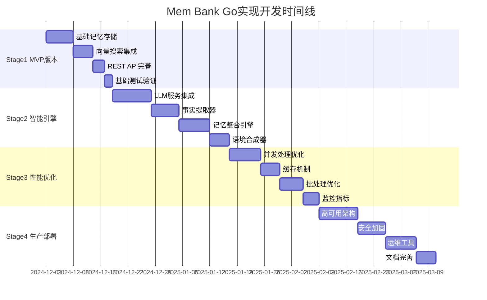
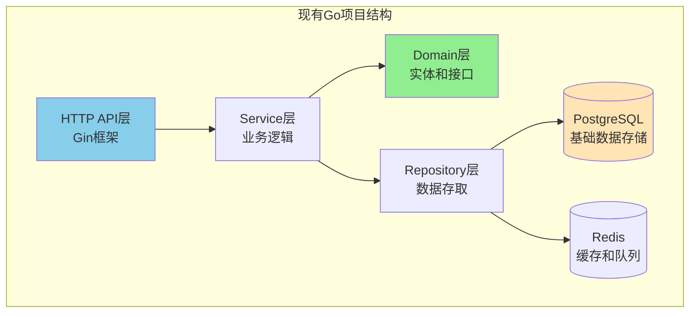
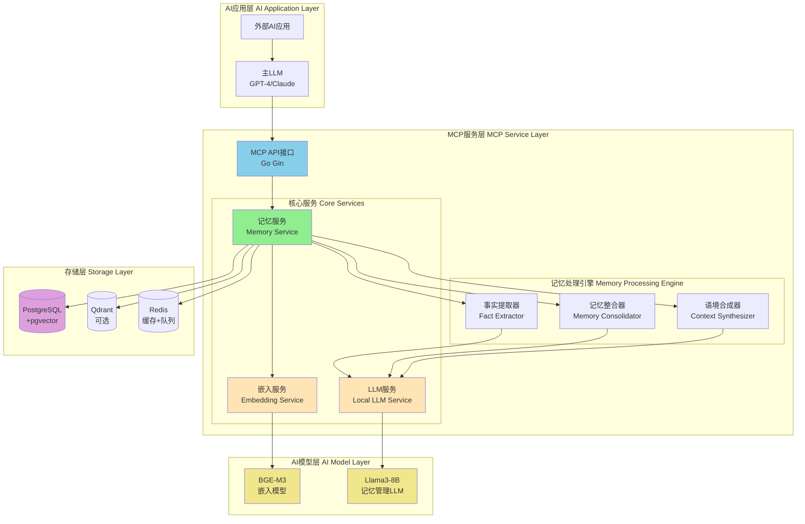

# Mem Bank Go语言实现多阶段开发计划

## 项目概述

基于现有的Python架构设计文档（docs/arch.md）和当前Go项目结构分析，制定了一个系统性的四阶段开发计划，将mem0.ai启发的记忆语境化与持久化(MCP)工具完整地迁移到Golang技术栈。

### 现有项目分析

当前项目已具备基础框架：
- **完整的Clean Architecture结构**：域层、用例层、存储层、接口层
- **数据库支持**：PostgreSQL/pgvector + Redis
- **基础功能**：用户管理、内存实体、HTTP接口
- **工具链**：Docker部署、数据库迁移、代码生成

### 核心设计原则

1. **渐进式重构**：在现有基础上逐步增强，而非推倒重来
2. **Go最佳实践**：充分利用Go的并发特性、接口设计和错误处理机制
3. **生产就绪**：每个阶段都产出可部署、可测试的增量版本
4. **性能优先**：针对Go的特性进行专门的性能优化设计

## 四阶段开发路线图



## 总体架构演进图

### 当前架构状态


### 目标架构状态


## 核心技术栈选型

### Go特定选择
- **HTTP框架**：Gin（已集成，性能优异）
- **ORM**：GORM（已集成，支持pgvector）
- **依赖注入**：Google Wire（推荐）或fx
- **配置管理**：Viper（已集成）
- **并发模式**：Worker Pool + Channel Pipeline
- **错误处理**：Go 1.13+ errors包装
- **测试框架**：标准testing + testify + gomock

### AI/ML集成
- **嵌入模型**：通过Python子进程调用BGE-M3或HTTP服务
- **向量数据库**：pgvector（主）+ Qdrant客户端（可选）
- **LLM集成**：OpenAI API兼容接口（支持本地Ollama）

### 运维工具
- **容器化**：Docker + Docker Compose（已有）
- **数据库迁移**：golang-migrate（已集成）
- **监控**：Prometheus + Grafana
- **日志**：structured logging with logrus（已集成）

## 项目文件结构规划

```
/mem_bank
├── cmd/api/main.go                     # 应用程序入口点 ✅
├── configs/                            # 配置管理 ✅
├── internal/
│   ├── domain/                         # 领域层 ✅
│   │   ├── memory/                     # 记忆领域 ✅
│   │   │   ├── entity.go               # 记忆实体 ✅
│   │   │   ├── repository.go           # 存储接口 ✅
│   │   │   ├── service.go              # 服务接口 ✅
│   │   │   └── fact.go                 # 事实实体 [新增]
│   │   └── user/                       # 用户领域 ✅
│   ├── service/                        # 应用服务层 ✅
│   │   ├── memory/                     # 记忆服务 ✅
│   │   │   ├── ai_service.go           # AI处理服务 ✅
│   │   │   ├── extraction_service.go   # 事实提取 [新增]
│   │   │   ├── consolidation_service.go # 记忆整合 [新增]
│   │   │   └── synthesis_service.go    # 语境合成 [新增]
│   │   ├── embedding/                  # 嵌入服务 ✅
│   │   │   └── service.go              # BGE-M3集成 ✅
│   │   └── llm/                        # LLM服务 [新增]
│   │       ├── client.go               # LLM客户端
│   │       └── memory_manager.go       # 记忆管理LLM
│   ├── dao/                            # 数据访问层 ✅
│   │   └── memory/                     # 记忆存储 ✅
│   │       ├── postgres.go             # PostgreSQL实现 ✅
│   │       ├── qdrant.go               # Qdrant实现 ✅
│   │       └── vector_store.go         # 统一向量存储接口 [新增]
│   ├── handler/http/                   # HTTP处理器 ✅
│   │   └── memory/                     # 记忆API ✅
│   ├── queue/                          # 消息队列 ✅
│   │   ├── memory_jobs.go              # 记忆处理任务 ✅
│   │   └── processor.go                # 异步处理器 [新增]
│   └── middleware/                     # 中间件 ✅
├── pkg/                                # 公共包 ✅
│   ├── llm/                            # LLM抽象 ✅
│   ├── database/                       # 数据库连接 ✅
│   └── logger/                         # 日志工具 ✅
└── migrations/                         # 数据库迁移 ✅
```

## 开发优先级和里程碑

### 里程碑M1：基础存储和检索 (Stage 1)
**目标**：实现基础的记忆存储和向量检索功能
- ✅ 完善PostgreSQL/pgvector集成
- ✅ 实现基础的向量搜索
- ✅ 完善REST API接口
- ✅ 基础单元测试和集成测试

**验收标准**：
- 可以存储和检索记忆
- 支持基础的语义搜索
- API响应时间 < 100ms
- 测试覆盖率 > 80%

### 里程碑M2：智能记忆处理 (Stage 2)
**目标**：实现完整的mem0.ai智能记忆管道
- 集成BGE-M3嵌入模型
- 实现事实提取器
- 实现记忆整合引擎（ADD/UPDATE/DELETE/NOOP）
- 实现语境合成器

**验收标准**：
- 可以从对话中提取关键事实
- 能够智能地整合新旧记忆
- 生成高质量的语境摘要
- Token消耗降低 > 70%

### 里程碑M3：性能优化 (Stage 3)
**目标**：达到生产级性能要求
- 实现并发处理和批处理优化
- 增加缓存机制
- 实现性能监控
- 压力测试和性能调优

**验收标准**：
- 支持1000+ QPS
- P99延迟 < 500ms
- 内存使用稳定
- 完整的监控指标

### 里程碑M4：生产部署 (Stage 4)
**目标**：生产环境就绪
- 高可用架构设计
- 安全性加固
- 完善的运维工具
- 详细的部署文档

**验收标准**：
- 支持高可用部署
- 通过安全审计
- 完整的监控和告警
- 运维自动化

## 关键技术挑战与解决方案

### 挑战1：Go与Python AI模型集成
**问题**：BGE-M3等模型主要提供Python接口
**解决方案**：
1. **HTTP服务方式**：将Python模型包装为HTTP服务
2. **进程间通信**：通过exec调用Python脚本
3. **gRPC接口**：使用gRPC实现高性能调用
4. **ONNX运行时**：考虑使用Go ONNX运行时

### 挑战2：高并发向量搜索
**问题**：大量并发的向量搜索可能造成性能瓶颈
**解决方案**：
1. **连接池管理**：合理配置数据库连接池
2. **查询优化**：使用合适的HNSW索引参数
3. **缓存策略**：对热点查询结果进行缓存
4. **异步处理**：记忆更新操作异步化

### 挑战3：内存管理与GC优化
**问题**：大向量数据可能导致GC压力
**解决方案**：
1. **对象池**：重用大型切片对象
2. **分批处理**：控制单次处理的数据量
3. **内存映射**：对大文件使用mmap
4. **GC调优**：合理设置GOGC参数

## 下一步行动

1. **立即开始Stage 1开发**，重点完善现有的向量搜索功能
2. **设置开发环境**，确保所有依赖项正确安装
3. **编写详细的API文档**，定义清晰的接口规范
4. **建立CI/CD流水线**，自动化测试和部署流程

这个计划将确保我们能够系统性地将Python架构迁移到Go，同时充分利用Go的语言特性和生态系统优势。