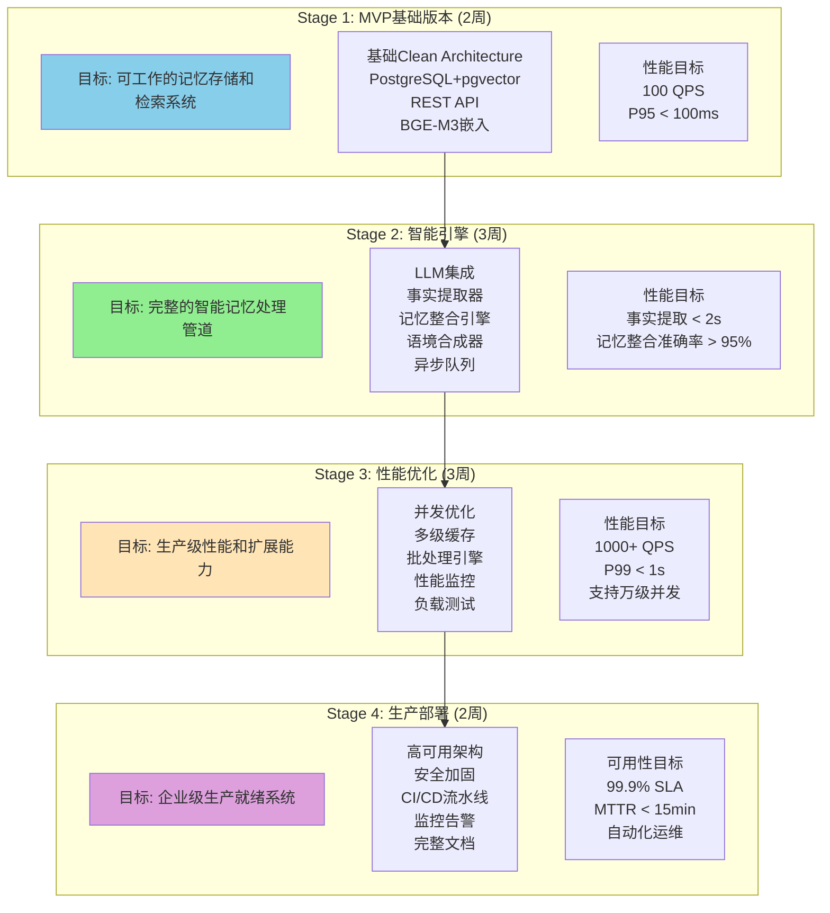
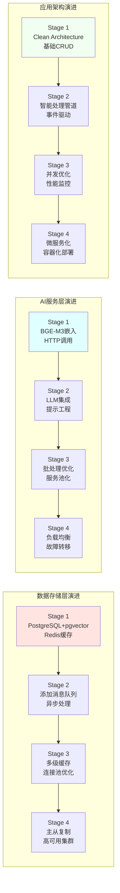
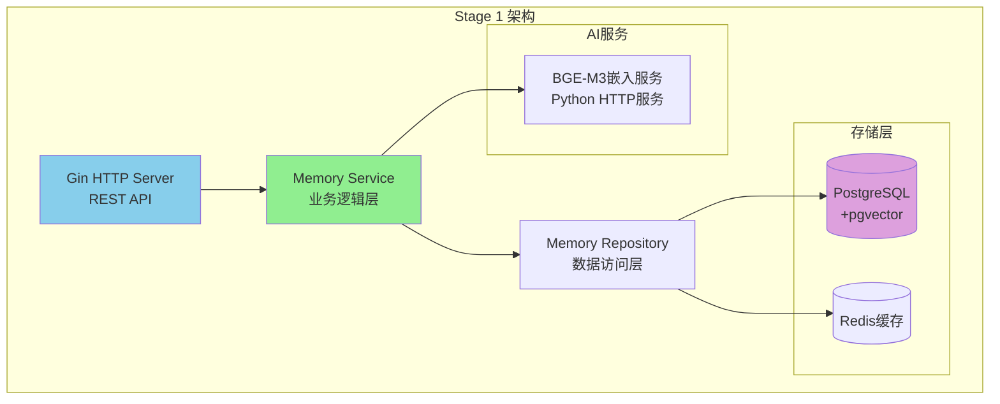
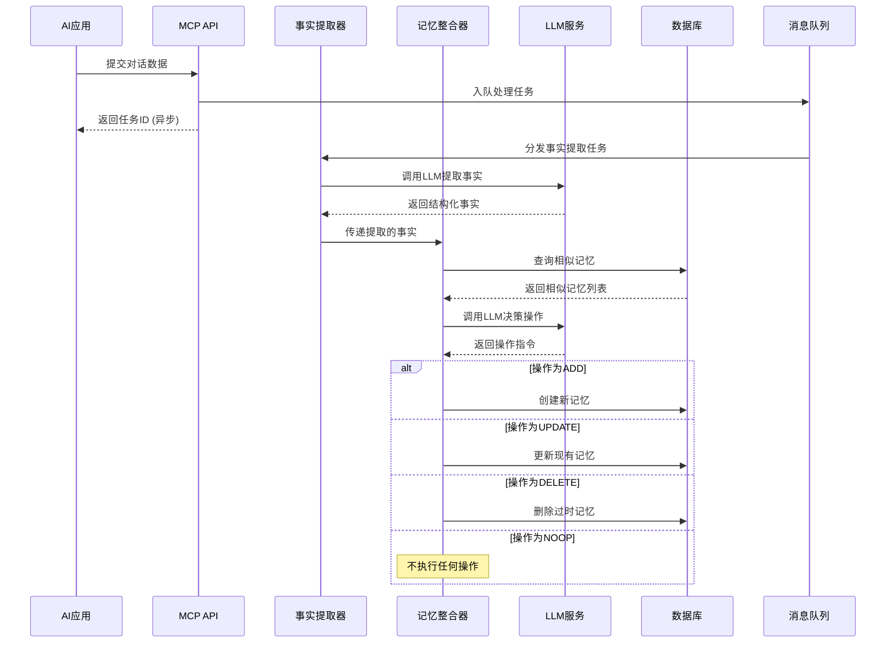
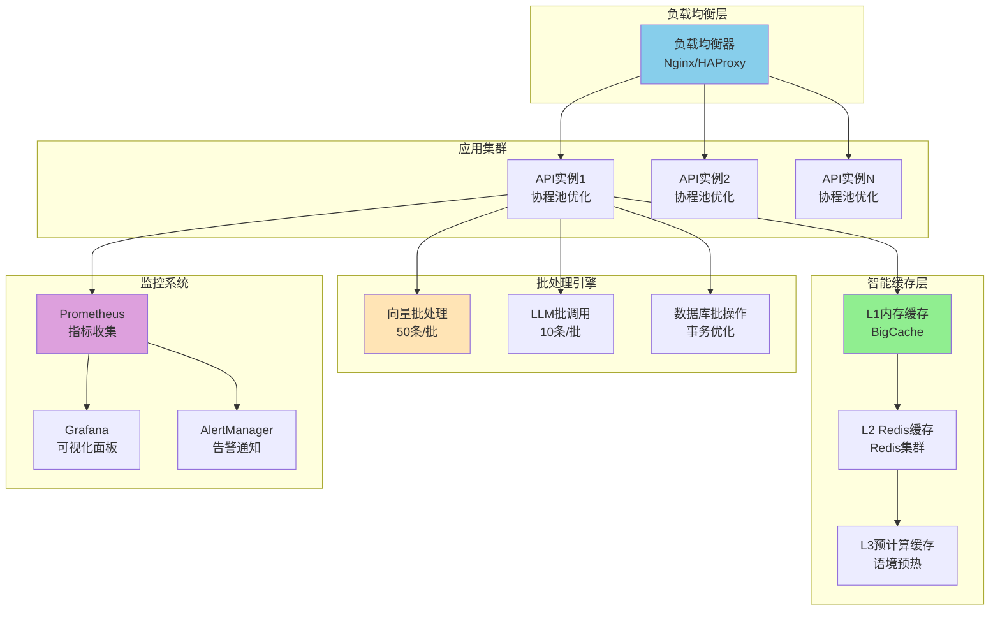
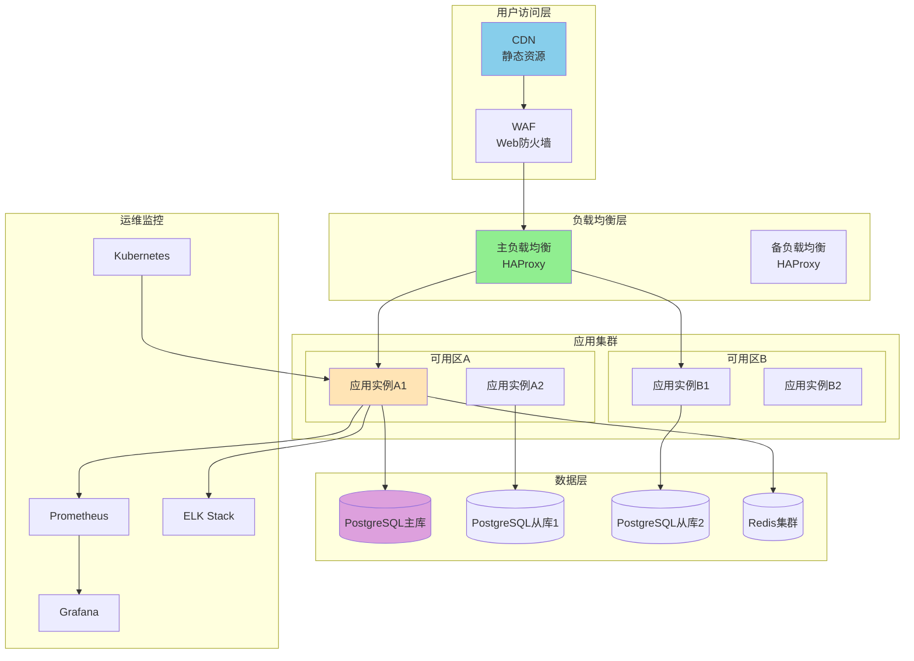
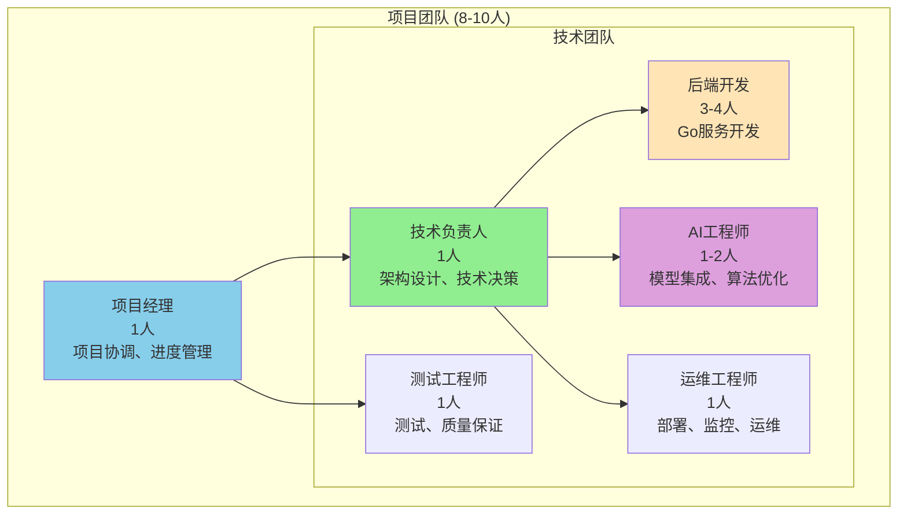
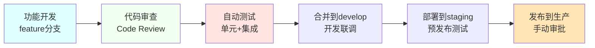

# Mem Bank 完整实现路线图

## 项目概述

本文档是基于Go语言实现的智能记忆语境化与持久化(MCP)系统的完整实现路线图。项目将mem0.ai启发的记忆管理能力完整地迁移到Golang技术栈，通过四个渐进式开发阶段，从MVP原型发展为企业级生产系统。

### 系统愿景

构建一个高性能、高可用、安全可靠的智能记忆处理系统，为AI应用提供上下文记忆管理能力，支持从个人助手到企业级AI应用的各种场景需求。

### 核心价值主张

1. **智能化记忆管理**：通过LLM驱动的事实提取、记忆整合和语境合成，提供智能化的记忆处理能力
2. **高性能Go实现**：充分利用Go语言的并发特性和高性能特点，实现毫秒级的记忆检索和处理
3. **生产就绪架构**：从设计之初就考虑企业级部署需求，支持高并发、高可用、高安全性
4. **开放式集成**：标准化的API接口设计，支持与各种AI应用和模型的无缝集成

## 四阶段开发战略

### 整体架构演进图



### 技术栈演进路径



## Stage 1: MVP基础版本 (2周)

### 目标和范围

**主要目标**：建立一个可工作的记忆存储和检索MVP系统，验证核心技术栈的可行性。

**功能范围**：
- 基础记忆CRUD操作
- 向量嵌入生成和存储
- 语义相似度搜索
- REST API接口
- 基础测试覆盖

### 技术架构



### 关键里程碑

| 里程碑 | 工期 | 验收标准 |
|--------|------|----------|
| **M1.1 基础存储功能** | 3天 | 数据库迁移完成，记忆CRUD正常，单元测试 > 80% |
| **M1.2 向量搜索集成** | 2天 | BGE-M3服务运行，向量搜索功能正常，搜索准确性验证 |
| **M1.3 REST API完善** | 2天 | API端点实现，请求验证，错误处理，Postman测试 |
| **M1.4 集成测试部署** | 1天 | Docker部署成功，端到端测试通过，性能达标 |

### 性能目标

- **API响应时间**：P95 < 100ms
- **向量搜索延迟**：< 50ms
- **并发处理能力**：100 QPS
- **测试覆盖率**：> 80%

### 风险和缓解策略

**主要风险**：
1. **BGE-M3模型集成复杂度**
   - 缓解：提前验证Python HTTP服务方案，准备备选的简化嵌入方案
2. **pgvector性能不满足需求**
   - 缓解：进行性能基准测试，准备Qdrant作为备选方案
3. **Go项目结构设计不合理**
   - 缓解：参考已验证的Clean Architecture模式，进行代码review

## Stage 2: 智能引擎 (3周)

### 目标和范围

**主要目标**：实现完整的mem0.ai智能记忆管道，包括事实提取、记忆整合和语境合成。

**功能范围**：
- LLM服务集成（本地Llama3或云端API）
- 事实提取引擎（从对话中提取结构化事实）
- 记忆整合引擎（ADD/UPDATE/DELETE/NOOP智能决策）
- 语境合成器（生成连贯的上下文摘要）
- 异步处理管道（Redis队列 + Worker模式）

### 智能处理流程



### 关键里程碑

| 里程碑 | 工期 | 验收标准 |
|--------|------|----------|
| **M2.1 LLM服务集成** | 5天 | LLM抽象层实现，支持本地/云端，基础调用测试通过 |
| **M2.2 事实提取引擎** | 4天 | 提示工程完成，事实提取准确率 > 90%，响应解析正常 |
| **M2.3 记忆整合引擎** | 5天 | ADD/UPDATE/DELETE/NOOP逻辑完成，整合准确率 > 95% |
| **M2.4 语境合成器** | 3天 | 记忆检索排序，时间衰减算法，合成质量验证 |
| **M2.5 异步处理管道** | 3天 | Redis队列集成，多worker并发，错误处理和重试 |

### 性能目标

- **事实提取时间**：P95 < 2s
- **记忆整合时间**：P95 < 3s  
- **语境合成时间**：P95 < 1s
- **队列处理能力**：100 jobs/min
- **LLM调用成功率**：> 99%
- **记忆整合准确率**：> 95%

### 关键技术挑战

**1. 提示工程优化**
- 设计稳定的事实提取提示词
- 优化记忆整合决策提示
- 处理LLM响应格式的变化

**2. 异步处理可靠性**
- 实现可靠的消息队列机制
- 处理worker故障和重启
- 确保任务处理的幂等性

**3. LLM服务稳定性**
- 处理LLM服务的超时和错误
- 实现智能重试策略
- 监控LLM服务的性能指标

## Stage 3: 性能优化 (3周)

### 目标和范围

**主要目标**：将系统性能优化到生产级标准，支持大规模并发和高吞吐量处理。

**功能范围**：
- 并发处理优化（协程池、通道管道、锁优化）
- 智能缓存体系（L1内存缓存、L2 Redis缓存、L3预计算缓存）
- 批处理引擎（向量批处理、LLM批调用、数据库批操作）
- 性能监控系统（Prometheus指标、Grafana面板、告警机制）
- 负载测试和调优（压力测试、瓶颈识别、系统调优）

### 性能优化架构



### 关键里程碑

| 里程碑 | 工期 | 验收标准 |
|--------|------|----------|
| **M3.1 并发处理优化** | 4天 | 协程池实现，支持1000+ QPS，CPU利用率优化 |
| **M3.2 智能缓存体系** | 3天 | 多级缓存部署，L1命中率>80%，整体性能提升50%+ |
| **M3.3 批处理引擎** | 4天 | 向量/LLM/DB批处理实现，吞吐量提升3x+ |
| **M3.4 性能监控系统** | 3天 | Prometheus/Grafana部署，告警规则配置完成 |
| **M3.5 负载测试调优** | 2天 | 负载测试框架，性能基准达标，瓶颈识别解决 |

### 性能目标

| 指标类别 | 指标名称 | 目标值 |
|---------|----------|--------|
| **吞吐量** | API QPS | > 1000 |
| **延迟** | P95响应时间 | < 500ms |
| **延迟** | P99响应时间 | < 1s |
| **并发** | 同时处理对话数 | > 500 |
| **缓存** | L1缓存命中率 | > 80% |
| **资源** | CPU使用率 | < 70% |
| **资源** | 内存使用 | < 2GB |

### 优化策略

**1. 并发处理优化**
```go
// Worker池设计
type WorkerPool struct {
    workerCount int
    jobQueue    chan Job
    workerQueue chan chan Job
    workers     []*Worker
}

// 批处理器设计
type BatchProcessor struct {
    batchSize   int
    maxWaitTime time.Duration
    processor   func([]Item) error
}
```

**2. 缓存策略优化**
- **L1缓存**：热点数据，1min TTL，内存限制512MB
- **L2缓存**：温数据，1h TTL，Redis集群存储
- **L3缓存**：冷数据预计算，24h TTL，异步更新

**3. 批处理优化**
- **向量处理**：50条文本/批，减少网络往返
- **LLM调用**：10个请求/批，降低API调用成本
- **数据库操作**：事务批量提交，减少I/O开销

## Stage 4: 生产部署 (2周)

### 目标和范围

**主要目标**：构建企业级生产就绪系统，确保高可用、高安全、易运维。

**功能范围**：
- 高可用架构设计（多区域部署、故障转移、负载均衡）
- 安全加固体系（身份认证、权限控制、数据加密、审计日志）
- 运维工具链（CI/CD流水线、监控告警、日志管理、性能分析）
- 部署自动化（容器化部署、自动扩缩容、配置管理、版本发布）
- 完整文档（API文档、运维手册、故障排查指南）

### 生产架构设计



### 关键里程碑

| 里程碑 | 工期 | 验收标准 |
|--------|------|----------|
| **M4.1 高可用架构部署** | 5天 | 多区域部署，数据库主从复制，故障转移验证 |
| **M4.2 安全加固实施** | 4天 | 身份认证系统，数据加密，安全审计，漏洞修复 |
| **M4.3 运维工具链搭建** | 4天 | CI/CD流水线，监控告警，日志分析，备份恢复 |
| **M4.4 部署自动化** | 3天 | K8s部署，Helm Charts，自动扩缩容，蓝绿部署 |
| **M4.5 文档和培训** | 2天 | API文档，运维手册，故障排查，团队培训 |

### 生产指标要求

| 指标类别 | 指标名称 | 目标值 |
|---------|----------|--------|
| **可用性** | 系统可用性 | 99.9% |
| **性能** | P99响应时间 | < 2s |
| **容量** | 并发用户数 | > 10,000 |
| **安全** | 安全审计覆盖率 | 100% |
| **可靠性** | MTTR | < 15min |
| **部署** | 部署成功率 | > 99% |

### 安全加固重点

**1. 身份认证和授权**
```go
type AuthMiddleware struct {
    jwtValidator  JWTValidator
    apiKeyValidator APIKeyValidator
    rbac         RBACService
}

// 支持JWT和API Key两种认证方式
func (am *AuthMiddleware) RequireAuth() gin.HandlerFunc
func (am *AuthMiddleware) RequirePermission(resource, action string) gin.HandlerFunc
```

**2. 数据加密**
- **传输加密**：TLS 1.3，HTTPS强制跳转
- **存储加密**：AES-256-GCM，用户数据分用户密钥加密
- **密钥管理**：HashiCorp Vault，密钥轮换机制

**3. 安全审计**
```go
type AuditEvent struct {
    EventID      string
    Timestamp    time.Time
    UserID       string
    Action       string
    Resource     string
    Result       string
    ClientIP     string
    Metadata     map[string]interface{}
}
```

### 运维自动化

**1. CI/CD流水线**
```yaml
# .gitlab-ci.yml 关键阶段
stages:
  - test           # 单元测试、集成测试、安全扫描
  - build          # Docker镜像构建和推送
  - deploy-staging # 预发布环境部署
  - integration-test # 端到端测试
  - deploy-production # 生产环境部署（手动审批）
```

**2. 监控告警**
- **基础指标**：CPU、内存、磁盘、网络
- **应用指标**：QPS、延迟、错误率、队列长度
- **业务指标**：活跃用户、记忆创建量、LLM调用量
- **告警通道**：邮件、短信、钉钉、PagerDuty

**3. 日志管理**
- **结构化日志**：JSON格式，统一字段规范
- **日志收集**：Fluentd采集，Elasticsearch存储
- **日志分析**：Kibana可视化，异常模式识别
- **日志保留**：30天热数据，180天冷数据

## 技术栈选择说明

### 编程语言和框架

**Go语言选择理由**：
1. **高性能并发**：原生协程支持，适合高并发记忆处理
2. **简洁可维护**：语法简洁，代码可读性强，维护成本低
3. **丰富生态系统**：完善的Web框架、数据库、缓存库支持
4. **容器化友好**：小体积镜像，快速启动，适合云原生部署
5. **企业级成熟度**：被多家大厂验证，社区活跃，生产可靠

**核心框架选择**：
- **Web框架**：Gin（性能优异、社区活跃、文档完善）
- **ORM框架**：GORM（功能完整、支持pgvector、易于使用）
- **依赖注入**：Google Wire（编译时注入、类型安全、性能好）
- **配置管理**：Viper（多格式支持、环境变量集成、热重载）

### 数据存储选择

**PostgreSQL + pgvector**：
- **优势**：ACID事务、SQL查询、向量搜索、运维成熟
- **适用场景**：结构化数据存储、复杂查询、事务一致性
- **扩展能力**：支持主从复制、读写分离、分片

**Redis**：
- **优势**：高性能、丰富数据结构、成熟集群方案
- **适用场景**：缓存、消息队列、会话存储
- **高可用**：主从复制、哨兵模式、集群模式

**备选方案**：
- **Qdrant**：专业向量数据库，更好的向量搜索性能
- **Weaviate**：知识图谱集成，语义搜索能力
- **Elasticsearch**：全文搜索，日志分析

### AI服务集成

**嵌入模型选择**：
- **主选**：BGE-M3（BAAI开源、中英文支持、性能优异）
- **备选**：text-embedding-ada-002（OpenAI、稳定可靠）
- **部署方式**：Python HTTP服务（灵活性）+ Go HTTP客户端

**LLM集成策略**：
- **本地部署**：Llama3-8B（Ollama部署、成本可控、数据安全）
- **云端服务**：OpenAI GPT-4、Claude（高质量、免运维、按需付费）
- **抽象设计**：统一LLM接口，支持多模型切换

### 部署和运维

**容器化技术**：
- **Docker**：应用容器化、环境一致性、部署简化
- **Kubernetes**：容器编排、自动扩缩容、故障恢复
- **Helm**：应用打包、版本管理、配置模板化

**监控和日志**：
- **Prometheus + Grafana**：指标收集和可视化
- **ELK Stack**：日志收集、存储和分析
- **Jaeger**：分布式链路追踪

## 风险评估和缓解策略

### 技术风险

**1. AI模型集成复杂度**
- **风险描述**：BGE-M3和LLM模型集成可能存在兼容性和性能问题
- **影响程度**：高
- **缓解策略**：
  - 提前进行技术验证和POC测试
  - 准备多个备选方案（OpenAI Embedding、简化版本）
  - 设计可插拔的模型接口，支持快速切换

**2. 性能瓶颈风险**
- **风险描述**：高并发场景下系统性能不满足需求
- **影响程度**：中
- **缓解策略**：
  - 每个阶段都设置明确的性能目标和测试
  - 提前识别性能瓶颈点，设计优化方案
  - 准备水平扩展方案，支持集群部署

**3. 数据一致性问题**
- **风险描述**：异步处理可能导致数据不一致
- **影响程度**：中
- **缓解策略**：
  - 设计幂等性操作，支持重试机制
  - 使用数据库事务保证关键操作的一致性
  - 实现最终一致性模型，允许短暂的数据延迟

### 项目风险

**1. 时间延期风险**
- **风险描述**：开发复杂度超预期，导致项目延期
- **影响程度**：中
- **缓解策略**：
  - 采用敏捷开发方法，每周回顾和调整
  - 预留20%的缓冲时间
  - 准备功能降级方案，确保核心功能按时交付

**2. 团队技能风险**
- **风险描述**：团队对Go语言或AI技术不熟悉
- **影响程度**：中
- **缓解策略**：
  - 提供技术培训和学习资源
  - 安排有经验的技术导师
  - 选择成熟的技术栈，降低学习曲线

**3. 需求变更风险**
- **风险描述**：项目过程中需求发生重大变化
- **影响程度**：高
- **缓解策略**：
  - 在项目初期充分沟通和确认需求
  - 采用模块化设计，提高系统适应性
  - 建立需求变更流程，评估影响和成本

### 商业风险

**1. 竞争对手风险**
- **风险描述**：竞争对手推出类似产品，抢占市场
- **影响程度**：中
- **缓解策略**：
  - 专注于差异化功能和用户体验
  - 快速迭代，保持技术领先优势
  - 建立用户社区，提高用户粘性

**2. 法规合规风险**
- **风险描述**：数据隐私法规变化影响产品设计
- **影响程度**：高
- **缓解策略**：
  - 从设计之初就考虑隐私保护
  - 实现数据加密和访问控制
  - 建立合规检查流程

## 团队协作和开发流程

### 团队组织结构



### 开发流程规范

**1. 代码开发流程**


**2. 质量保证流程**
- **代码规范**：使用gofmt、golint、go vet强制代码格式
- **单元测试**：要求测试覆盖率 > 80%，关键路径 > 95%
- **集成测试**：端到端API测试，数据库集成测试
- **性能测试**：每个版本都要进行性能回归测试
- **安全测试**：静态代码扫描，依赖漏洞扫描

**3. 敏捷开发实践**
- **Sprint周期**：2周一个Sprint，适合快速迭代
- **每日站会**：15分钟同步进度和问题
- **Sprint Review**：演示交付成果，收集反馈
- **Sprint Retrospective**：回顾改进，持续优化

### 知识管理和文档

**1. 技术文档体系**
```
docs/
├── architecture/           # 架构设计文档
│   ├── system-design.md   # 系统整体设计
│   ├── database-design.md # 数据库设计
│   └── api-design.md      # API接口设计
├── development/           # 开发文档
│   ├── setup-guide.md     # 环境搭建指南
│   ├── coding-standards.md # 编码规范
│   └── testing-guide.md   # 测试指南
├── deployment/            # 部署文档
│   ├── docker-guide.md    # Docker部署
│   ├── k8s-guide.md       # Kubernetes部署
│   └── monitoring.md      # 监控配置
└── operations/            # 运维文档
    ├── troubleshooting.md # 故障排查
    ├── performance.md     # 性能调优
    └── backup-restore.md  # 备份恢复
```

**2. 知识分享机制**
- **技术分享会**：每周五下午技术分享，轮流主讲
- **代码Review**：所有代码必须经过至少1人审查
- **文档审查**：重要文档需要团队集体审查
- **外部学习**：鼓励参加技术会议和在线课程

## 成功评估标准

### 技术成功指标

**1. 功能完整性**
- ✅ 所有MVP功能按时交付
- ✅ 智能记忆处理管道完整实现
- ✅ 性能目标全部达成
- ✅ 生产环境稳定运行

**2. 代码质量**
- ✅ 单元测试覆盖率 > 80%
- ✅ 集成测试覆盖率 > 70%
- ✅ 代码审查通过率 > 95%
- ✅ 静态代码检查无严重问题

**3. 性能指标**
- ✅ API响应时间P99 < 1s
- ✅ 系统可用性 > 99.9%
- ✅ 并发处理能力 > 1000 QPS
- ✅ 内存使用 < 2GB

### 业务成功指标

**1. 产品可用性**
- ✅ 系统可以稳定处理真实业务场景
- ✅ API接口易于集成和使用
- ✅ 文档完整，开发者友好
- ✅ 安全性满足企业级要求

**2. 运维成熟度**
- ✅ 自动化部署流程建立
- ✅ 监控告警体系完善
- ✅ 故障处理流程清晰
- ✅ 备份恢复机制验证

**3. 团队能力**
- ✅ 团队掌握Go语言和相关技术栈
- ✅ 团队具备AI系统开发经验
- ✅ 团队具备生产系统运维能力
- ✅ 知识文档体系建立完善

## 项目交付成果

### 软件交付物

**1. 核心应用系统**
- MCP Memory Bank Go应用（Docker镜像）
- BGE-M3嵌入服务（Python Docker镜像）
- 数据库迁移脚本和初始化数据
- Kubernetes部署配置文件（Helm Charts）

**2. 支持工具和脚本**
- 开发环境搭建脚本
- 数据库备份和恢复脚本
- 性能测试和压力测试套件
- 监控配置和告警规则

### 文档交付物

**1. 用户文档**
- API接口文档（OpenAPI 3.0规范）
- SDK使用指南和示例代码
- 快速开始教程
- 常见问题解答

**2. 开发文档**
- 系统架构设计文档
- 数据库设计文档
- 代码结构和开发规范
- 测试指南和质量标准

**3. 运维文档**
- 部署和配置手册
- 监控和告警配置
- 故障排查指南
- 性能调优建议

### 培训和支持

**1. 技术培训**
- 系统架构培训（2天）
- Go语言和框架培训（3天）
- AI模型集成培训（2天）
- 运维和监控培训（2天）

**2. 知识转移**
- 代码walkthrough会议
- 架构决策记录(ADR)
- 技术债务和改进建议
- 后续开发路线图

## 后续演进规划

### 短期演进 (3-6个月)

**1. 功能增强**
- 支持更多嵌入模型（OpenAI、Cohere等）
- 增加记忆分类和标签管理
- 实现记忆的自动过期和清理
- 支持多语言记忆处理

**2. 性能优化**
- 实现动态批处理大小调整
- 增加智能预加载和预计算
- 优化数据库查询和索引
- 实现更精细的缓存策略

**3. 运维改进**
- 增加更多监控指标和面板
- 实现智能告警和异常检测
- 优化日志结构和查询性能
- 建立容量规划和扩容机制

### 中期演进 (6-12个月)

**1. 架构升级**
- 微服务化架构改造
- 实现服务网格（Istio）
- 增加API网关和流量管理
- 支持多租户架构

**2. 智能化增强**
- 增加个性化记忆推荐
- 实现记忆质量评分机制
- 支持记忆关系图谱构建
- 增加自动化记忆整理

**3. 生态集成**
- 开发多语言SDK（Python、JavaScript、Java）
- 集成主流AI框架（LangChain、Haystack）
- 支持Webhook和事件驱动集成
- 建立插件和扩展机制

### 长期愿景 (1年+)

**1. 产品化**
- 建立SaaS服务平台
- 实现可视化记忆管理界面
- 支持企业级权限和安全管理
- 建立应用市场和生态系统

**2. 技术前瞻**
- 探索边缘计算部署
- 支持联邦学习和隐私保护
- 集成最新的大语言模型
- 研究多模态记忆处理（文本+图像+音频）

## 总结

Mem Bank项目通过四个渐进式开发阶段，将从一个Go语言的MVP原型发展为企业级的智能记忆处理系统。每个阶段都有明确的目标、可衡量的交付成果和详细的验收标准。

**项目核心价值**：
1. **技术价值**：验证Go语言在AI系统开发中的优势，建立可复用的技术架构
2. **产品价值**：为AI应用提供强大的记忆管理能力，提升用户体验
3. **商业价值**：建立技术壁垒，为后续产品化和商业化奠定基础
4. **团队价值**：提升团队在AI系统开发和运维方面的能力

通过严格的项目管理、持续的质量保证和完善的风险控制，项目有信心按时按质完成各阶段目标，最终交付一个生产就绪、性能优异、安全可靠的智能记忆处理系统。