# RFC: AI记忆系统总体架构设计

**文档版本**: 1.0  
**创建日期**: 2025-08-17  
**作者**: AI记忆系统团队  
**状态**: 草案

## 1. 摘要

本文档描述AI记忆系统的总体架构设计，整合了四个阶段的详细设计，形成完整的系统蓝图。该架构采用领域驱动设计(DDD)和整洁架构原则，支持从MVP到企业级生产环境的渐进式演进。系统旨在为AI应用提供智能、可扩展、高性能的持久化记忆能力。

## 2. 引言

### 2.1 系统愿景

构建一个世界级的AI记忆层系统，为AI应用提供：

- **智能记忆管理**: LLM驱动的自动记忆提取、整合和优化
- **企业级可靠性**: 99.9%+可用性，支持大规模生产部署
- **开发者友好**: 简单易用的API和多语言SDK
- **成本效益**: 智能资源管理和成本优化

### 2.2 系统定位

- **Memory Component Provider (MCP)**: 独立的记忆服务提供商
- **Cloud-Native**: 云原生架构，支持容器化和微服务
- **AI-First**: AI驱动的智能记忆管理
- **Enterprise-Ready**: 企业级治理、安全和合规

### 2.3 核心价值主张

1. **从无状态到有状态**: 让AI应用具备持久记忆能力
2. **智能化程度**: LLM驱动的自动记忆管理
3. **高性能**: 毫秒级响应，支持大规模并发
4. **灵活部署**: 支持多种数据库和部署环境

## 3. 系统架构概览

### 3.1 整体架构图

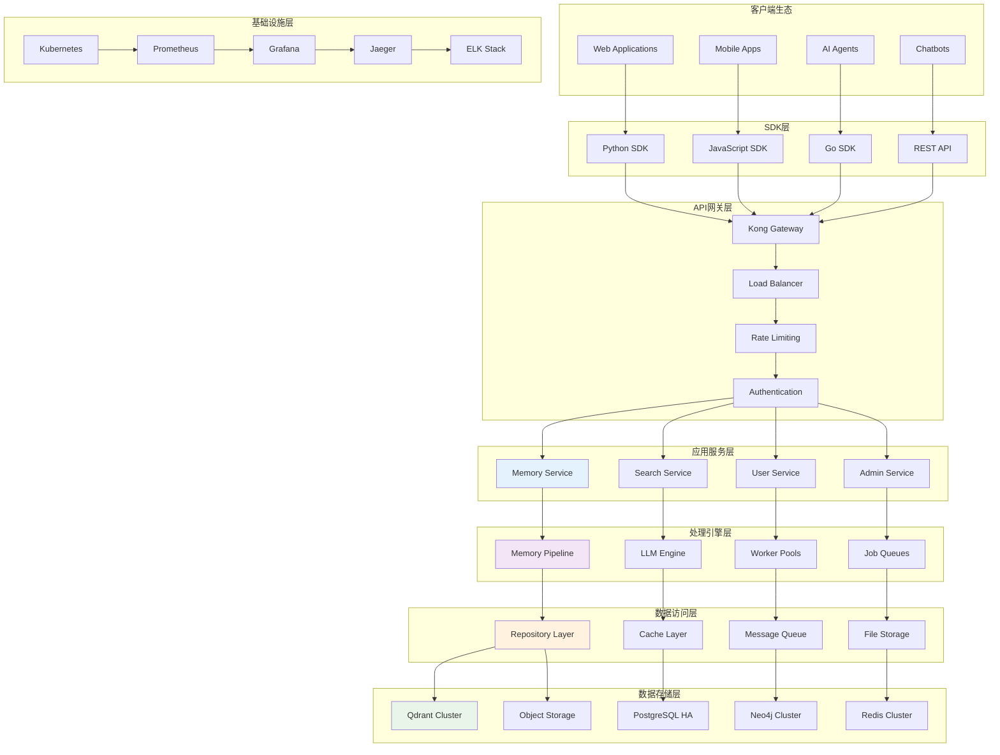
```mermaid
graph TB
    subgraph "客户端生态"
        A[Web Applications]
        B[Mobile Apps]
        C[AI Agents]
        D[Chatbots]
    end
    
    subgraph "SDK层"
        E[Python SDK]
        F[JavaScript SDK]
        G[Go SDK]
        H[REST API]
    end
    
    subgraph "API网关层"
        I[Kong Gateway]
        J[Load Balancer]
        K[Rate Limiting]
        L[Authentication]
    end
    
    subgraph "应用服务层"
        M[Memory Service]
        N[Search Service]
        O[User Service]
        P[Admin Service]
    end
    
    subgraph "处理引擎层"
        Q[Memory Pipeline]
        R[LLM Engine]
        S[Worker Pools]
        T[Job Queues]
    end
    
    subgraph "数据访问层"
        U[Repository Layer]
        V[Cache Layer]
        W[Message Queue]
        X[File Storage]
    end
    
    subgraph "数据存储层"
        Y[Qdrant Cluster]
        Z[PostgreSQL HA]
        AA[Neo4j Cluster]
        BB[Redis Cluster]
        CC[Object Storage]
    end
    
    subgraph "基础设施层"
        DD[Kubernetes]
        EE[Prometheus]
        FF[Grafana]
        GG[Jaeger]
        HH[ELK Stack]
    end
    
    A --> E
    B --> F
    C --> G
    D --> H
    
    E --> I
    F --> I
    G --> I
    H --> I
    
    I --> J
    J --> K
    K --> L
    L --> M
    L --> N
    L --> O
    L --> P
    
    M --> Q
    N --> R
    O --> S
    P --> T
    
    Q --> U
    R --> V
    S --> W
    T --> X
    
    U --> Y
    V --> Z
    W --> AA
    X --> BB
    U --> CC
    
    DD --> EE
    EE --> FF
    FF --> GG
    GG --> HH
    
    style M fill:#e3f2fd
    style Q fill:#f3e5f5
    style U fill:#fff3e0
    style Y fill:#e8f5e8
```

### 3.2 分层架构详解

#### 3.2.1 客户端生态层 (Client Ecosystem)
- **Web应用**: 基于浏览器的AI应用
- **移动应用**: iOS/Android原生AI应用  
- **AI代理**: 自主AI智能体
- **聊天机器人**: 对话式AI应用

#### 3.2.2 SDK层 (SDK Layer)
- **多语言支持**: Python, JavaScript/TypeScript, Go, Java
- **统一接口**: 一致的API设计和用户体验
- **异步支持**: 同步和异步调用模式
- **错误处理**: 完善的错误处理和重试机制

#### 3.2.3 API网关层 (API Gateway)
- **流量管理**: 负载均衡和流量分发
- **安全控制**: 认证、授权、限流
- **协议适配**: HTTP/REST, gRPC, WebSocket
- **监控分析**: API使用分析和监控

#### 3.2.4 应用服务层 (Application Services)
- **微服务架构**: 按业务域拆分的独立服务
- **服务发现**: 自动服务注册和发现
- **熔断降级**: 故障隔离和服务降级
- **配置管理**: 动态配置和热更新

#### 3.2.5 处理引擎层 (Processing Engine)
- **智能管道**: LLM驱动的记忆处理流水线
- **异步处理**: 高并发的后台处理
- **任务调度**: 智能任务分发和调度
- **事件驱动**: 基于事件的松耦合架构

#### 3.2.6 数据访问层 (Data Access Layer)
- **仓库模式**: 统一的数据访问抽象
- **多级缓存**: L1/L2/L3缓存架构
- **事务管理**: 分布式事务和一致性
- **连接池**: 高效的连接资源管理

#### 3.2.7 数据存储层 (Data Storage Layer)
- **多模态存储**: 向量、关系、图、文档
- **高可用**: 主从复制和集群部署
- **数据分片**: 水平扩展和负载分布
- **备份恢复**: 自动备份和灾难恢复

#### 3.2.8 基础设施层 (Infrastructure Layer)
- **容器编排**: Kubernetes集群管理
- **监控观测**: 全方位系统监控
- **日志聚合**: 分布式日志收集和分析
- **链路追踪**: 分布式调用链追踪

### 3.3 核心架构原则

#### 3.3.1 领域驱动设计 (DDD)
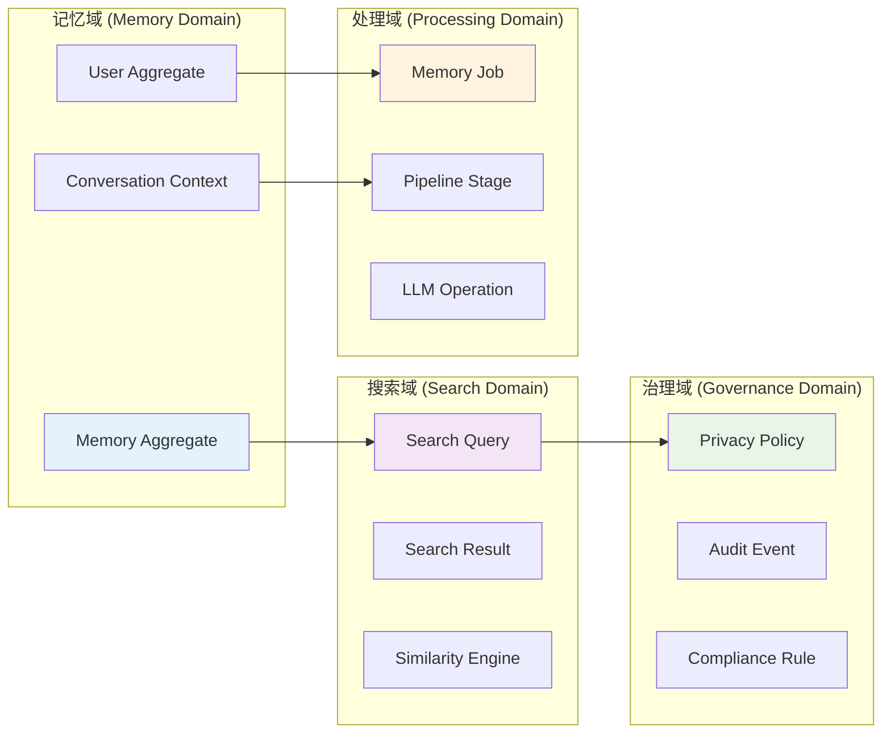
```mermaid
graph LR
    subgraph "记忆域 (Memory Domain)"
        A[Memory Aggregate]
        B[User Aggregate]
        C[Conversation Context]
    end
    
    subgraph "搜索域 (Search Domain)"
        D[Search Query]
        E[Search Result]
        F[Similarity Engine]
    end
    
    subgraph "处理域 (Processing Domain)"
        G[Memory Job]
        H[Pipeline Stage]
        I[LLM Operation]
    end
    
    subgraph "治理域 (Governance Domain)"
        J[Privacy Policy]
        K[Audit Event]
        L[Compliance Rule]
    end
    
    A --> D
    B --> G
    C --> H
    D --> J
    
    style A fill:#e3f2fd
    style D fill:#f3e5f5
    style G fill:#fff3e0
    style J fill:#e8f5e8
```

#### 3.3.2 整洁架构 (Clean Architecture)
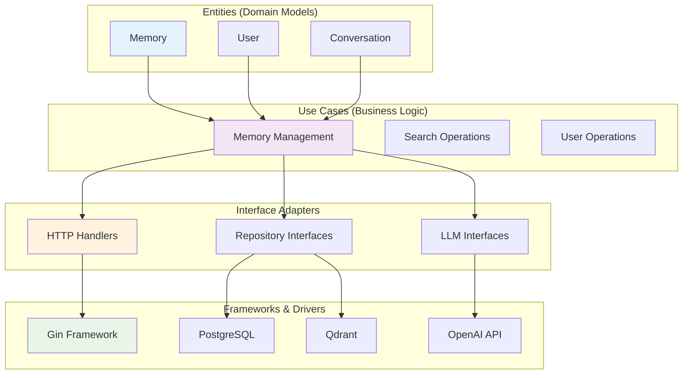
```mermaid
graph TB
    subgraph "Entities (Domain Models)"
        A[Memory]
        B[User]
        C[Conversation]
    end
    
    subgraph "Use Cases (Business Logic)"
        D[Memory Management]
        E[Search Operations]
        F[User Operations]
    end
    
    subgraph "Interface Adapters"
        G[HTTP Handlers]
        H[Repository Interfaces]
        I[LLM Interfaces]
    end
    
    subgraph "Frameworks & Drivers"
        J[Gin Framework]
        K[PostgreSQL]
        L[Qdrant]
        M[OpenAI API]
    end
    
    A --> D
    B --> D
    C --> D
    D --> G
    D --> H
    D --> I
    G --> J
    H --> K
    H --> L
    I --> M
    
    style A fill:#e3f2fd
    style D fill:#f3e5f5
    style G fill:#fff3e0
    style J fill:#e8f5e8
```

#### 3.3.3 事件驱动架构 (Event-Driven Architecture)
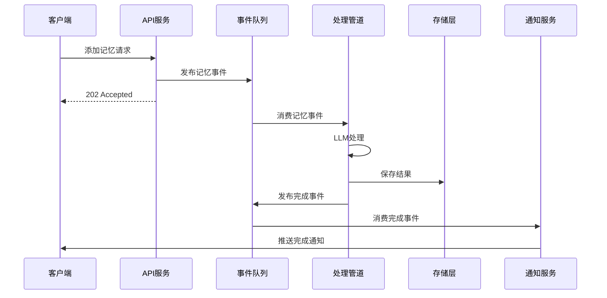
```mermaid
sequenceDiagram
    participant Client as 客户端
    participant API as API服务
    participant Queue as 事件队列
    participant Pipeline as 处理管道
    participant Storage as 存储层
    participant Notifier as 通知服务

    Client->>API: 添加记忆请求
    API->>Queue: 发布记忆事件
    API-->>Client: 202 Accepted
    
    Queue->>Pipeline: 消费记忆事件
    Pipeline->>Pipeline: LLM处理
    Pipeline->>Storage: 保存结果
    Pipeline->>Queue: 发布完成事件
    
    Queue->>Notifier: 消费完成事件
    Notifier->>Client: 推送完成通知
```

## 4. 核心功能架构

### 4.1 智能记忆管道

#### 4.1.1 两阶段处理流程

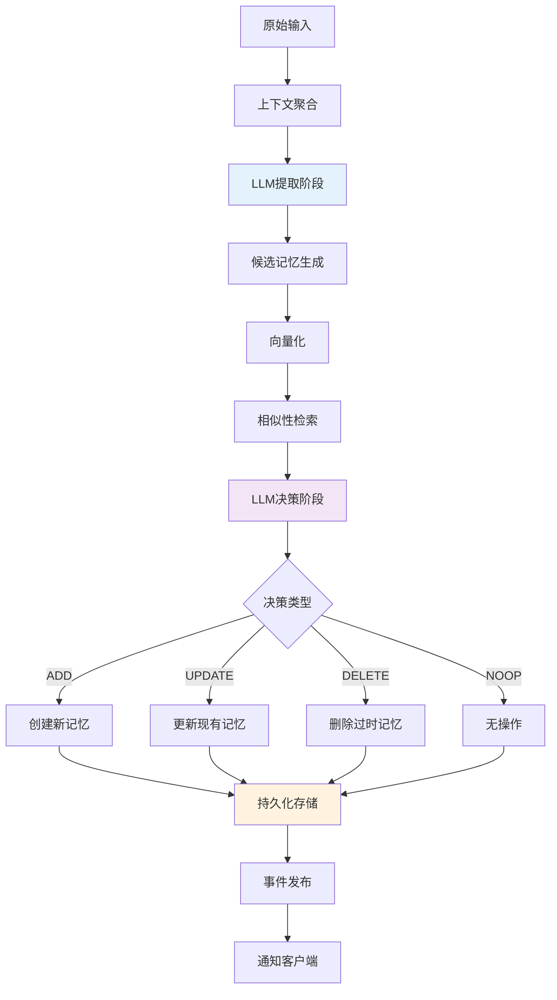
```mermaid
flowchart TD
    A[原始输入] --> B[上下文聚合]
    B --> C[LLM提取阶段]
    C --> D[候选记忆生成]
    D --> E[向量化]
    E --> F[相似性检索]
    F --> G[LLM决策阶段]
    G --> H{决策类型}
    
    H -->|ADD| I[创建新记忆]
    H -->|UPDATE| J[更新现有记忆]
    H -->|DELETE| K[删除过时记忆]
    H -->|NOOP| L[无操作]
    
    I --> M[持久化存储]
    J --> M
    K --> M
    L --> M
    
    M --> N[事件发布]
    N --> O[通知客户端]
    
    style C fill:#e3f2fd
    style G fill:#f3e5f5
    style M fill:#fff3e0
```

#### 4.1.2 记忆管道组件设计

```go
// MemoryPipeline 记忆处理管道接口
type MemoryPipeline interface {
    // 处理记忆作业
    ProcessMemoryJob(ctx context.Context, job MemoryJob) error
    
    // 阶段一：提取候选记忆
    ExtractCandidateMemories(ctx context.Context, context ConversationContext) ([]*CandidateMemory, error)
    
    // 阶段二：智能决策更新
    ProcessCandidateMemories(ctx context.Context, userID string, candidates []*CandidateMemory) error
}

// PipelineStage 管道阶段接口
type PipelineStage interface {
    Process(ctx context.Context, input PipelineInput) (PipelineOutput, error)
    GetName() string
    GetMetrics() StageMetrics
}

// ExtractionStage 提取阶段
type ExtractionStage struct {
    llmProvider LLMProvider
    promptBuilder PromptBuilder
    outputParser OutputParser
    metrics StageMetrics
}

// DecisionStage 决策阶段
type DecisionStage struct {
    llmProvider LLMProvider
    repository MemoryRepository
    decisionEngine DecisionEngine
    metrics StageMetrics
}
```

### 4.2 多数据库支持架构

#### 4.2.1 数据库选择策略

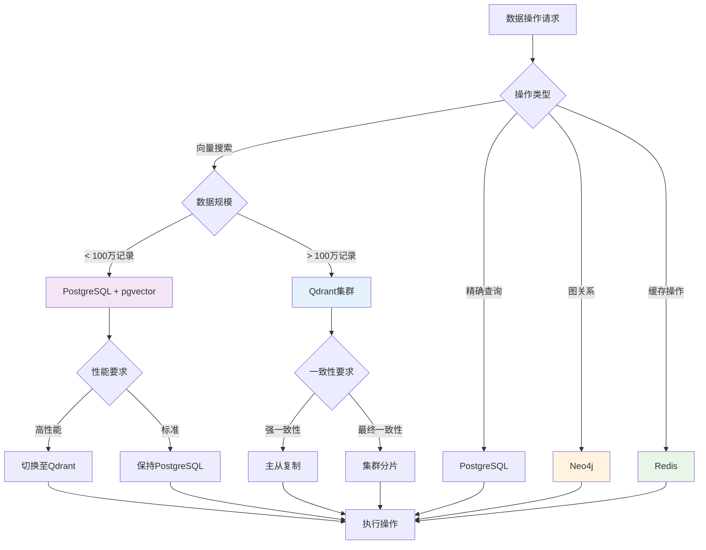
```mermaid
graph TD
    A[数据操作请求] --> B{操作类型}
    
    B -->|向量搜索| C{数据规模}
    B -->|精确查询| D[PostgreSQL]
    B -->|图关系| E[Neo4j]
    B -->|缓存操作| F[Redis]
    
    C -->|< 100万记录| G[PostgreSQL + pgvector]
    C -->|> 100万记录| H[Qdrant集群]
    
    G --> I{性能要求}
    H --> J{一致性要求}
    
    I -->|高性能| K[切换至Qdrant]
    I -->|标准| L[保持PostgreSQL]
    
    J -->|强一致性| M[主从复制]
    J -->|最终一致性| N[集群分片]
    
    K --> O[执行操作]
    L --> O
    M --> O
    N --> O
    D --> O
    E --> O
    F --> O
    
    style H fill:#e3f2fd
    style G fill:#f3e5f5
    style E fill:#fff3e0
    style F fill:#e8f5e8
```

#### 4.2.2 仓库抽象实现

```go
// RepositoryManager 仓库管理器
type RepositoryManager struct {
    primaryRepo   MemoryRepository    // 主要仓库（Qdrant/PostgreSQL）
    secondaryRepo MemoryRepository    // 次要仓库（用于故障转移）
    cacheRepo     CacheRepository     // 缓存仓库（Redis）
    graphRepo     GraphRepository     // 图仓库（Neo4j）
    
    strategy      RepositoryStrategy  // 选择策略
    router        RepositoryRouter    // 路由器
    health        HealthChecker       // 健康检查
}

// RepositoryStrategy 仓库选择策略
type RepositoryStrategy interface {
    SelectRepository(operation Operation, context OperationContext) RepositoryType
    ShouldFallback(error error) bool
    GetFallbackRepository(primary RepositoryType) RepositoryType
}

// SmartRepositoryStrategy 智能仓库选择策略
type SmartRepositoryStrategy struct {
    rules         []SelectionRule
    metrics       *RepositoryMetrics
    loadBalancer  LoadBalancer
}

func (srs *SmartRepositoryStrategy) SelectRepository(op Operation, ctx OperationContext) RepositoryType {
    // 基于操作类型、数据量、性能要求等选择最优仓库
    for _, rule := range srs.rules {
        if repo := rule.Evaluate(op, ctx); repo != RepositoryTypeUnknown {
            return repo
        }
    }
    return RepositoryTypeDefault
}
```

### 4.3 LLM集成架构

#### 4.3.1 LLM抽象层设计

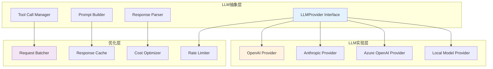
```mermaid
graph TB
    subgraph "LLM抽象层"
        A[LLMProvider Interface]
        B[Tool Call Manager]
        C[Prompt Builder]
        D[Response Parser]
    end
    
    subgraph "LLM实现层"
        E[OpenAI Provider]
        F[Anthropic Provider]
        G[Azure OpenAI Provider]
        H[Local Model Provider]
    end
    
    subgraph "优化层"
        I[Request Batcher]
        J[Response Cache]
        K[Cost Optimizer]
        L[Rate Limiter]
    end
    
    A --> E
    A --> F
    A --> G
    A --> H
    
    B --> I
    C --> J
    D --> K
    A --> L
    
    style A fill:#e3f2fd
    style I fill:#f3e5f5
    style E fill:#fff3e0
```

#### 4.3.2 工具调用框架

```go
// ToolCallManager 工具调用管理器
type ToolCallManager struct {
    providers     map[string]LLMProvider
    tools         map[string]Tool
    cache         ToolCallCache
    optimizer     CallOptimizer
    monitor       CallMonitor
}

// Tool 工具定义
type Tool struct {
    Name        string           `json:"name"`
    Description string           `json:"description"`
    Parameters  ParameterSchema  `json:"parameters"`
    Handler     ToolHandler      `json:"-"`
    Metadata    ToolMetadata     `json:"metadata"`
}

// ToolHandler 工具处理器
type ToolHandler interface {
    Execute(ctx context.Context, args ToolArguments) (ToolResult, error)
    Validate(args ToolArguments) error
    GetCost() CostInfo
}

// 内置工具
var BuiltinTools = map[string]Tool{
    "extract_memories": {
        Name:        "extract_memories",
        Description: "从对话中提取候选记忆",
        Parameters:  ExtractMemoriesSchema,
        Handler:     &ExtractMemoriesHandler{},
    },
    "add_memory": {
        Name:        "add_memory",
        Description: "添加新的记忆",
        Parameters:  AddMemorySchema,
        Handler:     &AddMemoryHandler{},
    },
    "update_memory": {
        Name:        "update_memory",
        Description: "更新现有记忆",
        Parameters:  UpdateMemorySchema,
        Handler:     &UpdateMemoryHandler{},
    },
    "delete_memory": {
        Name:        "delete_memory",
        Description: "删除记忆",
        Parameters:  DeleteMemorySchema,
        Handler:     &DeleteMemoryHandler{},
    },
}
```

### 4.4 异步处理架构

#### 4.4.1 作业队列系统

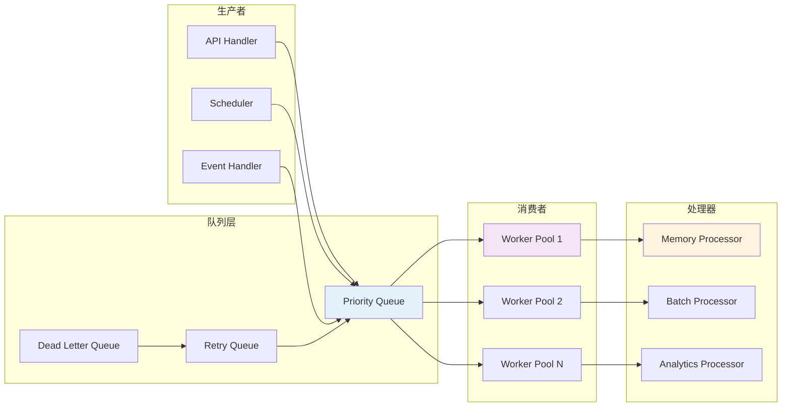
```mermaid
graph LR
    subgraph "生产者"
        A[API Handler]
        B[Scheduler]
        C[Event Handler]
    end
    
    subgraph "队列层"
        D[Priority Queue]
        E[Dead Letter Queue]
        F[Retry Queue]
    end
    
    subgraph "消费者"
        G[Worker Pool 1]
        H[Worker Pool 2]
        I[Worker Pool N]
    end
    
    subgraph "处理器"
        J[Memory Processor]
        K[Batch Processor]
        L[Analytics Processor]
    end
    
    A --> D
    B --> D
    C --> D
    
    D --> G
    D --> H
    D --> I
    
    E --> F
    F --> D
    
    G --> J
    H --> K
    I --> L
    
    style D fill:#e3f2fd
    style G fill:#f3e5f5
    style J fill:#fff3e0
```

#### 4.4.2 工作池管理

```go
// WorkerPoolManager 工作池管理器
type WorkerPoolManager struct {
    pools         map[string]*WorkerPool
    dispatcher    JobDispatcher
    monitor       PoolMonitor
    autoscaler    AutoScaler
    config        PoolConfig
}

// WorkerPool 工作池
type WorkerPool struct {
    id            string
    workers       []*Worker
    jobQueue      chan Job
    quitChan      chan bool
    metrics       *PoolMetrics
    config        WorkerConfig
}

// Worker 工作者
type Worker struct {
    id           int
    pool         *WorkerPool
    processor    JobProcessor
    currentJob   Job
    metrics      *WorkerMetrics
    lastActivity time.Time
}

// AutoScaler 自动扩缩容器
type AutoScaler struct {
    rules         []ScalingRule
    cooldown      time.Duration
    minWorkers    int
    maxWorkers    int
    metrics       *ScalingMetrics
}

func (as *AutoScaler) ShouldScale(pool *WorkerPool) ScalingDecision {
    currentLoad := pool.GetLoadMetrics()
    
    for _, rule := range as.rules {
        if decision := rule.Evaluate(currentLoad); decision.Action != ScaleNone {
            return decision
        }
    }
    
    return ScalingDecision{Action: ScaleNone}
}
```

## 5. 数据架构设计

### 5.1 数据模型

#### 5.1.1 核心实体关系

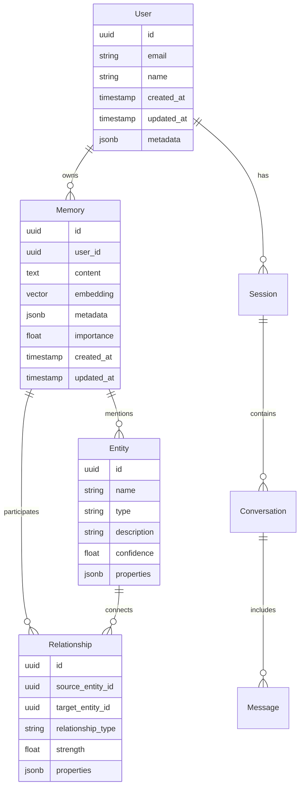
```mermaid
erDiagram
    User ||--o{ Memory : owns
    User ||--o{ Session : has
    Session ||--o{ Conversation : contains
    Conversation ||--o{ Message : includes
    Memory ||--o{ Entity : mentions
    Memory ||--o{ Relationship : participates
    Entity ||--o{ Relationship : connects
    
    User {
        uuid id
        string email
        string name
        timestamp created_at
        timestamp updated_at
        jsonb metadata
    }
    
    Memory {
        uuid id
        uuid user_id
        text content
        vector embedding
        jsonb metadata
        float importance
        timestamp created_at
        timestamp updated_at
    }
    
    Entity {
        uuid id
        string name
        string type
        string description
        float confidence
        jsonb properties
    }
    
    Relationship {
        uuid id
        uuid source_entity_id
        uuid target_entity_id
        string relationship_type
        float strength
        jsonb properties
    }
```

#### 5.1.2 数据分布策略

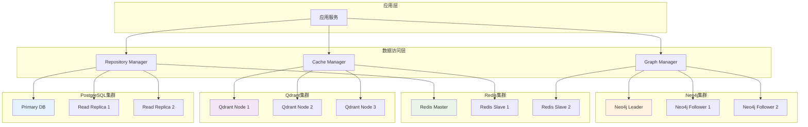
```mermaid
graph TB
    subgraph "应用层"
        A[应用服务]
    end
    
    subgraph "数据访问层"
        B[Repository Manager]
        C[Cache Manager]
        D[Graph Manager]
    end
    
    subgraph "PostgreSQL集群"
        E[Primary DB]
        F[Read Replica 1]
        G[Read Replica 2]
    end
    
    subgraph "Qdrant集群"
        H[Qdrant Node 1]
        I[Qdrant Node 2]
        J[Qdrant Node 3]
    end
    
    subgraph "Neo4j集群"
        K[Neo4j Leader]
        L[Neo4j Follower 1]
        M[Neo4j Follower 2]
    end
    
    subgraph "Redis集群"
        N[Redis Master]
        O[Redis Slave 1]
        P[Redis Slave 2]
    end
    
    A --> B
    A --> C
    A --> D
    
    B --> E
    B --> F
    B --> G
    
    C --> H
    C --> I
    C --> J
    
    D --> K
    D --> L
    D --> M
    
    B --> N
    C --> O
    D --> P
    
    style E fill:#e3f2fd
    style H fill:#f3e5f5
    style K fill:#fff3e0
    style N fill:#e8f5e8
```

### 5.2 数据一致性

#### 5.2.1 一致性策略

```go
// ConsistencyManager 一致性管理器
type ConsistencyManager struct {
    strategy    ConsistencyStrategy
    coordinator TransactionCoordinator
    compensator CompensatingActionManager
    monitor     ConsistencyMonitor
}

// ConsistencyStrategy 一致性策略
type ConsistencyStrategy interface {
    GetRequiredLevel(operation Operation) ConsistencyLevel
    ShouldUseTransaction(operations []Operation) bool
    GetIsolationLevel(operation Operation) IsolationLevel
}

// TransactionCoordinator 事务协调器（SAGA模式）
type TransactionCoordinator struct {
    sagaManager   SagaManager
    eventStore    EventStore
    compensations CompensationRegistry
}

// Saga 长事务处理
type Saga struct {
    ID            string
    Steps         []SagaStep
    CurrentStep   int
    Status        SagaStatus
    Context       SagaContext
    Compensations []CompensatingAction
}

func (tc *TransactionCoordinator) ExecuteSaga(saga *Saga) error {
    for i, step := range saga.Steps {
        saga.CurrentStep = i
        
        // 执行步骤
        result, err := step.Execute(saga.Context)
        if err != nil {
            // 执行补偿操作
            return tc.compensate(saga, i)
        }
        
        // 更新上下文
        saga.Context = saga.Context.Merge(result)
        
        // 记录事件
        tc.eventStore.Record(SagaStepCompletedEvent{
            SagaID: saga.ID,
            Step:   i,
            Result: result,
        })
    }
    
    saga.Status = SagaStatusCompleted
    return nil
}
```

#### 5.2.2 数据同步机制

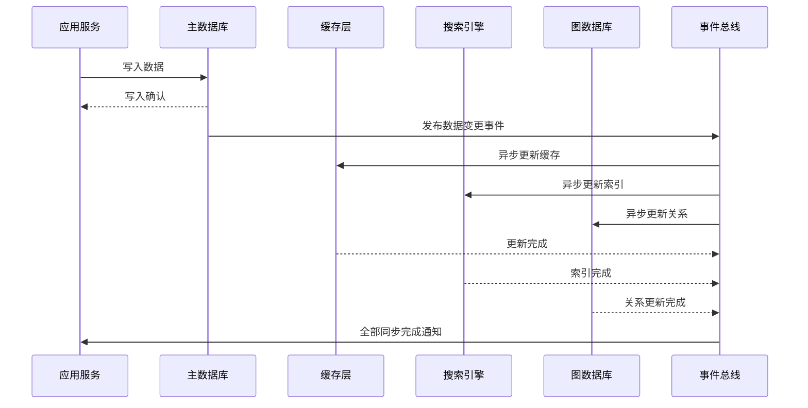
```mermaid
sequenceDiagram
    participant App as 应用服务
    participant Primary as 主数据库
    participant Cache as 缓存层
    participant Search as 搜索引擎
    participant Graph as 图数据库
    participant Event as 事件总线

    App->>Primary: 写入数据
    Primary-->>App: 写入确认
    
    Primary->>Event: 发布数据变更事件
    
    Event->>Cache: 异步更新缓存
    Event->>Search: 异步更新索引
    Event->>Graph: 异步更新关系
    
    Cache-->>Event: 更新完成
    Search-->>Event: 索引完成
    Graph-->>Event: 关系更新完成
    
    Event->>App: 全部同步完成通知
```

## 6. 安全架构

### 6.1 安全层次

#### 6.1.1 纵深防御架构

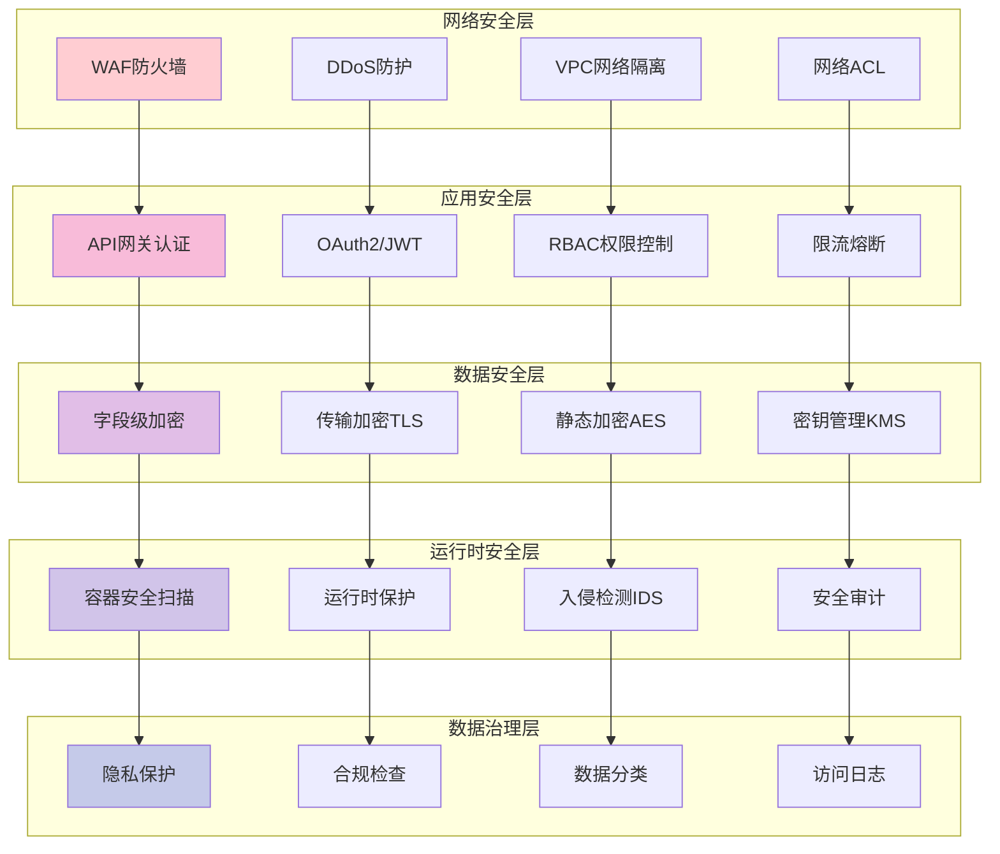
```mermaid
graph TB
    subgraph "网络安全层"
        A[WAF防火墙]
        B[DDoS防护]
        C[VPC网络隔离]
        D[网络ACL]
    end
    
    subgraph "应用安全层"
        E[API网关认证]
        F[OAuth2/JWT]
        G[RBAC权限控制]
        H[限流熔断]
    end
    
    subgraph "数据安全层"
        I[字段级加密]
        J[传输加密TLS]
        K[静态加密AES]
        L[密钥管理KMS]
    end
    
    subgraph "运行时安全层"
        M[容器安全扫描]
        N[运行时保护]
        O[入侵检测IDS]
        P[安全审计]
    end
    
    subgraph "数据治理层"
        Q[隐私保护]
        R[合规检查]
        S[数据分类]
        T[访问日志]
    end
    
    A --> E
    B --> F
    C --> G
    D --> H
    
    E --> I
    F --> J
    G --> K
    H --> L
    
    I --> M
    J --> N
    K --> O
    L --> P
    
    M --> Q
    N --> R
    O --> S
    P --> T
    
    style A fill:#ffcdd2
    style E fill:#f8bbd9
    style I fill:#e1bee7
    style M fill:#d1c4e9
    style Q fill:#c5cae9
```

#### 6.1.2 身份认证和授权

```go
// AuthenticationManager 认证管理器
type AuthenticationManager struct {
    providers    []AuthProvider
    jwtManager   JWTManager
    sessionStore SessionStore
    mfaManager   MFAManager
    config       AuthConfig
}

// AuthProvider 认证提供者接口
type AuthProvider interface {
    Authenticate(ctx context.Context, credentials Credentials) (*AuthResult, error)
    ValidateToken(ctx context.Context, token string) (*TokenClaims, error)
    RefreshToken(ctx context.Context, refreshToken string) (*TokenPair, error)
    Logout(ctx context.Context, token string) error
}

// RBAC权限控制
type RBACManager struct {
    roles       RoleRepository
    permissions PermissionRepository
    policies    PolicyEngine
    enforcer    PolicyEnforcer
}

// Permission 权限定义
type Permission struct {
    ID       string   `json:"id"`
    Resource string   `json:"resource"` // memories, users, admin
    Action   string   `json:"action"`   // read, write, delete
    Scope    string   `json:"scope"`    // own, team, global
    Conditions []Condition `json:"conditions"`
}

// Role 角色定义
type Role struct {
    ID          string       `json:"id"`
    Name        string       `json:"name"`
    Description string       `json:"description"`
    Permissions []Permission `json:"permissions"`
    Inheritance []string     `json:"inheritance"` // 继承的角色ID
}

func (rbac *RBACManager) CheckPermission(userID string, resource string, action string, context map[string]interface{}) (bool, error) {
    // 获取用户角色
    userRoles, err := rbac.getUserRoles(userID)
    if err != nil {
        return false, err
    }
    
    // 检查每个角色的权限
    for _, role := range userRoles {
        if allowed := rbac.checkRolePermission(role, resource, action, context); allowed {
            return true, nil
        }
    }
    
    return false, nil
}
```

### 6.2 数据隐私保护

#### 6.2.1 隐私保护流程

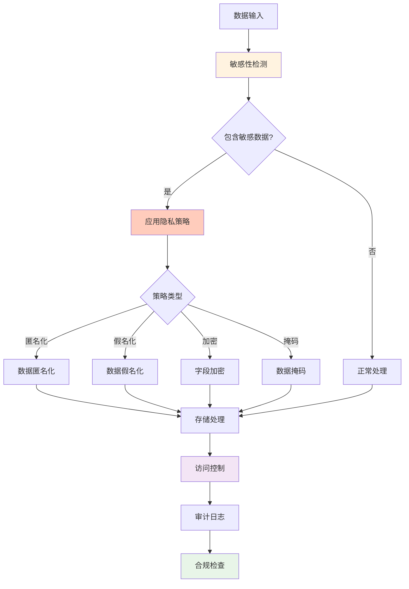
```mermaid
flowchart TD
    A[数据输入] --> B[敏感性检测]
    B --> C{包含敏感数据?}
    
    C -->|否| D[正常处理]
    C -->|是| E[应用隐私策略]
    
    E --> F{策略类型}
    
    F -->|匿名化| G[数据匿名化]
    F -->|假名化| H[数据假名化]
    F -->|加密| I[字段加密]
    F -->|掩码| J[数据掩码]
    
    G --> K[存储处理]
    H --> K
    I --> K
    J --> K
    D --> K
    
    K --> L[访问控制]
    L --> M[审计日志]
    M --> N[合规检查]
    
    style B fill:#fff3e0
    style E fill:#ffccbc
    style L fill:#f3e5f5
    style N fill:#e8f5e8
```

#### 6.2.2 GDPR合规实现

```go
// GDPRComplianceManager GDPR合规管理器
type GDPRComplianceManager struct {
    dataProcessor   DataProcessor
    consentManager  ConsentManager
    requestHandler  SubjectRequestHandler
    auditor        ComplianceAuditor
    config         GDPRConfig
}

// DataSubjectRights 数据主体权利
type DataSubjectRights struct {
    AccessRight         bool `json:"access_right"`          // 访问权
    RectificationRight  bool `json:"rectification_right"`   // 更正权
    ErasureRight        bool `json:"erasure_right"`         // 删除权
    PortabilityRight    bool `json:"portability_right"`     // 可携带权
    ObjectionRight      bool `json:"objection_right"`       // 反对权
    RestrictProcessing  bool `json:"restrict_processing"`   // 限制处理权
}

// 处理数据主体请求
func (gcm *GDPRComplianceManager) HandleSubjectRequest(request SubjectRequest) (*SubjectResponse, error) {
    // 验证请求者身份
    if err := gcm.verifySubjectIdentity(request); err != nil {
        return nil, fmt.Errorf("identity verification failed: %w", err)
    }
    
    switch request.Type {
    case RequestTypeAccess:
        return gcm.handleAccessRequest(request)
    case RequestTypeRectification:
        return gcm.handleRectificationRequest(request)
    case RequestTypeErasure:
        return gcm.handleErasureRequest(request)
    case RequestTypePortability:
        return gcm.handlePortabilityRequest(request)
    default:
        return nil, fmt.Errorf("unsupported request type: %s", request.Type)
    }
}

// Right to be Forgotten (删除权)
func (gcm *GDPRComplianceManager) handleErasureRequest(request SubjectRequest) (*SubjectResponse, error) {
    userID := request.SubjectID
    
    // 检查删除的合法性
    if !gcm.canErase(userID, request.Reason) {
        return &SubjectResponse{
            Status: ResponseStatusDenied,
            Reason: "Legal obligation to retain data",
        }, nil
    }
    
    // 执行数据删除
    deletionPlan := gcm.createDeletionPlan(userID)
    
    for _, step := range deletionPlan.Steps {
        if err := step.Execute(); err != nil {
            return nil, fmt.Errorf("deletion step failed: %w", err)
        }
    }
    
    // 记录删除操作
    gcm.auditor.LogDataErasure(DataErasureEvent{
        SubjectID:   userID,
        RequestID:   request.ID,
        Timestamp:   time.Now(),
        DataTypes:   deletionPlan.DataTypes,
        Reason:      request.Reason,
    })
    
    return &SubjectResponse{
        Status:      ResponseStatusCompleted,
        CompletedAt: time.Now(),
        Details:     deletionPlan.Summary(),
    }, nil
}
```

## 7. 可观测性架构

### 7.1 三支柱监控

#### 7.1.1 监控架构图

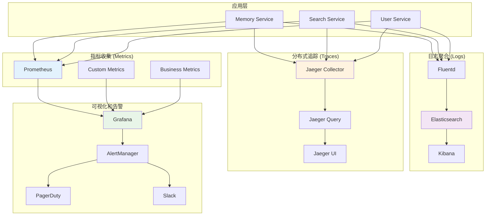
```mermaid
graph TB
    subgraph "应用层"
        A[Memory Service]
        B[Search Service] 
        C[User Service]
    end
    
    subgraph "指标收集 (Metrics)"
        D[Prometheus]
        E[Custom Metrics]
        F[Business Metrics]
    end
    
    subgraph "日志聚合 (Logs)"
        G[Fluentd]
        H[Elasticsearch]
        I[Kibana]
    end
    
    subgraph "分布式追踪 (Traces)"
        J[Jaeger Collector]
        K[Jaeger Query]
        L[Jaeger UI]
    end
    
    subgraph "可视化和告警"
        M[Grafana]
        N[AlertManager]
        O[PagerDuty]
        P[Slack]
    end
    
    A --> D
    A --> G
    A --> J
    
    B --> D
    B --> G
    B --> J
    
    C --> D
    C --> G
    C --> J
    
    D --> M
    E --> M
    F --> M
    
    G --> H
    H --> I
    
    J --> K
    K --> L
    
    M --> N
    N --> O
    N --> P
    
    style D fill:#e3f2fd
    style H fill:#f3e5f5
    style J fill:#fff3e0
    style M fill:#e8f5e8
```

#### 7.1.2 核心指标体系

```go
// MetricsRegistry 指标注册表
type MetricsRegistry struct {
    businessMetrics   *BusinessMetrics
    systemMetrics     *SystemMetrics
    customMetrics     *CustomMetrics
    registry          prometheus.Registerer
}

// BusinessMetrics 业务指标
type BusinessMetrics struct {
    // 内存操作指标
    MemoriesCreated     prometheus.Counter
    MemoriesUpdated     prometheus.Counter
    MemoriesDeleted     prometheus.Counter
    MemoriesSearched    prometheus.Counter
    
    // 性能指标
    MemoryProcessingDuration  prometheus.Histogram
    SearchLatency            prometheus.Histogram
    LLMCallDuration          prometheus.Histogram
    
    // 质量指标
    MemoryExtractionAccuracy prometheus.Gauge
    SearchRelevanceScore     prometheus.Gauge
    UserSatisfactionScore    prometheus.Gauge
    
    // 成本指标
    LLMTokensConsumed       *prometheus.CounterVec
    LLMCosts                prometheus.Counter
    InfrastructureCosts     prometheus.Gauge
}

// SystemMetrics 系统指标
type SystemMetrics struct {
    // 应用指标
    HTTPRequestsTotal       *prometheus.CounterVec
    HTTPRequestDuration     *prometheus.HistogramVec
    ActiveGoroutines        prometheus.Gauge
    MemoryUsage            prometheus.Gauge
    
    // 数据库指标
    DatabaseConnections     *prometheus.GaugeVec
    DatabaseQueryDuration   *prometheus.HistogramVec
    DatabaseConnectionErrors *prometheus.CounterVec
    
    // 队列指标
    JobQueueDepth          *prometheus.GaugeVec
    JobProcessingDuration  *prometheus.HistogramVec
    JobFailures            *prometheus.CounterVec
    
    // 外部服务指标
    ExternalServiceCalls    *prometheus.CounterVec
    ExternalServiceLatency  *prometheus.HistogramVec
    ExternalServiceErrors   *prometheus.CounterVec
}

// SLI/SLO定义
type ServiceLevelIndicators struct {
    Availability    SLI `json:"availability"`     // 99.9%
    Latency        SLI `json:"latency"`          // P95 < 100ms
    ErrorRate      SLI `json:"error_rate"`       // < 0.1%
    Throughput     SLI `json:"throughput"`       // > 1000 QPS
}

type SLI struct {
    Name        string  `json:"name"`
    Target      float64 `json:"target"`
    Current     float64 `json:"current"`
    Trend       string  `json:"trend"`
    Status      string  `json:"status"`
}
```

### 7.2 智能告警

#### 7.2.1 告警层次和升级

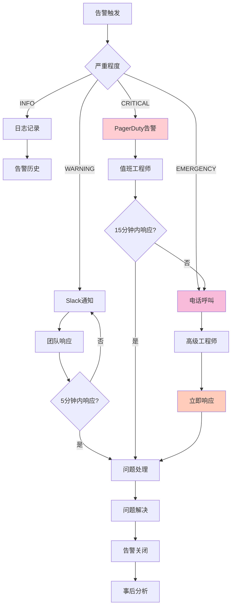
```mermaid
graph TD
    A[告警触发] --> B{严重程度}
    
    B -->|INFO| C[日志记录]
    B -->|WARNING| D[Slack通知]
    B -->|CRITICAL| E[PagerDuty告警]
    B -->|EMERGENCY| F[电话呼叫]
    
    C --> G[告警历史]
    D --> H[团队响应]
    E --> I[值班工程师]
    F --> J[高级工程师]
    
    H --> K{5分钟内响应?}
    I --> L{15分钟内响应?}
    J --> M[立即响应]
    
    K -->|否| D
    L -->|否| F
    
    K -->|是| N[问题处理]
    L -->|是| N
    M --> N
    
    N --> O[问题解决]
    O --> P[告警关闭]
    P --> Q[事后分析]
    
    style E fill:#ffcdd2
    style F fill:#f8bbd9
    style M fill:#ffccbc
```

#### 7.2.2 智能告警规则

```go
// AlertManager 智能告警管理器
type AlertManager struct {
    rules       []AlertRule
    evaluator   RuleEvaluator
    notifier    AlertNotifier
    suppressor  AlertSuppressor
    escalator   AlertEscalator
}

// AlertRule 告警规则
type AlertRule struct {
    ID          string            `json:"id"`
    Name        string            `json:"name"`
    Query       string            `json:"query"`        // PromQL查询
    Condition   AlertCondition    `json:"condition"`
    Duration    time.Duration     `json:"duration"`
    Severity    AlertSeverity     `json:"severity"`
    Labels      map[string]string `json:"labels"`
    Annotations map[string]string `json:"annotations"`
    Runbook     string            `json:"runbook"`
}

// SmartAlertEvaluator 智能告警评估器
type SmartAlertEvaluator struct {
    historyAnalyzer HistoryAnalyzer
    anomalyDetector AnomalyDetector
    contextEnricher ContextEnricher
    falsePositiveFilter FalsePositiveFilter
}

func (sae *SmartAlertEvaluator) EvaluateAlert(rule AlertRule, metrics MetricData) (*Alert, error) {
    // 基础条件检查
    if !rule.Condition.Evaluate(metrics) {
        return nil, nil
    }
    
    // 历史分析
    historical := sae.historyAnalyzer.GetHistoricalPattern(rule.ID, time.Hour*24)
    if sae.isExpectedAnomaly(metrics, historical) {
        return nil, nil // 预期的异常，不产生告警
    }
    
    // 异常检测
    anomalyScore := sae.anomalyDetector.CalculateScore(metrics)
    if anomalyScore < 0.7 { // 异常程度不足
        return nil, nil
    }
    
    // 上下文丰富
    context := sae.contextEnricher.EnrichContext(metrics)
    
    // 过滤误报
    if sae.falsePositiveFilter.IsLikelyFalsePositive(rule, metrics, context) {
        return nil, nil
    }
    
    alert := &Alert{
        ID:          generateAlertID(),
        Rule:        rule,
        FiredAt:     time.Now(),
        Value:       metrics.Value,
        Context:     context,
        AnomalyScore: anomalyScore,
        Severity:    sae.calculateDynamicSeverity(rule.Severity, anomalyScore, context),
    }
    
    return alert, nil
}

// 预定义的智能告警规则
var SmartAlertRules = []AlertRule{
    {
        ID:   "memory_processing_latency_high",
        Name: "Memory Processing Latency High",
        Query: `histogram_quantile(0.95, rate(memory_processing_duration_seconds_bucket[5m])) > 2`,
        Condition: AlertCondition{
            Threshold: 2.0,
            Operator:  OperatorGreater,
        },
        Duration: 5 * time.Minute,
        Severity: SeverityWarning,
        Annotations: map[string]string{
            "description": "95th percentile memory processing latency is {{ $value }}s",
            "summary":     "Memory processing is slower than expected",
            "runbook":     "https://runbooks.example.com/memory-latency",
        },
    },
    
    {
        ID:   "llm_cost_budget_exceeded",
        Name: "LLM Cost Budget Exceeded",
        Query: `increase(llm_costs_total[1h]) > 500`,
        Condition: AlertCondition{
            Threshold: 500.0,
            Operator:  OperatorGreater,
        },
        Duration: 1 * time.Hour,
        Severity: SeverityCritical,
        Annotations: map[string]string{
            "description": "LLM costs increased by ${{ $value }} in the last hour",
            "summary":     "LLM costs are exceeding budget",
            "action":      "Review LLM usage patterns and optimize",
        },
    },
    
    {
        ID:   "data_quality_degradation",
        Name: "Data Quality Degradation",
        Query: `memory_extraction_accuracy < 0.8`,
        Condition: AlertCondition{
            Threshold: 0.8,
            Operator:  OperatorLess,
        },
        Duration: 10 * time.Minute,
        Severity: SeverityWarning,
        Annotations: map[string]string{
            "description": "Memory extraction accuracy dropped to {{ $value }}",
            "summary":     "Data quality is degrading",
            "investigation": "Check LLM model performance and input data quality",
        },
    },
}
```

## 8. 部署架构

### 8.1 云原生部署

#### 8.1.1 Kubernetes部署架构

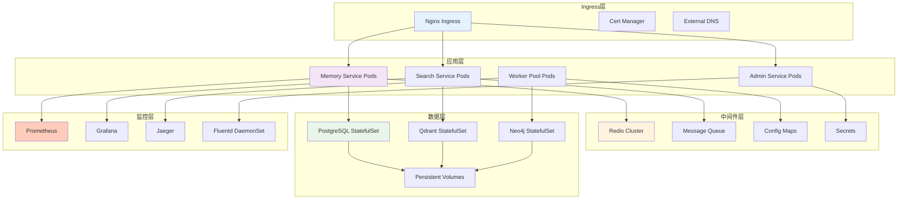
```mermaid
graph TB
    subgraph "Ingress层"
        A[Nginx Ingress]
        B[Cert Manager]
        C[External DNS]
    end
    
    subgraph "应用层"
        D[Memory Service Pods]
        E[Search Service Pods]
        F[Worker Pool Pods]
        G[Admin Service Pods]
    end
    
    subgraph "中间件层"
        H[Redis Cluster]
        I[Message Queue]
        J[Config Maps]
        K[Secrets]
    end
    
    subgraph "数据层"
        L[PostgreSQL StatefulSet]
        M[Qdrant StatefulSet]
        N[Neo4j StatefulSet]
        O[Persistent Volumes]
    end
    
    subgraph "监控层"
        P[Prometheus]
        Q[Grafana]
        R[Jaeger]
        S[Fluentd DaemonSet]
    end
    
    A --> D
    A --> E
    A --> G
    
    D --> H
    E --> I
    F --> J
    G --> K
    
    D --> L
    E --> M
    F --> N
    
    L --> O
    M --> O
    N --> O
    
    D --> P
    E --> Q
    F --> R
    G --> S
    
    style A fill:#e3f2fd
    style D fill:#f3e5f5
    style H fill:#fff3e0
    style L fill:#e8f5e8
    style P fill:#ffccbc
```

#### 8.1.2 多环境部署策略

```yaml
# environments/production/kustomization.yaml
apiVersion: kustomize.config.k8s.io/v1beta1
kind: Kustomization

namespace: mem-bank-prod

resources:
  - ../../base
  - postgres-ha.yaml
  - qdrant-cluster.yaml
  - neo4j-cluster.yaml
  - monitoring.yaml

patches:
  - target:
      kind: Deployment
      name: memory-service
    patch: |-
      - op: replace
        path: /spec/replicas
        value: 5
      - op: replace
        path: /spec/template/spec/containers/0/resources/requests/memory
        value: "2Gi"
      - op: replace
        path: /spec/template/spec/containers/0/resources/limits/memory
        value: "4Gi"

configMapGenerator:
  - name: app-config
    files:
      - config.yaml=config/production.yaml

secretGenerator:
  - name: app-secrets
    envs:
      - secrets/production.env

images:
  - name: mem-bank
    newTag: v1.2.3
```

### 8.2 高可用架构

#### 8.2.1 多区域部署

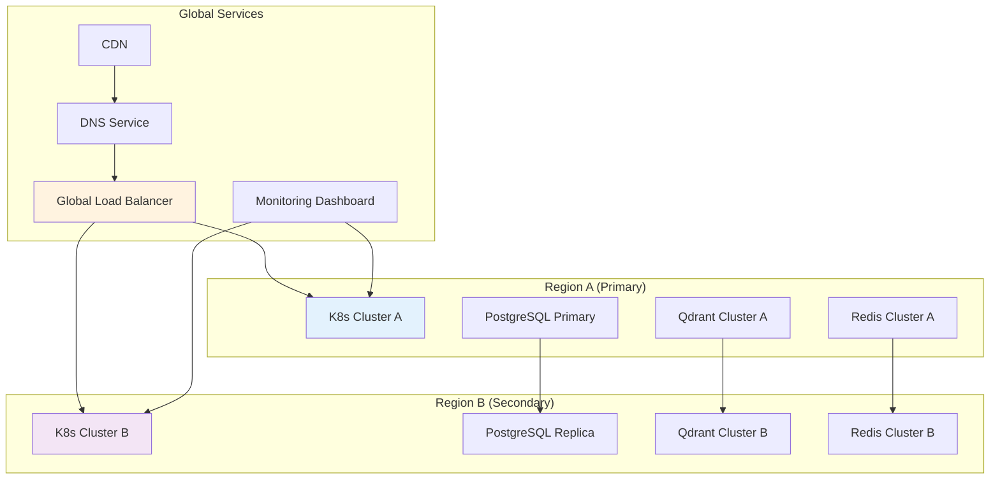
```mermaid
graph TB
    subgraph "Region A (Primary)"
        A1[K8s Cluster A]
        A2[PostgreSQL Primary]
        A3[Qdrant Cluster A]
        A4[Redis Cluster A]
    end
    
    subgraph "Region B (Secondary)"
        B1[K8s Cluster B]
        B2[PostgreSQL Replica]
        B3[Qdrant Cluster B]
        B4[Redis Cluster B]
    end
    
    subgraph "Global Services"
        C1[Global Load Balancer]
        C2[DNS Service]
        C3[CDN]
        C4[Monitoring Dashboard]
    end
    
    C1 --> A1
    C1 --> B1
    C2 --> C1
    C3 --> C2
    
    A2 --> B2
    A3 --> B3
    A4 --> B4
    
    C4 --> A1
    C4 --> B1
    
    style A1 fill:#e3f2fd
    style B1 fill:#f3e5f5
    style C1 fill:#fff3e0
```

#### 8.2.2 灾难恢复

```go
// DisasterRecoveryManager 灾难恢复管理器
type DisasterRecoveryManager struct {
    healthChecker    HealthChecker
    failoverManager  FailoverManager
    backupManager    BackupManager
    notificationService NotificationService
    config          DRConfig
}

// DRConfig 灾难恢复配置
type DRConfig struct {
    PrimaryRegion      string        `mapstructure:"primary_region"`
    SecondaryRegions   []string      `mapstructure:"secondary_regions"`
    FailoverThreshold  time.Duration `mapstructure:"failover_threshold"`
    AutoFailover       bool          `mapstructure:"auto_failover"`
    RecoveryObjective  time.Duration `mapstructure:"recovery_time_objective"`
    DataLossObjective  time.Duration `mapstructure:"recovery_point_objective"`
}

// MonitorHealth 监控系统健康状态
func (drm *DisasterRecoveryManager) MonitorHealth(ctx context.Context) {
    ticker := time.NewTicker(30 * time.Second)
    defer ticker.Stop()
    
    for {
        select {
        case <-ctx.Done():
            return
        case <-ticker.C:
            if err := drm.checkSystemHealth(); err != nil {
                drm.handleHealthIssue(err)
            }
        }
    }
}

// checkSystemHealth 检查系统健康状态
func (drm *DisasterRecoveryManager) checkSystemHealth() error {
    checks := []HealthCheck{
        drm.healthChecker.CheckApplicationHealth(),
        drm.healthChecker.CheckDatabaseHealth(),
        drm.healthChecker.CheckNetworkHealth(),
        drm.healthChecker.CheckStorageHealth(),
    }
    
    var failures []error
    for _, check := range checks {
        if err := check.Execute(); err != nil {
            failures = append(failures, err)
        }
    }
    
    if len(failures) > 0 {
        return fmt.Errorf("health check failures: %v", failures)
    }
    
    return nil
}

// InitiateFailover 启动故障转移
func (drm *DisasterRecoveryManager) InitiateFailover(reason string) error {
    drm.logger.WithField("reason", reason).Warn("Initiating failover")
    
    // 1. 停止主区域流量
    if err := drm.failoverManager.StopPrimaryTraffic(); err != nil {
        return fmt.Errorf("failed to stop primary traffic: %w", err)
    }
    
    // 2. 提升次要区域
    if err := drm.failoverManager.PromoteSecondary(); err != nil {
        return fmt.Errorf("failed to promote secondary: %w", err)
    }
    
    // 3. 切换DNS
    if err := drm.failoverManager.SwitchDNS(); err != nil {
        return fmt.Errorf("failed to switch DNS: %w", err)
    }
    
    // 4. 通知相关人员
    drm.notificationService.SendFailoverAlert(FailoverAlert{
        Reason:    reason,
        Timestamp: time.Now(),
        NewPrimary: drm.config.SecondaryRegions[0],
    })
    
    return nil
}
```

## 9. 成本优化

### 9.1 资源优化策略

#### 9.1.1 智能扩缩容

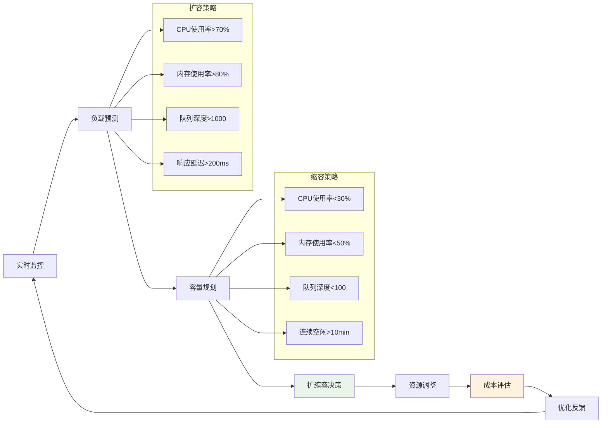
```mermaid
graph LR
    A[实时监控] --> B[负载预测]
    B --> C[容量规划]
    C --> D[扩缩容决策]
    D --> E[资源调整]
    E --> F[成本评估]
    F --> G[优化反馈]
    G --> A
    
    subgraph "扩容策略"
        H[CPU使用率>70%]
        I[内存使用率>80%]
        J[队列深度>1000]
        K[响应延迟>200ms]
    end
    
    subgraph "缩容策略"
        L[CPU使用率<30%]
        M[内存使用率<50%]
        N[队列深度<100]
        O[连续空闲>10min]
    end
    
    B --> H
    B --> I
    B --> J
    B --> K
    
    C --> L
    C --> M
    C --> N
    C --> O
    
    style D fill:#e8f5e8
    style F fill:#fff3e0
```

#### 9.1.2 成本优化实现

```go
// CostOptimizer 成本优化器
type CostOptimizer struct {
    cloudProvider   CloudProvider
    resourceManager ResourceManager
    usageAnalyzer   UsageAnalyzer
    predictor       CostPredictor
    optimizer       ResourceOptimizer
    config          CostConfig
}

// OptimizeResources 优化资源配置
func (co *CostOptimizer) OptimizeResources(ctx context.Context) (*OptimizationReport, error) {
    // 分析当前使用情况
    usage := co.usageAnalyzer.AnalyzeCurrentUsage(time.Hour * 24 * 7) // 7天
    
    // 预测未来需求
    forecast := co.predictor.PredictUsage(time.Hour * 24 * 30) // 30天
    
    // 生成优化建议
    recommendations := co.optimizer.GenerateRecommendations(usage, forecast)
    
    var optimizations []AppliedOptimization
    totalSavings := 0.0
    
    // 执行低风险优化
    for _, rec := range recommendations {
        if rec.Risk == RiskLow && rec.EstimatedSavings > 10 {
            optimization, err := co.applyOptimization(ctx, rec)
            if err != nil {
                co.logger.WithError(err).Warn("Failed to apply optimization")
                continue
            }
            optimizations = append(optimizations, *optimization)
            totalSavings += optimization.ActualSavings
        }
    }
    
    return &OptimizationReport{
        Period:               time.Hour * 24,
        TotalSavings:        totalSavings,
        OptimizationsApplied: len(optimizations),
        Recommendations:      recommendations,
        Details:             optimizations,
        GeneratedAt:         time.Now(),
    }, nil
}

// LLMCostOptimization LLM成本优化
func (co *CostOptimizer) OptimizeLLMCosts() []*LLMOptimization {
    var optimizations []*LLMOptimization
    
    // 1. 模型选择优化
    optimizations = append(optimizations, &LLMOptimization{
        Type:        "model_selection",
        Description: "Use cheaper models for simple tasks",
        CurrentCost: 1000.0,
        OptimizedCost: 600.0,
        Savings:     400.0,
        Implementation: "Route extraction tasks to GPT-3.5, decisions to GPT-4",
    })
    
    // 2. 批处理优化
    optimizations = append(optimizations, &LLMOptimization{
        Type:        "batch_processing",
        Description: "Batch multiple requests together",
        CurrentCost: 800.0,
        OptimizedCost: 500.0,
        Savings:     300.0,
        Implementation: "Accumulate requests and process in batches of 10",
    })
    
    // 3. 缓存优化
    optimizations = append(optimizations, &LLMOptimization{
        Type:        "caching",
        Description: "Cache frequently used embeddings",
        CurrentCost: 600.0,
        OptimizedCost: 300.0,
        Savings:     300.0,
        Implementation: "Implement 24-hour TTL cache for embeddings",
    })
    
    return optimizations
}
```

### 9.2 预算管理

```go
// BudgetManager 预算管理器
type BudgetManager struct {
    budgets     map[string]*Budget
    alerts      AlertSystem
    enforcer    BudgetEnforcer
    tracker     CostTracker
    config      BudgetConfig
}

// Budget 预算定义
type Budget struct {
    ID          string    `json:"id"`
    Name        string    `json:"name"`
    Service     string    `json:"service"`
    Amount      float64   `json:"amount"`
    Period      string    `json:"period"`     // monthly, quarterly, yearly
    Currency    string    `json:"currency"`
    Thresholds  []float64 `json:"thresholds"` // [50, 80, 90, 100] percentage
    Actions     []BudgetAction `json:"actions"`
    StartDate   time.Time `json:"start_date"`
    EndDate     time.Time `json:"end_date"`
}

// MonitorBudgets 监控预算使用情况
func (bm *BudgetManager) MonitorBudgets(ctx context.Context) {
    ticker := time.NewTicker(time.Hour)
    defer ticker.Stop()
    
    for {
        select {
        case <-ctx.Done():
            return
        case <-ticker.C:
            for _, budget := range bm.budgets {
                if err := bm.checkBudgetUsage(budget); err != nil {
                    bm.logger.WithError(err).Error("Budget check failed")
                }
            }
        }
    }
}

func (bm *BudgetManager) checkBudgetUsage(budget *Budget) error {
    // 获取当前支出
    currentSpend := bm.tracker.GetCurrentSpend(budget.Service, budget.Period)
    usagePercent := (currentSpend / budget.Amount) * 100
    
    // 检查是否超过阈值
    for i, threshold := range budget.Thresholds {
        if usagePercent >= threshold {
            action := budget.Actions[i]
            if err := bm.enforcer.ExecuteAction(action, budget, currentSpend); err != nil {
                return fmt.Errorf("failed to execute budget action: %w", err)
            }
        }
    }
    
    return nil
}
```

## 10. 演进路线图

### 10.1 四阶段演进

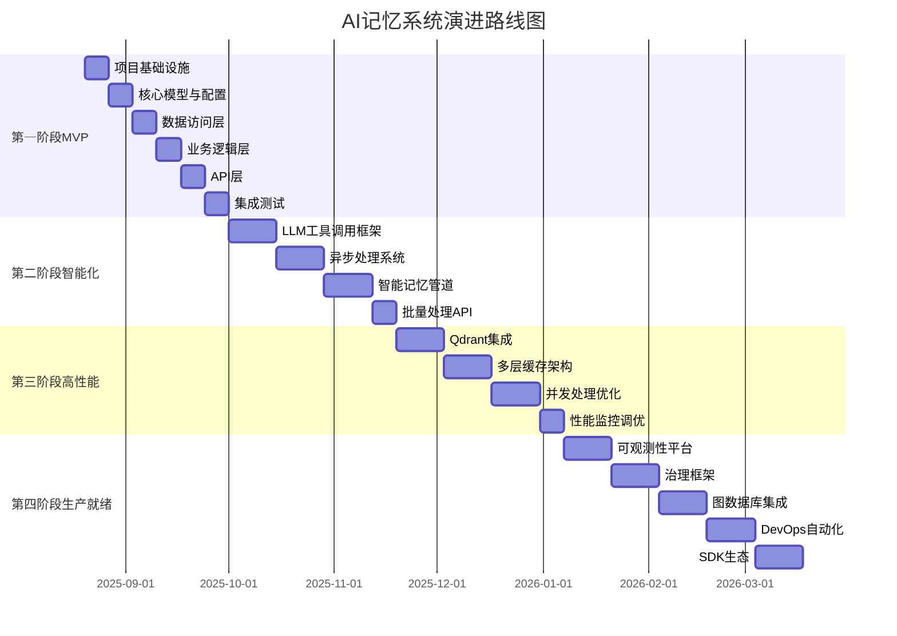
```mermaid
gantt
    title AI记忆系统演进路线图
    dateFormat  YYYY-MM-DD
    section 第一阶段MVP
    项目基础设施        :a1, 2025-08-20, 7d
    核心模型与配置      :a2, after a1, 7d
    数据访问层         :a3, after a2, 7d
    业务逻辑层         :a4, after a3, 7d
    API层             :a5, after a4, 7d
    集成测试          :a6, after a5, 7d
    
    section 第二阶段智能化
    LLM工具调用框架    :b1, after a6, 14d
    异步处理系统       :b2, after b1, 14d
    智能记忆管道       :b3, after b2, 14d
    批量处理API       :b4, after b3, 7d
    
    section 第三阶段高性能
    Qdrant集成        :c1, after b4, 14d
    多层缓存架构       :c2, after c1, 14d
    并发处理优化       :c3, after c2, 14d
    性能监控调优       :c4, after c3, 7d
    
    section 第四阶段生产就绪
    可观测性平台       :d1, after c4, 14d
    治理框架          :d2, after d1, 14d
    图数据库集成       :d3, after d2, 14d
    DevOps自动化      :d4, after d3, 14d
    SDK生态          :d5, after d4, 14d
```

### 10.2 技术演进

#### 10.2.1 架构演进路径

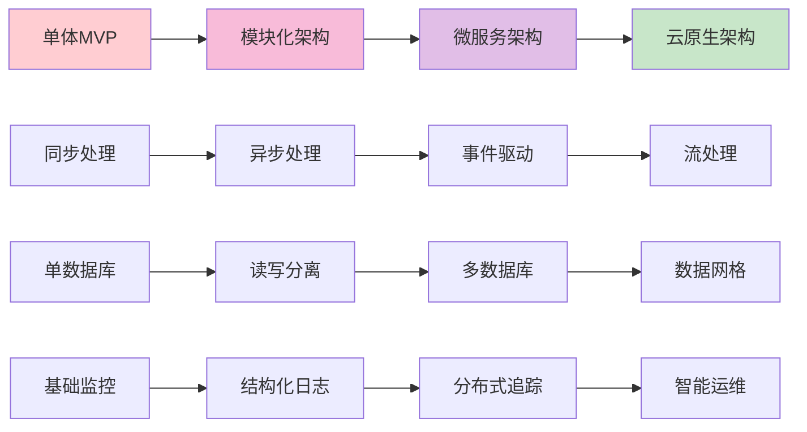
```mermaid
graph LR
    A[单体MVP] --> B[模块化架构]
    B --> C[微服务架构]
    C --> D[云原生架构]
    
    A1[同步处理] --> B1[异步处理]
    B1 --> C1[事件驱动]
    C1 --> D1[流处理]
    
    A2[单数据库] --> B2[读写分离]
    B2 --> C2[多数据库]
    C2 --> D2[数据网格]
    
    A3[基础监控] --> B3[结构化日志]
    B3 --> C3[分布式追踪]
    C3 --> D3[智能运维]
    
    style A fill:#ffcdd2
    style B fill:#f8bbd9
    style C fill:#e1bee7
    style D fill:#c8e6c9
```

#### 10.2.2 能力成熟度模型

```go
// CapabilityMaturityModel 能力成熟度模型
type CapabilityMaturityModel struct {
    levels []MaturityLevel
    assessor CapabilityAssessor
    roadmap  MaturityRoadmap
}

// MaturityLevel 成熟度级别
type MaturityLevel struct {
    Level       int                    `json:"level"`
    Name        string                 `json:"name"`
    Description string                 `json:"description"`
    Capabilities []Capability          `json:"capabilities"`
    Metrics     []MaturityMetric       `json:"metrics"`
    Requirements []Requirement         `json:"requirements"`
}

// 成熟度级别定义
var MaturityLevels = []MaturityLevel{
    {
        Level: 1,
        Name:  "Initial (初始级)",
        Description: "基础功能可用，手动运维",
        Capabilities: []Capability{
            {Name: "记忆CRUD", Status: CapabilityStatusAvailable},
            {Name: "基础搜索", Status: CapabilityStatusAvailable},
            {Name: "PostgreSQL存储", Status: CapabilityStatusAvailable},
        },
        Metrics: []MaturityMetric{
            {Name: "API可用性", Target: 99.0, Current: 95.0},
            {Name: "响应时间", Target: 500, Current: 800}, // ms
        },
    },
    
    {
        Level: 2,
        Name:  "Managed (管理级)",
        Description: "智能化处理，异步架构",
        Capabilities: []Capability{
            {Name: "LLM智能处理", Status: CapabilityStatusAvailable},
            {Name: "异步作业队列", Status: CapabilityStatusAvailable},
            {Name: "工具调用框架", Status: CapabilityStatusAvailable},
        },
        Metrics: []MaturityMetric{
            {Name: "处理准确率", Target: 90.0, Current: 85.0},
            {Name: "异步处理延迟", Target: 1000, Current: 1200}, // ms
        },
    },
    
    {
        Level: 3,
        Name:  "Defined (定义级)",
        Description: "高性能，多数据库支持",
        Capabilities: []Capability{
            {Name: "Qdrant向量搜索", Status: CapabilityStatusAvailable},
            {Name: "多层缓存", Status: CapabilityStatusAvailable},
            {Name: "并发处理优化", Status: CapabilityStatusAvailable},
        },
        Metrics: []MaturityMetric{
            {Name: "搜索响应时间", Target: 50, Current: 80}, // ms
            {Name: "并发处理能力", Target: 1000, Current: 500}, // QPS
        },
    },
    
    {
        Level: 4,
        Name:  "Quantitatively Managed (量化管理级)",
        Description: "全面可观测，智能运维",
        Capabilities: []Capability{
            {Name: "分布式追踪", Status: CapabilityStatusAvailable},
            {Name: "智能告警", Status: CapabilityStatusAvailable},
            {Name: "自动化运维", Status: CapabilityStatusPlanned},
        },
        Metrics: []MaturityMetric{
            {Name: "MTTR", Target: 5, Current: 15}, // 分钟
            {Name: "自动化率", Target: 80, Current: 40}, // 百分比
        },
    },
    
    {
        Level: 5,
        Name:  "Optimizing (优化级)",
        Description: "持续优化，自主进化",
        Capabilities: []Capability{
            {Name: "预测性维护", Status: CapabilityStatusPlanned},
            {Name: "自主优化", Status: CapabilityStatusPlanned},
            {Name: "智能成本控制", Status: CapabilityStatusPlanned},
        },
        Metrics: []MaturityMetric{
            {Name: "预测准确率", Target: 85, Current: 0},
            {Name: "成本优化率", Target: 30, Current: 0}, // 百分比
        },
    },
}
```

## 11. 总结

### 11.1 系统特色

- **AI原生**: 深度集成LLM，实现智能记忆管理
- **云原生**: 微服务架构，容器化部署，云原生生态
- **高性能**: 毫秒级响应，支持大规模并发
- **企业级**: 完整治理，安全合规，生产就绪

### 11.2 技术创新

- **两阶段智能管道**: 提取+决策的LLM驱动流程
- **多模态存储**: 向量+关系+图的统一架构
- **智能运维**: 预测性维护和自动化优化
- **成本优化**: AI驱动的资源和成本管理

### 11.3 商业价值

- **开发者友好**: 简单易用的API和SDK
- **运营效率**: 自动化运维，降低运营成本
- **业务赋能**: 为AI应用提供持久记忆能力
- **规模效应**: 支持从初创到企业的全场景

### 11.4 未来展望

随着AI技术的发展，该架构将持续演进：

- **多模态支持**: 文本、图像、音频的统一记忆
- **联邦学习**: 隐私保护的分布式记忆学习
- **边缘计算**: 边缘设备的本地记忆能力
- **量子计算**: 利用量子计算提升向量搜索性能

AI记忆系统将成为下一代AI应用的核心基础设施，为实现真正智能的AI助手奠定坚实基础。

---
**文档状态**: 草案  
**版本**: 1.0  
**最后更新**: 2025-08-17  
**相关文档**: 
- [第一阶段MVP设计](./stage1-mvp-design.md)
- [第二阶段智能化设计](./stage2-intelligent-design.md)  
- [第三阶段高性能设计](./stage3-performance-design.md)
- [第四阶段生产就绪设计](./stage4-production-ready-design.md)