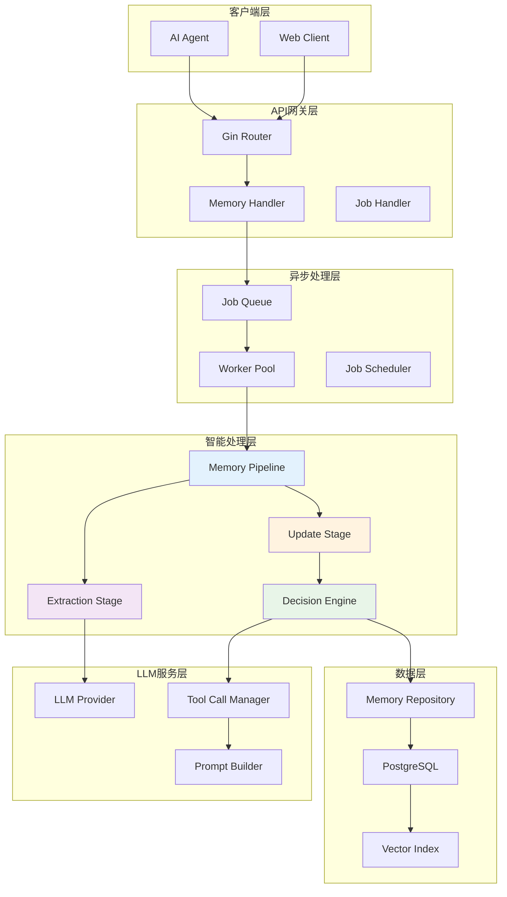
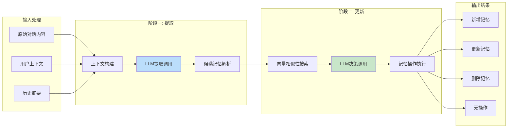
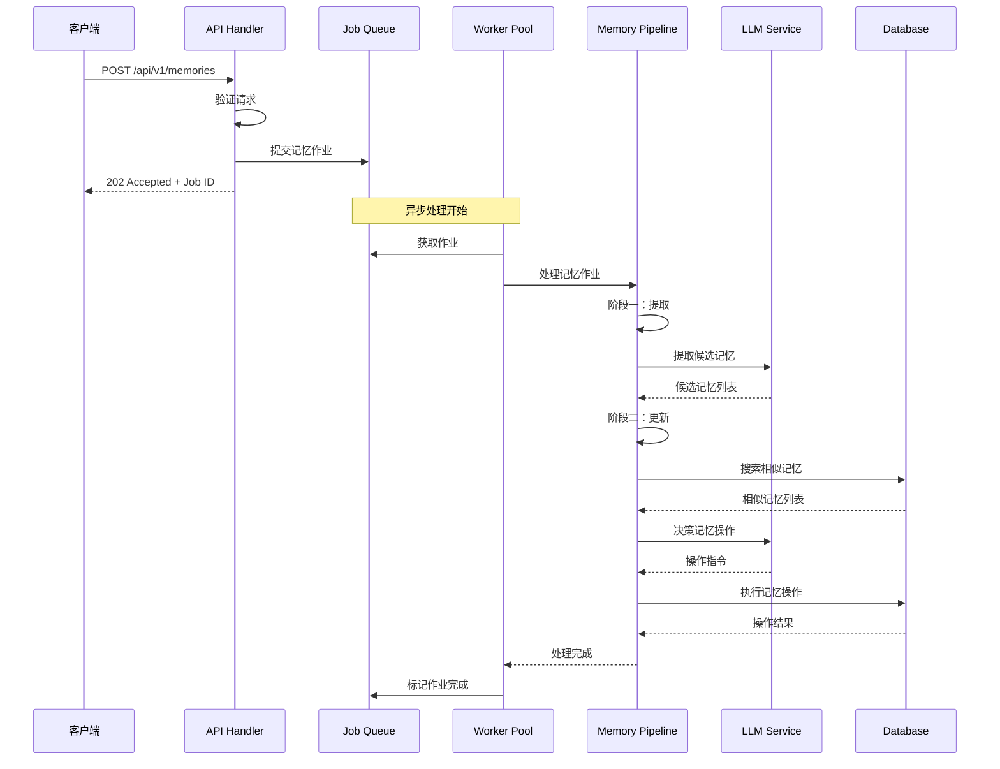
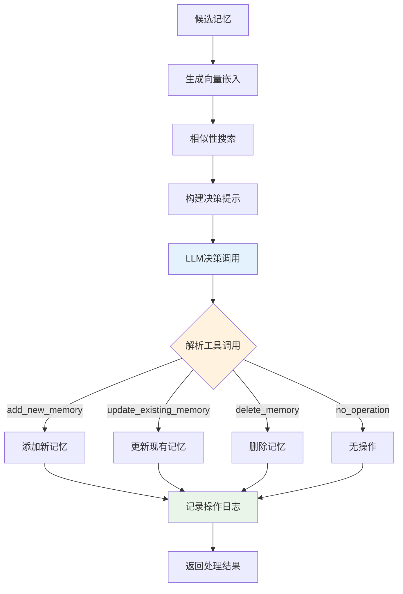
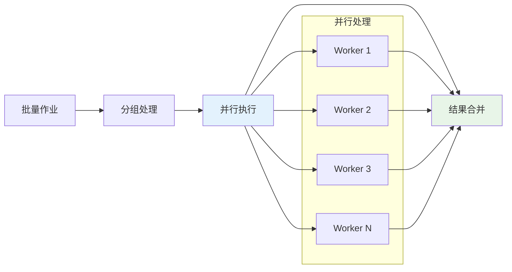
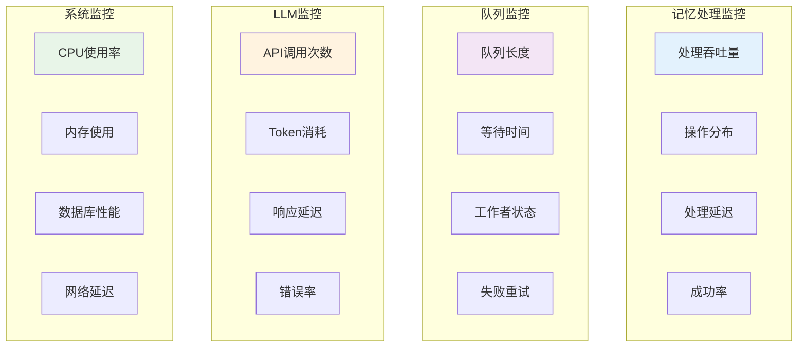
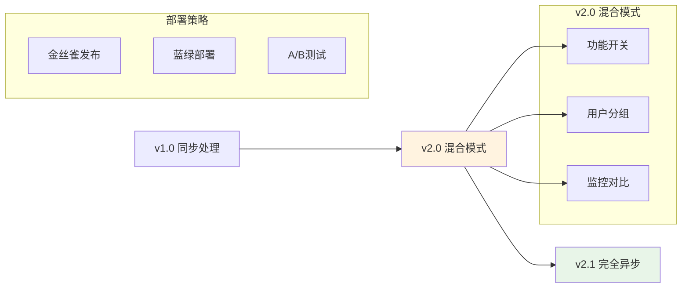

# RFC: AI记忆系统第二阶段智能化设计

**文档版本**: 1.0  
**创建日期**: 2025-08-17  
**作者**: AI记忆系统团队  
**状态**: 草案

## 1. 摘要

本文档描述AI记忆系统第二阶段智能化功能的详细设计。该阶段将在MVP基础上引入核心的智能记忆管理能力，包括LLM驱动的两阶段记忆管道、异步处理机制和高级的记忆操作。这是系统从简单存储向智能记忆管理转变的关键阶段。

## 2. 引言

### 2.1 目标

- 实现LLM驱动的智能记忆提取
- 建立异步的记忆处理管道
- 引入智能的记忆更新决策机制
- 实现结构化的LLM工具调用
- 提供智能的记忆去重和冲突解决

### 2.2 范围

第二阶段包含以下核心功能：
- 两阶段记忆管道（提取+更新）
- 异步作业队列系统
- LLM工具调用框架
- 智能记忆决策引擎
- 记忆相似性分析

### 2.3 前置条件

- 第一阶段MVP已完成
- PostgreSQL+pgvector正常运行
- 基础API功能可用
- LLM服务集成完成

## 3. 系统架构

### 3.1 智能化架构概览



### 3.2 两阶段记忆管道架构



## 4. 详细设计

### 4.1 异步处理系统

#### 4.1.1 作业队列设计

```go
// MemoryJob 记忆处理作业
type MemoryJob struct {
    ID          string                 `json:"id"`
    Type        JobType                `json:"type"`
    UserID      string                 `json:"user_id"`
    Content     string                 `json:"content"`
    Context     ConversationContext    `json:"context"`
    Priority    int                    `json:"priority"`
    RetryCount  int                    `json:"retry_count"`
    MaxRetries  int                    `json:"max_retries"`
    CreatedAt   time.Time              `json:"created_at"`
    ScheduledAt *time.Time             `json:"scheduled_at,omitempty"`
    Metadata    map[string]interface{} `json:"metadata"`
}

// JobType 作业类型
type JobType string

const (
    JobTypeMemoryAdd    JobType = "memory_add"
    JobTypeMemoryUpdate JobType = "memory_update"
    JobTypeBatchImport  JobType = "batch_import"
)

// ConversationContext 对话上下文
type ConversationContext struct {
    CurrentExchange    Exchange   `json:"current_exchange"`
    RecentMessages     []Message  `json:"recent_messages"`
    RollingSummary     string     `json:"rolling_summary"`
    SessionID          string     `json:"session_id"`
    ConversationLength int        `json:"conversation_length"`
}

// Exchange 对话交换
type Exchange struct {
    UserMessage      string    `json:"user_message"`
    AssistantMessage string    `json:"assistant_message"`
    Timestamp        time.Time `json:"timestamp"`
}
```

#### 4.1.2 工作池实现

```go
// WorkerPool 工作池
type WorkerPool struct {
    jobQueue    chan MemoryJob
    workers     []*Worker
    workerCount int
    quit        chan bool
    logger      *logrus.Logger
    pipeline    MemoryPipeline
}

// Worker 工作者
type Worker struct {
    id          int
    jobQueue    chan MemoryJob
    quit        chan bool
    pipeline    MemoryPipeline
    logger      *logrus.Logger
    metrics     *WorkerMetrics
}

// WorkerMetrics 工作者指标
type WorkerMetrics struct {
    JobsProcessed int64
    JobsFailed    int64
    TotalDuration time.Duration
    LastJobAt     time.Time
}
```

#### 4.1.3 异步处理流程



### 4.2 LLM工具调用框架

#### 4.2.1 工具定义系统

```go
// Tool LLM工具定义
type Tool struct {
    Name        string      `json:"name"`
    Description string      `json:"description"`
    Parameters  *Parameters `json:"parameters"`
}

// Parameters 工具参数定义
type Parameters struct {
    Type       string                 `json:"type"`
    Properties map[string]*Property   `json:"properties"`
    Required   []string               `json:"required"`
}

// Property 参数属性
type Property struct {
    Type        string      `json:"type"`
    Description string      `json:"description"`
    Enum        []string    `json:"enum,omitempty"`
    Items       *Property   `json:"items,omitempty"`
}

// ToolCall 工具调用
type ToolCall struct {
    ID       string          `json:"id"`
    Type     string          `json:"type"`
    Function FunctionCall    `json:"function"`
}

// FunctionCall 函数调用
type FunctionCall struct {
    Name      string          `json:"name"`
    Arguments json.RawMessage `json:"arguments"`
}
```

#### 4.2.2 提取阶段工具

```go
// 提取记忆工具
var ExtractMemoriesTool = Tool{
    Name:        "extract_memories",
    Description: "从对话中提取有价值的记忆信息",
    Parameters: &Parameters{
        Type: "object",
        Properties: map[string]*Property{
            "memories": {
                Type:        "array",
                Description: "提取的候选记忆列表",
                Items: &Property{
                    Type: "object",
                    Properties: map[string]*Property{
                        "content": {
                            Type:        "string",
                            Description: "记忆内容",
                        },
                        "type": {
                            Type:        "string",
                            Description: "记忆类型",
                            Enum:        []string{"fact", "preference", "goal", "relationship"},
                        },
                        "importance": {
                            Type:        "number",
                            Description: "重要性评分(1-10)",
                        },
                        "entities": {
                            Type:        "array",
                            Description: "涉及的实体",
                            Items: &Property{Type: "string"},
                        },
                    },
                },
            },
        },
        Required: []string{"memories"},
    },
}
```

#### 4.2.3 更新阶段工具

```go
// 记忆操作工具集
var MemoryUpdateTools = []Tool{
    {
        Name:        "add_new_memory",
        Description: "添加新的记忆",
        Parameters: &Parameters{
            Type: "object",
            Properties: map[string]*Property{
                "content": {
                    Type:        "string",
                    Description: "记忆内容",
                },
                "importance": {
                    Type:        "number",
                    Description: "重要性评分",
                },
                "reason": {
                    Type:        "string",
                    Description: "添加原因",
                },
            },
            Required: []string{"content", "importance", "reason"},
        },
    },
    {
        Name:        "update_existing_memory",
        Description: "更新现有记忆",
        Parameters: &Parameters{
            Type: "object",
            Properties: map[string]*Property{
                "memory_id": {
                    Type:        "string",
                    Description: "要更新的记忆ID",
                },
                "new_content": {
                    Type:        "string",
                    Description: "新的记忆内容",
                },
                "reason": {
                    Type:        "string",
                    Description: "更新原因",
                },
            },
            Required: []string{"memory_id", "new_content", "reason"},
        },
    },
    {
        Name:        "delete_memory",
        Description: "删除过时或错误的记忆",
        Parameters: &Parameters{
            Type: "object",
            Properties: map[string]*Property{
                "memory_id": {
                    Type:        "string",
                    Description: "要删除的记忆ID",
                },
                "reason": {
                    Type:        "string",
                    Description: "删除原因",
                },
            },
            Required: []string{"memory_id", "reason"},
        },
    },
    {
        Name:        "no_operation",
        Description: "不执行任何操作",
        Parameters: &Parameters{
            Type: "object",
            Properties: map[string]*Property{
                "reason": {
                    Type:        "string",
                    Description: "不操作的原因",
                },
            },
            Required: []string{"reason"},
        },
    },
}
```

### 4.3 智能记忆管道

#### 4.3.1 记忆管道接口

```go
// MemoryPipeline 记忆处理管道
type MemoryPipeline interface {
    ProcessMemoryJob(ctx context.Context, job MemoryJob) error
    ExtractCandidateMemories(ctx context.Context, context ConversationContext) ([]*CandidateMemory, error)
    UpdateMemories(ctx context.Context, userID string, candidates []*CandidateMemory) error
}

// CandidateMemory 候选记忆
type CandidateMemory struct {
    Content    string                 `json:"content"`
    Type       MemoryType             `json:"type"`
    Importance float64                `json:"importance"`
    Entities   []string               `json:"entities"`
    Metadata   map[string]interface{} `json:"metadata"`
}

// MemoryType 记忆类型
type MemoryType string

const (
    MemoryTypeFact         MemoryType = "fact"
    MemoryTypePreference   MemoryType = "preference"
    MemoryTypeGoal         MemoryType = "goal"
    MemoryTypeRelationship MemoryType = "relationship"
)
```

#### 4.3.2 提取阶段实现

```go
// extractCandidateMemories 提取候选记忆
func (p *memoryPipeline) extractCandidateMemories(ctx context.Context, context ConversationContext) ([]*CandidateMemory, error) {
    // 构建提取提示
    prompt := p.buildExtractionPrompt(context)
    
    // 创建LLM请求
    request := &LLMRequest{
        Messages: []Message{{
            Role:    "user",
            Content: prompt,
        }},
        Tools:       []Tool{ExtractMemoriesTool},
        ToolChoice:  "required",
        Temperature: 0.1,
    }
    
    // 调用LLM
    response, err := p.llmProvider.ChatCompletion(ctx, request)
    if err != nil {
        return nil, fmt.Errorf("LLM extraction failed: %w", err)
    }
    
    // 解析工具调用结果
    candidates, err := p.parseExtractionResponse(response)
    if err != nil {
        return nil, fmt.Errorf("failed to parse extraction response: %w", err)
    }
    
    // 验证和过滤候选记忆
    validCandidates := p.validateCandidates(candidates)
    
    return validCandidates, nil
}

// buildExtractionPrompt 构建提取提示
func (p *memoryPipeline) buildExtractionPrompt(context ConversationContext) string {
    prompt := strings.Builder{}
    
    prompt.WriteString("你是一个专业的记忆提取助手。请从以下对话中提取有价值的长期记忆信息。\n\n")
    prompt.WriteString("## 当前对话交换\n")
    prompt.WriteString(fmt.Sprintf("用户: %s\n", context.CurrentExchange.UserMessage))
    prompt.WriteString(fmt.Sprintf("助手: %s\n\n", context.CurrentExchange.AssistantMessage))
    
    if len(context.RecentMessages) > 0 {
        prompt.WriteString("## 近期对话历史\n")
        for _, msg := range context.RecentMessages {
            prompt.WriteString(fmt.Sprintf("%s: %s\n", msg.Role, msg.Content))
        }
        prompt.WriteString("\n")
    }
    
    if context.RollingSummary != "" {
        prompt.WriteString("## 对话摘要\n")
        prompt.WriteString(context.RollingSummary + "\n\n")
    }
    
    prompt.WriteString("## 提取指导原则\n")
    prompt.WriteString("1. 提取明确的事实性信息\n")
    prompt.WriteString("2. 识别用户的偏好和兴趣\n")
    prompt.WriteString("3. 记录重要的目标和计划\n")
    prompt.WriteString("4. 捕捉关键的人际关系信息\n")
    prompt.WriteString("5. 避免重复或琐碎的信息\n\n")
    
    prompt.WriteString("请使用extract_memories工具提取候选记忆。")
    
    return prompt.String()
}
```

#### 4.3.3 更新阶段流程



### 4.4 记忆决策引擎

#### 4.4.1 决策引擎实现

```go
// DecisionEngine 记忆决策引擎
type DecisionEngine struct {
    llmProvider       LLMProvider
    repository        MemoryRepository
    similarityThreshold float64
    logger            *logrus.Logger
}

// ProcessCandidateMemory 处理候选记忆
func (de *DecisionEngine) ProcessCandidateMemory(ctx context.Context, userID string, candidate *CandidateMemory) (*MemoryOperation, error) {
    // 1. 生成候选记忆的向量嵌入
    embedding, err := de.llmProvider.CreateEmbedding(ctx, candidate.Content)
    if err != nil {
        return nil, fmt.Errorf("failed to create embedding: %w", err)
    }
    
    // 2. 搜索相似的现有记忆
    similarMemories, err := de.repository.FindSimilar(ctx, userID, embedding, 5)
    if err != nil {
        return nil, fmt.Errorf("failed to find similar memories: %w", err)
    }
    
    // 3. 过滤高相似度记忆
    relevantMemories := de.filterBySimilarity(similarMemories, embedding, de.similarityThreshold)
    
    // 4. 构建决策提示并调用LLM
    decision, err := de.makeDecision(ctx, candidate, relevantMemories)
    if err != nil {
        return nil, fmt.Errorf("failed to make decision: %w", err)
    }
    
    return decision, nil
}

// makeDecision 做出记忆操作决策
func (de *DecisionEngine) makeDecision(ctx context.Context, candidate *CandidateMemory, existingMemories []*Memory) (*MemoryOperation, error) {
    prompt := de.buildDecisionPrompt(candidate, existingMemories)
    
    request := &LLMRequest{
        Messages: []Message{{
            Role:    "user",
            Content: prompt,
        }},
        Tools:       MemoryUpdateTools,
        ToolChoice:  "required",
        Temperature: 0.1,
    }
    
    response, err := de.llmProvider.ChatCompletion(ctx, request)
    if err != nil {
        return nil, fmt.Errorf("LLM decision failed: %w", err)
    }
    
    operation, err := de.parseDecisionResponse(response)
    if err != nil {
        return nil, fmt.Errorf("failed to parse decision: %w", err)
    }
    
    return operation, nil
}
```

#### 4.4.2 决策提示构建

```go
// buildDecisionPrompt 构建决策提示
func (de *DecisionEngine) buildDecisionPrompt(candidate *CandidateMemory, existingMemories []*Memory) string {
    prompt := strings.Builder{}
    
    prompt.WriteString("你是一个智能的记忆管理助手。请分析新的候选记忆与现有记忆的关系，并决定最合适的操作。\n\n")
    
    prompt.WriteString("## 候选记忆\n")
    prompt.WriteString(fmt.Sprintf("内容: %s\n", candidate.Content))
    prompt.WriteString(fmt.Sprintf("类型: %s\n", candidate.Type))
    prompt.WriteString(fmt.Sprintf("重要性: %.1f\n", candidate.Importance))
    prompt.WriteString(fmt.Sprintf("实体: %s\n\n", strings.Join(candidate.Entities, ", ")))
    
    if len(existingMemories) > 0 {
        prompt.WriteString("## 相似的现有记忆\n")
        for i, memory := range existingMemories {
            prompt.WriteString(fmt.Sprintf("记忆 %d (ID: %s):\n", i+1, memory.ID))
            prompt.WriteString(fmt.Sprintf("内容: %s\n", memory.Content))
            prompt.WriteString(fmt.Sprintf("创建时间: %s\n\n", memory.CreatedAt.Format("2006-01-02 15:04:05")))
        }
    } else {
        prompt.WriteString("## 相似的现有记忆\n无相似记忆\n\n")
    }
    
    prompt.WriteString("## 决策指导原则\n")
    prompt.WriteString("1. **添加(add_new_memory)**: 当候选记忆提供全新信息时\n")
    prompt.WriteString("2. **更新(update_existing_memory)**: 当候选记忆补充或修正现有记忆时\n")
    prompt.WriteString("3. **删除(delete_memory)**: 当候选记忆与现有记忆冲突，且候选记忆更准确时\n")
    prompt.WriteString("4. **无操作(no_operation)**: 当候选记忆是重复或无价值信息时\n\n")
    
    prompt.WriteString("请选择最合适的操作并提供详细的理由。")
    
    return prompt.String()
}
```

### 4.5 API增强

#### 4.5.1 异步API端点

```go
// AsyncMemoryHandler 异步记忆处理器
type AsyncMemoryHandler struct {
    jobQueue   JobQueue
    pipeline   MemoryPipeline
    jobTracker JobTracker
    logger     *logrus.Logger
}

// AddMemoryAsync 异步添加记忆
func (h *AsyncMemoryHandler) AddMemoryAsync(c *gin.Context) {
    var req AddMemoryRequest
    if err := c.ShouldBindJSON(&req); err != nil {
        c.JSON(http.StatusBadRequest, gin.H{"error": err.Error()})
        return
    }
    
    // 创建记忆作业
    job := MemoryJob{
        ID:         uuid.New().String(),
        Type:       JobTypeMemoryAdd,
        UserID:     req.UserID,
        Content:    req.Content,
        Context:    req.Context,
        Priority:   req.Priority,
        MaxRetries: 3,
        CreatedAt:  time.Now(),
    }
    
    // 提交到队列
    if err := h.jobQueue.Enqueue(job); err != nil {
        h.logger.WithError(err).Error("Failed to enqueue memory job")
        c.JSON(http.StatusInternalServerError, gin.H{"error": "Failed to queue memory processing"})
        return
    }
    
    // 记录作业状态
    h.jobTracker.Track(job.ID, JobStatusQueued)
    
    c.JSON(http.StatusAccepted, gin.H{
        "job_id": job.ID,
        "status": "queued",
        "message": "Memory processing queued successfully",
    })
}

// GetJobStatus 获取作业状态
func (h *AsyncMemoryHandler) GetJobStatus(c *gin.Context) {
    jobID := c.Param("job_id")
    
    status, err := h.jobTracker.GetStatus(jobID)
    if err != nil {
        if errors.Is(err, ErrJobNotFound) {
            c.JSON(http.StatusNotFound, gin.H{"error": "Job not found"})
            return
        }
        c.JSON(http.StatusInternalServerError, gin.H{"error": "Failed to get job status"})
        return
    }
    
    c.JSON(http.StatusOK, status)
}
```

#### 4.5.2 批量处理API

```go
// BatchProcessRequest 批量处理请求
type BatchProcessRequest struct {
    UserID       string                `json:"user_id" binding:"required,uuid"`
    Conversations []ConversationData   `json:"conversations" binding:"required,min=1,max=100"`
    Options      BatchProcessOptions   `json:"options"`
}

// ConversationData 对话数据
type ConversationData struct {
    SessionID string     `json:"session_id"`
    Messages  []Message  `json:"messages"`
    Timestamp time.Time  `json:"timestamp"`
}

// BatchProcessOptions 批量处理选项
type BatchProcessOptions struct {
    Priority        int    `json:"priority"`
    SkipDuplicates  bool   `json:"skip_duplicates"`
    MergeStrategy   string `json:"merge_strategy"` // "replace", "merge", "skip"
}

// BatchProcess 批量处理对话
func (h *AsyncMemoryHandler) BatchProcess(c *gin.Context) {
    var req BatchProcessRequest
    if err := c.ShouldBindJSON(&req); err != nil {
        c.JSON(http.StatusBadRequest, gin.H{"error": err.Error()})
        return
    }
    
    batchID := uuid.New().String()
    jobs := make([]MemoryJob, 0, len(req.Conversations))
    
    // 为每个对话创建处理作业
    for _, conv := range req.Conversations {
        job := MemoryJob{
            ID:         uuid.New().String(),
            Type:       JobTypeBatchImport,
            UserID:     req.UserID,
            Context:    convertToContext(conv),
            Priority:   req.Options.Priority,
            MaxRetries: 3,
            CreatedAt:  time.Now(),
            Metadata: map[string]interface{}{
                "batch_id":    batchID,
                "session_id":  conv.SessionID,
                "options":     req.Options,
            },
        }
        jobs = append(jobs, job)
    }
    
    // 批量提交作业
    if err := h.jobQueue.EnqueueBatch(jobs); err != nil {
        h.logger.WithError(err).Error("Failed to enqueue batch jobs")
        c.JSON(http.StatusInternalServerError, gin.H{"error": "Failed to queue batch processing"})
        return
    }
    
    c.JSON(http.StatusAccepted, gin.H{
        "batch_id":   batchID,
        "job_count":  len(jobs),
        "status":     "queued",
        "message":    "Batch processing queued successfully",
    })
}
```

## 5. 性能优化

### 5.1 并发处理优化

#### 5.1.1 工作池调优

```go
// WorkerPoolConfig 工作池配置
type WorkerPoolConfig struct {
    WorkerCount     int           `mapstructure:"worker_count"`
    QueueSize       int           `mapstructure:"queue_size"`
    BatchSize       int           `mapstructure:"batch_size"`
    ProcessTimeout  time.Duration `mapstructure:"process_timeout"`
    IdleTimeout     time.Duration `mapstructure:"idle_timeout"`
    RetryInterval   time.Duration `mapstructure:"retry_interval"`
}

// 动态工作池调整
func (wp *WorkerPool) adjustWorkerCount(queueLength int) {
    targetWorkers := wp.calculateOptimalWorkerCount(queueLength)
    currentWorkers := len(wp.workers)
    
    if targetWorkers > currentWorkers {
        wp.scaleUp(targetWorkers - currentWorkers)
    } else if targetWorkers < currentWorkers {
        wp.scaleDown(currentWorkers - targetWorkers)
    }
}
```

#### 5.1.2 批量处理优化



### 5.2 LLM调用优化

#### 5.2.1 请求合并

```go
// LLMRequestBatch LLM请求批次
type LLMRequestBatch struct {
    Requests    []*LLMRequest
    MaxWaitTime time.Duration
    MaxBatchSize int
}

// 批量处理LLM请求
func (p *LLMProvider) processBatch(ctx context.Context, batch *LLMRequestBatch) ([]*LLMResponse, error) {
    // 合并请求以减少API调用次数
    mergedRequest := p.mergeRequests(batch.Requests)
    
    // 单次API调用
    response, err := p.chatCompletion(ctx, mergedRequest)
    if err != nil {
        return nil, err
    }
    
    // 分离响应
    return p.splitResponse(response, len(batch.Requests)), nil
}
```

#### 5.2.2 缓存策略

```go
// LLMCache LLM响应缓存
type LLMCache struct {
    embeddings *cache.TTLCache[string, []float32]
    responses  *cache.TTLCache[string, *LLMResponse]
    ttl        time.Duration
}

// 缓存嵌入结果
func (c *LLMCache) GetOrCreateEmbedding(ctx context.Context, text string, provider LLMProvider) ([]float32, error) {
    key := c.generateEmbeddingKey(text)
    
    if embedding, found := c.embeddings.Get(key); found {
        return embedding, nil
    }
    
    embedding, err := provider.CreateEmbedding(ctx, text)
    if err != nil {
        return nil, err
    }
    
    c.embeddings.Set(key, embedding, c.ttl)
    return embedding, nil
}
```

## 6. 监控与可观测性

### 6.1 关键指标

#### 6.1.1 业务指标

```go
// Metrics 系统指标
type Metrics struct {
    // 记忆处理指标
    MemoriesProcessed    prometheus.Counter
    MemoryOperations     *prometheus.CounterVec // 按操作类型分组
    ProcessingDuration   prometheus.Histogram
    
    // 作业队列指标
    JobsQueued          prometheus.Counter
    JobsProcessed       prometheus.Counter
    JobsFailed          prometheus.Counter
    QueueLength         prometheus.Gauge
    
    // LLM调用指标
    LLMCalls            *prometheus.CounterVec // 按提供商和操作分组
    LLMTokensUsed       *prometheus.CounterVec
    LLMLatency          prometheus.Histogram
    
    // 系统资源指标
    WorkerPoolSize      prometheus.Gauge
    ActiveWorkers       prometheus.Gauge
    DatabaseConnections prometheus.Gauge
}
```

#### 6.1.2 监控仪表板



### 6.2 告警规则

```yaml
# 告警规则配置
groups:
  - name: memory_system
    rules:
      - alert: HighQueueLength
        expr: job_queue_length > 1000
        for: 5m
        labels:
          severity: warning
        annotations:
          summary: "作业队列长度过高"
          
      - alert: LLMHighLatency
        expr: llm_call_duration_seconds > 10
        for: 2m
        labels:
          severity: critical
        annotations:
          summary: "LLM调用延迟过高"
          
      - alert: MemoryProcessingFailed
        expr: rate(memory_operations_failed_total[5m]) > 0.1
        for: 3m
        labels:
          severity: warning
        annotations:
          summary: "记忆处理失败率过高"
```

## 7. 测试策略

### 7.1 单元测试

#### 7.1.1 记忆管道测试

```go
func TestMemoryPipeline_ExtractCandidateMemories(t *testing.T) {
    tests := []struct {
        name     string
        context  ConversationContext
        expected []*CandidateMemory
        wantErr  bool
    }{
        {
            name: "simple_fact_extraction",
            context: ConversationContext{
                CurrentExchange: Exchange{
                    UserMessage:      "我喜欢喝咖啡",
                    AssistantMessage: "知道了，您喜欢咖啡",
                },
            },
            expected: []*CandidateMemory{
                {
                    Content:    "用户喜欢喝咖啡",
                    Type:       MemoryTypePreference,
                    Importance: 7.0,
                },
            },
            wantErr: false,
        },
    }
    
    for _, tt := range tests {
        t.Run(tt.name, func(t *testing.T) {
            pipeline := setupTestPipeline(t)
            result, err := pipeline.ExtractCandidateMemories(context.Background(), tt.context)
            
            if tt.wantErr {
                assert.Error(t, err)
                return
            }
            
            assert.NoError(t, err)
            assert.Equal(t, len(tt.expected), len(result))
            // 详细断言...
        })
    }
}
```

#### 7.1.2 决策引擎测试

```go
func TestDecisionEngine_ProcessCandidateMemory(t *testing.T) {
    tests := []struct {
        name             string
        candidate        *CandidateMemory
        existingMemories []*Memory
        expectedOp       OperationType
    }{
        {
            name: "add_new_unique_memory",
            candidate: &CandidateMemory{
                Content:    "用户住在北京",
                Type:       MemoryTypeFact,
                Importance: 8.0,
            },
            existingMemories: []*Memory{},
            expectedOp:       OperationTypeAdd,
        },
        {
            name: "update_conflicting_memory",
            candidate: &CandidateMemory{
                Content:    "用户现在住在上海",
                Type:       MemoryTypeFact,
                Importance: 8.0,
            },
            existingMemories: []*Memory{
                {
                    ID:      "mem-1",
                    Content: "用户住在北京",
                },
            },
            expectedOp: OperationTypeUpdate,
        },
    }
    
    for _, tt := range tests {
        t.Run(tt.name, func(t *testing.T) {
            engine := setupTestDecisionEngine(t)
            operation, err := engine.ProcessCandidateMemory(context.Background(), "user-1", tt.candidate)
            
            assert.NoError(t, err)
            assert.Equal(t, tt.expectedOp, operation.Type)
        })
    }
}
```

### 7.2 集成测试

#### 7.2.1 端到端流程测试

```go
func TestAsyncMemoryProcessing_EndToEnd(t *testing.T) {
    // 设置测试环境
    testEnv := setupIntegrationTest(t)
    defer testEnv.Cleanup()
    
    // 提交记忆处理作业
    job := MemoryJob{
        UserID:  "test-user",
        Content: "我明天要去开会",
        Context: ConversationContext{
            CurrentExchange: Exchange{
                UserMessage:      "我明天要去开会",
                AssistantMessage: "好的，祝您开会顺利",
            },
        },
    }
    
    err := testEnv.JobQueue.Enqueue(job)
    assert.NoError(t, err)
    
    // 等待处理完成
    err = testEnv.WaitForJobCompletion(job.ID, 30*time.Second)
    assert.NoError(t, err)
    
    // 验证记忆已创建
    memories, err := testEnv.Repository.FindByUserID(context.Background(), "test-user", 10, 0)
    assert.NoError(t, err)
    assert.Len(t, memories, 1)
    assert.Contains(t, memories[0].Content, "开会")
}
```

## 8. 部署升级

### 8.1 向后兼容性

#### 8.1.1 API版本控制

```go
// API版本路由
func setupRoutes(r *gin.Engine) {
    v1 := r.Group("/api/v1")
    {
        v1.POST("/memories", memoryHandler.Create)           // 同步接口（兼容）
        v1.POST("/memories/async", memoryHandler.CreateAsync) // 新的异步接口
        v1.GET("/memories/:id", memoryHandler.GetByID)
        v1.POST("/memories/search", memoryHandler.Search)
    }
    
    v2 := r.Group("/api/v2")
    {
        v2.POST("/memories", memoryHandler.CreateAsync)      // v2默认异步
        v2.GET("/jobs/:id", memoryHandler.GetJobStatus)     // 作业状态查询
        v2.POST("/memories/batch", memoryHandler.BatchProcess) // 批量处理
    }
}
```

#### 8.1.2 数据库迁移

```sql
-- 添加作业表
CREATE TABLE IF NOT EXISTS memory_jobs (
    id UUID PRIMARY KEY DEFAULT gen_random_uuid(),
    type VARCHAR(50) NOT NULL,
    user_id UUID NOT NULL,
    content TEXT,
    context JSONB,
    status VARCHAR(20) NOT NULL DEFAULT 'queued',
    priority INTEGER DEFAULT 5,
    retry_count INTEGER DEFAULT 0,
    max_retries INTEGER DEFAULT 3,
    error_message TEXT,
    created_at TIMESTAMPTZ NOT NULL DEFAULT NOW(),
    started_at TIMESTAMPTZ,
    completed_at TIMESTAMPTZ
);

-- 添加索引
CREATE INDEX idx_memory_jobs_status ON memory_jobs(status);
CREATE INDEX idx_memory_jobs_user_id ON memory_jobs(user_id);
CREATE INDEX idx_memory_jobs_created_at ON memory_jobs(created_at DESC);

-- 添加记忆操作日志表
CREATE TABLE IF NOT EXISTS memory_operations (
    id UUID PRIMARY KEY DEFAULT gen_random_uuid(),
    job_id UUID REFERENCES memory_jobs(id),
    memory_id UUID REFERENCES memories(id),
    operation_type VARCHAR(20) NOT NULL, -- 'add', 'update', 'delete'
    reason TEXT,
    metadata JSONB,
    created_at TIMESTAMPTZ NOT NULL DEFAULT NOW()
);
```

### 8.2 灰度发布

#### 8.2.1 功能开关

```go
// FeatureFlags 功能开关
type FeatureFlags struct {
    AsyncProcessing   bool `mapstructure:"async_processing"`
    IntelligentUpdate bool `mapstructure:"intelligent_update"`
    BatchProcessing   bool `mapstructure:"batch_processing"`
    LLMCaching        bool `mapstructure:"llm_caching"`
}

// 在处理器中使用功能开关
func (h *MemoryHandler) Create(c *gin.Context) {
    if h.featureFlags.AsyncProcessing {
        h.CreateAsync(c)
        return
    }
    
    // 回退到同步处理
    h.createSync(c)
}
```

#### 8.2.2 渐进式部署



## 9. 总结

第二阶段智能化设计为AI记忆系统引入了核心的智能能力，包括：

### 9.1 主要成果
- **智能记忆管道**: LLM驱动的两阶段处理流程
- **异步处理架构**: 高性能的作业队列和工作池系统
- **工具调用框架**: 结构化的LLM交互机制
- **决策引擎**: 智能的记忆操作决策系统

### 9.2 技术提升
- 从简单存储升级为智能记忆管理
- 从同步处理升级为异步高并发处理
- 从基础API升级为智能工具调用
- 从被动存储升级为主动决策

### 9.3 为第三阶段准备
- 建立了可扩展的处理架构
- 预留了多数据库支持接口
- 实现了完整的监控体系
- 提供了灰度发布能力

第二阶段完成后，系统将具备真正的AI记忆管理能力，为第三阶段的高性能优化奠定基础。

---
**文档状态**: 草案  
**下次评审**: 2025-08-24  
**相关文档**: [第一阶段MVP设计](./stage1-mvp-design.md), [第三阶段高性能设计](./stage3-performance-design.md)