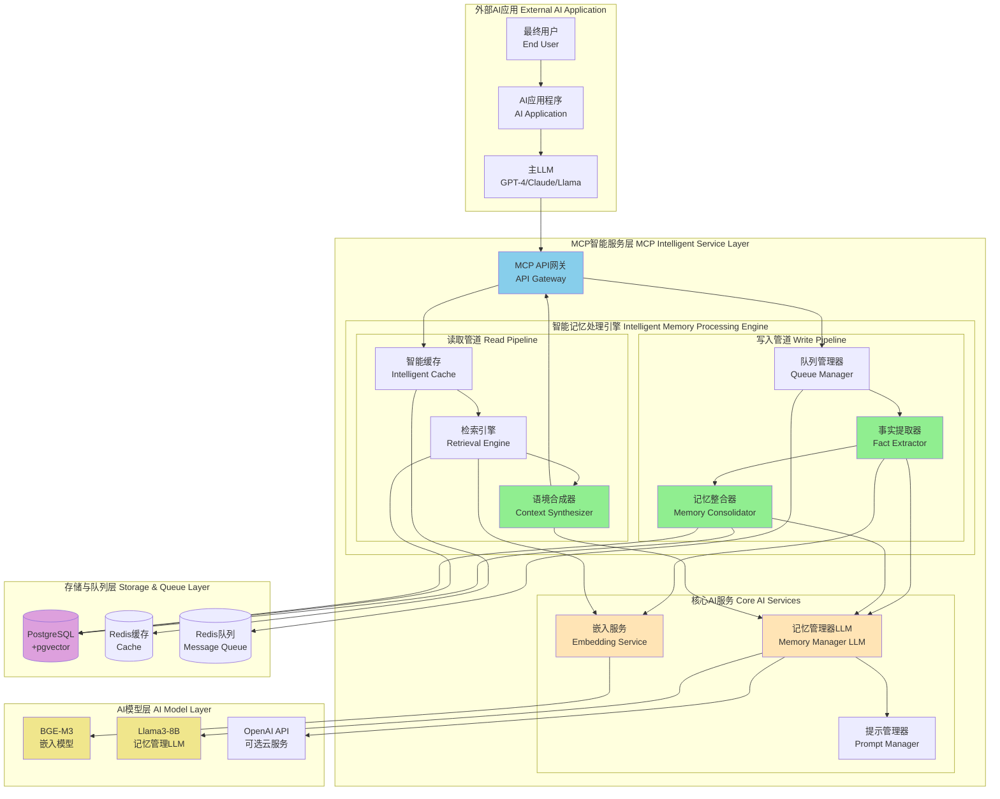

# Stage 2: 智能记忆处理引擎设计方案

## 阶段目标

Stage 2在Stage 1的基础架构之上，实现完整的mem0.ai智能记忆管道。这个阶段将把系统从简单的记忆存储升级为具有智能感知、理解和决策能力的记忆处理引擎。

### 核心功能范围

1. **LLM服务集成**：集成本地/云端LLM作为记忆管理器
2. **事实提取引擎**：从对话中智能提取原子化事实
3. **记忆整合引擎**：实现ADD/UPDATE/DELETE/NOOP智能决策
4. **语境合成器**：将检索到的记忆合成为连贯上下文
5. **异步处理管道**：实现高性能的记忆处理流水线

## 智能记忆处理架构

### Stage 2系统架构图



## 核心组件详细设计

### 1. LLM服务抽象层

```go
// pkg/llm/memory_manager.go (新文件)
package llm

import (
    "context"
    "fmt"
)

// MemoryManagerLLM 专用于记忆管理的LLM接口
type MemoryManagerLLM interface {
    // 事实提取
    ExtractFacts(ctx context.Context, conversation string, userID string) ([]Fact, error)
    
    // 记忆整合决策
    DecideOperation(ctx context.Context, candidateFact Fact, existingMemories []Memory) (Operation, error)
    
    // 语境合成
    SynthesizeContext(ctx context.Context, memories []Memory, query string) (string, error)
}

// Fact 表示从对话中提取的原子化事实
type Fact struct {
    Content    string            `json:"content"`
    Type       string            `json:"type"` // "factual", "episodic", "personal"
    UserID     string            `json:"user_id"`
    SessionID  string            `json:"session_id,omitempty"`
    Confidence float64           `json:"confidence"`
    Metadata   map[string]interface{} `json:"metadata,omitempty"`
}

// Operation 表示对记忆执行的操作
type Operation struct {
    Type         string `json:"type"` // "ADD", "UPDATE", "DELETE", "NOOP"
    TargetID     string `json:"target_id,omitempty"` // 用于UPDATE和DELETE
    NewContent   string `json:"new_content,omitempty"` // 用于UPDATE
    Explanation  string `json:"explanation"` // 操作解释
}

// Memory 简化的记忆表示（用于LLM处理）
type Memory struct {
    ID         string            `json:"id"`
    Content    string            `json:"content"`
    Type       string            `json:"type"`
    CreatedAt  string            `json:"created_at"`
    Metadata   map[string]interface{} `json:"metadata,omitempty"`
}
```

### 2. 提示管理器

```go
// internal/service/llm/prompt_manager.go (新文件)
package llm

import (
    "bytes"
    "fmt"
    "text/template"
)

type PromptManager struct {
    templates map[string]*template.Template
}

func NewPromptManager() *PromptManager {
    pm := &PromptManager{
        templates: make(map[string]*template.Template),
    }
    
    pm.loadTemplates()
    return pm
}

func (pm *PromptManager) loadTemplates() {
    // 事实提取提示模板
    factExtractionTemplate := `你是一个细致的记忆分析AI。你的任务是分析以下对话并提取关键的、原子化的事实。

规则：
1. 提取关于用户偏好、陈述、目标或重要实体的事实
2. 每个事实必须简洁且独立
3. 忽略对话填充词、问候语或无关的闲聊
4. 将每个事实的类型分类为 'factual'（稳定信息，如偏好）或 'episodic'（与特定事件相关，如计划）
5. 为每个事实分配置信度分数（0.0-1.0）
6. 输出结果为JSON数组，如果没有找到事实则返回空数组

上下文：
- 用户ID: {{.UserID}}
- 会话ID: {{.SessionID}}

对话内容：
{{.Conversation}}

请以JSON格式输出事实列表：`

    consolidationTemplate := `你是一个记忆整合AI。你的任务是决定如何将新信息（候选事实）整合到现有知识库中。

规则：
1. 比较候选事实与每个现有记忆
2. 决定以下操作之一：
   - 'ADD': 如果候选是新的、非冗余的且不矛盾
   - 'UPDATE': 如果候选是对现有记忆的直接更新或修正，提供要更新的记忆ID和新内容
   - 'DELETE': 如果候选使现有记忆无效，提供要删除的记忆ID
   - 'NOOP': 如果候选是重复的或完全无关的
3. 提供操作的简短解释

候选事实：
{{.CandidateFact.Content}}
（类型：{{.CandidateFact.Type}}，置信度：{{.CandidateFact.Confidence}}）

现有记忆：
{{range .ExistingMemories}}
- ID: {{.ID}}, 内容: "{{.Content}}", 创建时间: {{.CreatedAt}}
{{end}}

请以JSON格式回应单个操作：`

    synthesisTemplate := `你是一个有用的AI助手。你的任务是将以下关于用户的事实列表合成为简洁、连贯的段落。请在"相关背景"标题下呈现此段落。目标是为回答用户即将提出的查询提供背景。

用户记忆：
{{range .Memories}}
- {{.Content}}
{{end}}

当前查询：{{.Query}}

请生成简洁的背景摘要：`

    pm.templates["fact_extraction"] = template.Must(template.New("fact_extraction").Parse(factExtractionTemplate))
    pm.templates["consolidation"] = template.Must(template.New("consolidation").Parse(consolidationTemplate))
    pm.templates["synthesis"] = template.Must(template.New("synthesis").Parse(synthesisTemplate))
}

// 生成事实提取提示
func (pm *PromptManager) GenerateFactExtractionPrompt(conversation, userID, sessionID string) (string, error) {
    var buf bytes.Buffer
    
    data := struct {
        Conversation string
        UserID       string
        SessionID    string
    }{
        Conversation: conversation,
        UserID:       userID,
        SessionID:    sessionID,
    }
    
    err := pm.templates["fact_extraction"].Execute(&buf, data)
    if err != nil {
        return "", fmt.Errorf("failed to generate fact extraction prompt: %w", err)
    }
    
    return buf.String(), nil
}

// 生成记忆整合提示
func (pm *PromptManager) GenerateConsolidationPrompt(candidateFact Fact, existingMemories []Memory) (string, error) {
    var buf bytes.Buffer
    
    data := struct {
        CandidateFact     Fact
        ExistingMemories []Memory
    }{
        CandidateFact:     candidateFact,
        ExistingMemories: existingMemories,
    }
    
    err := pm.templates["consolidation"].Execute(&buf, data)
    if err != nil {
        return "", fmt.Errorf("failed to generate consolidation prompt: %w", err)
    }
    
    return buf.String(), nil
}

// 生成语境合成提示
func (pm *PromptManager) GenerateSynthesisPrompt(memories []Memory, query string) (string, error) {
    var buf bytes.Buffer
    
    data := struct {
        Memories []Memory
        Query    string
    }{
        Memories: memories,
        Query:    query,
    }
    
    err := pm.templates["synthesis"].Execute(&buf, data)
    if err != nil {
        return "", fmt.Errorf("failed to generate synthesis prompt: %w", err)
    }
    
    return buf.String(), nil
}
```

### 3. 事实提取器

```go
// internal/service/memory/extraction_service.go (新文件)
package memory

import (
    "context"
    "encoding/json"
    "fmt"
    "strings"
    
    "mem_bank/pkg/llm"
    "mem_bank/internal/service/llm"
)

type ExtractionService struct {
    llmClient     llm.MemoryManagerLLM
    promptManager *llm.PromptManager
}

func NewExtractionService(llmClient llm.MemoryManagerLLM, promptManager *llm.PromptManager) *ExtractionService {
    return &ExtractionService{
        llmClient:     llmClient,
        promptManager: promptManager,
    }
}

type ConversationInput struct {
    UserID      string `json:"user_id"`
    SessionID   string `json:"session_id,omitempty"`
    UserInput   string `json:"user_input"`
    AIResponse  string `json:"ai_response"`
    History     []ConversationTurn `json:"history,omitempty"` // 可选的历史对话
}

type ConversationTurn struct {
    Role    string `json:"role"` // "user" or "assistant"
    Content string `json:"content"`
}

type ExtractionResult struct {
    Facts        []llm.Fact `json:"facts"`
    Conversation string     `json:"conversation"`
    ProcessedAt  string     `json:"processed_at"`
}

func (s *ExtractionService) ExtractFacts(ctx context.Context, input *ConversationInput) (*ExtractionResult, error) {
    // 构建完整的对话上下文
    conversation := s.buildConversationContext(input)
    
    // 生成提取提示
    prompt, err := s.promptManager.GenerateFactExtractionPrompt(conversation, input.UserID, input.SessionID)
    if err != nil {
        return nil, fmt.Errorf("failed to generate extraction prompt: %w", err)
    }
    
    // 调用LLM进行事实提取
    response, err := s.llmClient.Complete(ctx, prompt)
    if err != nil {
        return nil, fmt.Errorf("LLM fact extraction failed: %w", err)
    }
    
    // 解析LLM响应
    facts, err := s.parseFactsFromResponse(response)
    if err != nil {
        return nil, fmt.Errorf("failed to parse facts from LLM response: %w", err)
    }
    
    // 过滤和验证事实
    validFacts := s.validateAndFilterFacts(facts, input.UserID)
    
    return &ExtractionResult{
        Facts:        validFacts,
        Conversation: conversation,
        ProcessedAt:  time.Now().UTC().Format(time.RFC3339),
    }, nil
}

func (s *ExtractionService) buildConversationContext(input *ConversationInput) string {
    var parts []string
    
    // 添加历史对话（如果有）
    if len(input.History) > 0 {
        parts = append(parts, "历史对话:")
        for _, turn := range input.History {
            if turn.Role == "user" {
                parts = append(parts, fmt.Sprintf("用户: %s", turn.Content))
            } else {
                parts = append(parts, fmt.Sprintf("助手: %s", turn.Content))
            }
        }
        parts = append(parts, "\n当前对话:")
    }
    
    // 添加当前对话
    parts = append(parts, fmt.Sprintf("用户: %s", input.UserInput))
    parts = append(parts, fmt.Sprintf("助手: %s", input.AIResponse))
    
    return strings.Join(parts, "\n")
}

func (s *ExtractionService) parseFactsFromResponse(response string) ([]llm.Fact, error) {
    // 尝试从响应中提取JSON部分
    jsonStart := strings.Index(response, "[")
    jsonEnd := strings.LastIndex(response, "]")
    
    if jsonStart == -1 || jsonEnd == -1 || jsonEnd <= jsonStart {
        return []llm.Fact{}, nil // 返回空列表而不是错误
    }
    
    jsonStr := response[jsonStart : jsonEnd+1]
    
    var facts []llm.Fact
    if err := json.Unmarshal([]byte(jsonStr), &facts); err != nil {
        // 如果解析失败，尝试更宽松的解析
        return s.fallbackParseResponse(response)
    }
    
    return facts, nil
}

func (s *ExtractionService) fallbackParseResponse(response string) ([]llm.Fact, error) {
    // 实现更宽松的解析逻辑，处理格式不完美的LLM响应
    lines := strings.Split(response, "\n")
    var facts []llm.Fact
    
    for _, line := range lines {
        line = strings.TrimSpace(line)
        if strings.HasPrefix(line, "-") || strings.HasPrefix(line, "*") {
            // 简单的列表项解析
            content := strings.TrimSpace(strings.TrimPrefix(strings.TrimPrefix(line, "-"), "*"))
            if content != "" && len(content) > 5 {
                fact := llm.Fact{
                    Content:    content,
                    Type:       "factual", // 默认类型
                    Confidence: 0.8,       // 默认置信度
                }
                facts = append(facts, fact)
            }
        }
    }
    
    return facts, nil
}

func (s *ExtractionService) validateAndFilterFacts(facts []llm.Fact, userID string) []llm.Fact {
    var validFacts []llm.Fact
    
    for _, fact := range facts {
        // 基本验证
        if fact.Content == "" || len(fact.Content) < 5 {
            continue
        }
        
        // 设置用户ID
        fact.UserID = userID
        
        // 确保有默认值
        if fact.Type == "" {
            fact.Type = "factual"
        }
        if fact.Confidence == 0 {
            fact.Confidence = 0.8
        }
        
        // 内容质量检查
        if s.isHighQualityFact(fact.Content) {
            validFacts = append(validFacts, fact)
        }
    }
    
    return validFacts
}

func (s *ExtractionService) isHighQualityFact(content string) bool {
    content = strings.ToLower(strings.TrimSpace(content))
    
    // 过滤低质量内容
    lowQualityPhrases := []string{
        "hello", "hi", "thanks", "thank you", "okay", "ok", "yes", "no",
        "good", "great", "nice", "fine", "sure", "maybe", "perhaps",
        "今天天气", "谢谢", "好的", "不错", "可能", "也许",
    }
    
    for _, phrase := range lowQualityPhrases {
        if content == phrase || strings.Contains(content, phrase) && len(content) < 20 {
            return false
        }
    }
    
    // 确保是有意义的陈述
    return len(content) >= 10 && (strings.Contains(content, "我") || strings.Contains(content, "user") || 
                                 strings.Contains(content, "喜欢") || strings.Contains(content, "需要"))
}
```

### 4. 记忆整合器

```go
// internal/service/memory/consolidation_service.go (新文件)
package memory

import (
    "context"
    "encoding/json"
    "fmt"
    "strings"
    
    "mem_bank/internal/domain/memory"
    "mem_bank/internal/domain/user"
    "mem_bank/pkg/llm"
    "mem_bank/internal/service/embedding"
)

type ConsolidationService struct {
    memoryRepo       memory.Repository
    vectorStore      memory.VectorStore  
    llmClient        llm.MemoryManagerLLM
    promptManager    *llm.PromptManager
    embeddingService *embedding.Service
}

func NewConsolidationService(
    memoryRepo memory.Repository,
    vectorStore memory.VectorStore,
    llmClient llm.MemoryManagerLLM,
    promptManager *llm.PromptManager,
    embeddingService *embedding.Service,
) *ConsolidationService {
    return &ConsolidationService{
        memoryRepo:       memoryRepo,
        vectorStore:      vectorStore,
        llmClient:        llmClient,
        promptManager:    promptManager,
        embeddingService: embeddingService,
    }
}

type ConsolidationRequest struct {
    UserID string     `json:"user_id"`
    Facts  []llm.Fact `json:"facts"`
}

type ConsolidationResult struct {
    ProcessedFacts []ProcessedFact `json:"processed_facts"`
    Summary        ConsolidationSummary `json:"summary"`
}

type ProcessedFact struct {
    OriginalFact llm.Fact      `json:"original_fact"`
    Operation    llm.Operation `json:"operation"`
    MemoryID     string        `json:"memory_id,omitempty"`
    Success      bool          `json:"success"`
    Error        string        `json:"error,omitempty"`
}

type ConsolidationSummary struct {
    TotalFacts   int `json:"total_facts"`
    AddedCount   int `json:"added_count"`
    UpdatedCount int `json:"updated_count"`
    DeletedCount int `json:"deleted_count"`
    SkippedCount int `json:"skipped_count"`
}

func (s *ConsolidationService) ConsolidateMemories(ctx context.Context, req *ConsolidationRequest) (*ConsolidationResult, error) {
    result := &ConsolidationResult{
        ProcessedFacts: make([]ProcessedFact, 0, len(req.Facts)),
        Summary: ConsolidationSummary{
            TotalFacts: len(req.Facts),
        },
    }
    
    userID, err := user.ParseID(req.UserID)
    if err != nil {
        return nil, fmt.Errorf("invalid user ID: %w", err)
    }
    
    for _, fact := range req.Facts {
        processed := s.processSingleFact(ctx, userID, fact)
        result.ProcessedFacts = append(result.ProcessedFacts, processed)
        
        // 更新统计
        if processed.Success {
            switch processed.Operation.Type {
            case "ADD":
                result.Summary.AddedCount++
            case "UPDATE":
                result.Summary.UpdatedCount++
            case "DELETE":
                result.Summary.DeletedCount++
            case "NOOP":
                result.Summary.SkippedCount++
            }
        }
    }
    
    return result, nil
}

func (s *ConsolidationService) processSingleFact(ctx context.Context, userID user.ID, fact llm.Fact) ProcessedFact {
    processed := ProcessedFact{
        OriginalFact: fact,
    }
    
    // 生成事实的嵌入向量
    embedding, err := s.embeddingService.GenerateEmbedding(ctx, fact.Content)
    if err != nil {
        processed.Error = fmt.Sprintf("failed to generate embedding: %v", err)
        return processed
    }
    
    // 搜索相似的现有记忆
    existingMemories, err := s.vectorStore.SearchSimilar(ctx, userID, embedding, 5, 0.7)
    if err != nil {
        processed.Error = fmt.Sprintf("failed to search similar memories: %v", err)
        return processed
    }
    
    // 转换为LLM格式
    llmMemories := s.convertToLLMMemories(existingMemories)
    
    // 生成整合决策提示
    prompt, err := s.promptManager.GenerateConsolidationPrompt(fact, llmMemories)
    if err != nil {
        processed.Error = fmt.Sprintf("failed to generate consolidation prompt: %v", err)
        return processed
    }
    
    // 调用LLM做决策
    response, err := s.llmClient.Complete(ctx, prompt)
    if err != nil {
        processed.Error = fmt.Sprintf("LLM consolidation decision failed: %v", err)
        return processed
    }
    
    // 解析操作指令
    operation, err := s.parseOperationFromResponse(response)
    if err != nil {
        processed.Error = fmt.Sprintf("failed to parse operation: %v", err)
        return processed
    }
    processed.Operation = operation
    
    // 执行操作
    memoryID, err := s.executeOperation(ctx, userID, fact, operation, embedding)
    if err != nil {
        processed.Error = fmt.Sprintf("failed to execute operation: %v", err)
        return processed
    }
    
    processed.MemoryID = memoryID
    processed.Success = true
    return processed
}

func (s *ConsolidationService) convertToLLMMemories(memories []*memory.Memory) []llm.Memory {
    llmMemories := make([]llm.Memory, len(memories))
    for i, mem := range memories {
        llmMemories[i] = llm.Memory{
            ID:        mem.ID.String(),
            Content:   mem.Content,
            Type:      mem.MemoryType,
            CreatedAt: mem.CreatedAt.Format("2006-01-02 15:04:05"),
            Metadata:  mem.Metadata,
        }
    }
    return llmMemories
}

func (s *ConsolidationService) parseOperationFromResponse(response string) (llm.Operation, error) {
    // 尝试解析JSON
    jsonStart := strings.Index(response, "{")
    jsonEnd := strings.LastIndex(response, "}")
    
    if jsonStart == -1 || jsonEnd == -1 {
        return llm.Operation{}, fmt.Errorf("no JSON found in response")
    }
    
    jsonStr := response[jsonStart : jsonEnd+1]
    
    var operation llm.Operation
    if err := json.Unmarshal([]byte(jsonStr), &operation); err != nil {
        // 尝试简单解析
        return s.fallbackParseOperation(response)
    }
    
    // 验证操作类型
    validTypes := map[string]bool{
        "ADD": true, "UPDATE": true, "DELETE": true, "NOOP": true,
    }
    
    if !validTypes[operation.Type] {
        operation.Type = "ADD" // 默认为添加
    }
    
    return operation, nil
}

func (s *ConsolidationService) fallbackParseOperation(response string) (llm.Operation, error) {
    response = strings.ToUpper(response)
    
    if strings.Contains(response, "UPDATE") {
        return llm.Operation{Type: "UPDATE"}, nil
    } else if strings.Contains(response, "DELETE") {
        return llm.Operation{Type: "DELETE"}, nil
    } else if strings.Contains(response, "NOOP") {
        return llm.Operation{Type: "NOOP"}, nil
    } else {
        return llm.Operation{Type: "ADD"}, nil
    }
}

func (s *ConsolidationService) executeOperation(ctx context.Context, userID user.ID, 
    fact llm.Fact, operation llm.Operation, embedding []float32) (string, error) {
    
    switch operation.Type {
    case "ADD":
        return s.executeAdd(ctx, userID, fact, embedding)
    case "UPDATE":
        return s.executeUpdate(ctx, operation, fact, embedding)
    case "DELETE":
        return s.executeDelete(ctx, operation)
    case "NOOP":
        return "", nil // 无操作
    default:
        return "", fmt.Errorf("unknown operation type: %s", operation.Type)
    }
}

func (s *ConsolidationService) executeAdd(ctx context.Context, userID user.ID, 
    fact llm.Fact, embedding []float32) (string, error) {
    
    mem := memory.NewMemory(userID, fact.Content, "", 5, fact.Type)
    mem.Embedding = embedding
    mem.Metadata = fact.Metadata
    
    if err := s.memoryRepo.Create(ctx, mem); err != nil {
        return "", fmt.Errorf("failed to create memory: %w", err)
    }
    
    return mem.ID.String(), nil
}

func (s *ConsolidationService) executeUpdate(ctx context.Context, operation llm.Operation, 
    fact llm.Fact, embedding []float32) (string, error) {
    
    if operation.TargetID == "" {
        return "", fmt.Errorf("target ID required for UPDATE operation")
    }
    
    memID, err := memory.ParseID(operation.TargetID)
    if err != nil {
        return "", fmt.Errorf("invalid memory ID: %w", err)
    }
    
    mem, err := s.memoryRepo.GetByID(ctx, memID)
    if err != nil {
        return "", fmt.Errorf("failed to get memory for update: %w", err)
    }
    
    // 更新内容
    content := operation.NewContent
    if content == "" {
        content = fact.Content
    }
    
    mem.Update(content, "", 5, mem.Tags, fact.Metadata)
    mem.UpdateEmbedding(embedding)
    
    if err := s.memoryRepo.Update(ctx, mem); err != nil {
        return "", fmt.Errorf("failed to update memory: %w", err)
    }
    
    return mem.ID.String(), nil
}

func (s *ConsolidationService) executeDelete(ctx context.Context, operation llm.Operation) (string, error) {
    if operation.TargetID == "" {
        return "", fmt.Errorf("target ID required for DELETE operation")
    }
    
    memID, err := memory.ParseID(operation.TargetID)
    if err != nil {
        return "", fmt.Errorf("invalid memory ID: %w", err)
    }
    
    if err := s.memoryRepo.Delete(ctx, memID); err != nil {
        return "", fmt.Errorf("failed to delete memory: %w", err)
    }
    
    return operation.TargetID, nil
}
```

### 5. 语境合成器

```go
// internal/service/memory/synthesis_service.go (新文件)
package memory

import (
    "context"
    "fmt"
    "sort"
    "strings"
    "time"
    
    "mem_bank/internal/domain/memory"
    "mem_bank/internal/domain/user"
    "mem_bank/pkg/llm"
    "mem_bank/internal/service/embedding"
)

type SynthesisService struct {
    vectorStore      memory.VectorStore
    llmClient        llm.MemoryManagerLLM
    promptManager    *llm.PromptManager
    embeddingService *embedding.Service
    cacheService     *CacheService
}

func NewSynthesisService(
    vectorStore memory.VectorStore,
    llmClient llm.MemoryManagerLLM,
    promptManager *llm.PromptManager,
    embeddingService *embedding.Service,
    cacheService *CacheService,
) *SynthesisService {
    return &SynthesisService{
        vectorStore:      vectorStore,
        llmClient:        llmClient,
        promptManager:    promptManager,
        embeddingService: embeddingService,
        cacheService:     cacheService,
    }
}

type SynthesisRequest struct {
    UserID    string   `json:"user_id" validate:"required"`
    Query     string   `json:"query" validate:"required"`
    MaxMemories int    `json:"max_memories" validate:"min=1,max=20"`
    MemoryTypes []string `json:"memory_types,omitempty"`
    TimeRange   *TimeRange `json:"time_range,omitempty"`
    UseCache    bool     `json:"use_cache"`
}

type TimeRange struct {
    From time.Time `json:"from"`
    To   time.Time `json:"to"`
}

type SynthesisResponse struct {
    ContextSummary   string             `json:"context_summary"`
    RelevantMemories []RetrievedMemory  `json:"relevant_memories"`
    TokensUsed       int               `json:"tokens_used"`
    ProcessingTime   time.Duration     `json:"processing_time"`
    CacheHit         bool              `json:"cache_hit"`
}

type RetrievedMemory struct {
    ID             string            `json:"id"`
    Content        string            `json:"content"`
    Type           string            `json:"type"`
    SimilarityScore float64          `json:"similarity_score"`
    TemporalScore   float64          `json:"temporal_score"`
    FinalScore      float64          `json:"final_score"`
    CreatedAt       time.Time        `json:"created_at"`
    Metadata        map[string]interface{} `json:"metadata,omitempty"`
}

func (s *SynthesisService) SynthesizeContext(ctx context.Context, req *SynthesisRequest) (*SynthesisResponse, error) {
    startTime := time.Now()
    
    // 检查缓存
    if req.UseCache {
        if cached := s.cacheService.GetContext(req.UserID, req.Query); cached != nil {
            cached.CacheHit = true
            return cached, nil
        }
    }
    
    userID, err := user.ParseID(req.UserID)
    if err != nil {
        return nil, fmt.Errorf("invalid user ID: %w", err)
    }
    
    // 生成查询嵌入
    queryEmbedding, err := s.embeddingService.GenerateEmbedding(ctx, req.Query)
    if err != nil {
        return nil, fmt.Errorf("failed to generate query embedding: %w", err)
    }
    
    // 检索相关记忆
    memories, err := s.retrieveRelevantMemories(ctx, userID, queryEmbedding, req)
    if err != nil {
        return nil, fmt.Errorf("failed to retrieve memories: %w", err)
    }
    
    if len(memories) == 0 {
        return &SynthesisResponse{
            ContextSummary:   "",
            RelevantMemories: []RetrievedMemory{},
            ProcessingTime:   time.Since(startTime),
        }, nil
    }
    
    // 应用时间衰减和重新排序
    scoredMemories := s.applyTemporalDecayAndRanking(memories, req.Query)
    
    // 选择最相关的记忆
    topMemories := s.selectTopMemories(scoredMemories, req.MaxMemories)
    
    // 合成上下文
    contextSummary, tokensUsed, err := s.synthesizeContextFromMemories(ctx, topMemories, req.Query)
    if err != nil {
        return nil, fmt.Errorf("failed to synthesize context: %w", err)
    }
    
    response := &SynthesisResponse{
        ContextSummary:   contextSummary,
        RelevantMemories: topMemories,
        TokensUsed:       tokensUsed,
        ProcessingTime:   time.Since(startTime),
        CacheHit:         false,
    }
    
    // 缓存结果
    if req.UseCache && len(contextSummary) > 0 {
        s.cacheService.SetContext(req.UserID, req.Query, response, 30*time.Minute)
    }
    
    return response, nil
}

func (s *SynthesisService) retrieveRelevantMemories(ctx context.Context, userID user.ID, 
    queryEmbedding []float32, req *SynthesisRequest) ([]*memory.Memory, error) {
    
    // 基础语义搜索
    maxSearch := req.MaxMemories * 3 // 获取更多候选记忆用于后续筛选
    memories, err := s.vectorStore.SearchSimilar(ctx, userID, queryEmbedding, maxSearch, 0.5)
    if err != nil {
        return nil, fmt.Errorf("vector search failed: %w", err)
    }
    
    // 应用类型过滤
    if len(req.MemoryTypes) > 0 {
        memories = s.filterByType(memories, req.MemoryTypes)
    }
    
    // 应用时间范围过滤
    if req.TimeRange != nil {
        memories = s.filterByTimeRange(memories, req.TimeRange)
    }
    
    return memories, nil
}

func (s *SynthesisService) filterByType(memories []*memory.Memory, types []string) []*memory.Memory {
    typeSet := make(map[string]bool)
    for _, t := range types {
        typeSet[t] = true
    }
    
    var filtered []*memory.Memory
    for _, mem := range memories {
        if typeSet[mem.MemoryType] {
            filtered = append(filtered, mem)
        }
    }
    
    return filtered
}

func (s *SynthesisService) filterByTimeRange(memories []*memory.Memory, timeRange *TimeRange) []*memory.Memory {
    var filtered []*memory.Memory
    for _, mem := range memories {
        if mem.CreatedAt.After(timeRange.From) && mem.CreatedAt.Before(timeRange.To) {
            filtered = append(filtered, mem)
        }
    }
    
    return filtered
}

func (s *SynthesisService) applyTemporalDecayAndRanking(memories []*memory.Memory, query string) []RetrievedMemory {
    scored := make([]RetrievedMemory, len(memories))
    
    for i, mem := range memories {
        // 计算时间衰减分数
        daysSince := time.Since(mem.CreatedAt).Hours() / 24
        temporalScore := s.calculateTemporalScore(daysSince, mem.MemoryType)
        
        // 基础相似度分数（这里简化为固定值，实际应该从搜索结果获取）
        similarityScore := 0.8
        
        // 计算最终分数
        finalScore := (similarityScore * 0.7) + (temporalScore * 0.2) + (float64(mem.Importance)/10 * 0.1)
        
        scored[i] = RetrievedMemory{
            ID:              mem.ID.String(),
            Content:         mem.Content,
            Type:            mem.MemoryType,
            SimilarityScore: similarityScore,
            TemporalScore:   temporalScore,
            FinalScore:      finalScore,
            CreatedAt:       mem.CreatedAt,
            Metadata:        mem.Metadata,
        }
    }
    
    // 按最终分数排序
    sort.Slice(scored, func(i, j int) bool {
        return scored[i].FinalScore > scored[j].FinalScore
    })
    
    return scored
}

func (s *SynthesisService) calculateTemporalScore(daysSince float64, memoryType string) float64 {
    // 根据记忆类型设置不同的衰减率
    var decayRate float64
    switch memoryType {
    case "personal": // 个人偏好衰减很慢
        decayRate = 0.01
    case "factual": // 事实性信息衰减较慢
        decayRate = 0.02
    case "episodic": // 情景记忆衰减较快
        decayRate = 0.1
    default:
        decayRate = 0.05
    }
    
    // 指数衰减公式: e^(-decay_rate * days)
    return math.Exp(-decayRate * daysSince)
}

func (s *SynthesisService) selectTopMemories(memories []RetrievedMemory, maxCount int) []RetrievedMemory {
    if len(memories) <= maxCount {
        return memories
    }
    
    // 去重逻辑：避免选择内容过于相似的记忆
    selected := []RetrievedMemory{}
    for _, mem := range memories {
        if !s.isTooSimilarToSelected(mem, selected) {
            selected = append(selected, mem)
            if len(selected) >= maxCount {
                break
            }
        }
    }
    
    return selected
}

func (s *SynthesisService) isTooSimilarToSelected(candidate RetrievedMemory, selected []RetrievedMemory) bool {
    for _, sel := range selected {
        // 简单的内容相似度检查
        if s.calculateStringSimilarity(candidate.Content, sel.Content) > 0.8 {
            return true
        }
    }
    return false
}

func (s *SynthesisService) calculateStringSimilarity(s1, s2 string) float64 {
    // 简化的字符串相似度计算（实际应该使用更复杂的算法）
    words1 := strings.Fields(strings.ToLower(s1))
    words2 := strings.Fields(strings.ToLower(s2))
    
    if len(words1) == 0 || len(words2) == 0 {
        return 0
    }
    
    wordSet1 := make(map[string]bool)
    for _, word := range words1 {
        wordSet1[word] = true
    }
    
    commonWords := 0
    for _, word := range words2 {
        if wordSet1[word] {
            commonWords++
        }
    }
    
    return float64(commonWords) / math.Max(float64(len(words1)), float64(len(words2)))
}

func (s *SynthesisService) synthesizeContextFromMemories(ctx context.Context, 
    memories []RetrievedMemory, query string) (string, int, error) {
    
    if len(memories) == 0 {
        return "", 0, nil
    }
    
    // 转换为LLM格式
    llmMemories := make([]llm.Memory, len(memories))
    for i, mem := range memories {
        llmMemories[i] = llm.Memory{
            ID:        mem.ID,
            Content:   mem.Content,
            Type:      mem.Type,
            CreatedAt: mem.CreatedAt.Format("2006-01-02"),
            Metadata:  mem.Metadata,
        }
    }
    
    // 生成合成提示
    prompt, err := s.promptManager.GenerateSynthesisPrompt(llmMemories, query)
    if err != nil {
        return "", 0, fmt.Errorf("failed to generate synthesis prompt: %w", err)
    }
    
    // 调用LLM进行合成
    response, err := s.llmClient.Complete(ctx, prompt)
    if err != nil {
        return "", 0, fmt.Errorf("LLM synthesis failed: %w", err)
    }
    
    // 清理和格式化响应
    contextSummary := s.cleanSynthesisResponse(response)
    
    // 估算使用的token数（简化计算）
    tokensUsed := len(strings.Fields(prompt + response))
    
    return contextSummary, tokensUsed, nil
}

func (s *SynthesisService) cleanSynthesisResponse(response string) string {
    lines := strings.Split(response, "\n")
    var contextLines []string
    inContext := false
    
    for _, line := range lines {
        line = strings.TrimSpace(line)
        
        if strings.Contains(strings.ToLower(line), "相关背景") || 
           strings.Contains(strings.ToLower(line), "relevant context") {
            inContext = true
            continue
        }
        
        if inContext && line != "" && !strings.HasPrefix(line, "#") {
            contextLines = append(contextLines, line)
        }
    }
    
    if len(contextLines) == 0 {
        // 如果没有找到标记的上下文，返回整个响应的清理版本
        return strings.TrimSpace(response)
    }
    
    return strings.Join(contextLines, " ")
}
```

## 异步处理管道

### 队列处理器实现

```go
// internal/queue/memory_processor.go (新文件)
package queue

import (
    "context"
    "encoding/json"
    "fmt"
    "log"
    "time"
    
    "github.com/redis/go-redis/v9"
    "mem_bank/internal/service/memory"
)

type MemoryProcessor struct {
    redisClient          *redis.Client
    extractionService    *memory.ExtractionService
    consolidationService *memory.ConsolidationService
    queueName            string
    maxRetries          int
    processingTimeout   time.Duration
}

type MemoryJob struct {
    ID          string                    `json:"id"`
    Type        string                    `json:"type"` // "extract_and_consolidate"
    UserID      string                    `json:"user_id"`
    Input       *memory.ConversationInput `json:"input"`
    CreatedAt   time.Time                 `json:"created_at"`
    Attempts    int                       `json:"attempts"`
}

func NewMemoryProcessor(
    redisClient *redis.Client,
    extractionService *memory.ExtractionService,
    consolidationService *memory.ConsolidationService,
) *MemoryProcessor {
    return &MemoryProcessor{
        redisClient:          redisClient,
        extractionService:    extractionService,
        consolidationService: consolidationService,
        queueName:           "memory_processing_queue",
        maxRetries:          3,
        processingTimeout:   30 * time.Second,
    }
}

func (p *MemoryProcessor) StartProcessing(ctx context.Context, workers int) error {
    log.Printf("Starting %d memory processing workers", workers)
    
    for i := 0; i < workers; i++ {
        go p.processJobs(ctx, i)
    }
    
    <-ctx.Done()
    log.Println("Memory processor shutting down")
    return nil
}

func (p *MemoryProcessor) processJobs(ctx context.Context, workerID int) {
    log.Printf("Worker %d started", workerID)
    
    for {
        select {
        case <-ctx.Done():
            log.Printf("Worker %d stopping", workerID)
            return
        default:
            p.processNextJob(ctx, workerID)
        }
    }
}

func (p *MemoryProcessor) processNextJob(ctx context.Context, workerID int) {
    // 使用 BLPOP 阻塞等待作业
    result, err := p.redisClient.BLPop(ctx, 5*time.Second, p.queueName).Result()
    if err != nil {
        if err != redis.Nil {
            log.Printf("Worker %d: Error popping job: %v", workerID, err)
        }
        return
    }
    
    if len(result) < 2 {
        return
    }
    
    jobData := result[1]
    var job MemoryJob
    
    if err := json.Unmarshal([]byte(jobData), &job); err != nil {
        log.Printf("Worker %d: Error unmarshaling job: %v", workerID, err)
        return
    }
    
    log.Printf("Worker %d: Processing job %s for user %s", workerID, job.ID, job.UserID)
    
    // 设置处理超时
    jobCtx, cancel := context.WithTimeout(ctx, p.processingTimeout)
    defer cancel()
    
    if err := p.executeJob(jobCtx, &job); err != nil {
        log.Printf("Worker %d: Job %s failed: %v", workerID, job.ID, err)
        p.handleJobFailure(ctx, &job, err)
    } else {
        log.Printf("Worker %d: Job %s completed successfully", workerID, job.ID)
    }
}

func (p *MemoryProcessor) executeJob(ctx context.Context, job *MemoryJob) error {
    switch job.Type {
    case "extract_and_consolidate":
        return p.processExtractAndConsolidate(ctx, job)
    default:
        return fmt.Errorf("unknown job type: %s", job.Type)
    }
}

func (p *MemoryProcessor) processExtractAndConsolidate(ctx context.Context, job *MemoryJob) error {
    // 1. 事实提取
    extractionResult, err := p.extractionService.ExtractFacts(ctx, job.Input)
    if err != nil {
        return fmt.Errorf("fact extraction failed: %w", err)
    }
    
    if len(extractionResult.Facts) == 0 {
        log.Printf("No facts extracted for job %s", job.ID)
        return nil // 不是错误，只是没有事实可处理
    }
    
    // 2. 记忆整合
    consolidationReq := &memory.ConsolidationRequest{
        UserID: job.UserID,
        Facts:  extractionResult.Facts,
    }
    
    consolidationResult, err := p.consolidationService.ConsolidateMemories(ctx, consolidationReq)
    if err != nil {
        return fmt.Errorf("memory consolidation failed: %w", err)
    }
    
    log.Printf("Job %s processed: %d facts, %d added, %d updated, %d deleted, %d skipped",
        job.ID,
        consolidationResult.Summary.TotalFacts,
        consolidationResult.Summary.AddedCount,
        consolidationResult.Summary.UpdatedCount,
        consolidationResult.Summary.DeletedCount,
        consolidationResult.Summary.SkippedCount,
    )
    
    return nil
}

func (p *MemoryProcessor) handleJobFailure(ctx context.Context, job *MemoryJob, jobErr error) {
    job.Attempts++
    
    if job.Attempts >= p.maxRetries {
        log.Printf("Job %s exceeded max retries (%d), moving to dead letter queue", job.ID, p.maxRetries)
        p.moveToDeadLetterQueue(ctx, job, jobErr)
        return
    }
    
    // 重新排队，带有指数退避
    delay := time.Duration(job.Attempts) * time.Minute
    log.Printf("Job %s failed (attempt %d/%d), retrying in %v", job.ID, job.Attempts, p.maxRetries, delay)
    
    go func() {
        time.Sleep(delay)
        p.EnqueueJob(context.Background(), job)
    }()
}

func (p *MemoryProcessor) moveToDeadLetterQueue(ctx context.Context, job *MemoryJob, jobErr error) {
    deadLetterData := map[string]interface{}{
        "job":           job,
        "error":         jobErr.Error(),
        "failed_at":     time.Now(),
        "final_attempt": job.Attempts,
    }
    
    data, _ := json.Marshal(deadLetterData)
    p.redisClient.LPush(ctx, "memory_dead_letter_queue", data)
}

func (p *MemoryProcessor) EnqueueJob(ctx context.Context, job *MemoryJob) error {
    if job.ID == "" {
        job.ID = fmt.Sprintf("job_%d", time.Now().UnixNano())
    }
    
    if job.CreatedAt.IsZero() {
        job.CreatedAt = time.Now()
    }
    
    data, err := json.Marshal(job)
    if err != nil {
        return fmt.Errorf("failed to marshal job: %w", err)
    }
    
    return p.redisClient.LPush(ctx, p.queueName, data).Err()
}

// 便利方法：排队对话处理作业
func (p *MemoryProcessor) EnqueueConversationProcessing(ctx context.Context, userID string, input *memory.ConversationInput) error {
    job := &MemoryJob{
        Type:   "extract_and_consolidate",
        UserID: userID,
        Input:  input,
    }
    
    return p.EnqueueJob(ctx, job)
}
```

## API增强和集成

### 增强的记忆API

```go
// internal/handler/http/memory/intelligent_handler.go (新文件)
package memory

import (
    "net/http"
    
    "github.com/gin-gonic/gin"
    "mem_bank/internal/service/memory"
    "mem_bank/internal/queue"
)

type IntelligentHandler struct {
    synthesisService *memory.SynthesisService
    processor        *queue.MemoryProcessor
}

func NewIntelligentHandler(synthesisService *memory.SynthesisService, processor *queue.MemoryProcessor) *IntelligentHandler {
    return &IntelligentHandler{
        synthesisService: synthesisService,
        processor:        processor,
    }
}

// POST /api/v1/memories/process-conversation
func (h *IntelligentHandler) ProcessConversation(c *gin.Context) {
    var input memory.ConversationInput
    if err := c.ShouldBindJSON(&input); err != nil {
        c.JSON(http.StatusBadRequest, gin.H{"error": err.Error()})
        return
    }
    
    // 异步处理对话
    if err := h.processor.EnqueueConversationProcessing(c.Request.Context(), input.UserID, &input); err != nil {
        c.JSON(http.StatusInternalServerError, gin.H{"error": "Failed to enqueue conversation processing"})
        return
    }
    
    c.JSON(http.StatusAccepted, gin.H{
        "success": true,
        "message": "Conversation processing queued",
        "async":   true,
    })
}

// POST /api/v1/memories/synthesize-context
func (h *IntelligentHandler) SynthesizeContext(c *gin.Context) {
    var req memory.SynthesisRequest
    if err := c.ShouldBindJSON(&req); err != nil {
        c.JSON(http.StatusBadRequest, gin.H{"error": err.Error()})
        return
    }
    
    // 设置默认值
    if req.MaxMemories == 0 {
        req.MaxMemories = 5
    }
    if !req.UseCache {
        req.UseCache = true
    }
    
    response, err := h.synthesisService.SynthesizeContext(c.Request.Context(), &req)
    if err != nil {
        c.JSON(http.StatusInternalServerError, gin.H{"error": err.Error()})
        return
    }
    
    c.JSON(http.StatusOK, gin.H{
        "success": true,
        "data":    response,
    })
}
```

## 性能指标和监控

### Stage 2性能目标

| 指标 | 目标值 | 说明 |
|------|--------|------|
| **事实提取时间** | P95 < 2s | LLM调用延迟 |
| **记忆整合时间** | P95 < 3s | 包含向量搜索+LLM决策 |
| **语境合成时间** | P95 < 1s | 快速上下文生成 |
| **队列处理能力** | 100 jobs/min | 异步处理吞吐量 |
| **LLM调用成功率** | > 99% | 稳定的AI服务调用 |
| **记忆整合准确率** | > 95% | 正确的ADD/UPDATE/DELETE决策 |

## 里程碑验收标准

### M2.1: LLM服务集成 (5天)

**完成标准：**
- ✅ LLM抽象层实现
- ✅ 支持本地Ollama和云端API
- ✅ 提示管理器完成
- ✅ 基础LLM调用测试通过

### M2.2: 事实提取引擎 (4天)

**完成标准：**
- ✅ 事实提取服务实现
- ✅ 智能提示工程
- ✅ 响应解析和验证
- ✅ 提取准确率 > 90%

### M2.3: 记忆整合引擎 (5天)

**完成标准：**
- ✅ ADD/UPDATE/DELETE/NOOP逻辑
- ✅ 向量相似度搜索集成
- ✅ LLM决策引擎
- ✅ 整合准确率 > 95%

### M2.4: 语境合成器 (3天)

**完成标准：**
- ✅ 记忆检索和排序
- ✅ 时间衰减算法
- ✅ 语境合成优化
- ✅ 缓存机制实现

### M2.5: 异步处理管道 (3天)

**完成标准：**
- ✅ Redis队列集成
- ✅ 多工作者并发处理
- ✅ 错误处理和重试机制
- ✅ 死信队列管理

## Stage 3预览

Stage 2完成后，将构建一个完整的智能记忆处理系统。Stage 3将专注于：

- **性能优化**：并发处理、批处理、缓存优化
- **高可用性**：分布式架构、故障恢复
- **监控告警**：完整的可观测性体系
- **扩展能力**：水平扩展、负载均衡

Stage 2将验证智能记忆算法的有效性，为生产级部署奠定基础。