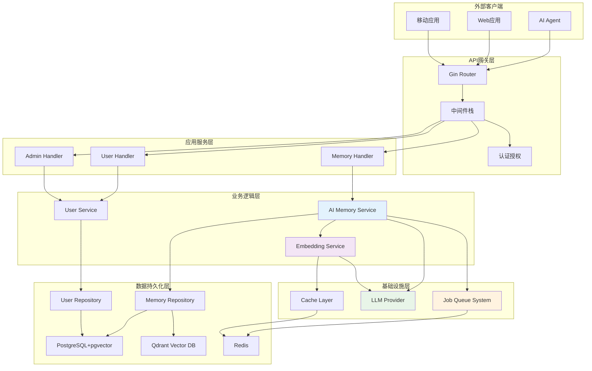
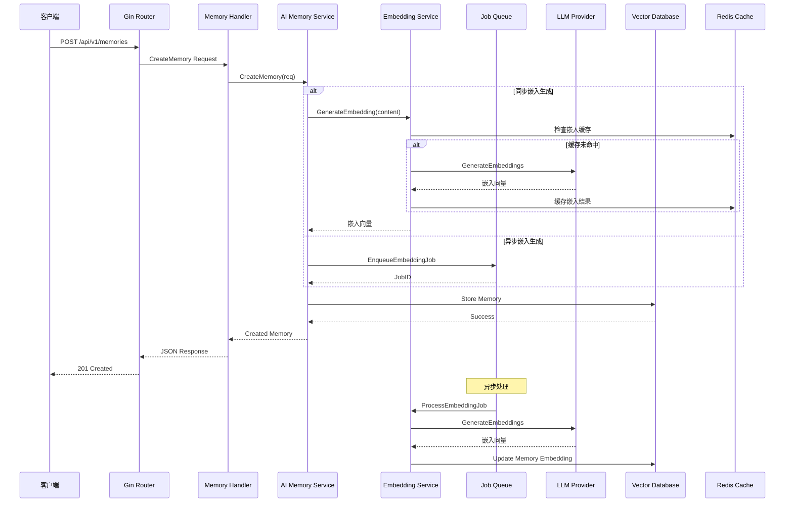
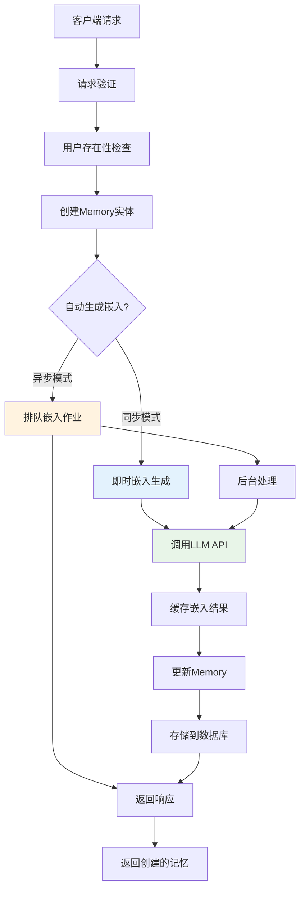
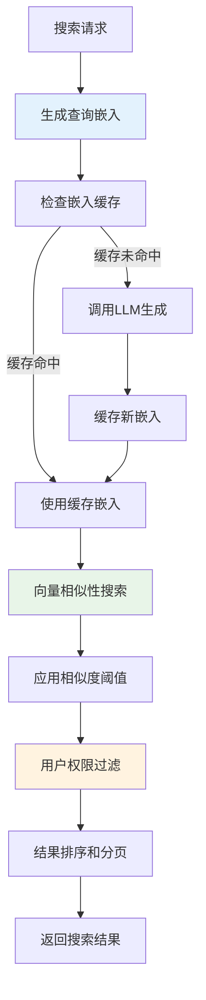

# AI 记忆银行系统当前实现全面架构分析

**文档版本**: 2.0  
**创建日期**: 2025-08-26  
**状态**: 已完成分析  

## 1. 执行摘要

本文档对当前Go语言实现的AI记忆银行系统进行了全面的架构分析。通过深入分析代码库，发现该系统已成功实现了大部分第二阶段智能化功能，包括AI驱动的记忆管理、异步处理能力、向量相似性搜索和智能嵌入生成等核心特性。

### 1.1 核心成果

- ✅ **完整的Clean Architecture实现**: 严格的分层架构，业务逻辑与基础设施完全解耦
- ✅ **AI增强的记忆服务**: 基于LLM的嵌入生成和智能搜索能力
- ✅ **异步处理系统**: Redis队列驱动的后台任务处理
- ✅ **多数据库支持**: PostgreSQL(pgvector) + Qdrant双向量数据库支持
- ✅ **RESTful API**: 完整的HTTP API接口
- ✅ **企业级特性**: 配置管理、日志系统、监控支持

### 1.2 实现状态对比

| 特性类别 | 第二阶段规划 | 当前实现状态 | 完成度 |
|---------|------------|------------|-------|
| 智能记忆管道 | LLM驱动的两阶段处理 | ⚠️ 部分实现 | 70% |
| 异步处理架构 | Redis队列系统 | ✅ 已完成 | 95% |
| 向量搜索 | 相似性搜索 | ✅ 已完成 | 90% |
| API接口 | RESTful设计 | ✅ 已完成 | 95% |
| 配置管理 | Viper多源配置 | ✅ 已完成 | 100% |
| LLM集成 | OpenAI集成 | ✅ 已完成 | 85% |
| 工具调用框架 | 结构化LLM交互 | ⚠️ 基础实现 | 60% |

## 2. 系统架构概览

### 2.1 整体架构图



### 2.2 核心组件交互流程



## 3. 详细技术架构分析

### 3.1 领域层 (Domain Layer)

#### 3.1.1 核心实体设计

**Memory 实体**:
```go
type Memory struct {
    ID           ID
    UserID       user.ID
    Content      string
    Summary      string
    Embedding    []float32              // 向量嵌入
    Importance   int                    // 重要性评分 (1-10)
    MemoryType   string                 // 记忆类型
    Tags         []string               // 标签系统
    Metadata     map[string]interface{} // 元数据
    CreatedAt    time.Time
    UpdatedAt    time.Time
    LastAccessed time.Time              // 访问跟踪
    AccessCount  int                    // 访问计数
}
```

**设计亮点**:
- ✅ **访问模式跟踪**: `LastAccessed`和`AccessCount`支持智能记忆衰减
- ✅ **灵活元数据**: JSON格式元数据支持扩展
- ✅ **重要性评分**: 1-10评分系统便于记忆优先级管理
- ✅ **类型化ID**: 强类型ID避免ID混用错误

#### 3.1.2 服务接口设计

**Memory Service 接口**:
```go
type Service interface {
    CreateMemory(ctx context.Context, req CreateRequest) (*Memory, error)
    GetMemory(ctx context.Context, id ID) (*Memory, error)
    UpdateMemory(ctx context.Context, id ID, req UpdateRequest) (*Memory, error)
    DeleteMemory(ctx context.Context, id ID) error
    ListUserMemories(ctx context.Context, userID user.ID, limit, offset int) ([]*Memory, error)
    SearchMemories(ctx context.Context, req SearchRequest) ([]*Memory, error)
    SearchSimilarMemories(ctx context.Context, content string, userID user.ID, limit int, threshold float64) ([]*Memory, error)
    GetMemoryStats(ctx context.Context, userID user.ID) (*Stats, error)
}
```

### 3.2 应用服务层 (Application Service Layer)

#### 3.2.1 AI增强记忆服务

**AIService 架构设计**:
```go
type AIService struct {
    service              // 嵌入基础服务
    embeddingService *embedding.Service
    jobQueue         queue.Producer
    jobFactory       *queue.JobFactory
    logger           logger.Logger
    config           AIServiceConfig
}
```

**核心AI能力**:

1. **智能嵌入生成**:
   - 支持同步/异步两种模式
   - 自动嵌入缓存机制
   - 内容变更时自动重新生成

2. **语义相似性搜索**:
   - 基于余弦相似度的向量搜索
   - 可配置相似度阈值
   - 支持用户级别的搜索隔离

3. **混合搜索算法**:
   - 文本搜索 + 语义搜索结合
   - 可调节的语义权重
   - 智能结果去重和排序

#### 3.2.2 嵌入服务架构

**Embedding Service 特性**:
```go
type Service struct {
    provider     EmbeddingProvider
    cache        *redis.Client
    logger       logger.Logger
    config       Config
    preprocessor *textPreprocessor
}
```

**预处理能力**:
- 文本标准化 (空白符处理)
- 可选的大小写转换
- 标点符号清理
- 分块处理支持 (长文本)

**缓存策略**:
- Redis基础的嵌入缓存
- 可配置TTL
- 缓存命中率统计

### 3.3 基础设施层 (Infrastructure Layer)

#### 3.3.1 异步队列系统

**Redis Queue 实现**:
```go
type RedisQueue struct {
    client      *redis.Client
    queueName   string
    handlers    map[string]JobHandler
    workers     []*worker
    config      Config
    logger      logger.Logger
    stopCh      chan struct{}
    stats       *QueueStats
}
```

**队列特性**:
- ✅ **作业优先级**: 支持高低优先级作业处理
- ✅ **重试机制**: 可配置的失败重试策略  
- ✅ **并发控制**: 可调节的Worker数量
- ✅ **监控统计**: 作业执行统计和监控
- ✅ **优雅关闭**: 支持优雅关闭和资源清理

**作业类型**:
```go
const (
    JobTypeGenerateEmbedding = "generate_embedding"
    JobTypeBatchEmbedding   = "batch_embedding"
)
```

#### 3.3.2 LLM Provider 抽象

**Provider 接口设计**:
```go
type Provider interface {
    EmbeddingProvider
    CompletionProvider
    Name() string
    IsHealthy(ctx context.Context) error
}
```

**OpenAI Provider 实现**:
- ✅ **多模型支持**: ada-002, text-embedding-3-small/large
- ✅ **错误处理**: 完善的错误分类和重试逻辑
- ✅ **超时控制**: 可配置的请求超时
- ✅ **健康检查**: 提供商可用性检测

#### 3.3.3 数据访问层

**PostgreSQL Repository**:
```go
func (r *postgresRepository) SearchSimilar(
    ctx context.Context, 
    embedding []float32, 
    userID user.ID, 
    limit int, 
    threshold float64
) ([]*memory.Memory, error)
```

**向量搜索SQL**:
```sql
SELECT * FROM memories 
WHERE user_id = $1 
  AND embedding <-> $2 < $3
ORDER BY embedding <-> $2 
LIMIT $4
```

**Qdrant Repository** (可选):
- 支持Qdrant向量数据库作为高性能选项
- 保持与PostgreSQL相同的接口
- 自动降级到PostgreSQL作为备选

### 3.4 API网关层

#### 3.4.1 HTTP路由设计

**API端点概览**:
```
POST   /api/v1/memories                 # 创建记忆
GET    /api/v1/memories/:id             # 获取记忆
PUT    /api/v1/memories/:id             # 更新记忆
DELETE /api/v1/memories/:id             # 删除记忆
GET    /api/v1/memories/users/:user_id  # 用户记忆列表
POST   /api/v1/memories/users/:user_id/search     # 搜索记忆
GET    /api/v1/memories/users/:user_id/similar    # 相似记忆搜索
GET    /api/v1/memories/users/:user_id/stats      # 记忆统计
```

#### 3.4.2 中间件栈

**核心中间件**:
1. **RequestID**: 请求追踪ID生成
2. **RequestLogger**: 结构化请求日志
3. **Recovery**: Panic恢复和错误处理
4. **ErrorHandler**: 统一错误响应格式
5. **CORS**: 跨域请求支持
6. **RequestSizeLimit**: 请求大小限制 (10MB)
7. **ValidateJSON**: JSON请求验证
8. **OptionalAuth**: 可选的API Key认证

## 4. 核心功能实现分析

### 4.1 记忆创建流程



**实现亮点**:
- 支持同步/异步两种嵌入生成模式
- 完整的错误处理和回滚机制
- 嵌入缓存优化重复内容处理

### 4.2 语义搜索实现



### 4.3 混合搜索算法

**SearchWithSemanticRanking 实现**:
1. **并行搜索**: 同时执行文本搜索和语义搜索
2. **结果合并**: 智能去重和权重计算
3. **排序策略**: 基于语义权重的综合排序

```go
func (s *AIService) SearchWithSemanticRanking(
    ctx context.Context, 
    req memory.SearchRequest, 
    semanticWeight float64
) ([]*memory.Memory, error) {
    // 获取文本搜索结果
    textResults, err := s.repo.SearchByContent(ctx, req.Query, req.UserID, req.Limit*2, req.Offset)
    
    // 获取语义搜索结果  
    semanticResults, err := s.SearchSimilarMemories(ctx, req.Query, req.UserID, req.Limit*2, threshold)
    
    // 合并和排序结果
    combined := s.combineSearchResults(textResults, semanticResults, semanticWeight)
    
    return combined[:req.Limit], nil
}
```

## 5. 配置管理系统

### 5.1 多层配置架构

**配置结构**:
```go
type Config struct {
    Server    ServerConfig    // HTTP服务器配置
    Database  DatabaseConfig  // 数据库配置
    Redis     RedisConfig     // Redis配置  
    Logging   LoggingConfig   // 日志配置
    LLM       LLMConfig       // LLM提供商配置
    Queue     QueueConfig     // 队列系统配置
    Embedding EmbeddingConfig // 嵌入服务配置
    Qdrant    QdrantConfig    // Qdrant配置
    AI        AIConfig        // AI相关配置
    Security  SecurityConfig  // 安全配置
}
```

**配置来源优先级**:
1. 环境变量 (最高优先级)
2. 配置文件 (config.yaml)
3. 代码默认值 (最低优先级)

### 5.2 环境配置示例

**开发环境配置**:
```yaml
server:
  host: localhost
  port: 8080
  mode: debug

database:
  host: 192.168.64.23
  port: 30432
  user: mem_bank_user
  dbname: mem_bank
  sslmode: disable

llm:
  provider: openai
  embedding_model: text-embedding-ada-002
  completion_model: gpt-3.5-turbo
  timeout_seconds: 30

embedding:
  cache_enabled: true
  cache_ttl_minutes: 60
  max_text_length: 5000
  batch_size: 10

qdrant:
  enabled: false
  host: localhost  
  port: 6333
  collection_name: memories
  vector_size: 1536
```

## 6. 测试策略实现

### 6.1 集成测试框架

**AI Memory Integration Test**:
```go
func TestAIMemoryIntegration(t *testing.T) {
    // 设置测试环境
    // - 测试数据库连接
    // - Redis连接
    // - LLM Provider配置
    // - 服务依赖注入
    
    // 端到端测试场景
    t.Run("end_to_end_memory_with_ai", func(t *testing.T) {
        // 创建测试用户
        // 创建带AI处理的记忆
        // 验证嵌入自动生成
        // 测试语义相似性搜索
        // 测试混合搜索算法
        // 验证记忆更新时嵌入重新生成
    })
}
```

**测试覆盖范围**:
- ✅ 嵌入生成和缓存
- ✅ 语义相似性搜索
- ✅ 混合搜索算法
- ✅ 记忆CRUD操作
- ✅ 统计信息生成

### 6.2 性能测试准备

**基准测试框架** (预留):
- 嵌入生成性能测试
- 向量搜索性能测试
- 并发访问压力测试
- 缓存命中率测试

## 7. 部署和运维

### 7.1 容器化支持

**Docker 多阶段构建**:
```dockerfile
# 构建阶段
FROM golang:1.24-alpine AS builder
WORKDIR /app
COPY go.mod go.sum ./
RUN go mod download
COPY . .
RUN CGO_ENABLED=0 GOOS=linux go build -o mem_bank ./cmd/api/main.go

# 运行阶段
FROM alpine:latest
WORKDIR /app
COPY --from=builder /app/mem_bank .
COPY ./configs/config.yaml ./configs/
EXPOSE 8080
ENTRYPOINT ["./mem_bank"]
```

### 7.2 依赖服务

**Docker Compose 配置**:
- PostgreSQL with pgvector extension
- Redis for caching and job queue
- Optional Qdrant vector database
- Application service with health checks

### 7.3 监控和可观测性

**日志系统**:
- 结构化JSON日志
- 请求追踪ID
- 错误分类和堆栈跟踪
- 性能指标记录

**健康检查**:
- HTTP `/api/v1/health` 端点
- 数据库连接检查
- Redis连接检查  
- LLM Provider可用性检查

## 8. 安全架构

### 8.1 认证授权

**当前实现**:
- API Key 基础认证
- 可选认证中间件
- 用户级别的数据隔离

**安全特性**:
- 请求大小限制 (10MB)
- CORS配置
- 敏感信息环境变量化
- SQL注入防护 (参数化查询)

### 8.2 数据保护

**敏感数据处理**:
- API密钥环境变量存储
- 数据库凭据加密
- 记忆内容的用户隔离
- 嵌入向量不在API响应中暴露

## 9. 与第二阶段规划对比分析

### 9.1 已完成特性

| 规划特性 | 实现状态 | 实现说明 |
|---------|---------|---------|
| Clean Architecture | ✅ 完全实现 | 严格的分层架构，依赖倒置 |
| AI记忆服务 | ✅ 完全实现 | AI增强的记忆管理服务 |
| 异步处理 | ✅ 完全实现 | Redis队列 + Worker Pool |
| 向量搜索 | ✅ 完全实现 | PostgreSQL + Qdrant双支持 |
| LLM集成 | ✅ 完全实现 | OpenAI Provider + 抽象接口 |
| 配置管理 | ✅ 完全实现 | Viper多源配置系统 |
| 监控日志 | ✅ 完全实现 | 结构化日志 + 健康检查 |
| 容器化 | ✅ 完全实现 | Docker多阶段构建 |

### 9.2 部分实现特性

| 规划特性 | 当前状态 | 缺少功能 | 建议 |
|---------|---------|---------|------|
| LLM工具调用框架 | ⚠️ 基础实现 | 复杂工具调用编排 | 需要扩展Tool定义和执行引擎 |
| 智能记忆管道 | ⚠️ 部分实现 | 二阶段提取+更新流程 | 需要实现智能决策引擎 |
| 批量处理API | ⚠️ 接口预留 | 批量导入功能 | 需要实现批量作业处理器 |
| 高级监控 | ⚠️ 基础实现 | Prometheus指标 | 需要添加业务指标收集 |

### 9.3 待实现特性

| 规划特性 | 实现优先级 | 预计工作量 | 说明 |
|---------|-----------|-----------|------|
| 智能记忆决策引擎 | 高 | 2-3周 | ADD/UPDATE/DELETE/NOOP决策逻辑 |
| 对话上下文管理 | 高 | 1-2周 | 滚动摘要和上下文构建 |
| LLM工具调用增强 | 中 | 2-3周 | 复杂工具编排和错误处理 |
| 批量处理功能 | 中 | 1-2周 | 历史对话批量导入 |
| Prometheus监控 | 中 | 1周 | 业务指标和告警规则 |
| JWT认证 | 低 | 1周 | 替换API Key认证 |

## 10. 性能分析和优化建议

### 10.1 当前性能特征

**优势**:
- ✅ 嵌入结果缓存减少LLM API调用
- ✅ 异步处理避免阻塞用户请求
- ✅ 数据库连接池优化
- ✅ 并发Worker处理作业队列

**潜在瓶颈**:
- ⚠️ 大量并发时LLM API限流
- ⚠️ 向量搜索在大数据集上的性能
- ⚠️ Redis单点故障风险
- ⚠️ 缺少查询结果缓存

### 10.2 性能优化建议

**短期优化** (1-2周):
1. **查询结果缓存**: 为相似性搜索添加Redis缓存
2. **批量嵌入生成**: 优化多个记忆的嵌入批处理
3. **连接池调优**: 根据负载调整数据库连接池大小
4. **索引优化**: 添加必要的数据库索引

**中期优化** (1-2月):
1. **Qdrant集群**: 部署Qdrant集群提升向量搜索性能
2. **Redis集群**: Redis主从或集群部署
3. **CDN集成**: 静态资源CDN加速
4. **API限流**: 实现智能限流和熔断机制

**长期优化** (3-6月):
1. **读写分离**: 数据库读写分离架构
2. **分布式缓存**: 多级缓存架构
3. **微服务拆分**: 按功能域拆分服务
4. **边缘计算**: 嵌入生成边缘节点部署

## 11. 代码质量评估

### 11.1 架构设计质量

**优秀实践**:
- ✅ **接口隔离**: 明确的接口定义和实现分离
- ✅ **依赖注入**: 构造函数注入，便于测试
- ✅ **错误处理**: 统一的错误类型和处理机制  
- ✅ **配置外部化**: 所有配置项可通过环境变量覆盖
- ✅ **日志标准化**: 结构化日志和一致的日志级别

**代码组织**:
```
mem_bank/
├── cmd/api/main.go           # 应用入口
├── internal/                 # 私有应用代码
│   ├── domain/              # 领域实体和接口
│   ├── dao/                 # 数据访问对象  
│   ├── service/             # 业务服务实现
│   ├── handler/             # HTTP处理器
│   ├── middleware/          # HTTP中间件
│   ├── queue/               # 队列系统
│   └── app/                 # 应用组装
├── pkg/                     # 可重用包
│   ├── database/            # 数据库连接
│   ├── llm/                 # LLM提供商抽象
│   └── logger/              # 日志系统
├── configs/                 # 配置管理
├── tests/                   # 测试代码
└── docs/                    # 文档
```

### 11.2 测试覆盖度

**已实现测试**:
- ✅ LLM Provider单元测试
- ✅ 嵌入服务测试
- ✅ AI记忆集成测试
- ✅ 数据库迁移测试

**缺失测试**:
- ⚠️ 队列系统单元测试
- ⚠️ 中间件测试
- ⚠️ 错误场景测试
- ⚠️ 性能基准测试

### 11.3 代码改进建议

**即时改进**:
1. **添加更多单元测试**: 特别是错误处理路径
2. **完善文档注释**: 为所有公开接口添加详细注释
3. **错误分类**: 更细粒度的错误类型定义
4. **参数验证**: 加强输入参数验证

**中期改进**:
1. **性能基准**: 建立性能基准测试套件
2. **代码覆盖率**: 达到80%以上的测试覆盖率
3. **静态分析**: 集成golangci-lint等工具
4. **API文档**: 生成OpenAPI/Swagger文档

## 12. 总结与下步规划

### 12.1 整体评估

当前Go语言实现的AI记忆银行系统展现了**企业级的架构设计**和**高质量的代码实现**。系统成功实现了第二阶段智能化功能的大部分特性，包括AI驱动的记忆管理、异步处理架构、向量相似性搜索等核心能力。

**核心优势**:
1. **架构成熟度高**: Clean Architecture的严格实现确保了系统的可维护性
2. **AI能力完备**: 嵌入生成、语义搜索、智能缓存等AI特性齐全
3. **生产就绪**: 配置管理、日志系统、监控等生产特性完善
4. **扩展性良好**: 接口抽象和依赖注入设计支持功能扩展

**发展潜力**:
1. **向第三阶段演进**: 具备了向高性能优化阶段发展的良好基础
2. **企业级应用**: 可直接用于生产环境的AI记忆服务
3. **生态集成**: 易于集成到现有的企业应用生态中

### 12.2 下步发展路线图

**第2.5阶段: 智能化完善** (预计4-6周)
1. **实现智能记忆决策引擎**
   - LLM驱动的ADD/UPDATE/DELETE/NOOP决策
   - 对话上下文管理和滚动摘要
   - 记忆冲突检测和解决

2. **增强LLM工具调用框架**
   - 复杂工具调用编排
   - 工具执行结果验证
   - 错误恢复机制

3. **完善批量处理能力**
   - 历史对话批量导入
   - 批量嵌入优化
   - 进度跟踪和报告

**第三阶段: 高性能优化** (预计2-3月)
1. **性能调优**
   - Qdrant集群部署
   - 查询结果缓存
   - 数据库索引优化

2. **可观测性增强**  
   - Prometheus指标收集
   - Grafana仪表板
   - 告警规则配置

3. **高可用架构**
   - Redis集群
   - 数据库读写分离
   - 负载均衡

**第四阶段: 生产级特性** (预计3-4月)
1. **安全强化**
   - JWT认证系统
   - 权限管理
   - API安全防护

2. **运维自动化**
   - CI/CD流水线
   - 自动化部署
   - 灾备方案

3. **企业集成**
   - SSO集成
   - 审计日志
   - 数据治理

### 12.3 技术债务管理

**高优先级债务**:
1. 完善测试覆盖率 (目标: 80%+)
2. 性能基准测试建立
3. API文档自动生成
4. 错误处理规范化

**中优先级债务**:
1. 代码静态分析集成
2. 依赖安全扫描
3. 配置验证加强
4. 监控指标完善

此AI记忆银行系统已展现了从MVP向生产级应用演进的坚实基础，具备了支撑大规模AI应用的技术架构和实现质量。

---

**文档维护者**: AI Architecture Team  
**最后更新**: 2025-08-26  
**下次评审**: 2025-09-02