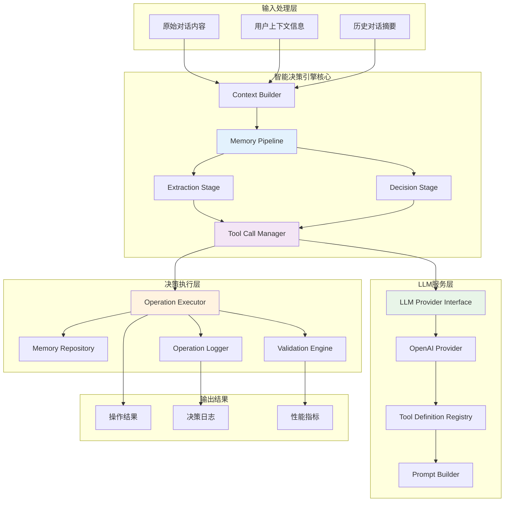
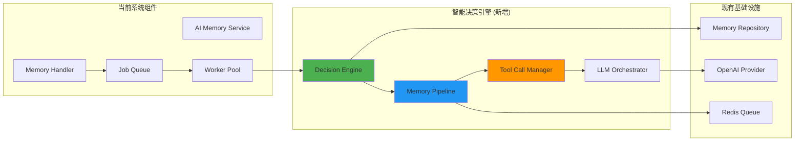
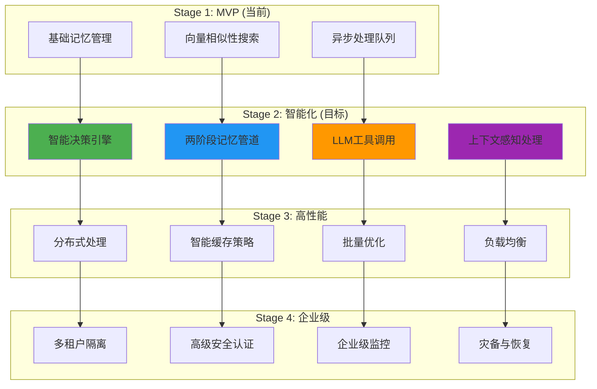

# 智能决策引擎技术设计

**文档版本**: 1.0  
**创建日期**: 2025-08-26  
**作者**: AI记忆系统架构团队  
**状态**: 详细设计

## 1. 概述

### 1.1 设计目标

本文档描述AI记忆银行系统中缺失的核心组件 - 智能决策引擎的完整技术实现。基于当前项目的Clean Architecture架构，设计一个可扩展、高性能的LLM驱动智能决策系统。

### 1.2 核心功能

- **两阶段记忆管道**: 提取候选记忆 → 智能决策操作
- **LLM工具调用框架**: 结构化的AI交互机制
- **智能操作决策**: ADD/UPDATE/DELETE/NOOP四种记忆操作
- **上下文感知处理**: 基于对话历史和用户特征的智能判断
- **异步处理优化**: 与现有异步系统无缝集成

## 2. 总体架构设计

### 2.1 智能决策引擎架构图



### 2.2 决策引擎在系统中的位置



## 3. 两阶段记忆管道设计

### 3.1 管道接口定义

```go
// MemoryPipeline 智能记忆处理管道
type MemoryPipeline interface {
    // ProcessMemoryInput 处理记忆输入（完整流程）
    ProcessMemoryInput(ctx context.Context, input *MemoryInput) (*ProcessingResult, error)
    
    // Stage 1: 提取候选记忆
    ExtractCandidateMemories(ctx context.Context, input *MemoryInput) ([]*CandidateMemory, error)
    
    // Stage 2: 智能决策更新
    DecideMemoryOperations(ctx context.Context, userID string, candidates []*CandidateMemory) ([]*MemoryOperation, error)
}

// MemoryInput 记忆输入结构
type MemoryInput struct {
    UserID          string                 `json:"user_id"`
    SessionID       string                 `json:"session_id"`
    CurrentExchange ConversationExchange   `json:"current_exchange"`
    RecentHistory   []ConversationMessage  `json:"recent_history"`
    RollingSummary  string                 `json:"rolling_summary"`
    Metadata        map[string]interface{} `json:"metadata"`
}

// ConversationExchange 对话交换
type ConversationExchange struct {
    UserMessage      string    `json:"user_message"`
    AssistantMessage string    `json:"assistant_message"`
    Timestamp        time.Time `json:"timestamp"`
}

// CandidateMemory 候选记忆
type CandidateMemory struct {
    ID          string                 `json:"id"`
    Content     string                 `json:"content"`
    Type        MemoryType             `json:"type"`
    Importance  float64                `json:"importance"`
    Confidence  float64                `json:"confidence"`
    Entities    []string               `json:"entities"`
    Keywords    []string               `json:"keywords"`
    Metadata    map[string]interface{} `json:"metadata"`
    Reasoning   string                 `json:"reasoning"`
}

// MemoryType 记忆类型枚举
type MemoryType string

const (
    MemoryTypeFact         MemoryType = "fact"         // 事实信息
    MemoryTypePreference   MemoryType = "preference"   // 用户偏好
    MemoryTypeGoal         MemoryType = "goal"         // 目标计划
    MemoryTypeRelationship MemoryType = "relationship" // 关系信息
    MemoryTypeEvent        MemoryType = "event"        // 事件记录
    MemoryTypeSkill        MemoryType = "skill"        // 技能特长
)

// MemoryOperation 记忆操作
type MemoryOperation struct {
    ID            string                 `json:"id"`
    Type          OperationType          `json:"type"`
    TargetMemory  *CandidateMemory      `json:"target_memory,omitempty"`
    ExistingID    string                 `json:"existing_id,omitempty"`
    NewContent    string                 `json:"new_content,omitempty"`
    Reason        string                 `json:"reason"`
    Confidence    float64                `json:"confidence"`
    Metadata      map[string]interface{} `json:"metadata"`
    ExecutedAt    *time.Time             `json:"executed_at,omitempty"`
    Status        OperationStatus        `json:"status"`
}

// OperationType 操作类型
type OperationType string

const (
    OperationAdd    OperationType = "ADD"    // 添加新记忆
    OperationUpdate OperationType = "UPDATE" // 更新现有记忆
    OperationDelete OperationType = "DELETE" // 删除过时记忆
    OperationNoop   OperationType = "NOOP"   // 无需操作
)

// OperationStatus 操作状态
type OperationStatus string

const (
    StatusPending   OperationStatus = "PENDING"
    StatusExecuted  OperationStatus = "EXECUTED"
    StatusFailed    OperationStatus = "FAILED"
    StatusSkipped   OperationStatus = "SKIPPED"
)
```

### 3.2 阶段一：记忆提取实现

```go
// ExtractionStage 记忆提取阶段
type ExtractionStage struct {
    llmProvider    LLMProvider
    promptBuilder  *PromptBuilder
    validator      *CandidateValidator
    logger         *logrus.Logger
    config         ExtractionConfig
}

// ExtractionConfig 提取配置
type ExtractionConfig struct {
    MaxCandidates     int     `mapstructure:"max_candidates"`
    MinImportance     float64 `mapstructure:"min_importance"`
    MinConfidence     float64 `mapstructure:"min_confidence"`
    EnableEntityExtraction bool `mapstructure:"enable_entity_extraction"`
    ContextWindowSize int     `mapstructure:"context_window_size"`
}

// ExtractCandidateMemories 提取候选记忆
func (es *ExtractionStage) ExtractCandidateMemories(ctx context.Context, input *MemoryInput) ([]*CandidateMemory, error) {
    // 1. 构建提取上下文
    extractionContext := es.buildExtractionContext(input)
    
    // 2. 构建提取提示
    prompt, err := es.promptBuilder.BuildExtractionPrompt(extractionContext)
    if err != nil {
        return nil, fmt.Errorf("failed to build extraction prompt: %w", err)
    }
    
    // 3. 调用LLM进行提取
    request := &LLMRequest{
        Messages: []Message{{
            Role:    "user", 
            Content: prompt,
        }},
        Tools: []Tool{es.getExtractionTool()},
        ToolChoice: ToolChoice{
            Type: "function",
            Function: &FunctionChoice{Name: "extract_memories"},
        },
        Temperature:    0.1,
        MaxTokens:      2000,
        ResponseFormat: "tool_calls",
    }
    
    response, err := es.llmProvider.ChatCompletion(ctx, request)
    if err != nil {
        return nil, fmt.Errorf("LLM extraction failed: %w", err)
    }
    
    // 4. 解析LLM响应
    candidates, err := es.parseExtractionResponse(response)
    if err != nil {
        return nil, fmt.Errorf("failed to parse extraction response: %w", err)
    }
    
    // 5. 验证和过滤候选记忆
    validCandidates := es.validator.ValidateAndFilter(candidates, es.config)
    
    es.logger.WithFields(logrus.Fields{
        "user_id": input.UserID,
        "session_id": input.SessionID,
        "extracted_count": len(candidates),
        "valid_count": len(validCandidates),
    }).Info("Memory extraction completed")
    
    return validCandidates, nil
}

// buildExtractionContext 构建提取上下文
func (es *ExtractionStage) buildExtractionContext(input *MemoryInput) *ExtractionContext {
    return &ExtractionContext{
        CurrentExchange: input.CurrentExchange,
        RecentHistory:   input.RecentHistory,
        RollingSummary:  input.RollingSummary,
        SessionID:       input.SessionID,
        UserID:          input.UserID,
        Timestamp:       time.Now(),
        WindowSize:      es.config.ContextWindowSize,
    }
}

// getExtractionTool 获取记忆提取工具定义
func (es *ExtractionStage) getExtractionTool() Tool {
    return Tool{
        Name:        "extract_memories",
        Description: "从对话中提取有价值的长期记忆信息",
        Parameters: &ToolParameters{
            Type: "object",
            Properties: map[string]*ParameterProperty{
                "memories": {
                    Type:        "array",
                    Description: "提取的候选记忆列表",
                    Items: &ParameterProperty{
                        Type: "object",
                        Properties: map[string]*ParameterProperty{
                            "content": {
                                Type:        "string",
                                Description: "记忆内容，清晰简洁的描述",
                            },
                            "type": {
                                Type:        "string",
                                Description: "记忆类型",
                                Enum:        []string{"fact", "preference", "goal", "relationship", "event", "skill"},
                            },
                            "importance": {
                                Type:        "number",
                                Description: "重要性评分(1-10)，越高越重要",
                                Minimum:     1,
                                Maximum:     10,
                            },
                            "confidence": {
                                Type:        "number", 
                                Description: "置信度(0.0-1.0)，提取准确性评估",
                                Minimum:     0,
                                Maximum:     1,
                            },
                            "entities": {
                                Type:        "array",
                                Description: "涉及的关键实体（人名、地名、组织等）",
                                Items: &ParameterProperty{Type: "string"},
                            },
                            "keywords": {
                                Type:        "array",
                                Description: "关键词标签",
                                Items: &ParameterProperty{Type: "string"},
                            },
                            "reasoning": {
                                Type:        "string",
                                Description: "提取这个记忆的理由",
                            },
                        },
                        Required: []string{"content", "type", "importance", "confidence"},
                    },
                },
            },
            Required: []string{"memories"},
        },
    }
}
```

### 3.3 阶段二：智能决策实现

```go
// DecisionStage 决策阶段
type DecisionStage struct {
    llmProvider         LLMProvider
    memoryRepository    MemoryRepository
    promptBuilder       *PromptBuilder
    similarityAnalyzer  *SimilarityAnalyzer
    operationExecutor   *OperationExecutor
    logger              *logrus.Logger
    config              DecisionConfig
}

// DecisionConfig 决策配置
type DecisionConfig struct {
    SimilarityThreshold   float64 `mapstructure:"similarity_threshold"`
    MaxSimilarMemories    int     `mapstructure:"max_similar_memories"`
    RequireHighConfidence bool    `mapstructure:"require_high_confidence"`
    EnableConflictResolution bool `mapstructure:"enable_conflict_resolution"`
    DecisionTimeout       time.Duration `mapstructure:"decision_timeout"`
}

// DecideMemoryOperations 决策记忆操作
func (ds *DecisionStage) DecideMemoryOperations(ctx context.Context, userID string, candidates []*CandidateMemory) ([]*MemoryOperation, error) {
    var operations []*MemoryOperation
    
    for _, candidate := range candidates {
        operation, err := ds.processCandidate(ctx, userID, candidate)
        if err != nil {
            ds.logger.WithError(err).WithField("candidate_id", candidate.ID).Error("Failed to process candidate")
            continue
        }
        
        if operation != nil {
            operations = append(operations, operation)
        }
    }
    
    return operations, nil
}

// processCandidate 处理单个候选记忆
func (ds *DecisionStage) processCandidate(ctx context.Context, userID string, candidate *CandidateMemory) (*MemoryOperation, error) {
    // 1. 生成候选记忆的向量嵌入
    embedding, err := ds.generateEmbedding(ctx, candidate.Content)
    if err != nil {
        return nil, fmt.Errorf("failed to generate embedding: %w", err)
    }
    
    // 2. 搜索相似的现有记忆
    similarMemories, err := ds.memoryRepository.FindSimilar(ctx, &SimilarityQuery{
        UserID:    userID,
        Embedding: embedding,
        Limit:     ds.config.MaxSimilarMemories,
        Threshold: ds.config.SimilarityThreshold,
    })
    if err != nil {
        return nil, fmt.Errorf("failed to find similar memories: %w", err)
    }
    
    // 3. 分析相似性和冲突
    analysis := ds.similarityAnalyzer.Analyze(candidate, similarMemories)
    
    // 4. 构建决策上下文并调用LLM
    decision, err := ds.makeDecision(ctx, candidate, similarMemories, analysis)
    if err != nil {
        return nil, fmt.Errorf("failed to make decision: %w", err)
    }
    
    return decision, nil
}

// makeDecision 使用LLM做出决策
func (ds *DecisionStage) makeDecision(ctx context.Context, candidate *CandidateMemory, similarMemories []*Memory, analysis *SimilarityAnalysis) (*MemoryOperation, error) {
    // 构建决策提示
    prompt, err := ds.promptBuilder.BuildDecisionPrompt(&DecisionContext{
        Candidate:        candidate,
        SimilarMemories:  similarMemories,
        Analysis:         analysis,
        DecisionCriteria: ds.getDecisionCriteria(),
    })
    if err != nil {
        return nil, fmt.Errorf("failed to build decision prompt: %w", err)
    }
    
    // 调用LLM进行决策
    request := &LLMRequest{
        Messages: []Message{{
            Role:    "user",
            Content: prompt,
        }},
        Tools:       ds.getDecisionTools(),
        ToolChoice: ToolChoice{Type: "required"},
        Temperature: 0.2,
        MaxTokens:   1000,
    }
    
    response, err := ds.llmProvider.ChatCompletion(ctx, request)
    if err != nil {
        return nil, fmt.Errorf("LLM decision failed: %w", err)
    }
    
    // 解析决策结果
    operation, err := ds.parseDecisionResponse(response, candidate)
    if err != nil {
        return nil, fmt.Errorf("failed to parse decision: %w", err)
    }
    
    return operation, nil
}

// getDecisionTools 获取决策工具集
func (ds *DecisionStage) getDecisionTools() []Tool {
    return []Tool{
        {
            Name:        "add_new_memory",
            Description: "添加一个全新的记忆，当候选记忆包含之前未记录的信息时使用",
            Parameters: &ToolParameters{
                Type: "object",
                Properties: map[string]*ParameterProperty{
                    "content": {
                        Type:        "string",
                        Description: "要添加的记忆内容",
                    },
                    "importance": {
                        Type:        "number",
                        Description: "记忆重要性评分(1-10)",
                    },
                    "confidence": {
                        Type:        "number",
                        Description: "决策置信度(0.0-1.0)",
                    },
                    "reasoning": {
                        Type:        "string",
                        Description: "选择添加操作的详细理由",
                    },
                    "tags": {
                        Type:        "array",
                        Description: "记忆标签",
                        Items: &ParameterProperty{Type: "string"},
                    },
                },
                Required: []string{"content", "reasoning"},
            },
        },
        {
            Name:        "update_existing_memory",
            Description: "更新现有记忆，当候选记忆补充或修正现有信息时使用",
            Parameters: &ToolParameters{
                Type: "object",
                Properties: map[string]*ParameterProperty{
                    "memory_id": {
                        Type:        "string",
                        Description: "要更新的现有记忆ID",
                    },
                    "new_content": {
                        Type:        "string",
                        Description: "更新后的记忆内容",
                    },
                    "merge_strategy": {
                        Type:        "string",
                        Description: "合并策略",
                        Enum:        []string{"replace", "append", "merge"},
                    },
                    "confidence": {
                        Type:        "number",
                        Description: "决策置信度(0.0-1.0)",
                    },
                    "reasoning": {
                        Type:        "string",
                        Description: "选择更新操作的详细理由",
                    },
                },
                Required: []string{"memory_id", "new_content", "reasoning"},
            },
        },
        {
            Name:        "delete_memory",
            Description: "删除过时或错误的记忆，当候选记忆与现有记忆冲突且候选更准确时使用",
            Parameters: &ToolParameters{
                Type: "object",
                Properties: map[string]*ParameterProperty{
                    "memory_id": {
                        Type:        "string",
                        Description: "要删除的记忆ID",
                    },
                    "replacement_content": {
                        Type:        "string",
                        Description: "替代的正确记忆内容（可选）",
                    },
                    "confidence": {
                        Type:        "number",
                        Description: "决策置信度(0.0-1.0)",
                    },
                    "reasoning": {
                        Type:        "string",
                        Description: "选择删除操作的详细理由",
                    },
                },
                Required: []string{"memory_id", "reasoning"},
            },
        },
        {
            Name:        "no_operation",
            Description: "不执行任何操作，当候选记忆重复、不重要或质量不足时使用",
            Parameters: &ToolParameters{
                Type: "object",
                Properties: map[string]*ParameterProperty{
                    "reasoning": {
                        Type:        "string",
                        Description: "不执行操作的详细理由",
                    },
                    "confidence": {
                        Type:        "number",
                        Description: "决策置信度(0.0-1.0)",
                    },
                },
                Required: []string{"reasoning"},
            },
        },
    }
}
```

## 4. LLM工具调用框架设计

### 4.1 工具调用管理器

```go
// ToolCallManager LLM工具调用管理器
type ToolCallManager struct {
    toolRegistry    *ToolRegistry
    executorFactory *ExecutorFactory
    validator       *ToolCallValidator
    logger          *logrus.Logger
    metrics         *ToolCallMetrics
}

// ToolRegistry 工具注册中心
type ToolRegistry struct {
    tools map[string]*ToolDefinition
    mutex sync.RWMutex
}

// ToolDefinition 工具定义
type ToolDefinition struct {
    Tool        Tool                    `json:"tool"`
    Handler     ToolHandler            `json:"-"`
    Validator   ParameterValidator     `json:"-"`
    RateLimit   *RateLimitConfig       `json:"rate_limit,omitempty"`
    Permissions []string               `json:"permissions,omitempty"`
    Metadata    map[string]interface{} `json:"metadata,omitempty"`
}

// ToolHandler 工具处理器接口
type ToolHandler interface {
    Execute(ctx context.Context, params map[string]interface{}) (*ToolResult, error)
    Validate(params map[string]interface{}) error
    GetSchema() *ToolParameters
}

// ToolResult 工具执行结果
type ToolResult struct {
    Success     bool                   `json:"success"`
    Result      interface{}           `json:"result,omitempty"`
    Error       string                `json:"error,omitempty"`
    ExecutionID string                `json:"execution_id"`
    Duration    time.Duration         `json:"duration"`
    Metadata    map[string]interface{} `json:"metadata,omitempty"`
}

// ExecuteToolCalls 执行工具调用
func (tcm *ToolCallManager) ExecuteToolCalls(ctx context.Context, toolCalls []ToolCall) ([]*ToolResult, error) {
    results := make([]*ToolResult, len(toolCalls))
    var wg sync.WaitGroup
    
    for i, toolCall := range toolCalls {
        wg.Add(1)
        go func(index int, call ToolCall) {
            defer wg.Done()
            
            result, err := tcm.executeToolCall(ctx, call)
            if err != nil {
                result = &ToolResult{
                    Success:     false,
                    Error:       err.Error(),
                    ExecutionID: uuid.New().String(),
                }
            }
            results[index] = result
        }(i, toolCall)
    }
    
    wg.Wait()
    return results, nil
}

// executeToolCall 执行单个工具调用
func (tcm *ToolCallManager) executeToolCall(ctx context.Context, toolCall ToolCall) (*ToolResult, error) {
    startTime := time.Now()
    executionID := uuid.New().String()
    
    // 获取工具定义
    toolDef, exists := tcm.toolRegistry.GetTool(toolCall.Function.Name)
    if !exists {
        return nil, fmt.Errorf("unknown tool: %s", toolCall.Function.Name)
    }
    
    // 解析参数
    var params map[string]interface{}
    if err := json.Unmarshal(toolCall.Function.Arguments, &params); err != nil {
        return nil, fmt.Errorf("failed to parse tool arguments: %w", err)
    }
    
    // 验证参数
    if err := tcm.validator.ValidateParameters(toolDef.Tool.Parameters, params); err != nil {
        return nil, fmt.Errorf("parameter validation failed: %w", err)
    }
    
    // 执行工具
    result, err := toolDef.Handler.Execute(ctx, params)
    if err != nil {
        return nil, fmt.Errorf("tool execution failed: %w", err)
    }
    
    // 记录执行指标
    duration := time.Since(startTime)
    tcm.metrics.RecordExecution(toolCall.Function.Name, duration, err == nil)
    
    result.ExecutionID = executionID
    result.Duration = duration
    
    tcm.logger.WithFields(logrus.Fields{
        "tool_name":    toolCall.Function.Name,
        "execution_id": executionID,
        "duration":     duration,
        "success":      result.Success,
    }).Info("Tool execution completed")
    
    return result, nil
}
```

### 4.2 记忆操作工具处理器

```go
// AddMemoryHandler 添加记忆工具处理器
type AddMemoryHandler struct {
    memoryService MemoryService
    validator     *MemoryValidator
    logger        *logrus.Logger
}

// Execute 执行添加记忆操作
func (h *AddMemoryHandler) Execute(ctx context.Context, params map[string]interface{}) (*ToolResult, error) {
    // 解析参数
    content, _ := params["content"].(string)
    importance, _ := params["importance"].(float64)
    reasoning, _ := params["reasoning"].(string)
    tags, _ := params["tags"].([]interface{})
    
    // 转换标签
    var tagStrings []string
    for _, tag := range tags {
        if tagStr, ok := tag.(string); ok {
            tagStrings = append(tagStrings, tagStr)
        }
    }
    
    // 创建记忆实体
    memory := &Memory{
        ID:        uuid.New().String(),
        Content:   content,
        Tags:      tagStrings,
        CreatedAt: time.Now(),
        UpdatedAt: time.Now(),
        Metadata: map[string]interface{}{
            "importance": importance,
            "reasoning":  reasoning,
            "source":     "intelligent_decision",
        },
    }
    
    // 验证记忆
    if err := h.validator.ValidateMemory(memory); err != nil {
        return &ToolResult{
            Success: false,
            Error:   fmt.Sprintf("Memory validation failed: %v", err),
        }, nil
    }
    
    // 保存记忆
    if err := h.memoryService.CreateMemory(ctx, memory); err != nil {
        return &ToolResult{
            Success: false,
            Error:   fmt.Sprintf("Failed to create memory: %v", err),
        }, nil
    }
    
    h.logger.WithFields(logrus.Fields{
        "memory_id":  memory.ID,
        "content":    content,
        "importance": importance,
    }).Info("Memory added through intelligent decision")
    
    return &ToolResult{
        Success: true,
        Result: map[string]interface{}{
            "memory_id": memory.ID,
            "message":   "Memory successfully added",
        },
    }, nil
}

// UpdateMemoryHandler 更新记忆工具处理器
type UpdateMemoryHandler struct {
    memoryService MemoryService
    logger        *logrus.Logger
}

// Execute 执行更新记忆操作
func (h *UpdateMemoryHandler) Execute(ctx context.Context, params map[string]interface{}) (*ToolResult, error) {
    memoryID, _ := params["memory_id"].(string)
    newContent, _ := params["new_content"].(string)
    mergeStrategy, _ := params["merge_strategy"].(string)
    reasoning, _ := params["reasoning"].(string)
    
    // 获取现有记忆
    existingMemory, err := h.memoryService.GetMemoryByID(ctx, memoryID)
    if err != nil {
        return &ToolResult{
            Success: false,
            Error:   fmt.Sprintf("Failed to find memory: %v", err),
        }, nil
    }
    
    // 根据合并策略更新内容
    var updatedContent string
    switch mergeStrategy {
    case "replace":
        updatedContent = newContent
    case "append":
        updatedContent = existingMemory.Content + " " + newContent
    case "merge":
        updatedContent = h.mergeContents(existingMemory.Content, newContent)
    default:
        updatedContent = newContent
    }
    
    // 更新记忆
    updateReq := &UpdateMemoryRequest{
        ID:      memoryID,
        Content: updatedContent,
        Metadata: map[string]interface{}{
            "last_update_reason": reasoning,
            "merge_strategy":     mergeStrategy,
            "updated_by":        "intelligent_decision",
        },
    }
    
    if err := h.memoryService.UpdateMemory(ctx, updateReq); err != nil {
        return &ToolResult{
            Success: false,
            Error:   fmt.Sprintf("Failed to update memory: %v", err),
        }, nil
    }
    
    h.logger.WithFields(logrus.Fields{
        "memory_id":      memoryID,
        "merge_strategy": mergeStrategy,
        "reasoning":      reasoning,
    }).Info("Memory updated through intelligent decision")
    
    return &ToolResult{
        Success: true,
        Result: map[string]interface{}{
            "memory_id": memoryID,
            "message":   "Memory successfully updated",
        },
    }, nil
}

// mergeContents 智能合并内容
func (h *UpdateMemoryHandler) mergeContents(existing, new string) string {
    // 简单的合并逻辑，实际可以更复杂
    if strings.Contains(existing, new) {
        return existing
    }
    if strings.Contains(new, existing) {
        return new
    }
    return existing + "; " + new
}
```

## 5. 智能决策算法

### 5.1 相似性分析器

```go
// SimilarityAnalyzer 相似性分析器
type SimilarityAnalyzer struct {
    embeddingService EmbeddingService
    threshold        float64
    logger          *logrus.Logger
}

// SimilarityAnalysis 相似性分析结果
type SimilarityAnalysis struct {
    MaxSimilarity     float64           `json:"max_similarity"`
    HighlySimilar     []*Memory         `json:"highly_similar"`
    PotentialConflicts []*ConflictInfo  `json:"potential_conflicts"`
    Recommendations   []string          `json:"recommendations"`
    ConfidenceScore   float64           `json:"confidence_score"`
}

// ConflictInfo 冲突信息
type ConflictInfo struct {
    ConflictingMemory *Memory `json:"conflicting_memory"`
    ConflictType      string  `json:"conflict_type"`
    Severity          float64 `json:"severity"`
    Description       string  `json:"description"`
}

// Analyze 分析候选记忆与现有记忆的关系
func (sa *SimilarityAnalyzer) Analyze(candidate *CandidateMemory, similarMemories []*Memory) *SimilarityAnalysis {
    analysis := &SimilarityAnalysis{
        HighlySimilar:      make([]*Memory, 0),
        PotentialConflicts: make([]*ConflictInfo, 0),
        Recommendations:    make([]string, 0),
    }
    
    if len(similarMemories) == 0 {
        analysis.Recommendations = append(analysis.Recommendations, "No similar memories found - likely new information")
        analysis.ConfidenceScore = 0.9
        return analysis
    }
    
    for _, memory := range similarMemories {
        similarity := sa.calculateSemSimilarity(candidate.Content, memory.Content)
        
        if similarity > analysis.MaxSimilarity {
            analysis.MaxSimilarity = similarity
        }
        
        if similarity > sa.threshold {
            analysis.HighlySimilar = append(analysis.HighlySimilar, memory)
            
            // 检查潜在冲突
            conflict := sa.detectConflict(candidate, memory, similarity)
            if conflict != nil {
                analysis.PotentialConflicts = append(analysis.PotentialConflicts, conflict)
            }
        }
    }
    
    // 生成建议
    analysis.Recommendations = sa.generateRecommendations(candidate, analysis)
    analysis.ConfidenceScore = sa.calculateConfidence(analysis)
    
    return analysis
}

// detectConflict 检测内容冲突
func (sa *SimilarityAnalyzer) detectConflict(candidate *CandidateMemory, existing *Memory, similarity float64) *ConflictInfo {
    // 高相似度但内容不完全匹配可能是冲突
    if similarity > 0.8 && !sa.isContentConsistent(candidate.Content, existing.Content) {
        return &ConflictInfo{
            ConflictingMemory: existing,
            ConflictType:      "content_inconsistency",
            Severity:          (1.0 - similarity) * candidate.Importance,
            Description:       "High similarity but inconsistent content detected",
        }
    }
    
    // 时间信息冲突检测
    if sa.hasTemporalConflict(candidate, existing) {
        return &ConflictInfo{
            ConflictingMemory: existing,
            ConflictType:      "temporal_conflict",
            Severity:          0.8,
            Description:       "Temporal information conflict detected",
        }
    }
    
    return nil
}

// calculateConfidence 计算决策置信度
func (sa *SimilarityAnalyzer) calculateConfidence(analysis *SimilarityAnalysis) float64 {
    baseConfidence := 0.5
    
    // 高相似度降低信心（可能重复）
    if analysis.MaxSimilarity > 0.9 {
        baseConfidence -= 0.3
    } else if analysis.MaxSimilarity < 0.3 {
        baseConfidence += 0.3
    }
    
    // 冲突降低信心
    if len(analysis.PotentialConflicts) > 0 {
        baseConfidence -= 0.2 * float64(len(analysis.PotentialConflicts))
    }
    
    // 边界检查
    if baseConfidence < 0.1 {
        baseConfidence = 0.1
    } else if baseConfidence > 0.95 {
        baseConfidence = 0.95
    }
    
    return baseConfidence
}
```

### 5.2 上下文构建器

```go
// ContextBuilder 上下文构建器
type ContextBuilder struct {
    templateEngine *TemplateEngine
    config        ContextConfig
}

// ContextConfig 上下文配置
type ContextConfig struct {
    MaxContextLength    int `mapstructure:"max_context_length"`
    IncludeUserProfile  bool `mapstructure:"include_user_profile"`
    IncludeSessionInfo  bool `mapstructure:"include_session_info"`
    EnableReasoningMode bool `mapstructure:"enable_reasoning_mode"`
}

// ExtractionContext 提取上下文
type ExtractionContext struct {
    CurrentExchange ConversationExchange   `json:"current_exchange"`
    RecentHistory   []ConversationMessage  `json:"recent_history"`
    RollingSummary  string                 `json:"rolling_summary"`
    UserProfile     *UserProfile           `json:"user_profile,omitempty"`
    SessionInfo     *SessionInfo           `json:"session_info,omitempty"`
    Timestamp       time.Time              `json:"timestamp"`
}

// DecisionContext 决策上下文
type DecisionContext struct {
    Candidate        *CandidateMemory  `json:"candidate"`
    SimilarMemories  []*Memory         `json:"similar_memories"`
    Analysis         *SimilarityAnalysis `json:"analysis"`
    DecisionCriteria *DecisionCriteria `json:"decision_criteria"`
    UserContext      *UserContext      `json:"user_context,omitempty"`
}

// BuildExtractionPrompt 构建提取提示
func (cb *ContextBuilder) BuildExtractionPrompt(context *ExtractionContext) (string, error) {
    template := `你是一个专业的AI记忆提取助手。请从以下对话中识别和提取值得长期记住的重要信息。

## 当前对话交换
**用户**: {{.CurrentExchange.UserMessage}}
**助手**: {{.CurrentExchange.AssistantMessage}}
**时间**: {{.CurrentExchange.Timestamp.Format "2006-01-02 15:04:05"}}

{{if .RecentHistory}}
## 近期对话历史
{{range .RecentHistory}}
**{{.Role}}**: {{.Content}}
{{end}}
{{end}}

{{if .RollingSummary}}
## 对话摘要
{{.RollingSummary}}
{{end}}

{{if .UserProfile}}
## 用户画像
- 姓名: {{.UserProfile.Name}}
- 偏好: {{join .UserProfile.Preferences ", "}}
- 兴趣: {{join .UserProfile.Interests ", "}}
{{end}}

## 提取指导原则

### 值得记忆的信息类型：
1. **事实信息 (fact)**: 客观的、可验证的信息
2. **用户偏好 (preference)**: 用户的喜好、习惯、倾向
3. **目标计划 (goal)**: 用户的目标、计划、意图
4. **关系信息 (relationship)**: 人际关系、社交联系
5. **事件记录 (event)**: 重要事件、经历、里程碑
6. **技能特长 (skill)**: 用户的技能、专长、能力

### 提取标准：
- 重要性评分: 1-10分，综合考虑信息的价值、持久性和独特性
- 置信度评分: 0.0-1.0，基于信息的清晰度和确定性
- 避免重复或琐碎的日常信息
- 优先提取具有长期价值的信息

### 质量要求：
- 记忆内容应该清晰、简洁、准确
- 包含必要的实体和关键词
- 提供提取理由说明

请使用 extract_memories 工具来提取候选记忆。`

    return cb.templateEngine.Execute(template, context)
}

// BuildDecisionPrompt 构建决策提示  
func (cb *ContextBuilder) BuildDecisionPrompt(context *DecisionContext) (string, error) {
    template := `你是一个智能的记忆管理决策助手。请分析候选记忆与现有记忆的关系，并决定最佳的操作方案。

## 候选记忆信息
**内容**: {{.Candidate.Content}}
**类型**: {{.Candidate.Type}}
**重要性**: {{.Candidate.Importance}}/10
**置信度**: {{printf "%.2f" .Candidate.Confidence}}
**实体**: {{join .Candidate.Entities ", "}}
**关键词**: {{join .Candidate.Keywords ", "}}
**提取理由**: {{.Candidate.Reasoning}}

## 现有相似记忆
{{if .SimilarMemories}}
{{range $index, $memory := .SimilarMemories}}
### 记忆 {{add $index 1}} (ID: {{$memory.ID}})
- **内容**: {{$memory.Content}}
- **创建时间**: {{$memory.CreatedAt.Format "2006-01-02 15:04:05"}}
- **更新时间**: {{$memory.UpdatedAt.Format "2006-01-02 15:04:05"}}
- **标签**: {{join $memory.Tags ", "}}
{{end}}
{{else}}
*未找到相似记忆*
{{end}}

## 相似性分析
{{if .Analysis}}
- **最高相似度**: {{printf "%.3f" .Analysis.MaxSimilarity}}
- **高度相似记忆数**: {{len .Analysis.HighlySimilar}}
- **潜在冲突数**: {{len .Analysis.PotentialConflicts}}
- **决策置信度**: {{printf "%.3f" .Analysis.ConfidenceScore}}

{{if .Analysis.PotentialConflicts}}
### 发现的冲突
{{range .Analysis.PotentialConflicts}}
- **冲突类型**: {{.ConflictType}}
- **严重程度**: {{printf "%.2f" .Severity}}
- **描述**: {{.Description}}
{{end}}
{{end}}

### 分析建议
{{range .Analysis.Recommendations}}
- {{.}}
{{end}}
{{end}}

## 决策标准和指导

### 操作类型选择：

**1. ADD (添加新记忆)**
- 候选记忆包含全新的、之前未记录的信息
- 与现有记忆相似度 < 0.7
- 信息具有独立价值和意义
- 重要性评分 ≥ 6

**2. UPDATE (更新现有记忆)**  
- 候选记忆补充或修正现有记忆
- 相似度在 0.7-0.9 之间
- 信息是对现有记忆的增强或更正
- 不构成实质性冲突

**3. DELETE (删除过时记忆)**
- 候选记忆与现有记忆直接冲突
- 候选记忆更准确或更新
- 现有记忆已过时或不正确
- 置信度 > 0.8

**4. NOOP (无操作)**
- 候选记忆与现有记忆高度重复 (相似度 > 0.9)
- 信息质量不足或重要性过低
- 置信度 < 0.5
- 内容过于琐碎或临时

### 决策考量因素：
- 信息的时效性和持久性
- 内容的准确性和完整性  
- 避免信息冗余和冲突
- 保持记忆库的质量和一致性
- 考虑用户的长期需求

请选择最合适的操作并提供详细的决策理由。`

    return cb.templateEngine.Execute(template, context)
}
```

## 6. 系统集成和性能优化

### 6.1 与现有系统集成

```go
// IntelligentMemoryService 智能记忆服务
type IntelligentMemoryService struct {
    // 现有服务
    memoryService    MemoryService
    embeddingService EmbeddingService
    jobQueue         JobQueue
    
    // 新增智能组件
    decisionEngine   *DecisionEngine
    memoryPipeline   MemoryPipeline
    toolCallManager  *ToolCallManager
    
    config           IntelligentConfig
    logger           *logrus.Logger
    metrics          *IntelligentMetrics
}

// ProcessIntelligentMemory 智能记忆处理（异步）
func (ims *IntelligentMemoryService) ProcessIntelligentMemory(ctx context.Context, input *MemoryInput) error {
    // 创建智能处理作业
    job := &IntelligentMemoryJob{
        ID:        uuid.New().String(),
        Type:      JobTypeIntelligentMemory,
        Input:     input,
        Status:    JobStatusPending,
        CreatedAt: time.Now(),
        Config: IntelligentJobConfig{
            EnableExtraction: true,
            EnableDecision:   true,
            MaxRetries:       3,
            Timeout:         30 * time.Second,
        },
    }
    
    // 提交到队列
    return ims.jobQueue.EnqueueIntelligentJob(ctx, job)
}

// ProcessIntelligentMemorySync 智能记忆处理（同步，用于测试）
func (ims *IntelligentMemoryService) ProcessIntelligentMemorySync(ctx context.Context, input *MemoryInput) (*IntelligentProcessingResult, error) {
    startTime := time.Now()
    
    // 阶段一：提取候选记忆
    candidates, err := ims.memoryPipeline.ExtractCandidateMemories(ctx, input)
    if err != nil {
        return nil, fmt.Errorf("memory extraction failed: %w", err)
    }
    
    ims.metrics.RecordExtraction(len(candidates), time.Since(startTime))
    
    if len(candidates) == 0 {
        return &IntelligentProcessingResult{
            Status:     "completed",
            Message:    "No valuable memories extracted",
            Candidates: 0,
            Operations: 0,
        }, nil
    }
    
    // 阶段二：决策记忆操作
    decisionStartTime := time.Now()
    operations, err := ims.memoryPipeline.DecideMemoryOperations(ctx, input.UserID, candidates)
    if err != nil {
        return nil, fmt.Errorf("memory decision failed: %w", err)
    }
    
    ims.metrics.RecordDecision(len(operations), time.Since(decisionStartTime))
    
    // 执行操作
    executionResults, err := ims.executeOperations(ctx, operations)
    if err != nil {
        return nil, fmt.Errorf("operation execution failed: %w", err)
    }
    
    result := &IntelligentProcessingResult{
        Status:           "completed",
        Message:          fmt.Sprintf("Processed %d candidates, executed %d operations", len(candidates), len(operations)),
        Candidates:       len(candidates),
        Operations:       len(operations),
        ExecutionResults: executionResults,
        Duration:         time.Since(startTime),
    }
    
    ims.logger.WithFields(logrus.Fields{
        "user_id":         input.UserID,
        "session_id":      input.SessionID,
        "candidates":      len(candidates),
        "operations":      len(operations),
        "duration":        result.Duration,
    }).Info("Intelligent memory processing completed")
    
    return result, nil
}

// executeOperations 执行记忆操作
func (ims *IntelligentMemoryService) executeOperations(ctx context.Context, operations []*MemoryOperation) ([]*OperationResult, error) {
    results := make([]*OperationResult, len(operations))
    var wg sync.WaitGroup
    
    // 并发执行操作（非破坏性操作）
    for i, operation := range operations {
        wg.Add(1)
        go func(index int, op *MemoryOperation) {
            defer wg.Done()
            
            result, err := ims.executeOperation(ctx, op)
            if err != nil {
                result = &OperationResult{
                    OperationID: op.ID,
                    Success:     false,
                    Error:       err.Error(),
                }
            }
            results[index] = result
        }(i, operation)
    }
    
    wg.Wait()
    return results, nil
}

// executeOperation 执行单个操作
func (ims *IntelligentMemoryService) executeOperation(ctx context.Context, operation *MemoryOperation) (*OperationResult, error) {
    switch operation.Type {
    case OperationAdd:
        return ims.executeAddOperation(ctx, operation)
    case OperationUpdate:
        return ims.executeUpdateOperation(ctx, operation)
    case OperationDelete:
        return ims.executeDeleteOperation(ctx, operation)
    case OperationNoop:
        return &OperationResult{
            OperationID: operation.ID,
            Success:     true,
            Message:     "No operation performed as decided",
        }, nil
    default:
        return nil, fmt.Errorf("unknown operation type: %s", operation.Type)
    }
}
```

### 6.2 性能优化策略

```go
// PerformanceOptimizer 性能优化器
type PerformanceOptimizer struct {
    cacheManager     *CacheManager
    batchProcessor   *BatchProcessor
    poolManager      *ConnectionPoolManager
    metricsCollector *MetricsCollector
}

// CacheManager 缓存管理器
type CacheManager struct {
    embeddingCache   *TTLCache[string, []float32]
    similarityCache  *TTLCache[string, []*Memory]
    decisionCache    *TTLCache[string, *MemoryOperation]
    configCache      *ConfigCache
}

// OptimizedEmbeddingGeneration 优化的嵌入生成
func (cm *CacheManager) OptimizedEmbeddingGeneration(ctx context.Context, texts []string, provider LLMProvider) ([][]float32, error) {
    var results [][]float32
    var uncachedTexts []string
    var uncachedIndices []int
    
    // 检查缓存
    for i, text := range texts {
        key := cm.generateCacheKey(text)
        if embedding, found := cm.embeddingCache.Get(key); found {
            results = append(results, embedding)
        } else {
            results = append(results, nil)
            uncachedTexts = append(uncachedTexts, text)
            uncachedIndices = append(uncachedIndices, i)
        }
    }
    
    // 批量生成未缓存的嵌入
    if len(uncachedTexts) > 0 {
        embeddings, err := provider.CreateEmbeddings(ctx, uncachedTexts)
        if err != nil {
            return nil, fmt.Errorf("failed to generate embeddings: %w", err)
        }
        
        // 填充结果并缓存
        for i, embedding := range embeddings {
            resultIndex := uncachedIndices[i]
            results[resultIndex] = embedding
            
            // 缓存结果
            key := cm.generateCacheKey(uncachedTexts[i])
            cm.embeddingCache.Set(key, embedding, 24*time.Hour)
        }
    }
    
    return results, nil
}

// BatchProcessor 批量处理器
type BatchProcessor struct {
    maxBatchSize    int
    batchTimeout    time.Duration
    processingQueue chan *BatchItem
    workerPool      *WorkerPool
}

// BatchItem 批处理项目
type BatchItem struct {
    ID       string
    Data     interface{}
    Callback func(interface{}, error)
}

// ProcessBatch 批量处理
func (bp *BatchProcessor) ProcessBatch(items []*BatchItem) error {
    // 分组处理
    batches := bp.groupIntoBatches(items, bp.maxBatchSize)
    
    var wg sync.WaitGroup
    for _, batch := range batches {
        wg.Add(1)
        go func(batchItems []*BatchItem) {
            defer wg.Done()
            bp.processBatchItems(batchItems)
        }(batch)
    }
    
    wg.Wait()
    return nil
}
```

## 7. 监控和可观测性

### 7.1 智能决策指标

```go
// IntelligentMetrics 智能决策指标
type IntelligentMetrics struct {
    // 处理指标
    ExtractionDuration    prometheus.Histogram
    DecisionDuration      prometheus.Histogram
    TotalProcessingTime   prometheus.Histogram
    
    // 业务指标
    CandidatesExtracted   *prometheus.CounterVec // 按类型分组
    OperationDecisions    *prometheus.CounterVec // 按操作类型分组
    DecisionConfidence    prometheus.Histogram
    
    // LLM调用指标
    LLMToolCalls         *prometheus.CounterVec // 按工具分组
    LLMTokenConsumption  *prometheus.CounterVec // 按模型分组
    LLMErrorRate         *prometheus.CounterVec
    
    // 缓存指标
    CacheHitRate         *prometheus.CounterVec // 按缓存类型分组
    CacheSize            prometheus.Gauge
    
    // 质量指标
    OperationSuccessRate *prometheus.CounterVec
    ConflictResolution   *prometheus.CounterVec
}

// RecordExtractionMetrics 记录提取指标
func (im *IntelligentMetrics) RecordExtractionMetrics(userID string, candidateCount int, duration time.Duration, memoryTypes []MemoryType) {
    im.ExtractionDuration.Observe(duration.Seconds())
    
    for _, memoryType := range memoryTypes {
        im.CandidatesExtracted.WithLabelValues(
            string(memoryType),
            "success",
        ).Inc()
    }
}

// RecordDecisionMetrics 记录决策指标
func (im *IntelligentMetrics) RecordDecisionMetrics(operations []*MemoryOperation, duration time.Duration) {
    im.DecisionDuration.Observe(duration.Seconds())
    
    for _, operation := range operations {
        im.OperationDecisions.WithLabelValues(
            string(operation.Type),
            "decided",
        ).Inc()
        
        im.DecisionConfidence.Observe(operation.Confidence)
    }
}
```

### 7.2 智能决策仪表板

```yaml
# Grafana Dashboard配置
dashboard:
  title: "AI Memory System - Intelligent Decision Engine"
  panels:
    - title: "Memory Processing Overview"
      type: "stat"
      targets:
        - expr: "rate(memory_candidates_extracted_total[5m])"
          legendFormat: "Extraction Rate"
        - expr: "rate(memory_operations_decided_total[5m])" 
          legendFormat: "Decision Rate"
    
    - title: "Processing Duration"
      type: "histogram"
      targets:
        - expr: "histogram_quantile(0.95, extraction_duration_seconds_bucket)"
          legendFormat: "95th Percentile Extraction"
        - expr: "histogram_quantile(0.95, decision_duration_seconds_bucket)"
          legendFormat: "95th Percentile Decision"
    
    - title: "Operation Distribution"
      type: "pie"
      targets:
        - expr: "sum by (operation_type) (memory_operations_decided_total)"
    
    - title: "LLM Token Consumption"
      type: "graph"
      targets:
        - expr: "rate(llm_token_consumption_total[5m])"
          legendFormat: "Tokens per Second"
    
    - title: "Decision Confidence"
      type: "histogram"
      targets:
        - expr: "histogram_quantile(0.5, decision_confidence_bucket)"
          legendFormat: "Median Confidence"
        - expr: "histogram_quantile(0.95, decision_confidence_bucket)"
          legendFormat: "95th Percentile"

# 告警规则
alerts:
  - name: "LowExtractionRate"
    expr: "rate(memory_candidates_extracted_total[5m]) < 0.1"
    duration: "5m"
    severity: "warning"
    
  - name: "HighDecisionLatency"
    expr: "histogram_quantile(0.95, decision_duration_seconds_bucket) > 10"
    duration: "2m"
    severity: "critical"
    
  - name: "LowDecisionConfidence"
    expr: "histogram_quantile(0.5, decision_confidence_bucket) < 0.6"
    duration: "10m"
    severity: "warning"
```

## 8. 部署和扩展策略

### 8.1 MVP到企业级扩展路径



### 8.2 技术债务和改进建议

| 优先级 | 改进项目 | 预期效果 | 实施复杂度 |
|-------|---------|---------|-----------|
| 🔴 P0 | 实现智能决策引擎核心 | 系统从存储变为智能管理 | 高 |
| 🔴 P0 | LLM工具调用框架 | 结构化AI交互 | 中 |
| 🟡 P1 | 两阶段记忆管道 | 完整智能处理流程 | 高 |
| 🟡 P1 | 监控和可观测性 | 生产环境可维护性 | 中 |
| 🟢 P2 | 性能优化和缓存 | 降低延迟提高吞吐 | 中 |
| 🟢 P2 | 安全和认证增强 | 企业级安全保障 | 低 |

## 9. 实施计划

### 9.1 第一阶段（2-4周）：核心智能引擎

1. **Week 1-2**: 
   - 实现基础LLM工具调用框架
   - 开发记忆提取阶段
   - 创建基础决策引擎结构

2. **Week 3-4**:
   - 实现智能决策算法
   - 集成现有异步系统
   - 基础测试和调试

### 9.2 第二阶段（4-6周）：完善和优化

1. **Week 5-6**:
   - 完善两阶段记忆管道
   - 增加监控和指标收集
   - 性能优化和缓存

2. **Week 7-8**:
   - 全面测试和验证
   - 文档完善
   - 生产环境准备

## 10. 总结

本设计文档提供了完整的智能决策引擎技术实现方案，包括：

### 10.1 核心贡献
- **完整的两阶段记忆管道**：从候选提取到智能决策的端到端流程
- **结构化的LLM工具调用框架**：可扩展的AI交互机制
- **智能决策算法**：基于相似性分析和上下文感知的决策引擎
- **高性能异步处理**：与现有系统无缝集成的并发处理架构

### 10.2 技术特点
- 遵循Clean Architecture原则，保持系统可维护性
- 基于现有Go技术栈，降低实施风险
- 完整的监控和可观测性设计
- 从MVP到企业级的清晰扩展路径

### 10.3 预期效果
实施完成后，系统将从简单的记忆存储工具升级为真正的AI智能记忆管理系统，具备：
- 自动记忆提取和整理能力
- 智能去重和冲突解决
- 上下文感知的记忆决策
- 高性能并发处理能力

这将使mem_bank项目成为业界领先的AI记忆管理解决方案。

---

**文档状态**: 详细设计完成  
**下一步**: 开始核心组件实施  
**预期完成时间**: 8-10周  
**相关文档**: [系统架构分析报告](../系统架构分析报告.md), [Stage2智能化设计](../stage2-intelligent-design.md)