# AI 记忆银行系统架构与工作流程图

**文档版本**: 1.0  
**创建日期**: 2025-08-26  
**状态**: 系统架构文档  

## 1. 系统整体架构图

### 1.1 分层架构概览

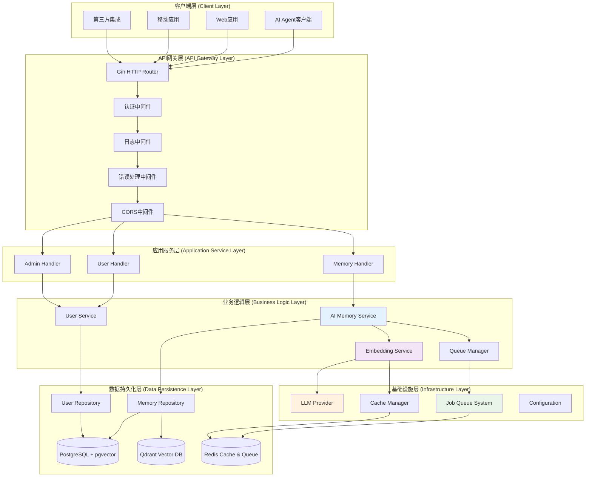

### 1.2 核心组件依赖关系

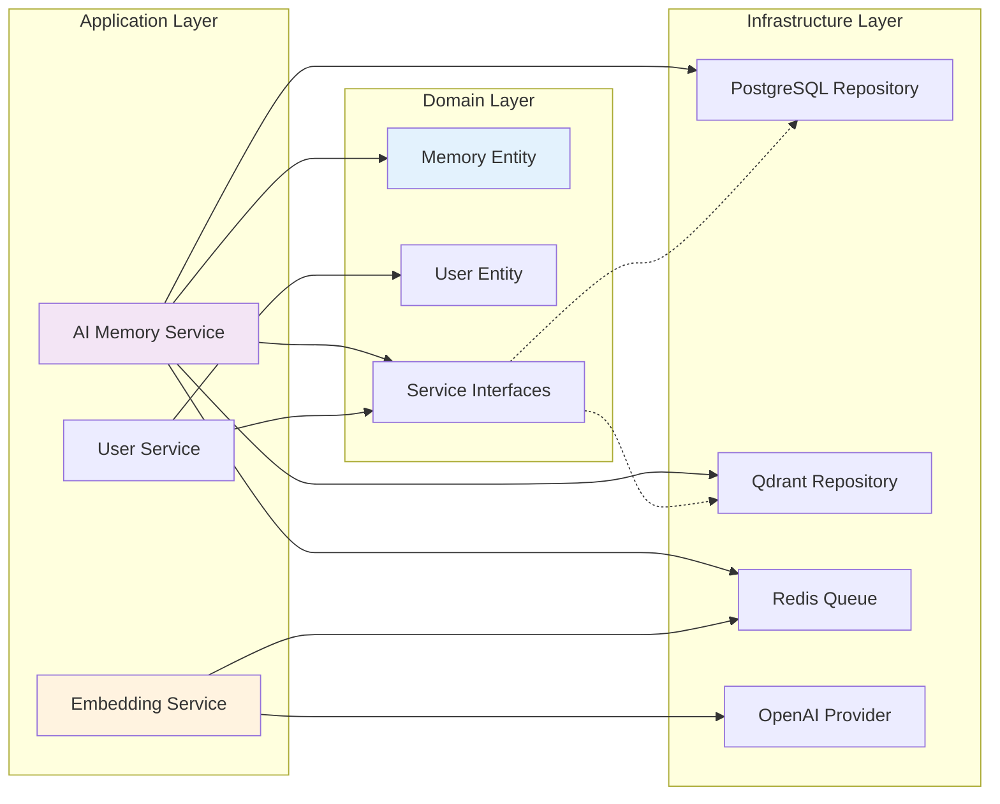

## 2. 核心工作流程图

### 2.1 记忆创建完整流程

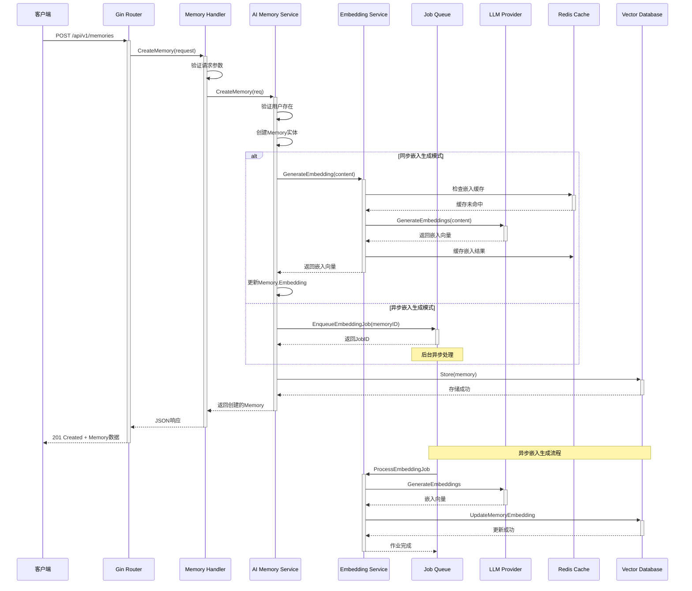

### 2.2 语义相似性搜索流程

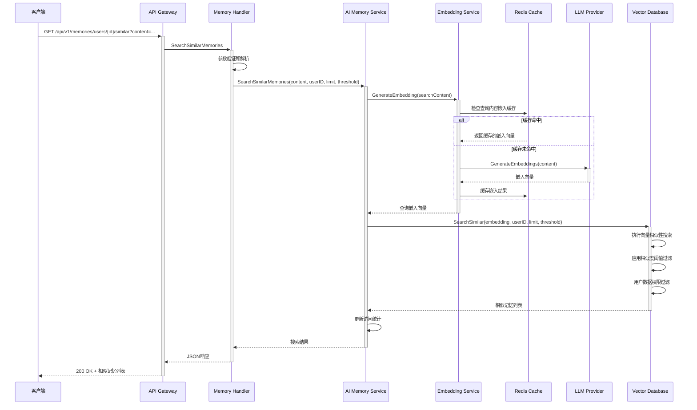

### 2.3 混合搜索算法流程

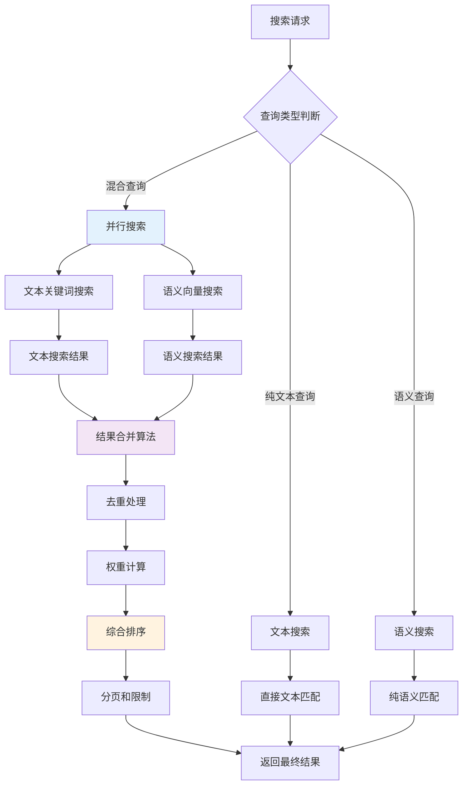

### 2.4 异步作业处理流程

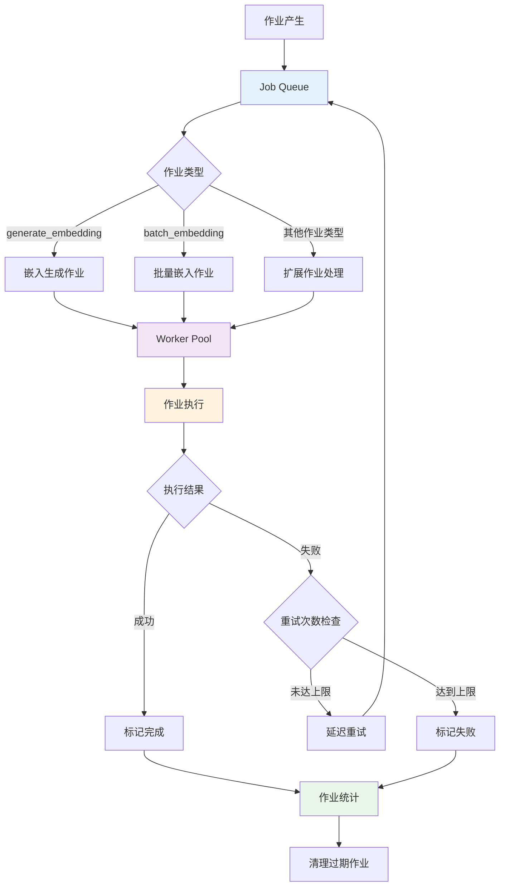

## 3. 数据流架构图

### 3.1 记忆数据生命周期

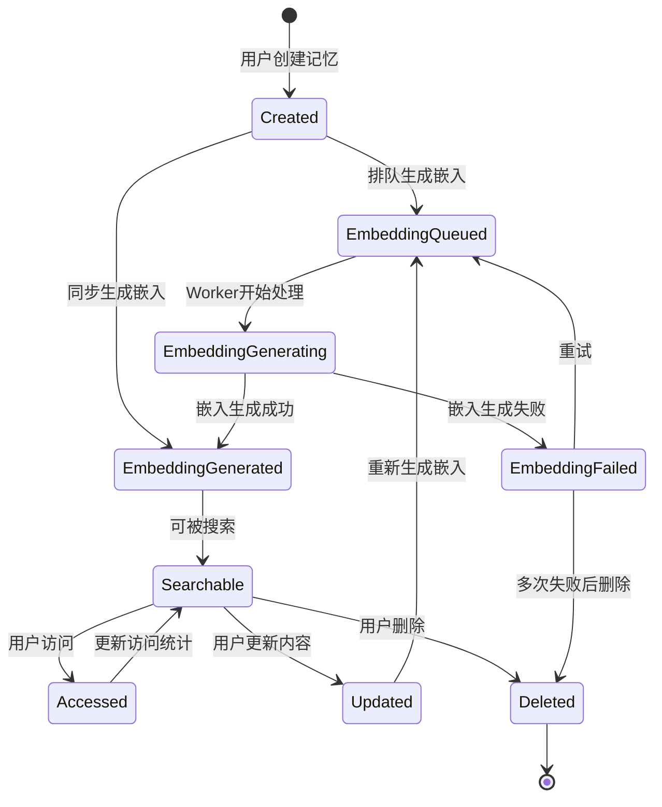

### 3.2 嵌入缓存策略

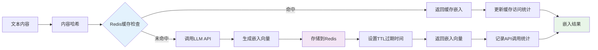

## 4. 系统交互序列图

### 4.1 用户认证和权限检查

```mermaid
sequenceDiagram
    participant Client as 客户端
    participant Gateway as API Gateway
    participant Auth as 认证中间件
    participant Handler as 业务处理器
    participant Service as 业务服务

    Client->>+Gateway: 请求 + API Key
    Gateway->>+Auth: 验证请求
    
    Auth->>Auth: 提取API Key
    Auth->>Auth: 验证API Key有效性
    
    alt API Key有效
        Auth->>Auth: 设置用户上下文
        Auth->>+Handler: 转发请求
        Handler->>+Service: 调用业务逻辑
        Service->>Service: 检查用户权限
        Service-->>-Handler: 业务结果
        Handler-->>-Auth: 处理结果
        Auth-->>-Gateway: 成功响应
    else API Key无效
        Auth-->>-Gateway: 401 Unauthorized
    end
    
    Gateway-->>-Client: 最终响应
```

### 4.2 错误处理和恢复流程

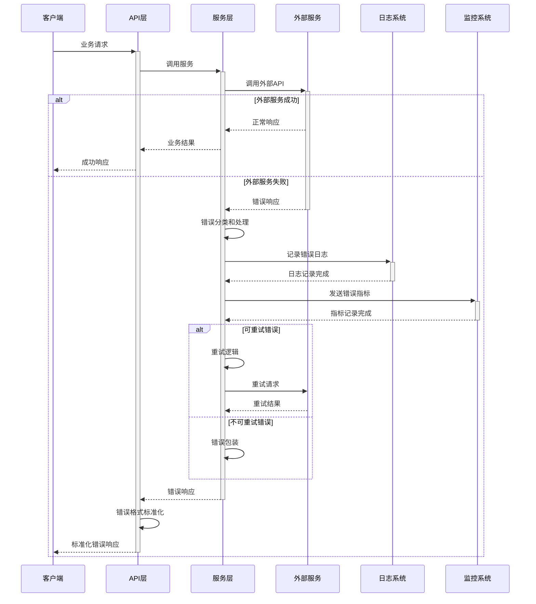

## 5. 配置和部署架构

### 5.1 配置管理流程

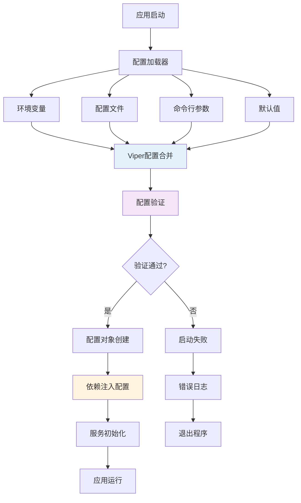

### 5.2 容器化部署架构

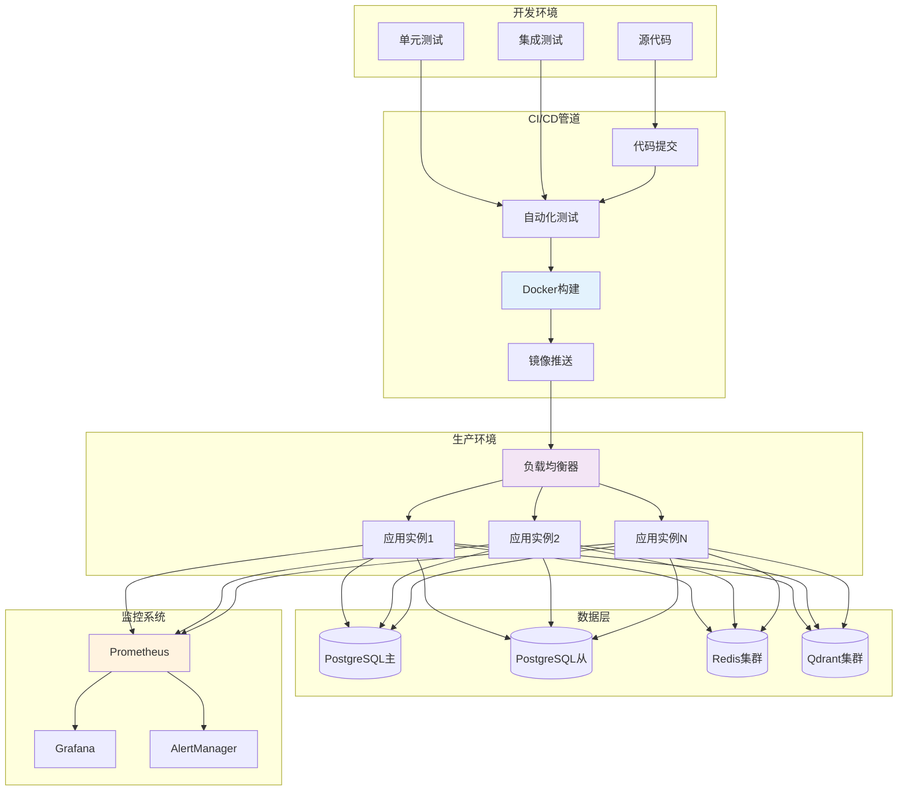

## 6. 性能监控架构

### 6.1 监控指标收集流程

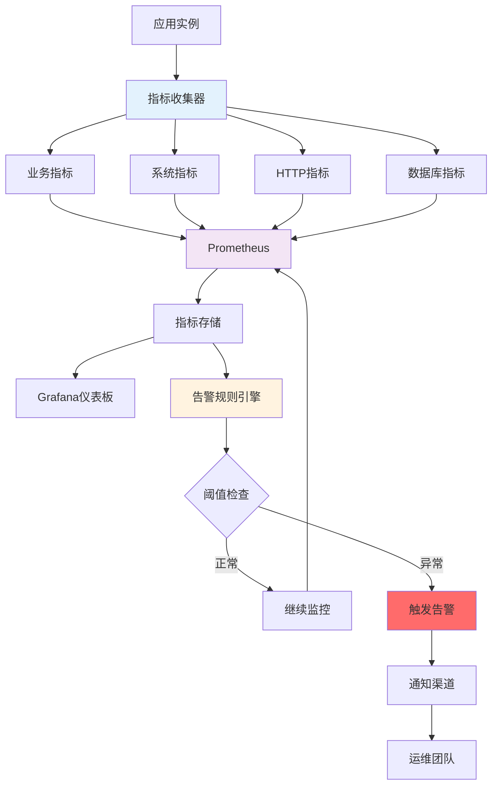

### 6.2 日志聚合架构

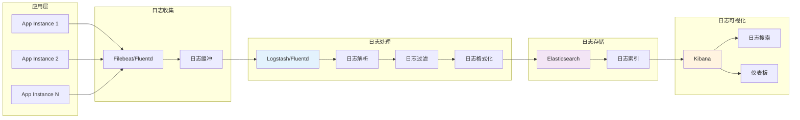

## 7. 数据库架构设计

### 7.1 PostgreSQL + pgvector架构

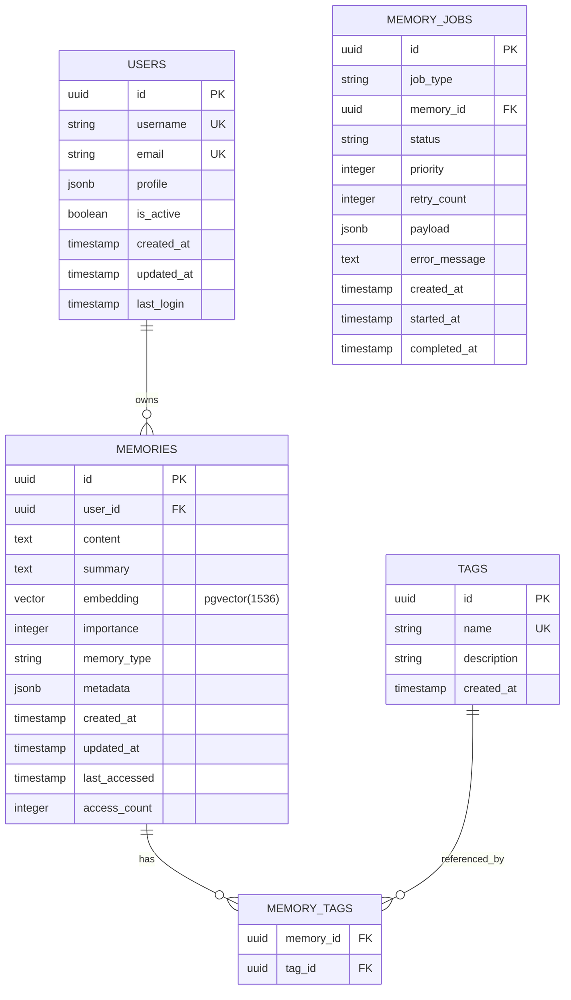

### 7.2 Qdrant向量数据库架构

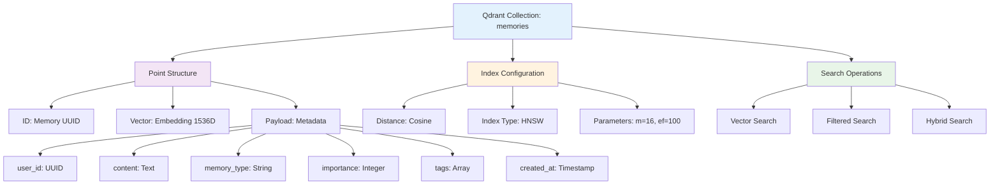

## 8. 总结

本文档详细展示了AI记忆银行系统的完整架构设计和核心工作流程。系统采用了现代化的微服务架构设计原则，实现了以下关键特性：

### 8.1 架构优势

1. **分层清晰**: 严格的Clean Architecture实现确保了各层职责明确
2. **可扩展性**: 接口驱动设计支持功能模块的独立扩展  
3. **高性能**: 异步处理和智能缓存策略优化系统性能
4. **可观测性**: 完整的监控、日志和告警体系
5. **容错性**: 多层错误处理和恢复机制

### 8.2 技术创新点

1. **智能嵌入管理**: 自动化的向量嵌入生成和缓存
2. **混合搜索算法**: 文本搜索与语义搜索的智能结合
3. **双数据库支持**: PostgreSQL + Qdrant的灵活切换
4. **异步作业系统**: Redis队列驱动的高并发处理

### 8.3 生产就绪特性

1. **配置管理**: 多源配置和环境变量支持
2. **容器化**: Docker多阶段构建和部署
3. **监控告警**: Prometheus + Grafana监控栈
4. **日志聚合**: 结构化日志和ELK栈集成
5. **安全认证**: API Key认证和权限控制

该系统已具备了企业级AI记忆服务的完整能力，可直接用于生产环境部署和大规模应用。

---

**文档维护者**: AI Architecture Team  
**最后更新**: 2025-08-26  
**相关文档**: [当前实现分析](./current-implementation-analysis.md)