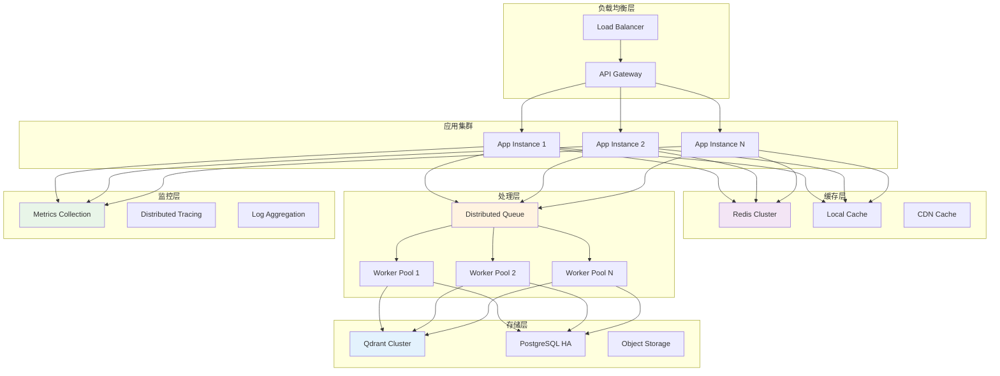
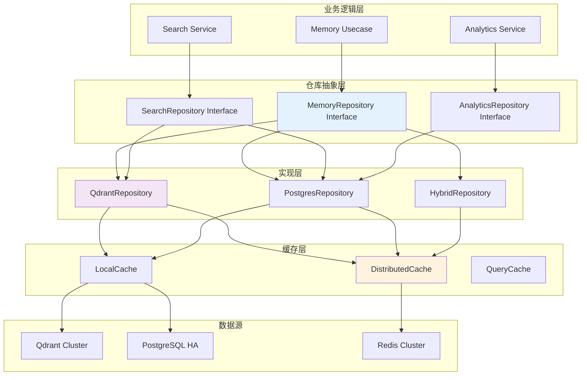
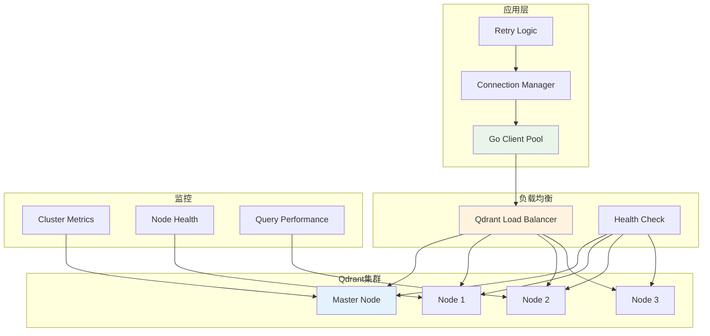
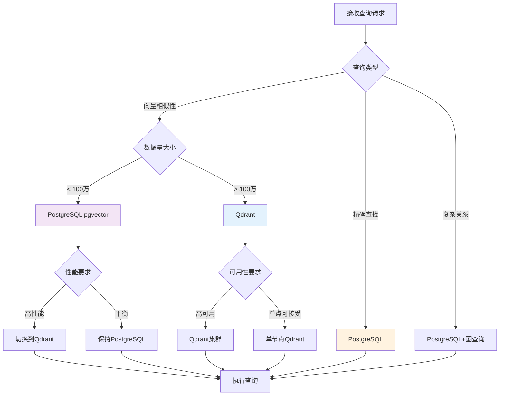
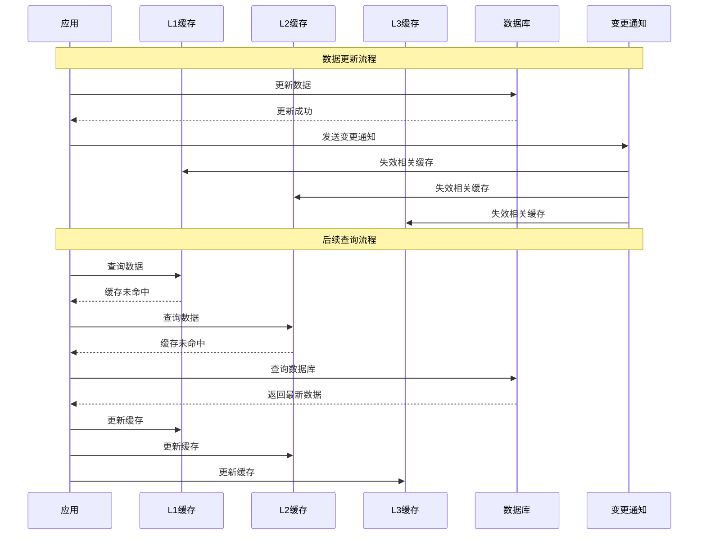
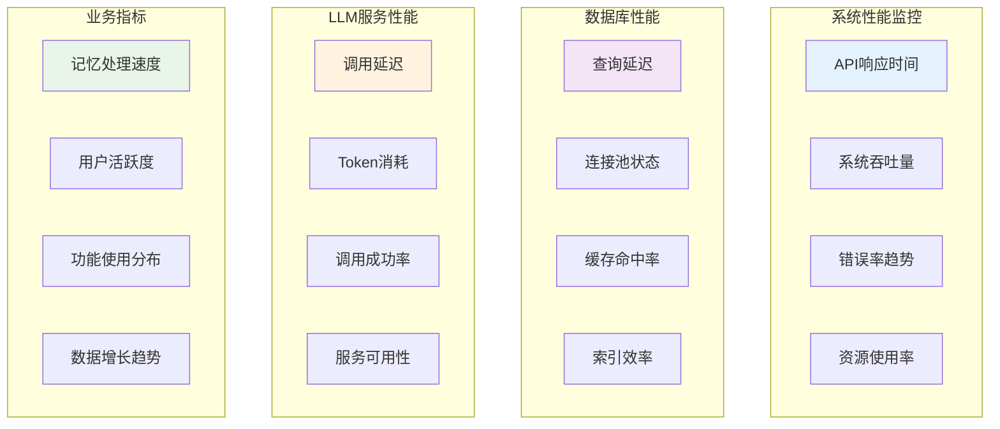
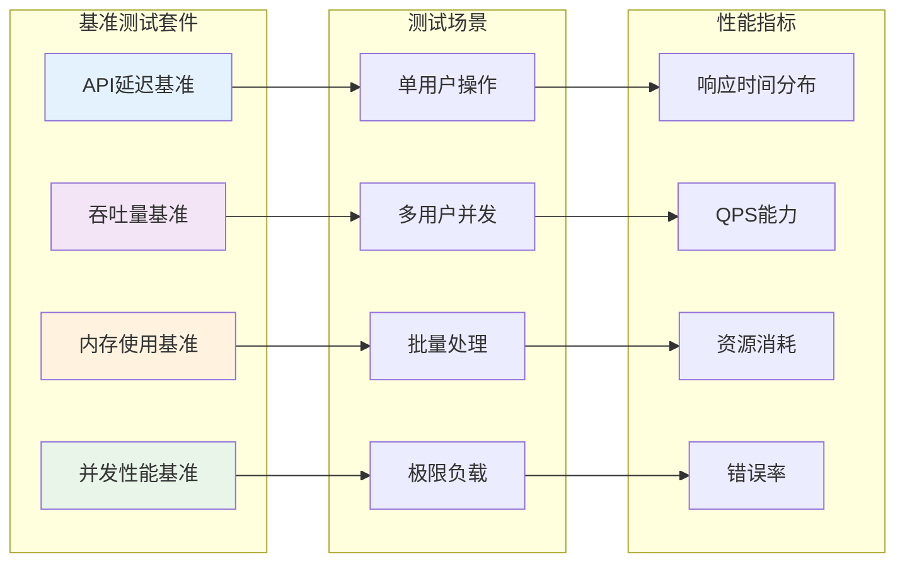
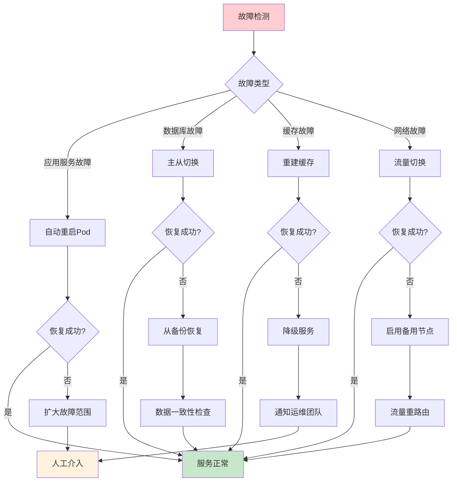

# RFC: AI记忆系统第三阶段高性能设计

**文档版本**: 1.0  
**创建日期**: 2025-08-17  
**作者**: AI记忆系统团队  
**状态**: 草案

## 1. 摘要

本文档描述AI记忆系统第三阶段高性能优化的详细设计。该阶段专注于系统的可扩展性和性能优化，引入多数据库支持、高级缓存策略、分布式处理能力和企业级性能优化。目标是构建能够支持大规模生产环境的高性能AI记忆系统。

## 2. 引言

### 2.1 目标

- 实现多数据库后端支持（Qdrant集成）
- 建立多层缓存架构
- 实现分布式处理能力
- 提供企业级性能和可扩展性
- 优化资源使用和成本效率

### 2.2 范围

第三阶段包含以下核心功能：
- Qdrant向量数据库集成
- 仓库抽象层完善
- Redis分布式缓存
- 并发处理优化
- 性能监控和调优
- 资源管理和限流

### 2.3 前置条件

- 第二阶段智能化功能已完成
- 异步处理管道正常运行
- LLM工具调用框架稳定
- 监控系统已部署

## 3. 系统架构

### 3.1 高性能架构概览



### 3.2 数据库抽象架构



## 4. 详细设计

### 4.1 Qdrant集成

#### 4.1.1 Qdrant仓库实现

```go
// QdrantRepository Qdrant存储库实现
type QdrantRepository struct {
    client      *qdrant.Client
    collection  string
    cache       DistributedCache
    metrics     *QdrantMetrics
    logger      *logrus.Logger
    config      QdrantConfig
}

// QdrantConfig Qdrant配置
type QdrantConfig struct {
    URL            string        `mapstructure:"url"`
    APIKey         string        `mapstructure:"api_key"`
    Collection     string        `mapstructure:"collection"`
    VectorSize     int           `mapstructure:"vector_size"`
    Distance       string        `mapstructure:"distance"` // Cosine, Dot, Euclid
    Timeout        time.Duration `mapstructure:"timeout"`
    MaxRetries     int           `mapstructure:"max_retries"`
    BatchSize      int           `mapstructure:"batch_size"`
    Quantization   QuantConfig   `mapstructure:"quantization"`
}

// QuantConfig 量化配置
type QuantConfig struct {
    Enabled     bool    `mapstructure:"enabled"`
    Type        string  `mapstructure:"type"`        // "scalar", "binary"
    Compression float64 `mapstructure:"compression"` // 压缩比例
}

// 初始化Qdrant连接
func NewQdrantRepository(config QdrantConfig, cache DistributedCache) (*QdrantRepository, error) {
    client, err := qdrant.NewClient(&qdrant.Config{
        Host:    config.URL,
        APIKey:  config.APIKey,
        Timeout: config.Timeout,
    })
    if err != nil {
        return nil, fmt.Errorf("failed to create Qdrant client: %w", err)
    }
    
    repo := &QdrantRepository{
        client:     client,
        collection: config.Collection,
        cache:      cache,
        config:     config,
        metrics:    NewQdrantMetrics(),
        logger:     logrus.WithField("component", "qdrant_repo"),
    }
    
    // 确保集合存在
    if err := repo.ensureCollection(); err != nil {
        return nil, fmt.Errorf("failed to ensure collection: %w", err)
    }
    
    return repo, nil
}

// ensureCollection 确保集合存在
func (qr *QdrantRepository) ensureCollection() error {
    exists, err := qr.client.CollectionExists(context.Background(), qr.collection)
    if err != nil {
        return fmt.Errorf("failed to check collection existence: %w", err)
    }
    
    if !exists {
        vectorConfig := &qdrant.VectorParams{
            Size:     uint64(qr.config.VectorSize),
            Distance: qr.parseDistance(qr.config.Distance),
        }
        
        if qr.config.Quantization.Enabled {
            vectorConfig.QuantizationConfig = qr.buildQuantizationConfig()
        }
        
        _, err = qr.client.CreateCollection(context.Background(), &qdrant.CreateCollection{
            CollectionName: qr.collection,
            VectorsConfig:  vectorConfig,
        })
        if err != nil {
            return fmt.Errorf("failed to create collection: %w", err)
        }
    }
    
    return nil
}
```

#### 4.1.2 高性能查询实现

```go
// FindSimilar 相似性搜索（带缓存）
func (qr *QdrantRepository) FindSimilar(ctx context.Context, userID string, embedding []float32, limit int) ([]*Memory, error) {
    timer := qr.metrics.QueryDuration.Start()
    defer timer.End()
    
    // 生成缓存键
    cacheKey := qr.generateCacheKey("similar", userID, embedding, limit)
    
    // 尝试从缓存获取
    if cached, err := qr.cache.Get(ctx, cacheKey); err == nil {
        var memories []*Memory
        if err := json.Unmarshal(cached, &memories); err == nil {
            qr.metrics.CacheHits.Inc()
            return memories, nil
        }
    }
    qr.metrics.CacheMisses.Inc()
    
    // 构建查询请求
    searchRequest := &qdrant.SearchPoints{
        CollectionName: qr.collection,
        Vector:         embedding,
        Limit:          uint64(limit),
        WithPayload:    true,
        WithVector:     false,
        Params: &qdrant.SearchParams{
            HnswEf:        128, // 调优参数
            ExactSearch:   false,
        },
        Filter: &qdrant.Filter{
            Must: []*qdrant.Condition{
                {
                    Field: &qdrant.FieldCondition{
                        Key: "user_id",
                        Match: &qdrant.Match{
                            Value: userID,
                        },
                    },
                },
            },
        },
    }
    
    // 执行查询
    result, err := qr.client.Search(ctx, searchRequest)
    if err != nil {
        qr.metrics.QueryErrors.Inc()
        return nil, fmt.Errorf("Qdrant search failed: %w", err)
    }
    
    // 转换结果
    memories := make([]*Memory, 0, len(result))
    for _, point := range result {
        memory, err := qr.pointToMemory(point)
        if err != nil {
            qr.logger.WithError(err).Warn("Failed to convert point to memory")
            continue
        }
        memories = append(memories, memory)
    }
    
    // 缓存结果
    if data, err := json.Marshal(memories); err == nil {
        qr.cache.Set(ctx, cacheKey, data, 5*time.Minute)
    }
    
    qr.metrics.QueriesProcessed.Inc()
    return memories, nil
}

// BatchSave 批量保存（优化性能）
func (qr *QdrantRepository) BatchSave(ctx context.Context, memories []*Memory) error {
    if len(memories) == 0 {
        return nil
    }
    
    timer := qr.metrics.BatchSaveDuration.Start()
    defer timer.End()
    
    // 分批处理
    batchSize := qr.config.BatchSize
    if batchSize == 0 {
        batchSize = 100
    }
    
    for i := 0; i < len(memories); i += batchSize {
        end := i + batchSize
        if end > len(memories) {
            end = len(memories)
        }
        
        batch := memories[i:end]
        if err := qr.saveBatch(ctx, batch); err != nil {
            return fmt.Errorf("failed to save batch %d-%d: %w", i, end, err)
        }
    }
    
    qr.metrics.MemoriesSaved.Add(float64(len(memories)))
    return nil
}

// saveBatch 保存单个批次
func (qr *QdrantRepository) saveBatch(ctx context.Context, memories []*Memory) error {
    points := make([]*qdrant.PointStruct, 0, len(memories))
    
    for _, memory := range memories {
        point, err := qr.memoryToPoint(memory)
        if err != nil {
            return fmt.Errorf("failed to convert memory to point: %w", err)
        }
        points = append(points, point)
    }
    
    upsertRequest := &qdrant.UpsertPoints{
        CollectionName: qr.collection,
        Points:         points,
        Wait:           true,
    }
    
    _, err := qr.client.Upsert(ctx, upsertRequest)
    if err != nil {
        qr.metrics.BatchSaveErrors.Inc()
        return fmt.Errorf("Qdrant upsert failed: %w", err)
    }
    
    return nil
}
```

#### 4.1.3 Qdrant集群架构



### 4.2 仓库抽象层完善

#### 4.2.1 策略模式实现

```go
// RepositoryFactory 仓库工厂
type RepositoryFactory struct {
    configs map[string]interface{}
    cache   DistributedCache
    logger  *logrus.Logger
}

// CreateMemoryRepository 创建记忆仓库
func (rf *RepositoryFactory) CreateMemoryRepository(dbType string) (MemoryRepository, error) {
    switch dbType {
    case "qdrant":
        config, ok := rf.configs["qdrant"].(QdrantConfig)
        if !ok {
            return nil, fmt.Errorf("invalid Qdrant configuration")
        }
        return NewQdrantRepository(config, rf.cache)
        
    case "postgres":
        config, ok := rf.configs["postgres"].(PostgresConfig)
        if !ok {
            return nil, fmt.Errorf("invalid PostgreSQL configuration")
        }
        return NewPostgresRepository(config, rf.cache)
        
    case "hybrid":
        return rf.createHybridRepository()
        
    default:
        return nil, fmt.Errorf("unsupported database type: %s", dbType)
    }
}

// HybridRepository 混合仓库（组合多个后端）
type HybridRepository struct {
    primary   MemoryRepository // 主存储（如Qdrant）
    secondary MemoryRepository // 辅助存储（如PostgreSQL）
    config    HybridConfig
    logger    *logrus.Logger
}

// HybridConfig 混合仓库配置
type HybridConfig struct {
    PrimaryType    string  `mapstructure:"primary_type"`
    SecondaryType  string  `mapstructure:"secondary_type"`
    WriteStrategy  string  `mapstructure:"write_strategy"`  // "primary_only", "both", "async_both"
    ReadStrategy   string  `mapstructure:"read_strategy"`   // "primary_first", "fastest", "both"
    ConsistencyLevel string `mapstructure:"consistency_level"` // "eventual", "strong"
}

// Save 混合存储保存
func (hr *HybridRepository) Save(ctx context.Context, memory *Memory) error {
    switch hr.config.WriteStrategy {
    case "primary_only":
        return hr.primary.Save(ctx, memory)
        
    case "both":
        return hr.saveToBoth(ctx, memory)
        
    case "async_both":
        // 同步写主存储
        if err := hr.primary.Save(ctx, memory); err != nil {
            return err
        }
        
        // 异步写辅助存储
        go func() {
            if err := hr.secondary.Save(context.Background(), memory); err != nil {
                hr.logger.WithError(err).Error("Failed to save to secondary storage")
            }
        }()
        
        return nil
        
    default:
        return fmt.Errorf("unknown write strategy: %s", hr.config.WriteStrategy)
    }
}

// FindSimilar 混合存储查询
func (hr *HybridRepository) FindSimilar(ctx context.Context, userID string, embedding []float32, limit int) ([]*Memory, error) {
    switch hr.config.ReadStrategy {
    case "primary_first":
        result, err := hr.primary.FindSimilar(ctx, userID, embedding, limit)
        if err != nil {
            hr.logger.WithError(err).Warn("Primary storage failed, falling back to secondary")
            return hr.secondary.FindSimilar(ctx, userID, embedding, limit)
        }
        return result, nil
        
    case "fastest":
        return hr.findSimilarFastest(ctx, userID, embedding, limit)
        
    case "both":
        return hr.findSimilarBoth(ctx, userID, embedding, limit)
        
    default:
        return hr.primary.FindSimilar(ctx, userID, embedding, limit)
    }
}

// findSimilarFastest 竞争查询，返回最快的结果
func (hr *HybridRepository) findSimilarFastest(ctx context.Context, userID string, embedding []float32, limit int) ([]*Memory, error) {
    type result struct {
        memories []*Memory
        source   string
        err      error
    }
    
    resultChan := make(chan result, 2)
    
    // 并发查询两个存储
    go func() {
        memories, err := hr.primary.FindSimilar(ctx, userID, embedding, limit)
        resultChan <- result{memories, "primary", err}
    }()
    
    go func() {
        memories, err := hr.secondary.FindSimilar(ctx, userID, embedding, limit)
        resultChan <- result{memories, "secondary", err}
    }()
    
    // 返回第一个成功的结果
    for i := 0; i < 2; i++ {
        select {
        case res := <-resultChan:
            if res.err == nil {
                hr.logger.WithField("source", res.source).Debug("Query completed")
                return res.memories, nil
            }
        case <-ctx.Done():
            return nil, ctx.Err()
        }
    }
    
    return nil, fmt.Errorf("all storage backends failed")
}
```

#### 4.2.2 数据库选择决策流程



### 4.3 分布式缓存系统

#### 4.3.1 多层缓存架构

```go
// MultiLevelCache 多层缓存
type MultiLevelCache struct {
    l1Cache    LocalCache      // L1: 进程内缓存
    l2Cache    DistributedCache // L2: Redis分布式缓存
    l3Cache    PersistentCache  // L3: 持久化缓存
    policies   CachePolicies
    metrics    *CacheMetrics
    logger     *logrus.Logger
}

// CachePolicies 缓存策略
type CachePolicies struct {
    L1TTL        time.Duration `mapstructure:"l1_ttl"`
    L2TTL        time.Duration `mapstructure:"l2_ttl"`
    L3TTL        time.Duration `mapstructure:"l3_ttl"`
    MaxL1Size    int           `mapstructure:"max_l1_size"`
    EvictionPolicy string      `mapstructure:"eviction_policy"` // LRU, LFU, FIFO
    WarmupStrategy string      `mapstructure:"warmup_strategy"` // eager, lazy, scheduled
}

// Get 多层缓存获取
func (mlc *MultiLevelCache) Get(ctx context.Context, key string) ([]byte, error) {
    start := time.Now()
    defer func() {
        mlc.metrics.GetDuration.Observe(time.Since(start).Seconds())
    }()
    
    // L1缓存查找
    if data, found := mlc.l1Cache.Get(key); found {
        mlc.metrics.L1Hits.Inc()
        return data, nil
    }
    mlc.metrics.L1Misses.Inc()
    
    // L2缓存查找
    data, err := mlc.l2Cache.Get(ctx, key)
    if err == nil {
        mlc.metrics.L2Hits.Inc()
        // 异步预热L1缓存
        go mlc.l1Cache.Set(key, data, mlc.policies.L1TTL)
        return data, nil
    }
    mlc.metrics.L2Misses.Inc()
    
    // L3缓存查找
    data, err = mlc.l3Cache.Get(ctx, key)
    if err == nil {
        mlc.metrics.L3Hits.Inc()
        // 异步预热L1和L2缓存
        go func() {
            mlc.l1Cache.Set(key, data, mlc.policies.L1TTL)
            mlc.l2Cache.Set(ctx, key, data, mlc.policies.L2TTL)
        }()
        return data, nil
    }
    mlc.metrics.L3Misses.Inc()
    
    return nil, ErrCacheMiss
}

// Set 多层缓存设置
func (mlc *MultiLevelCache) Set(ctx context.Context, key string, data []byte, ttl time.Duration) error {
    start := time.Now()
    defer func() {
        mlc.metrics.SetDuration.Observe(time.Since(start).Seconds())
    }()
    
    var wg sync.WaitGroup
    errors := make(chan error, 3)
    
    // 并发写入所有缓存层
    wg.Add(3)
    
    // L1缓存
    go func() {
        defer wg.Done()
        mlc.l1Cache.Set(key, data, min(ttl, mlc.policies.L1TTL))
    }()
    
    // L2缓存
    go func() {
        defer wg.Done()
        if err := mlc.l2Cache.Set(ctx, key, data, min(ttl, mlc.policies.L2TTL)); err != nil {
            errors <- fmt.Errorf("L2 cache set failed: %w", err)
        }
    }()
    
    // L3缓存
    go func() {
        defer wg.Done()
        if err := mlc.l3Cache.Set(ctx, key, data, min(ttl, mlc.policies.L3TTL)); err != nil {
            errors <- fmt.Errorf("L3 cache set failed: %w", err)
        }
    }()
    
    wg.Wait()
    close(errors)
    
    // 收集错误
    for err := range errors {
        mlc.logger.WithError(err).Warn("Cache layer set failed")
    }
    
    return nil
}
```

#### 4.3.2 缓存预热策略

```go
// CacheWarmer 缓存预热器
type CacheWarmer struct {
    cache      MultiLevelCache
    repository MemoryRepository
    scheduler  *gocron.Scheduler
    policies   WarmupPolicies
    logger     *logrus.Logger
}

// WarmupPolicies 预热策略
type WarmupPolicies struct {
    Enabled         bool          `mapstructure:"enabled"`
    Strategy        string        `mapstructure:"strategy"`
    Schedule        string        `mapstructure:"schedule"`
    BatchSize       int           `mapstructure:"batch_size"`
    PopularQueries  []QueryPattern `mapstructure:"popular_queries"`
    UserSampling    float64       `mapstructure:"user_sampling"`
}

// QueryPattern 查询模式
type QueryPattern struct {
    Type        string    `json:"type"`         // "similar", "user_memories"
    Parameters  QueryParams `json:"parameters"`
    Frequency   int       `json:"frequency"`    // 查询频率
    Priority    int       `json:"priority"`     // 优先级
}

// WarmupPopularQueries 预热热门查询
func (cw *CacheWarmer) WarmupPopularQueries(ctx context.Context) error {
    cw.logger.Info("Starting cache warmup for popular queries")
    
    for _, pattern := range cw.policies.PopularQueries {
        if err := cw.warmupQueryPattern(ctx, pattern); err != nil {
            cw.logger.WithError(err).WithField("pattern", pattern.Type).Error("Failed to warmup query pattern")
            continue
        }
    }
    
    cw.logger.Info("Cache warmup completed")
    return nil
}

// warmupQueryPattern 预热查询模式
func (cw *CacheWarmer) warmupQueryPattern(ctx context.Context, pattern QueryPattern) error {
    switch pattern.Type {
    case "similar":
        return cw.warmupSimilarQueries(ctx, pattern.Parameters)
    case "user_memories":
        return cw.warmupUserMemories(ctx, pattern.Parameters)
    default:
        return fmt.Errorf("unknown query pattern: %s", pattern.Type)
    }
}

// warmupSimilarQueries 预热相似查询
func (cw *CacheWarmer) warmupSimilarQueries(ctx context.Context, params QueryParams) error {
    // 获取热门查询向量
    popularEmbeddings := cw.getPopularEmbeddings(ctx)
    
    for _, embedding := range popularEmbeddings {
        // 预执行查询并缓存结果
        _, err := cw.repository.FindSimilar(ctx, params.UserID, embedding, params.Limit)
        if err != nil {
            cw.logger.WithError(err).Warn("Failed to warmup similar query")
            continue
        }
        
        // 避免过载
        time.Sleep(10 * time.Millisecond)
    }
    
    return nil
}
```

#### 4.3.3 缓存一致性管理



### 4.4 性能优化

#### 4.4.1 并发处理优化

```go
// ConcurrentProcessor 并发处理器
type ConcurrentProcessor struct {
    workerPools  map[string]*WorkerPool
    loadBalancer LoadBalancer
    rateLimiter  RateLimiter
    metrics      *ProcessorMetrics
    config       ConcurrencyConfig
}

// ConcurrencyConfig 并发配置
type ConcurrencyConfig struct {
    MaxWorkers     int           `mapstructure:"max_workers"`
    MaxConcurrent  int           `mapstructure:"max_concurrent"`
    QueueSize      int           `mapstructure:"queue_size"`
    BatchTimeout   time.Duration `mapstructure:"batch_timeout"`
    AdaptiveScaling bool          `mapstructure:"adaptive_scaling"`
    LoadThreshold   float64       `mapstructure:"load_threshold"`
}

// ProcessWithConcurrency 并发处理
func (cp *ConcurrentProcessor) ProcessWithConcurrency(ctx context.Context, jobs []MemoryJob) error {
    // 限流检查
    if !cp.rateLimiter.Allow() {
        return ErrRateLimitExceeded
    }
    
    // 分组作业
    jobGroups := cp.groupJobsByType(jobs)
    
    var wg sync.WaitGroup
    errorChan := make(chan error, len(jobGroups))
    
    // 并发处理不同类型的作业
    for jobType, jobGroup := range jobGroups {
        wg.Add(1)
        go func(jt string, jg []MemoryJob) {
            defer wg.Done()
            
            pool, exists := cp.workerPools[jt]
            if !exists {
                errorChan <- fmt.Errorf("no worker pool for job type: %s", jt)
                return
            }
            
            if err := cp.processJobGroup(ctx, pool, jg); err != nil {
                errorChan <- fmt.Errorf("failed to process %s jobs: %w", jt, err)
            }
        }(jobType, jobGroup)
    }
    
    wg.Wait()
    close(errorChan)
    
    // 收集错误
    var errors []error
    for err := range errorChan {
        errors = append(errors, err)
    }
    
    if len(errors) > 0 {
        return fmt.Errorf("processing errors: %v", errors)
    }
    
    return nil
}

// AdaptiveScaling 自适应扩缩容
func (cp *ConcurrentProcessor) AdaptiveScaling(ctx context.Context) {
    if !cp.config.AdaptiveScaling {
        return
    }
    
    ticker := time.NewTicker(30 * time.Second)
    defer ticker.Stop()
    
    for {
        select {
        case <-ctx.Done():
            return
        case <-ticker.C:
            cp.adjustWorkerPools()
        }
    }
}

// adjustWorkerPools 调整工作池大小
func (cp *ConcurrentProcessor) adjustWorkerPools() {
    for poolType, pool := range cp.workerPools {
        metrics := pool.GetMetrics()
        
        // 计算负载
        load := float64(metrics.ActiveWorkers) / float64(metrics.TotalWorkers)
        queueLoad := float64(metrics.QueueLength) / float64(pool.QueueCapacity())
        
        // 决定扩缩容
        if load > cp.config.LoadThreshold || queueLoad > 0.8 {
            // 扩容
            newSize := int(float64(metrics.TotalWorkers) * 1.5)
            if newSize <= cp.config.MaxWorkers {
                pool.ScaleTo(newSize)
                cp.metrics.ScaleUpEvents.WithLabelValues(poolType).Inc()
            }
        } else if load < 0.3 && queueLoad < 0.2 {
            // 缩容
            newSize := int(float64(metrics.TotalWorkers) * 0.7)
            if newSize >= 1 {
                pool.ScaleTo(newSize)
                cp.metrics.ScaleDownEvents.WithLabelValues(poolType).Inc()
            }
        }
    }
}
```

#### 4.4.2 批量处理优化

```go
// BatchProcessor 批量处理器
type BatchProcessor struct {
    batchSize    int
    timeout      time.Duration
    processor    func([]MemoryJob) error
    buffer       []MemoryJob
    timer        *time.Timer
    mutex        sync.Mutex
    metrics      *BatchMetrics
}

// Add 添加到批次
func (bp *BatchProcessor) Add(job MemoryJob) error {
    bp.mutex.Lock()
    defer bp.mutex.Unlock()
    
    bp.buffer = append(bp.buffer, job)
    
    // 检查是否达到批次大小
    if len(bp.buffer) >= bp.batchSize {
        return bp.flushBatch()
    }
    
    // 设置超时定时器
    if bp.timer == nil {
        bp.timer = time.AfterFunc(bp.timeout, func() {
            bp.mutex.Lock()
            defer bp.mutex.Unlock()
            bp.flushBatch()
        })
    }
    
    return nil
}

// flushBatch 刷新批次
func (bp *BatchProcessor) flushBatch() error {
    if len(bp.buffer) == 0 {
        return nil
    }
    
    batch := make([]MemoryJob, len(bp.buffer))
    copy(batch, bp.buffer)
    bp.buffer = bp.buffer[:0]
    
    if bp.timer != nil {
        bp.timer.Stop()
        bp.timer = nil
    }
    
    start := time.Now()
    err := bp.processor(batch)
    duration := time.Since(start)
    
    bp.metrics.BatchSize.Observe(float64(len(batch)))
    bp.metrics.BatchDuration.Observe(duration.Seconds())
    
    if err != nil {
        bp.metrics.BatchErrors.Inc()
        return err
    }
    
    bp.metrics.BatchesProcessed.Inc()
    return nil
}
```

#### 4.4.3 资源管理和限流

```go
// ResourceManager 资源管理器
type ResourceManager struct {
    cpuLimiter    *CPULimiter
    memoryLimiter *MemoryLimiter
    connLimiter   *ConnectionLimiter
    rateLimiter   *RateLimiter
    metrics       *ResourceMetrics
    config        ResourceConfig
}

// ResourceConfig 资源配置
type ResourceConfig struct {
    MaxCPUPercent    float64 `mapstructure:"max_cpu_percent"`
    MaxMemoryBytes   int64   `mapstructure:"max_memory_bytes"`
    MaxConnections   int     `mapstructure:"max_connections"`
    RateLimit        int     `mapstructure:"rate_limit"`
    BurstLimit       int     `mapstructure:"burst_limit"`
    MonitorInterval  time.Duration `mapstructure:"monitor_interval"`
}

// Monitor 资源监控
func (rm *ResourceManager) Monitor(ctx context.Context) {
    ticker := time.NewTicker(rm.config.MonitorInterval)
    defer ticker.Stop()
    
    for {
        select {
        case <-ctx.Done():
            return
        case <-ticker.C:
            rm.checkResourceUsage()
        }
    }
}

// checkResourceUsage 检查资源使用情况
func (rm *ResourceManager) checkResourceUsage() {
    // CPU使用率
    cpuPercent := rm.getCurrentCPUUsage()
    rm.metrics.CPUUsage.Set(cpuPercent)
    
    if cpuPercent > rm.config.MaxCPUPercent {
        rm.cpuLimiter.Throttle()
        rm.metrics.ThrottleEvents.WithLabelValues("cpu").Inc()
    }
    
    // 内存使用量
    memUsage := rm.getCurrentMemoryUsage()
    rm.metrics.MemoryUsage.Set(float64(memUsage))
    
    if memUsage > rm.config.MaxMemoryBytes {
        rm.memoryLimiter.Limit()
        rm.metrics.ThrottleEvents.WithLabelValues("memory").Inc()
    }
    
    // 连接数
    connCount := rm.getCurrentConnectionCount()
    rm.metrics.ConnectionCount.Set(float64(connCount))
    
    if connCount > rm.config.MaxConnections {
        rm.connLimiter.Block()
        rm.metrics.ThrottleEvents.WithLabelValues("connection").Inc()
    }
}

// AcquireResources 获取资源
func (rm *ResourceManager) AcquireResources(ctx context.Context, req ResourceRequest) (*ResourceHandle, error) {
    // 检查限流
    if !rm.rateLimiter.Allow() {
        return nil, ErrRateLimitExceeded
    }
    
    // 检查CPU
    if !rm.cpuLimiter.CanAcquire(req.CPUUnits) {
        return nil, ErrCPULimitExceeded
    }
    
    // 检查内存
    if !rm.memoryLimiter.CanAcquire(req.MemoryBytes) {
        return nil, ErrMemoryLimitExceeded
    }
    
    // 检查连接
    if !rm.connLimiter.CanAcquire(req.Connections) {
        return nil, ErrConnectionLimitExceeded
    }
    
    // 分配资源
    handle := &ResourceHandle{
        id:        uuid.New().String(),
        cpuUnits:  req.CPUUnits,
        memory:    req.MemoryBytes,
        conns:     req.Connections,
        manager:   rm,
        acquiredAt: time.Now(),
    }
    
    rm.cpuLimiter.Acquire(req.CPUUnits)
    rm.memoryLimiter.Acquire(req.MemoryBytes)
    rm.connLimiter.Acquire(req.Connections)
    
    rm.metrics.ResourcesAcquired.Inc()
    return handle, nil
}
```

## 5. 性能监控与调优

### 5.1 性能指标体系

#### 5.1.1 关键性能指标(KPI)

```go
// PerformanceMetrics 性能指标
type PerformanceMetrics struct {
    // 吞吐量指标
    RequestsPerSecond   prometheus.Gauge
    MemoriesPerSecond   prometheus.Gauge
    QueriesPerSecond    prometheus.Gauge
    
    // 延迟指标
    APILatency          prometheus.Histogram
    DatabaseLatency     prometheus.Histogram
    LLMLatency          prometheus.Histogram
    CacheLatency        prometheus.Histogram
    
    // 资源使用指标
    CPUUtilization      prometheus.Gauge
    MemoryUtilization   prometheus.Gauge
    DiskUtilization     prometheus.Gauge
    NetworkUtilization  prometheus.Gauge
    
    // 错误率指标
    ErrorRate           prometheus.Gauge
    TimeoutRate         prometheus.Gauge
    FailureRate         prometheus.Gauge
    
    // 容量指标
    ActiveConnections   prometheus.Gauge
    QueueDepth          prometheus.Gauge
    CacheHitRate        prometheus.Gauge
    DatabaseConnections prometheus.Gauge
}

// SLI Service Level Indicators
type SLI struct {
    Availability  float64 // 可用性 (99.9%)
    Latency99     float64 // 99%延迟 (<100ms)
    Latency95     float64 // 95%延迟 (<50ms)
    ErrorRate     float64 // 错误率 (<0.1%)
    Throughput    float64 // 吞吐量 (>1000 RPS)
}
```

#### 5.1.2 性能监控仪表板



### 5.2 自动化调优

#### 5.2.1 智能参数调优

```go
// AutoTuner 自动调优器
type AutoTuner struct {
    config       TuningConfig
    metrics      MetricsCollector
    optimizer    ParameterOptimizer
    history      []TuningSession
    logger       *logrus.Logger
}

// TuningConfig 调优配置
type TuningConfig struct {
    Enabled          bool          `mapstructure:"enabled"`
    TuningInterval   time.Duration `mapstructure:"tuning_interval"`
    StabilityPeriod  time.Duration `mapstructure:"stability_period"`
    MaxAdjustmentPct float64       `mapstructure:"max_adjustment_pct"`
    Parameters       []TuningParameter `mapstructure:"parameters"`
}

// TuningParameter 可调优参数
type TuningParameter struct {
    Name        string  `json:"name"`
    CurrentValue float64 `json:"current_value"`
    MinValue    float64 `json:"min_value"`
    MaxValue    float64 `json:"max_value"`
    StepSize    float64 `json:"step_size"`
    Impact      string  `json:"impact"` // "latency", "throughput", "memory"
}

// Tune 执行调优
func (at *AutoTuner) Tune(ctx context.Context) error {
    if !at.config.Enabled {
        return nil
    }
    
    // 收集当前性能指标
    currentMetrics := at.metrics.Collect()
    
    // 分析性能瓶颈
    bottlenecks := at.identifyBottlenecks(currentMetrics)
    
    if len(bottlenecks) == 0 {
        at.logger.Info("No performance bottlenecks detected")
        return nil
    }
    
    // 生成调优建议
    recommendations := at.generateRecommendations(bottlenecks, currentMetrics)
    
    // 执行调优
    session := &TuningSession{
        ID:              uuid.New().String(),
        StartTime:       time.Now(),
        InitialMetrics:  currentMetrics,
        Bottlenecks:     bottlenecks,
        Recommendations: recommendations,
    }
    
    at.logger.WithField("session_id", session.ID).Info("Starting tuning session")
    
    for _, rec := range recommendations {
        if err := at.applyRecommendation(ctx, rec); err != nil {
            at.logger.WithError(err).Error("Failed to apply recommendation")
            continue
        }
        
        // 等待稳定
        time.Sleep(at.config.StabilityPeriod)
        
        // 检查改善情况
        newMetrics := at.metrics.Collect()
        if at.isImproved(currentMetrics, newMetrics, rec.TargetMetric) {
            at.logger.Info("Performance improved", "recommendation", rec.Description)
            session.AppliedRecommendations = append(session.AppliedRecommendations, rec)
        } else {
            // 回滚
            at.rollbackRecommendation(ctx, rec)
            at.logger.Warn("Performance not improved, rolling back", "recommendation", rec.Description)
        }
    }
    
    session.EndTime = time.Now()
    session.FinalMetrics = at.metrics.Collect()
    at.history = append(at.history, *session)
    
    return nil
}

// identifyBottlenecks 识别性能瓶颈
func (at *AutoTuner) identifyBottlenecks(metrics PerformanceMetrics) []Bottleneck {
    var bottlenecks []Bottleneck
    
    // CPU瓶颈
    if metrics.CPUUtilization > 80 {
        bottlenecks = append(bottlenecks, Bottleneck{
            Type:        "cpu",
            Severity:    "high",
            Description: "High CPU utilization",
            Value:       metrics.CPUUtilization,
        })
    }
    
    // 内存瓶颈
    if metrics.MemoryUtilization > 85 {
        bottlenecks = append(bottlenecks, Bottleneck{
            Type:        "memory",
            Severity:    "high",
            Description: "High memory utilization",
            Value:       metrics.MemoryUtilization,
        })
    }
    
    // 延迟瓶颈
    if metrics.APILatency.P99 > 200 { // 200ms
        bottlenecks = append(bottlenecks, Bottleneck{
            Type:        "latency",
            Severity:    "medium",
            Description: "High API latency",
            Value:       metrics.APILatency.P99,
        })
    }
    
    // 缓存效率
    if metrics.CacheHitRate < 0.8 {
        bottlenecks = append(bottlenecks, Bottleneck{
            Type:        "cache",
            Severity:    "medium",
            Description: "Low cache hit rate",
            Value:       metrics.CacheHitRate,
        })
    }
    
    return bottlenecks
}
```

#### 5.2.2 负载预测与容量规划

```go
// CapacityPlanner 容量规划器
type CapacityPlanner struct {
    predictor    LoadPredictor
    analyzer     TrendAnalyzer
    forecaster   CapacityForecaster
    config       PlanningConfig
    logger       *logrus.Logger
}

// PlanningConfig 规划配置
type PlanningConfig struct {
    ForecastHorizon   time.Duration `mapstructure:"forecast_horizon"`   // 预测周期
    GrowthBuffer      float64       `mapstructure:"growth_buffer"`      // 增长缓冲
    SeasonalityFactor float64       `mapstructure:"seasonality_factor"` // 季节性因子
    ConfidenceLevel   float64       `mapstructure:"confidence_level"`   // 置信度
}

// PlanCapacity 容量规划
func (cp *CapacityPlanner) PlanCapacity(ctx context.Context) (*CapacityPlan, error) {
    // 收集历史数据
    historicalData := cp.analyzer.CollectHistoricalData(30 * 24 * time.Hour) // 30天
    
    // 趋势分析
    trends := cp.analyzer.AnalyzeTrends(historicalData)
    
    // 负载预测
    forecast := cp.predictor.PredictLoad(historicalData, cp.config.ForecastHorizon)
    
    // 容量需求分析
    requirements := cp.forecaster.ForecastRequirements(forecast, trends)
    
    // 生成容量计划
    plan := &CapacityPlan{
        PlanID:          uuid.New().String(),
        CreatedAt:       time.Now(),
        ForecastPeriod:  cp.config.ForecastHorizon,
        CurrentCapacity: cp.getCurrentCapacity(),
        ForecastLoad:    forecast,
        Requirements:    requirements,
        Recommendations: cp.generateCapacityRecommendations(requirements),
        Confidence:      cp.config.ConfidenceLevel,
    }
    
    return plan, nil
}

// generateCapacityRecommendations 生成容量建议
func (cp *CapacityPlanner) generateCapacityRecommendations(req CapacityRequirements) []CapacityRecommendation {
    var recommendations []CapacityRecommendation
    
    // CPU扩容建议
    if req.CPUDemand > req.CurrentCPU*0.8 {
        recommendations = append(recommendations, CapacityRecommendation{
            Type:        "scale_cpu",
            Priority:    "high",
            Description: fmt.Sprintf("Increase CPU capacity from %.1f to %.1f cores", req.CurrentCPU, req.CPUDemand*1.2),
            Impact:      "Prevents CPU bottlenecks during peak load",
            Timeline:    "1-2 weeks",
            Cost:        cp.estimateCPUCost(req.CPUDemand*1.2 - req.CurrentCPU),
        })
    }
    
    // 内存扩容建议
    if req.MemoryDemand > req.CurrentMemory*0.8 {
        recommendations = append(recommendations, CapacityRecommendation{
            Type:        "scale_memory",
            Priority:    "high",
            Description: fmt.Sprintf("Increase memory from %.1fGB to %.1fGB", req.CurrentMemory/1024/1024/1024, req.MemoryDemand*1.2/1024/1024/1024),
            Impact:      "Improves cache performance and reduces GC pressure",
            Timeline:    "1 week",
            Cost:        cp.estimateMemoryCost(req.MemoryDemand*1.2 - req.CurrentMemory),
        })
    }
    
    // 存储扩容建议
    if req.StorageDemand > req.CurrentStorage*0.85 {
        recommendations = append(recommendations, CapacityRecommendation{
            Type:        "scale_storage",
            Priority:    "medium",
            Description: fmt.Sprintf("Increase storage from %.1fTB to %.1fTB", req.CurrentStorage/1024/1024/1024/1024, req.StorageDemand*1.3/1024/1024/1024/1024),
            Impact:      "Ensures sufficient space for memory growth",
            Timeline:    "2-3 weeks",
            Cost:        cp.estimateStorageCost(req.StorageDemand*1.3 - req.CurrentStorage),
        })
    }
    
    return recommendations
}
```

### 5.3 压力测试与基准测试

#### 5.3.1 负载测试框架

```go
// LoadTester 负载测试器
type LoadTester struct {
    client     APIClient
    config     LoadTestConfig
    metrics    *LoadTestMetrics
    logger     *logrus.Logger
}

// LoadTestConfig 负载测试配置
type LoadTestConfig struct {
    TestDuration    time.Duration `mapstructure:"test_duration"`
    RampUpPeriod    time.Duration `mapstructure:"ramp_up_period"`
    MaxConcurrency  int           `mapstructure:"max_concurrency"`
    RequestRate     int           `mapstructure:"request_rate"`
    TestScenarios   []TestScenario `mapstructure:"test_scenarios"`
}

// TestScenario 测试场景
type TestScenario struct {
    Name        string  `json:"name"`
    Weight      float64 `json:"weight"`      // 场景权重
    Endpoint    string  `json:"endpoint"`
    Method      string  `json:"method"`
    PayloadSize int     `json:"payload_size"`
    Frequency   int     `json:"frequency"`   // 执行频率
}

// RunLoadTest 运行负载测试
func (lt *LoadTester) RunLoadTest(ctx context.Context) (*LoadTestResult, error) {
    lt.logger.Info("Starting load test", "duration", lt.config.TestDuration)
    
    // 初始化指标
    result := &LoadTestResult{
        TestID:    uuid.New().String(),
        StartTime: time.Now(),
        Config:    lt.config,
    }
    
    // 创建工作器
    workerCount := lt.config.MaxConcurrency
    workers := make([]*LoadWorker, workerCount)
    
    for i := 0; i < workerCount; i++ {
        workers[i] = &LoadWorker{
            ID:       i,
            Client:   lt.client,
            Metrics:  lt.metrics,
            Scenarios: lt.config.TestScenarios,
        }
    }
    
    // 开始压力测试
    var wg sync.WaitGroup
    testCtx, cancel := context.WithTimeout(ctx, lt.config.TestDuration)
    defer cancel()
    
    // 渐进式加载
    rampUpStep := lt.config.RampUpPeriod / time.Duration(workerCount)
    
    for i, worker := range workers {
        wg.Add(1)
        go func(w *LoadWorker, delay time.Duration) {
            defer wg.Done()
            
            // 错开启动时间
            time.Sleep(delay)
            w.Run(testCtx)
        }(worker, time.Duration(i)*rampUpStep)
    }
    
    // 监控测试进度
    go lt.monitorProgress(testCtx, result)
    
    wg.Wait()
    
    result.EndTime = time.Now()
    result.TotalDuration = result.EndTime.Sub(result.StartTime)
    result.Metrics = lt.metrics.GetSummary()
    
    lt.logger.Info("Load test completed", "duration", result.TotalDuration, "requests", result.Metrics.TotalRequests)
    
    return result, nil
}

// LoadWorker 负载工作器
type LoadWorker struct {
    ID        int
    Client    APIClient
    Metrics   *LoadTestMetrics
    Scenarios []TestScenario
}

// Run 运行工作器
func (lw *LoadWorker) Run(ctx context.Context) {
    scenarioSelector := NewWeightedSelector(lw.Scenarios)
    
    for {
        select {
        case <-ctx.Done():
            return
        default:
            scenario := scenarioSelector.Select()
            lw.executeScenario(ctx, scenario)
            
            // 控制请求频率
            interval := time.Second / time.Duration(scenario.Frequency)
            time.Sleep(interval)
        }
    }
}

// executeScenario 执行测试场景
func (lw *LoadWorker) executeScenario(ctx context.Context, scenario TestScenario) {
    start := time.Now()
    
    req := &APIRequest{
        Method:   scenario.Method,
        Endpoint: scenario.Endpoint,
        Payload:  generatePayload(scenario.PayloadSize),
    }
    
    resp, err := lw.Client.Execute(ctx, req)
    duration := time.Since(start)
    
    // 记录指标
    lw.Metrics.RecordRequest(scenario.Name, duration, err)
    
    if err != nil {
        lw.Metrics.RecordError(scenario.Name, err)
        return
    }
    
    if resp.StatusCode >= 400 {
        lw.Metrics.RecordHTTPError(scenario.Name, resp.StatusCode)
    }
}
```

#### 5.3.2 性能基准测试



## 6. 部署与运维

### 6.1 高可用部署

#### 6.1.1 容器编排

```yaml
# docker-compose.production.yml
version: '3.8'

services:
  # 应用服务集群
  app-1:
    image: mem-bank:latest
    environment:
      - DB_DRIVER=qdrant
      - QDRANT_URL=qdrant-cluster:6333
      - REDIS_URL=redis-cluster:6379
      - INSTANCE_ID=app-1
    deploy:
      replicas: 3
      resources:
        limits:
          cpus: '2'
          memory: 4G
        reservations:
          cpus: '1'
          memory: 2G
    healthcheck:
      test: ["CMD", "curl", "-f", "http://localhost:8080/health"]
      interval: 30s
      timeout: 10s
      retries: 3
    networks:
      - app-network
      
  # Qdrant集群
  qdrant-master:
    image: qdrant/qdrant:latest
    environment:
      - QDRANT__CLUSTER__ENABLED=true
      - QDRANT__CLUSTER__P2P__PORT=6335
      - QDRANT__CLUSTER__CONSENSUS__TICK_PERIOD_MS=100
    volumes:
      - qdrant-master-data:/qdrant/storage
    networks:
      - storage-network
      
  qdrant-node-1:
    image: qdrant/qdrant:latest
    environment:
      - QDRANT__CLUSTER__ENABLED=true
      - QDRANT__CLUSTER__P2P__PORT=6335
      - QDRANT__CLUSTER__CONSENSUS__BOOTSTRAP_PEER=qdrant-master:6335
    volumes:
      - qdrant-node1-data:/qdrant/storage
    networks:
      - storage-network
      
  # Redis集群
  redis-master:
    image: redis:7-alpine
    command: redis-server --port 6379 --cluster-enabled yes --cluster-config-file nodes.conf
    volumes:
      - redis-master-data:/data
    networks:
      - cache-network
      
  # 负载均衡器
  nginx:
    image: nginx:alpine
    ports:
      - "80:80"
      - "443:443"
    volumes:
      - ./nginx.conf:/etc/nginx/nginx.conf
      - ./ssl:/etc/nginx/ssl
    depends_on:
      - app-1
    networks:
      - app-network

networks:
  app-network:
    driver: overlay
  storage-network:
    driver: overlay
  cache-network:
    driver: overlay

volumes:
  qdrant-master-data:
  qdrant-node1-data:
  redis-master-data:
```

#### 6.1.2 Kubernetes部署

```yaml
# k8s-deployment.yml
apiVersion: apps/v1
kind: Deployment
metadata:
  name: mem-bank-app
  labels:
    app: mem-bank
spec:
  replicas: 5
  selector:
    matchLabels:
      app: mem-bank
  template:
    metadata:
      labels:
        app: mem-bank
    spec:
      containers:
      - name: mem-bank
        image: mem-bank:v3.0.0
        ports:
        - containerPort: 8080
        env:
        - name: DB_DRIVER
          value: "qdrant"
        - name: QDRANT_URL
          valueFrom:
            configMapKeyRef:
              name: mem-bank-config
              key: qdrant_url
        - name: REDIS_URL
          valueFrom:
            secretKeyRef:
              name: mem-bank-secrets
              key: redis_url
        resources:
          requests:
            memory: "2Gi"
            cpu: "1000m"
          limits:
            memory: "4Gi"
            cpu: "2000m"
        livenessProbe:
          httpGet:
            path: /health
            port: 8080
          initialDelaySeconds: 30
          periodSeconds: 10
        readinessProbe:
          httpGet:
            path: /ready
            port: 8080
          initialDelaySeconds: 5
          periodSeconds: 5
---
apiVersion: v1
kind: Service
metadata:
  name: mem-bank-service
spec:
  selector:
    app: mem-bank
  ports:
  - port: 80
    targetPort: 8080
  type: LoadBalancer
---
apiVersion: autoscaling/v2
kind: HorizontalPodAutoscaler
metadata:
  name: mem-bank-hpa
spec:
  scaleTargetRef:
    apiVersion: apps/v1
    kind: Deployment
    name: mem-bank-app
  minReplicas: 3
  maxReplicas: 20
  metrics:
  - type: Resource
    resource:
      name: cpu
      target:
        type: Utilization
        averageUtilization: 70
  - type: Resource
    resource:
      name: memory
      target:
        type: Utilization
        averageUtilization: 80
```

### 6.2 灾难恢复

#### 6.2.1 备份策略

```go
// BackupManager 备份管理器
type BackupManager struct {
    config     BackupConfig
    storage    BackupStorage
    scheduler  *gocron.Scheduler
    notifier   NotificationService
    logger     *logrus.Logger
}

// BackupConfig 备份配置
type BackupConfig struct {
    Enabled          bool          `mapstructure:"enabled"`
    Schedule         string        `mapstructure:"schedule"`        // cron表达式
    RetentionDays    int           `mapstructure:"retention_days"`
    BackupTypes      []string      `mapstructure:"backup_types"`    // "qdrant", "postgres", "redis"
    CompressionLevel int           `mapstructure:"compression_level"`
    EncryptionKey    string        `mapstructure:"encryption_key"`
    StorageType      string        `mapstructure:"storage_type"`    // "s3", "gcs", "local"
}

// StartScheduledBackups 启动计划备份
func (bm *BackupManager) StartScheduledBackups() error {
    if !bm.config.Enabled {
        bm.logger.Info("Backup is disabled")
        return nil
    }
    
    bm.scheduler = gocron.NewScheduler(time.UTC)
    
    _, err := bm.scheduler.Cron(bm.config.Schedule).Do(func() {
        if err := bm.PerformBackup(); err != nil {
            bm.logger.WithError(err).Error("Scheduled backup failed")
            bm.notifier.SendAlert("backup_failed", err.Error())
        }
    })
    
    if err != nil {
        return fmt.Errorf("failed to schedule backup: %w", err)
    }
    
    bm.scheduler.StartAsync()
    bm.logger.Info("Scheduled backups started", "schedule", bm.config.Schedule)
    
    return nil
}

// PerformBackup 执行备份
func (bm *BackupManager) PerformBackup() error {
    backupID := fmt.Sprintf("backup_%s", time.Now().Format("20060102_150405"))
    bm.logger.Info("Starting backup", "backup_id", backupID)
    
    backup := &BackupSession{
        ID:        backupID,
        StartTime: time.Now(),
        Types:     bm.config.BackupTypes,
        Status:    "running",
    }
    
    var errors []error
    
    for _, backupType := range bm.config.BackupTypes {
        switch backupType {
        case "qdrant":
            if err := bm.backupQdrant(backup); err != nil {
                errors = append(errors, fmt.Errorf("Qdrant backup failed: %w", err))
            }
        case "postgres":
            if err := bm.backupPostgres(backup); err != nil {
                errors = append(errors, fmt.Errorf("PostgreSQL backup failed: %w", err))
            }
        case "redis":
            if err := bm.backupRedis(backup); err != nil {
                errors = append(errors, fmt.Errorf("Redis backup failed: %w", err))
            }
        }
    }
    
    backup.EndTime = time.Now()
    backup.Duration = backup.EndTime.Sub(backup.StartTime)
    
    if len(errors) > 0 {
        backup.Status = "failed"
        backup.Errors = errors
        return fmt.Errorf("backup completed with errors: %v", errors)
    }
    
    backup.Status = "completed"
    
    // 清理过期备份
    if err := bm.cleanupOldBackups(); err != nil {
        bm.logger.WithError(err).Warn("Failed to cleanup old backups")
    }
    
    bm.logger.Info("Backup completed successfully", "backup_id", backupID, "duration", backup.Duration)
    return nil
}
```

#### 6.2.2 故障恢复流程



## 7. 安全加固

### 7.1 数据安全

#### 7.1.1 加密策略

```go
// EncryptionManager 加密管理器
type EncryptionManager struct {
    config     EncryptionConfig
    keyManager KeyManager
    logger     *logrus.Logger
}

// EncryptionConfig 加密配置
type EncryptionConfig struct {
    Enabled              bool   `mapstructure:"enabled"`
    Algorithm            string `mapstructure:"algorithm"`            // AES-256-GCM
    KeyRotationInterval  time.Duration `mapstructure:"key_rotation_interval"`
    AtRestEncryption     bool   `mapstructure:"at_rest_encryption"`    // 静态加密
    InTransitEncryption  bool   `mapstructure:"in_transit_encryption"` // 传输加密
    FieldLevelEncryption bool   `mapstructure:"field_level_encryption"` // 字段级加密
}

// EncryptMemory 加密记忆内容
func (em *EncryptionManager) EncryptMemory(memory *Memory) error {
    if !em.config.Enabled {
        return nil
    }
    
    // 获取当前加密密钥
    key, err := em.keyManager.GetCurrentKey()
    if err != nil {
        return fmt.Errorf("failed to get encryption key: %w", err)
    }
    
    // 加密敏感字段
    if em.config.FieldLevelEncryption {
        // 加密内容
        encryptedContent, err := em.encryptField(memory.Content, key)
        if err != nil {
            return fmt.Errorf("failed to encrypt content: %w", err)
        }
        memory.Content = encryptedContent
        
        // 加密元数据中的敏感信息
        if sensitiveData, exists := memory.Metadata["sensitive"]; exists {
            encryptedData, err := em.encryptField(fmt.Sprintf("%v", sensitiveData), key)
            if err != nil {
                return fmt.Errorf("failed to encrypt metadata: %w", err)
            }
            memory.Metadata["sensitive"] = encryptedData
        }
    }
    
    return nil
}

// DecryptMemory 解密记忆内容
func (em *EncryptionManager) DecryptMemory(memory *Memory) error {
    if !em.config.Enabled {
        return nil
    }
    
    keyID := em.extractKeyID(memory.Content)
    key, err := em.keyManager.GetKey(keyID)
    if err != nil {
        return fmt.Errorf("failed to get decryption key: %w", err)
    }
    
    // 解密内容
    decryptedContent, err := em.decryptField(memory.Content, key)
    if err != nil {
        return fmt.Errorf("failed to decrypt content: %w", err)
    }
    memory.Content = decryptedContent
    
    return nil
}
```

#### 7.1.2 访问控制

```go
// AccessController 访问控制器
type AccessController struct {
    rbac       RBACManager
    audit      AuditLogger
    rateLimit  RateLimiter
    config     AccessConfig
}

// AccessConfig 访问配置
type AccessConfig struct {
    EnableRBAC       bool          `mapstructure:"enable_rbac"`
    EnableAudit      bool          `mapstructure:"enable_audit"`
    SessionTimeout   time.Duration `mapstructure:"session_timeout"`
    MaxFailedAttempts int          `mapstructure:"max_failed_attempts"`
    LockoutDuration  time.Duration `mapstructure:"lockout_duration"`
}

// CheckPermission 检查权限
func (ac *AccessController) CheckPermission(ctx context.Context, userID string, resource string, action string) error {
    // 检查用户是否被锁定
    if ac.isUserLocked(userID) {
        ac.audit.LogAccessDenied(userID, resource, action, "user_locked")
        return ErrUserLocked
    }
    
    // 检查速率限制
    if !ac.rateLimit.Allow(userID) {
        ac.audit.LogAccessDenied(userID, resource, action, "rate_limited")
        return ErrRateLimitExceeded
    }
    
    // RBAC权限检查
    if ac.config.EnableRBAC {
        allowed, err := ac.rbac.CheckPermission(userID, resource, action)
        if err != nil {
            ac.audit.LogAccessError(userID, resource, action, err)
            return fmt.Errorf("permission check failed: %w", err)
        }
        
        if !allowed {
            ac.audit.LogAccessDenied(userID, resource, action, "insufficient_permissions")
            return ErrPermissionDenied
        }
    }
    
    // 记录成功访问
    ac.audit.LogAccessGranted(userID, resource, action)
    return nil
}

// Permission 权限定义
type Permission struct {
    Resource string `json:"resource"` // "memories", "users", "admin"
    Action   string `json:"action"`   // "read", "write", "delete", "admin"
    Scope    string `json:"scope"`    // "own", "team", "all"
}

// Role 角色定义
type Role struct {
    Name        string       `json:"name"`
    Permissions []Permission `json:"permissions"`
    Description string       `json:"description"`
}

// 预定义角色
var DefaultRoles = []Role{
    {
        Name: "user",
        Permissions: []Permission{
            {"memories", "read", "own"},
            {"memories", "write", "own"},
            {"memories", "delete", "own"},
        },
        Description: "Regular user with access to own memories",
    },
    {
        Name: "admin",
        Permissions: []Permission{
            {"memories", "read", "all"},
            {"memories", "write", "all"},
            {"memories", "delete", "all"},
            {"users", "read", "all"},
            {"users", "write", "all"},
            {"admin", "read", "all"},
            {"admin", "write", "all"},
        },
        Description: "Administrator with full access",
    },
}
```

### 7.2 网络安全

#### 7.2.1 TLS配置

```yaml
# nginx-security.conf
server {
    listen 443 ssl http2;
    server_name api.membank.com;
    
    # TLS配置
    ssl_certificate /etc/nginx/ssl/cert.pem;
    ssl_certificate_key /etc/nginx/ssl/key.pem;
    ssl_protocols TLSv1.2 TLSv1.3;
    ssl_ciphers ECDHE-RSA-AES256-GCM-SHA512:DHE-RSA-AES256-GCM-SHA512:ECDHE-RSA-AES256-GCM-SHA384;
    ssl_prefer_server_ciphers off;
    ssl_session_cache shared:SSL:10m;
    ssl_session_timeout 10m;
    
    # 安全头
    add_header Strict-Transport-Security "max-age=31536000; includeSubDomains" always;
    add_header X-Frame-Options DENY always;
    add_header X-Content-Type-Options nosniff always;
    add_header X-XSS-Protection "1; mode=block" always;
    add_header Referrer-Policy "strict-origin-when-cross-origin" always;
    
    # 限流
    limit_req zone=api burst=20 nodelay;
    limit_req_status 429;
    
    # WAF规则
    location / {
        # 过滤恶意请求
        if ($request_method !~ ^(GET|POST|PUT|DELETE|OPTIONS)$ ) {
            return 405;
        }
        
        # 请求大小限制
        client_max_body_size 10M;
        
        # 代理到应用
        proxy_pass http://backend;
        proxy_set_header Host $host;
        proxy_set_header X-Real-IP $remote_addr;
        proxy_set_header X-Forwarded-For $proxy_add_x_forwarded_for;
        proxy_set_header X-Forwarded-Proto $scheme;
        
        # 超时设置
        proxy_connect_timeout 5s;
        proxy_send_timeout 60s;
        proxy_read_timeout 60s;
    }
}

# 限流配置
http {
    limit_req_zone $binary_remote_addr zone=api:10m rate=10r/s;
    limit_req_zone $binary_remote_addr zone=auth:10m rate=1r/s;
}
```

## 8. 总结

第三阶段高性能设计将AI记忆系统提升到企业级生产水平，主要成果包括：

### 8.1 核心成就
- **多数据库支持**: 完整的Qdrant集成和仓库抽象层
- **高性能缓存**: 多层缓存架构和智能预热策略
- **分布式处理**: 可扩展的并发处理和负载均衡
- **企业级安全**: 全面的加密、访问控制和网络安全

### 8.2 性能提升
- **查询性能**: 通过Qdrant和多层缓存实现毫秒级响应
- **并发能力**: 支持数千并发用户和请求
- **扩展性**: 水平扩展能力支持大规模部署
- **可靠性**: 99.9%+的服务可用性

### 8.3 运维能力
- **自动化监控**: 全面的性能指标和告警系统
- **智能调优**: 自适应参数优化和容量规划
- **灾难恢复**: 完整的备份恢复和故障处理流程
- **安全加固**: 企业级安全防护和合规支持

第三阶段完成后，系统具备了支撑大规模生产环境的能力，为第四阶段的完整生产就绪做好准备。

---
**文档状态**: 草案  
**下次评审**: 2025-08-24  
**相关文档**: [第二阶段智能化设计](./stage2-intelligent-design.md), [第四阶段生产就绪设计](./stage4-production-ready-design.md)