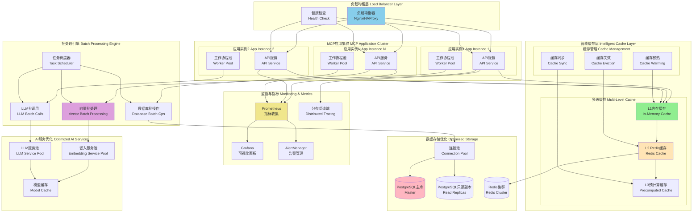

# Stage 3: 性能优化设计方案

## 阶段目标

Stage 3专注于将智能记忆处理系统优化到生产级性能标准。在Stage 2实现的智能记忆引擎基础上，通过并发处理优化、智能缓存体系、批处理机制和全面的性能监控，将系统性能提升至可支持大规模用户和高并发场景的水平。

### 核心功能范围

1. **并发处理优化**：Go协程池、通道管道、锁优化
2. **智能缓存体系**：多级缓存、缓存预热、失效策略
3. **批处理引擎**：向量批处理、LLM批调用、数据库批操作
4. **性能监控系统**：指标收集、性能分析、告警机制
5. **负载测试与调优**：压力测试、性能瓶颈识别、系统调优

## 性能优化架构设计

### Stage 3架构图



## 并发处理优化

### 协程池设计

```go
// internal/pool/worker_pool.go (新文件)
package pool

import (
    "context"
    "runtime"
    "sync"
    "time"
    "log"
)

type WorkerPool struct {
    workerCount    int
    jobQueue       chan Job
    workerQueue    chan chan Job
    workers        []*Worker
    quit           chan struct{}
    wg             sync.WaitGroup
    metrics        *PoolMetrics
}

type Job interface {
    Execute(ctx context.Context) error
    GetID() string
    GetPriority() int
}

type Worker struct {
    id          int
    jobChannel  chan Job
    workerQueue chan chan Job
    quit        chan struct{}
    metrics     *WorkerMetrics
}

type PoolMetrics struct {
    mu                sync.RWMutex
    jobsProcessed     int64
    jobsInProgress    int64
    jobsFailed        int64
    avgProcessingTime time.Duration
    maxProcessingTime time.Duration
    queueSize         int64
}

type WorkerMetrics struct {
    mu            sync.RWMutex
    jobsProcessed int64
    totalTime     time.Duration
    lastActive    time.Time
}

func NewWorkerPool(workerCount int, queueSize int) *WorkerPool {
    if workerCount <= 0 {
        workerCount = runtime.NumCPU() * 2
    }
    
    if queueSize <= 0 {
        queueSize = workerCount * 100
    }
    
    pool := &WorkerPool{
        workerCount: workerCount,
        jobQueue:    make(chan Job, queueSize),
        workerQueue: make(chan chan Job, workerCount),
        quit:        make(chan struct{}),
        metrics:     &PoolMetrics{},
    }
    
    pool.startWorkers()
    return pool
}

func (p *WorkerPool) startWorkers() {
    p.workers = make([]*Worker, p.workerCount)
    
    for i := 0; i < p.workerCount; i++ {
        worker := &Worker{
            id:          i,
            jobChannel:  make(chan Job),
            workerQueue: p.workerQueue,
            quit:        make(chan struct{}),
            metrics:     &WorkerMetrics{},
        }
        p.workers[i] = worker
        worker.start()
    }
    
    go p.dispatch()
    log.Printf("Started worker pool with %d workers", p.workerCount)
}

func (p *WorkerPool) dispatch() {
    for {
        select {
        case job := <-p.jobQueue:
            go func() {
                worker := <-p.workerQueue
                worker <- job
            }()
        case <-p.quit:
            return
        }
    }
}

func (w *Worker) start() {
    go func() {
        for {
            // 将工作者添加到可用队列
            w.workerQueue <- w.jobChannel
            
            select {
            case job := <-w.jobChannel:
                w.processJob(job)
            case <-w.quit:
                return
            }
        }
    }()
}

func (w *Worker) processJob(job Job) {
    startTime := time.Now()
    w.metrics.mu.Lock()
    w.metrics.lastActive = startTime
    w.metrics.mu.Unlock()
    
    ctx, cancel := context.WithTimeout(context.Background(), 30*time.Second)
    defer cancel()
    
    if err := job.Execute(ctx); err != nil {
        log.Printf("Worker %d: Job %s failed: %v", w.id, job.GetID(), err)
    }
    
    duration := time.Since(startTime)
    
    w.metrics.mu.Lock()
    w.metrics.jobsProcessed++
    w.metrics.totalTime += duration
    w.metrics.mu.Unlock()
}

func (p *WorkerPool) Submit(job Job) error {
    select {
    case p.jobQueue <- job:
        p.metrics.mu.Lock()
        p.metrics.queueSize++
        p.metrics.mu.Unlock()
        return nil
    default:
        return ErrQueueFull
    }
}

func (p *WorkerPool) SubmitWithTimeout(job Job, timeout time.Duration) error {
    select {
    case p.jobQueue <- job:
        p.metrics.mu.Lock()
        p.metrics.queueSize++
        p.metrics.mu.Unlock()
        return nil
    case <-time.After(timeout):
        return ErrSubmissionTimeout
    }
}

func (p *WorkerPool) Shutdown() {
    close(p.quit)
    
    for _, worker := range p.workers {
        close(worker.quit)
    }
    
    p.wg.Wait()
    log.Println("Worker pool shut down")
}

func (p *WorkerPool) GetMetrics() PoolMetrics {
    p.metrics.mu.RLock()
    defer p.metrics.mu.RUnlock()
    return *p.metrics
}

var (
    ErrQueueFull         = errors.New("job queue is full")
    ErrSubmissionTimeout = errors.New("job submission timeout")
)
```

### 内存处理作业实现

```go
// internal/service/memory/batch_processing_job.go (新文件)
package memory

import (
    "context"
    "fmt"
    "time"
    
    "mem_bank/internal/pool"
    "mem_bank/pkg/llm"
)

type BatchExtractionJob struct {
    ID           string
    UserID       string
    Conversations []ConversationInput
    Priority     int
    CreatedAt    time.Time
    
    extractionService *ExtractionService
    callback         func(*BatchExtractionResult, error)
}

type BatchConsolidationJob struct {
    ID          string
    UserID      string
    Facts       []llm.Fact
    Priority    int
    CreatedAt   time.Time
    
    consolidationService *ConsolidationService
    callback            func(*ConsolidationResult, error)
}

type BatchEmbeddingJob struct {
    ID        string
    Texts     []string
    Priority  int
    CreatedAt time.Time
    
    embeddingService *EmbeddingService
    callback        func([][]float32, error)
}

type BatchExtractionResult struct {
    Results     []ExtractionResult `json:"results"`
    TotalFacts  int               `json:"total_facts"`
    ProcessTime time.Duration     `json:"process_time"`
    Errors      []string          `json:"errors,omitempty"`
}

// 实现 Job 接口
func (j *BatchExtractionJob) Execute(ctx context.Context) error {
    startTime := time.Now()
    result := &BatchExtractionResult{
        Results: make([]ExtractionResult, 0, len(j.Conversations)),
    }
    
    // 并发处理多个对话
    resultChan := make(chan struct {
        result *ExtractionResult
        err    error
        index  int
    }, len(j.Conversations))
    
    // 启动协程处理每个对话
    for i, conv := range j.Conversations {
        go func(idx int, conversation ConversationInput) {
            extractResult, err := j.extractionService.ExtractFacts(ctx, &conversation)
            resultChan <- struct {
                result *ExtractionResult
                err    error
                index  int
            }{extractResult, err, idx}
        }(i, conv)
    }
    
    // 收集结果
    results := make([]*ExtractionResult, len(j.Conversations))
    errors := make([]string, 0)
    
    for i := 0; i < len(j.Conversations); i++ {
        select {
        case res := <-resultChan:
            if res.err != nil {
                errors = append(errors, fmt.Sprintf("Conversation %d: %v", res.index, res.err))
            } else {
                results[res.index] = res.result
                result.TotalFacts += len(res.result.Facts)
            }
        case <-ctx.Done():
            return ctx.Err()
        }
    }
    
    // 过滤nil结果
    for _, res := range results {
        if res != nil {
            result.Results = append(result.Results, *res)
        }
    }
    
    result.ProcessTime = time.Since(startTime)
    result.Errors = errors
    
    if j.callback != nil {
        j.callback(result, nil)
    }
    
    return nil
}

func (j *BatchExtractionJob) GetID() string {
    return j.ID
}

func (j *BatchExtractionJob) GetPriority() int {
    return j.Priority
}

func (j *BatchConsolidationJob) Execute(ctx context.Context) error {
    req := &ConsolidationRequest{
        UserID: j.UserID,
        Facts:  j.Facts,
    }
    
    result, err := j.consolidationService.ConsolidateMemories(ctx, req)
    
    if j.callback != nil {
        j.callback(result, err)
    }
    
    return err
}

func (j *BatchConsolidationJob) GetID() string {
    return j.ID
}

func (j *BatchConsolidationJob) GetPriority() int {
    return j.Priority
}

func (j *BatchEmbeddingJob) Execute(ctx context.Context) error {
    embeddings, err := j.embeddingService.GenerateEmbeddings(ctx, j.Texts)
    
    if j.callback != nil {
        j.callback(embeddings, err)
    }
    
    return err
}

func (j *BatchEmbeddingJob) GetID() string {
    return j.ID
}

func (j *BatchEmbeddingJob) GetPriority() int {
    return j.Priority
}
```

## 智能缓存体系

### 多级缓存管理器

```go
// internal/cache/multi_level_cache.go (新文件)
package cache

import (
    "context"
    "encoding/json"
    "fmt"
    "sync"
    "time"
    
    "github.com/redis/go-redis/v9"
    "github.com/allegro/bigcache/v3"
)

type MultiLevelCache struct {
    l1Cache    *bigcache.BigCache  // 内存缓存
    l2Cache    *redis.Client       // Redis缓存
    l3Cache    PrecomputedCache    // 预计算缓存
    config     *CacheConfig
    metrics    *CacheMetrics
    mu         sync.RWMutex
}

type CacheConfig struct {
    L1TTL           time.Duration `json:"l1_ttl"`
    L2TTL           time.Duration `json:"l2_ttl"`
    L3TTL           time.Duration `json:"l3_ttl"`
    L1MaxSize       int           `json:"l1_max_size"`
    PrecomputeAsync bool          `json:"precompute_async"`
    WarmupPatterns  []string      `json:"warmup_patterns"`
}

type CacheMetrics struct {
    L1Hits      int64 `json:"l1_hits"`
    L1Misses    int64 `json:"l1_misses"`
    L2Hits      int64 `json:"l2_hits"`
    L2Misses    int64 `json:"l2_misses"`
    L3Hits      int64 `json:"l3_hits"`
    L3Misses    int64 `json:"l3_misses"`
    Evictions   int64 `json:"evictions"`
    WarmupCount int64 `json:"warmup_count"`
}

type PrecomputedCache interface {
    Get(ctx context.Context, key string) ([]byte, error)
    Set(ctx context.Context, key string, value []byte, ttl time.Duration) error
    Delete(ctx context.Context, key string) error
    Precompute(ctx context.Context, patterns []string) error
}

type CacheItem struct {
    Data      []byte    `json:"data"`
    CreatedAt time.Time `json:"created_at"`
    TTL       time.Duration `json:"ttl"`
    Level     int       `json:"level"` // 1=L1, 2=L2, 3=L3
}

func NewMultiLevelCache(redisClient *redis.Client, config *CacheConfig) (*MultiLevelCache, error) {
    // 创建L1缓存（内存）
    l1Config := bigcache.Config{
        Shards:     1024,
        LifeWindow: config.L1TTL,
        MaxEntriesInWindow: config.L1MaxSize,
        MaxEntrySize: 1024 * 1024, // 1MB
        HardMaxCacheSize: 512, // 512MB
    }
    
    l1Cache, err := bigcache.NewBigCache(l1Config)
    if err != nil {
        return nil, fmt.Errorf("failed to create L1 cache: %w", err)
    }
    
    // 创建预计算缓存
    l3Cache := NewMemorySynthesisCache()
    
    cache := &MultiLevelCache{
        l1Cache: l1Cache,
        l2Cache: redisClient,
        l3Cache: l3Cache,
        config:  config,
        metrics: &CacheMetrics{},
    }
    
    // 启动预热和清理协程
    go cache.startWarmupRoutine()
    go cache.startCleanupRoutine()
    
    return cache, nil
}

func (c *MultiLevelCache) Get(ctx context.Context, key string) (*CacheItem, error) {
    // L1缓存查找
    if data, err := c.l1Cache.Get(key); err == nil {
        c.recordHit(1)
        var item CacheItem
        if err := json.Unmarshal(data, &item); err == nil {
            item.Level = 1
            return &item, nil
        }
    }
    c.recordMiss(1)
    
    // L2缓存查找
    if data, err := c.l2Cache.Get(ctx, key).Bytes(); err == nil {
        c.recordHit(2)
        var item CacheItem
        if err := json.Unmarshal(data, &item); err == nil {
            item.Level = 2
            // 回写到L1缓存
            c.setL1(key, &item)
            return &item, nil
        }
    }
    c.recordMiss(2)
    
    // L3预计算缓存查找
    if data, err := c.l3Cache.Get(ctx, key); err == nil {
        c.recordHit(3)
        item := CacheItem{
            Data:      data,
            CreatedAt: time.Now(),
            TTL:       c.config.L3TTL,
            Level:     3,
        }
        // 回写到L2和L1
        c.setL2(ctx, key, &item)
        c.setL1(key, &item)
        return &item, nil
    }
    c.recordMiss(3)
    
    return nil, ErrCacheMiss
}

func (c *MultiLevelCache) Set(ctx context.Context, key string, data []byte, ttl time.Duration) error {
    item := &CacheItem{
        Data:      data,
        CreatedAt: time.Now(),
        TTL:       ttl,
    }
    
    // 并发写入所有缓存层
    var wg sync.WaitGroup
    var errors []error
    var mu sync.Mutex
    
    // L1缓存
    wg.Add(1)
    go func() {
        defer wg.Done()
        if err := c.setL1(key, item); err != nil {
            mu.Lock()
            errors = append(errors, fmt.Errorf("L1 set error: %w", err))
            mu.Unlock()
        }
    }()
    
    // L2缓存
    wg.Add(1)
    go func() {
        defer wg.Done()
        if err := c.setL2(ctx, key, item); err != nil {
            mu.Lock()
            errors = append(errors, fmt.Errorf("L2 set error: %w", err))
            mu.Unlock()
        }
    }()
    
    // L3预计算缓存（异步）
    if c.config.PrecomputeAsync {
        go func() {
            c.l3Cache.Set(ctx, key, data, ttl)
        }()
    }
    
    wg.Wait()
    
    if len(errors) > 0 {
        return fmt.Errorf("cache set errors: %v", errors)
    }
    
    return nil
}

func (c *MultiLevelCache) setL1(key string, item *CacheItem) error {
    data, err := json.Marshal(item)
    if err != nil {
        return err
    }
    return c.l1Cache.Set(key, data)
}

func (c *MultiLevelCache) setL2(ctx context.Context, key string, item *CacheItem) error {
    data, err := json.Marshal(item)
    if err != nil {
        return err
    }
    return c.l2Cache.Set(ctx, key, data, item.TTL).Err()
}

func (c *MultiLevelCache) Delete(ctx context.Context, key string) error {
    // 并发删除所有缓存层
    var wg sync.WaitGroup
    
    wg.Add(1)
    go func() {
        defer wg.Done()
        c.l1Cache.Delete(key)
    }()
    
    wg.Add(1)
    go func() {
        defer wg.Done()
        c.l2Cache.Del(ctx, key)
    }()
    
    wg.Add(1)
    go func() {
        defer wg.Done()
        c.l3Cache.Delete(ctx, key)
    }()
    
    wg.Wait()
    return nil
}

func (c *MultiLevelCache) recordHit(level int) {
    c.mu.Lock()
    defer c.mu.Unlock()
    switch level {
    case 1:
        c.metrics.L1Hits++
    case 2:
        c.metrics.L2Hits++
    case 3:
        c.metrics.L3Hits++
    }
}

func (c *MultiLevelCache) recordMiss(level int) {
    c.mu.Lock()
    defer c.mu.Unlock()
    switch level {
    case 1:
        c.metrics.L1Misses++
    case 2:
        c.metrics.L2Misses++
    case 3:
        c.metrics.L3Misses++
    }
}

func (c *MultiLevelCache) startWarmupRoutine() {
    ticker := time.NewTicker(1 * time.Hour)
    defer ticker.Stop()
    
    for {
        select {
        case <-ticker.C:
            ctx := context.Background()
            if err := c.l3Cache.Precompute(ctx, c.config.WarmupPatterns); err != nil {
                log.Printf("Cache warmup failed: %v", err)
            } else {
                c.mu.Lock()
                c.metrics.WarmupCount++
                c.mu.Unlock()
            }
        }
    }
}

func (c *MultiLevelCache) startCleanupRoutine() {
    ticker := time.NewTicker(30 * time.Minute)
    defer ticker.Stop()
    
    for {
        select {
        case <-ticker.C:
            // 清理过期的L1缓存项
            c.l1Cache.Reset()
            
            c.mu.Lock()
            c.metrics.Evictions++
            c.mu.Unlock()
        }
    }
}

func (c *MultiLevelCache) GetMetrics() CacheMetrics {
    c.mu.RLock()
    defer c.mu.RUnlock()
    return *c.metrics
}

var ErrCacheMiss = errors.New("cache miss")
```

### 语境合成预计算缓存

```go
// internal/cache/synthesis_cache.go (新文件)
package cache

import (
    "context"
    "crypto/md5"
    "encoding/hex"
    "encoding/json"
    "fmt"
    "strings"
    "sync"
    "time"
    
    "mem_bank/internal/service/memory"
)

type MemorySynthesisCache struct {
    cache            map[string]*CacheEntry
    userPatterns     map[string][]QueryPattern
    precomputeQueue  chan PrecomputeTask
    mu               sync.RWMutex
    metrics          SynthesisCacheMetrics
}

type CacheEntry struct {
    Data       []byte    `json:"data"`
    CreatedAt  time.Time `json:"created_at"`
    TTL        time.Duration `json:"ttl"`
    AccessCount int      `json:"access_count"`
    LastAccess time.Time `json:"last_access"`
}

type QueryPattern struct {
    Pattern    string    `json:"pattern"`
    UserID     string    `json:"user_id"`
    Frequency  int       `json:"frequency"`
    LastSeen   time.Time `json:"last_seen"`
    Variations []string  `json:"variations"`
}

type PrecomputeTask struct {
    UserID    string   `json:"user_id"`
    Queries   []string `json:"queries"`
    Priority  int      `json:"priority"`
    CreatedAt time.Time `json:"created_at"`
}

type SynthesisCacheMetrics struct {
    TotalEntries    int64 `json:"total_entries"`
    PrecomputedHits int64 `json:"precomputed_hits"`
    CacheHitRate    float64 `json:"cache_hit_rate"`
    AvgResponseTime time.Duration `json:"avg_response_time"`
}

func NewMemorySynthesisCache() *MemorySynthesisCache {
    cache := &MemorySynthesisCache{
        cache:           make(map[string]*CacheEntry),
        userPatterns:    make(map[string][]QueryPattern),
        precomputeQueue: make(chan PrecomputeTask, 1000),
        metrics:         SynthesisCacheMetrics{},
    }
    
    // 启动预计算协程
    go cache.startPrecomputeWorker()
    go cache.startPatternAnalyzer()
    
    return cache
}

func (c *MemorySynthesisCache) Get(ctx context.Context, key string) ([]byte, error) {
    c.mu.RLock()
    entry, exists := c.cache[key]
    c.mu.RUnlock()
    
    if !exists {
        return nil, ErrCacheMiss
    }
    
    // 检查是否过期
    if time.Since(entry.CreatedAt) > entry.TTL {
        c.Delete(ctx, key)
        return nil, ErrCacheMiss
    }
    
    // 更新访问统计
    c.mu.Lock()
    entry.AccessCount++
    entry.LastAccess = time.Now()
    c.metrics.PrecomputedHits++
    c.mu.Unlock()
    
    return entry.Data, nil
}

func (c *MemorySynthesisCache) Set(ctx context.Context, key string, value []byte, ttl time.Duration) error {
    entry := &CacheEntry{
        Data:        value,
        CreatedAt:   time.Now(),
        TTL:         ttl,
        AccessCount: 0,
        LastAccess:  time.Now(),
    }
    
    c.mu.Lock()
    c.cache[key] = entry
    c.metrics.TotalEntries++
    c.mu.Unlock()
    
    return nil
}

func (c *MemorySynthesisCache) Delete(ctx context.Context, key string) error {
    c.mu.Lock()
    delete(c.cache, key)
    c.mu.Unlock()
    return nil
}

func (c *MemorySynthesisCache) Precompute(ctx context.Context, patterns []string) error {
    for _, pattern := range patterns {
        // 解析模式以提取用户ID和查询
        userQueries := c.parseWarmupPattern(pattern)
        
        for userID, queries := range userQueries {
            task := PrecomputeTask{
                UserID:    userID,
                Queries:   queries,
                Priority:  1,
                CreatedAt: time.Now(),
            }
            
            select {
            case c.precomputeQueue <- task:
            default:
                // 队列满，跳过这个任务
                continue
            }
        }
    }
    
    return nil
}

func (c *MemorySynthesisCache) parseWarmupPattern(pattern string) map[string][]string {
    // 简化的模式解析，实际应该更复杂
    result := make(map[string][]string)
    
    // 例如: "user:*:common_queries"
    if strings.Contains(pattern, "common_queries") {
        // 获取常见查询模式
        c.mu.RLock()
        for userID, patterns := range c.userPatterns {
            queries := make([]string, 0, len(patterns))
            for _, p := range patterns {
                if p.Frequency > 5 { // 频率阈值
                    queries = append(queries, p.Pattern)
                }
            }
            if len(queries) > 0 {
                result[userID] = queries
            }
        }
        c.mu.RUnlock()
    }
    
    return result
}

func (c *MemorySynthesisCache) startPrecomputeWorker() {
    for task := range c.precomputeQueue {
        c.processPrecomputeTask(task)
    }
}

func (c *MemorySynthesisCache) processPrecomputeTask(task PrecomputeTask) {
    // 这里应该调用真正的语境合成服务来预计算结果
    // 为了示例，我们模拟预计算过程
    
    for _, query := range task.Queries {
        cacheKey := c.generateCacheKey(task.UserID, query)
        
        // 检查是否已经缓存
        if _, err := c.Get(context.Background(), cacheKey); err == nil {
            continue // 已经缓存
        }
        
        // 模拟语境合成过程
        synthesisResult := c.simulateSynthesis(task.UserID, query)
        
        // 缓存结果
        data, _ := json.Marshal(synthesisResult)
        c.Set(context.Background(), cacheKey, data, 1*time.Hour)
    }
}

func (c *MemorySynthesisCache) simulateSynthesis(userID, query string) *memory.SynthesisResponse {
    // 这是模拟实现，实际应该调用真正的合成服务
    return &memory.SynthesisResponse{
        ContextSummary:   fmt.Sprintf("Precomputed context for user %s query: %s", userID, query),
        RelevantMemories: []memory.RetrievedMemory{},
        TokensUsed:       0,
        ProcessingTime:   0,
        CacheHit:         false,
    }
}

func (c *MemorySynthesisCache) startPatternAnalyzer() {
    ticker := time.NewTicker(15 * time.Minute)
    defer ticker.Stop()
    
    for {
        select {
        case <-ticker.C:
            c.analyzeQueryPatterns()
        }
    }
}

func (c *MemorySynthesisCache) analyzeQueryPatterns() {
    // 分析缓存访问模式，识别热门查询
    c.mu.Lock()
    defer c.mu.Unlock()
    
    for key, entry := range c.cache {
        if entry.AccessCount > 10 { // 访问频率阈值
            userID, query := c.parseCacheKey(key)
            if userID != "" && query != "" {
                c.updateQueryPattern(userID, query)
            }
        }
    }
}

func (c *MemorySynthesisCache) updateQueryPattern(userID, query string) {
    patterns, exists := c.userPatterns[userID]
    if !exists {
        patterns = make([]QueryPattern, 0)
    }
    
    // 查找现有模式
    found := false
    for i := range patterns {
        if c.isSimilarQuery(patterns[i].Pattern, query) {
            patterns[i].Frequency++
            patterns[i].LastSeen = time.Now()
            patterns[i].Variations = append(patterns[i].Variations, query)
            found = true
            break
        }
    }
    
    // 创建新模式
    if !found {
        patterns = append(patterns, QueryPattern{
            Pattern:    query,
            UserID:     userID,
            Frequency:  1,
            LastSeen:   time.Now(),
            Variations: []string{query},
        })
    }
    
    c.userPatterns[userID] = patterns
}

func (c *MemorySynthesisCache) isSimilarQuery(pattern, query string) bool {
    // 简化的相似度判断，实际应该使用更复杂的算法
    return strings.EqualFold(strings.TrimSpace(pattern), strings.TrimSpace(query))
}

func (c *MemorySynthesisCache) generateCacheKey(userID, query string) string {
    hasher := md5.New()
    hasher.Write([]byte(userID + ":" + query))
    return hex.EncodeToString(hasher.Sum(nil))
}

func (c *MemorySynthesisCache) parseCacheKey(key string) (userID, query string) {
    // 这里需要反向解析缓存键，在实际实现中应该存储元数据
    // 简化实现，返回空值
    return "", ""
}
```

## 批处理引擎优化

### 向量批处理管理器

```go
// internal/batch/vector_batch_processor.go (新文件)
package batch

import (
    "context"
    "fmt"
    "sync"
    "time"
    
    "mem_bank/internal/service/embedding"
)

type VectorBatchProcessor struct {
    embeddingService *embedding.Service
    batchSize        int
    maxWaitTime      time.Duration
    pendingTexts     []string
    pendingCallbacks []EmbeddingCallback
    mu               sync.Mutex
    ticker           *time.Ticker
    quit             chan struct{}
    metrics          *BatchMetrics
}

type EmbeddingCallback func([]float32, error)

type BatchMetrics struct {
    mu                  sync.RWMutex
    TotalBatches        int64 `json:"total_batches"`
    TotalTexts          int64 `json:"total_texts"`
    AvgBatchSize        float64 `json:"avg_batch_size"`
    AvgProcessingTime   time.Duration `json:"avg_processing_time"`
    SuccessfulBatches   int64 `json:"successful_batches"`
    FailedBatches       int64 `json:"failed_batches"`
}

func NewVectorBatchProcessor(embeddingService *embedding.Service, batchSize int, maxWaitTime time.Duration) *VectorBatchProcessor {
    if batchSize <= 0 {
        batchSize = 50 // 默认批处理大小
    }
    
    if maxWaitTime <= 0 {
        maxWaitTime = 100 * time.Millisecond // 默认最大等待时间
    }
    
    processor := &VectorBatchProcessor{
        embeddingService: embeddingService,
        batchSize:        batchSize,
        maxWaitTime:      maxWaitTime,
        pendingTexts:     make([]string, 0, batchSize),
        pendingCallbacks: make([]EmbeddingCallback, 0, batchSize),
        ticker:           time.NewTicker(maxWaitTime),
        quit:             make(chan struct{}),
        metrics:          &BatchMetrics{},
    }
    
    go processor.processLoop()
    return processor
}

func (p *VectorBatchProcessor) AddText(ctx context.Context, text string, callback EmbeddingCallback) error {
    p.mu.Lock()
    defer p.mu.Unlock()
    
    p.pendingTexts = append(p.pendingTexts, text)
    p.pendingCallbacks = append(p.pendingCallbacks, callback)
    
    // 检查是否达到批处理大小
    if len(p.pendingTexts) >= p.batchSize {
        go p.processBatch()
    }
    
    return nil
}

func (p *VectorBatchProcessor) processLoop() {
    for {
        select {
        case <-p.ticker.C:
            p.mu.Lock()
            if len(p.pendingTexts) > 0 {
                go p.processBatch()
            }
            p.mu.Unlock()
        case <-p.quit:
            return
        }
    }
}

func (p *VectorBatchProcessor) processBatch() {
    p.mu.Lock()
    if len(p.pendingTexts) == 0 {
        p.mu.Unlock()
        return
    }
    
    // 复制当前批次数据
    batchTexts := make([]string, len(p.pendingTexts))
    batchCallbacks := make([]EmbeddingCallback, len(p.pendingCallbacks))
    copy(batchTexts, p.pendingTexts)
    copy(batchCallbacks, p.pendingCallbacks)
    
    // 清空待处理队列
    p.pendingTexts = p.pendingTexts[:0]
    p.pendingCallbacks = p.pendingCallbacks[:0]
    p.mu.Unlock()
    
    startTime := time.Now()
    
    // 批量生成嵌入
    ctx, cancel := context.WithTimeout(context.Background(), 30*time.Second)
    defer cancel()
    
    embeddings, err := p.embeddingService.GenerateEmbeddings(ctx, batchTexts)
    processingTime := time.Since(startTime)
    
    // 更新指标
    p.updateMetrics(len(batchTexts), processingTime, err == nil)
    
    // 调用回调函数
    if err != nil {
        // 所有回调都返回错误
        for _, callback := range batchCallbacks {
            callback(nil, err)
        }
    } else {
        // 返回对应的嵌入结果
        for i, callback := range batchCallbacks {
            if i < len(embeddings) {
                callback(embeddings[i], nil)
            } else {
                callback(nil, fmt.Errorf("embedding not available for index %d", i))
            }
        }
    }
}

func (p *VectorBatchProcessor) updateMetrics(batchSize int, processingTime time.Duration, success bool) {
    p.metrics.mu.Lock()
    defer p.metrics.mu.Unlock()
    
    p.metrics.TotalBatches++
    p.metrics.TotalTexts += int64(batchSize)
    
    if success {
        p.metrics.SuccessfulBatches++
    } else {
        p.metrics.FailedBatches++
    }
    
    // 更新平均值
    p.metrics.AvgBatchSize = float64(p.metrics.TotalTexts) / float64(p.metrics.TotalBatches)
    p.metrics.AvgProcessingTime = (p.metrics.AvgProcessingTime*time.Duration(p.metrics.TotalBatches-1) + processingTime) / time.Duration(p.metrics.TotalBatches)
}

func (p *VectorBatchProcessor) Shutdown() {
    close(p.quit)
    p.ticker.Stop()
    
    // 处理剩余的待处理项
    p.mu.Lock()
    if len(p.pendingTexts) > 0 {
        p.mu.Unlock()
        p.processBatch()
    } else {
        p.mu.Unlock()
    }
}

func (p *VectorBatchProcessor) GetMetrics() BatchMetrics {
    p.metrics.mu.RLock()
    defer p.metrics.mu.RUnlock()
    return *p.metrics
}
```

### LLM批调用管理器

```go
// internal/batch/llm_batch_processor.go (新文件)
package batch

import (
    "context"
    "sync"
    "time"
    
    "mem_bank/pkg/llm"
)

type LLMBatchProcessor struct {
    llmClient       llm.MemoryManagerLLM
    batchSize       int
    maxWaitTime     time.Duration
    pendingRequests []LLMRequest
    pendingResults  []chan LLMResult
    mu              sync.Mutex
    ticker          *time.Ticker
    quit            chan struct{}
    metrics         *LLMBatchMetrics
}

type LLMRequest struct {
    ID       string
    Prompt   string
    Type     string // "extraction", "consolidation", "synthesis"
    Priority int
    Context  context.Context
}

type LLMResult struct {
    Response string
    Error    error
    Tokens   int
    Duration time.Duration
}

type LLMBatchMetrics struct {
    mu                  sync.RWMutex
    TotalRequests       int64 `json:"total_requests"`
    TotalBatches        int64 `json:"total_batches"`
    TotalTokens         int64 `json:"total_tokens"`
    AvgTokensPerRequest float64 `json:"avg_tokens_per_request"`
    AvgLatency          time.Duration `json:"avg_latency"`
    SuccessfulRequests  int64 `json:"successful_requests"`
    FailedRequests      int64 `json:"failed_requests"`
}

func NewLLMBatchProcessor(llmClient llm.MemoryManagerLLM, batchSize int, maxWaitTime time.Duration) *LLMBatchProcessor {
    if batchSize <= 0 {
        batchSize = 10 // LLM批处理通常较小
    }
    
    if maxWaitTime <= 0 {
        maxWaitTime = 200 * time.Millisecond
    }
    
    processor := &LLMBatchProcessor{
        llmClient:       llmClient,
        batchSize:       batchSize,
        maxWaitTime:     maxWaitTime,
        pendingRequests: make([]LLMRequest, 0, batchSize),
        pendingResults:  make([]chan LLMResult, 0, batchSize),
        ticker:          time.NewTicker(maxWaitTime),
        quit:            make(chan struct{}),
        metrics:         &LLMBatchMetrics{},
    }
    
    go processor.processLoop()
    return processor
}

func (p *LLMBatchProcessor) SubmitRequest(ctx context.Context, req LLMRequest) (<-chan LLMResult, error) {
    p.mu.Lock()
    defer p.mu.Unlock()
    
    resultChan := make(chan LLMResult, 1)
    
    p.pendingRequests = append(p.pendingRequests, req)
    p.pendingResults = append(p.pendingResults, resultChan)
    
    // 检查是否达到批处理大小或有高优先级请求
    if len(p.pendingRequests) >= p.batchSize || req.Priority > 5 {
        go p.processBatch()
    }
    
    return resultChan, nil
}

func (p *LLMBatchProcessor) processLoop() {
    for {
        select {
        case <-p.ticker.C:
            p.mu.Lock()
            if len(p.pendingRequests) > 0 {
                go p.processBatch()
            }
            p.mu.Unlock()
        case <-p.quit:
            return
        }
    }
}

func (p *LLMBatchProcessor) processBatch() {
    p.mu.Lock()
    if len(p.pendingRequests) == 0 {
        p.mu.Unlock()
        return
    }
    
    // 复制当前批次数据
    batchRequests := make([]LLMRequest, len(p.pendingRequests))
    batchResults := make([]chan LLMResult, len(p.pendingResults))
    copy(batchRequests, p.pendingRequests)
    copy(batchResults, p.pendingResults)
    
    // 清空待处理队列
    p.pendingRequests = p.pendingRequests[:0]
    p.pendingResults = p.pendingResults[:0]
    p.mu.Unlock()
    
    // 按类型分组处理
    p.processByType(batchRequests, batchResults)
}

func (p *LLMBatchProcessor) processByType(requests []LLMRequest, results []chan LLMResult) {
    // 按请求类型分组
    groups := make(map[string][]int)
    for i, req := range requests {
        groups[req.Type] = append(groups[req.Type], i)
    }
    
    // 并发处理每个组
    var wg sync.WaitGroup
    for requestType, indices := range groups {
        wg.Add(1)
        go func(reqType string, reqIndices []int) {
            defer wg.Done()
            p.processGroup(reqType, reqIndices, requests, results)
        }(requestType, indices)
    }
    
    wg.Wait()
}

func (p *LLMBatchProcessor) processGroup(requestType string, indices []int, requests []LLMRequest, results []chan LLMResult) {
    startTime := time.Now()
    
    for _, i := range indices {
        req := requests[i]
        result := results[i]
        
        // 处理单个请求
        go func(request LLMRequest, resultChan chan LLMResult) {
            defer close(resultChan)
            
            reqStartTime := time.Now()
            
            var response string
            var err error
            var tokens int
            
            // 根据请求类型调用不同的LLM方法
            switch request.Type {
            case "extraction":
                response, err = p.llmClient.Complete(request.Context, request.Prompt)
            case "consolidation":
                response, err = p.llmClient.Complete(request.Context, request.Prompt)
            case "synthesis":
                response, err = p.llmClient.Complete(request.Context, request.Prompt)
            default:
                response, err = p.llmClient.Complete(request.Context, request.Prompt)
            }
            
            duration := time.Since(reqStartTime)
            
            // 估算token数量（简化实现）
            if response != "" {
                tokens = len(response) / 4 // 粗略估算
            }
            
            // 更新指标
            p.updateMetrics(tokens, duration, err == nil)
            
            resultChan <- LLMResult{
                Response: response,
                Error:    err,
                Tokens:   tokens,
                Duration: duration,
            }
        }(req, result)
    }
}

func (p *LLMBatchProcessor) updateMetrics(tokens int, duration time.Duration, success bool) {
    p.metrics.mu.Lock()
    defer p.metrics.mu.Unlock()
    
    p.metrics.TotalRequests++
    p.metrics.TotalTokens += int64(tokens)
    
    if success {
        p.metrics.SuccessfulRequests++
    } else {
        p.metrics.FailedRequests++
    }
    
    // 更新平均值
    if p.metrics.TotalRequests > 0 {
        p.metrics.AvgTokensPerRequest = float64(p.metrics.TotalTokens) / float64(p.metrics.TotalRequests)
        p.metrics.AvgLatency = (p.metrics.AvgLatency*time.Duration(p.metrics.TotalRequests-1) + duration) / time.Duration(p.metrics.TotalRequests)
    }
}

func (p *LLMBatchProcessor) Shutdown() {
    close(p.quit)
    p.ticker.Stop()
    
    // 处理剩余的待处理项
    p.mu.Lock()
    if len(p.pendingRequests) > 0 {
        p.mu.Unlock()
        p.processBatch()
    } else {
        p.mu.Unlock()
    }
}

func (p *LLMBatchProcessor) GetMetrics() LLMBatchMetrics {
    p.metrics.mu.RLock()
    defer p.metrics.mu.RUnlock()
    return *p.metrics
}
```

## 性能监控系统

### 指标收集器

```go
// internal/monitoring/metrics_collector.go (新文件)
package monitoring

import (
    "context"
    "runtime"
    "sync"
    "time"
    
    "github.com/prometheus/client_golang/prometheus"
    "github.com/prometheus/client_golang/prometheus/promauto"
)

type MetricsCollector struct {
    // HTTP指标
    httpRequestsTotal     prometheus.CounterVec
    httpRequestDuration   prometheus.HistogramVec
    httpRequestsInFlight  prometheus.Gauge
    
    // 记忆处理指标
    memoryOperationsTotal  prometheus.CounterVec
    memoryProcessingTime   prometheus.HistogramVec
    memoryQueueSize       prometheus.Gauge
    
    // 缓存指标
    cacheHitRatio         prometheus.GaugeVec
    cacheOperationsTotal  prometheus.CounterVec
    cacheSize             prometheus.GaugeVec
    
    // 数据库指标
    dbConnectionsInUse    prometheus.Gauge
    dbConnectionsOpen     prometheus.Gauge
    dbQueryDuration       prometheus.HistogramVec
    
    // AI服务指标
    llmRequestsTotal      prometheus.CounterVec
    llmTokensUsed         prometheus.CounterVec
    llmLatency            prometheus.HistogramVec
    embeddingLatency      prometheus.HistogramVec
    
    // 系统指标
    goRoutines            prometheus.Gauge
    memoryUsage           prometheus.Gauge
    cpuUsage              prometheus.Gauge
    
    mu                    sync.RWMutex
}

func NewMetricsCollector() *MetricsCollector {
    mc := &MetricsCollector{
        httpRequestsTotal: *promauto.NewCounterVec(
            prometheus.CounterOpts{
                Name: "http_requests_total",
                Help: "Total number of HTTP requests",
            },
            []string{"method", "endpoint", "status"},
        ),
        httpRequestDuration: *promauto.NewHistogramVec(
            prometheus.HistogramOpts{
                Name:    "http_request_duration_seconds",
                Help:    "HTTP request duration in seconds",
                Buckets: prometheus.DefBuckets,
            },
            []string{"method", "endpoint"},
        ),
        httpRequestsInFlight: promauto.NewGauge(prometheus.GaugeOpts{
            Name: "http_requests_in_flight",
            Help: "Current number of HTTP requests being processed",
        }),
        
        memoryOperationsTotal: *promauto.NewCounterVec(
            prometheus.CounterOpts{
                Name: "memory_operations_total",
                Help: "Total number of memory operations",
            },
            []string{"operation", "status"},
        ),
        memoryProcessingTime: *promauto.NewHistogramVec(
            prometheus.HistogramOpts{
                Name:    "memory_processing_duration_seconds",
                Help:    "Memory operation processing time",
                Buckets: []float64{0.001, 0.01, 0.1, 0.5, 1.0, 2.0, 5.0, 10.0},
            },
            []string{"operation"},
        ),
        memoryQueueSize: promauto.NewGauge(prometheus.GaugeOpts{
            Name: "memory_queue_size",
            Help: "Current size of memory processing queue",
        }),
        
        cacheHitRatio: *promauto.NewGaugeVec(
            prometheus.GaugeOpts{
                Name: "cache_hit_ratio",
                Help: "Cache hit ratio",
            },
            []string{"level"},
        ),
        cacheOperationsTotal: *promauto.NewCounterVec(
            prometheus.CounterOpts{
                Name: "cache_operations_total",
                Help: "Total cache operations",
            },
            []string{"level", "operation", "result"},
        ),
        cacheSize: *promauto.NewGaugeVec(
            prometheus.GaugeOpts{
                Name: "cache_size_bytes",
                Help: "Cache size in bytes",
            },
            []string{"level"},
        ),
        
        dbConnectionsInUse: promauto.NewGauge(prometheus.GaugeOpts{
            Name: "database_connections_in_use",
            Help: "Number of database connections currently in use",
        }),
        dbConnectionsOpen: promauto.NewGauge(prometheus.GaugeOpts{
            Name: "database_connections_open",
            Help: "Number of open database connections",
        }),
        dbQueryDuration: *promauto.NewHistogramVec(
            prometheus.HistogramOpts{
                Name:    "database_query_duration_seconds",
                Help:    "Database query duration",
                Buckets: []float64{0.001, 0.01, 0.1, 0.5, 1.0, 2.0, 5.0},
            },
            []string{"query_type"},
        ),
        
        llmRequestsTotal: *promauto.NewCounterVec(
            prometheus.CounterOpts{
                Name: "llm_requests_total",
                Help: "Total LLM requests",
            },
            []string{"model", "operation", "status"},
        ),
        llmTokensUsed: *promauto.NewCounterVec(
            prometheus.CounterOpts{
                Name: "llm_tokens_used_total",
                Help: "Total tokens used in LLM requests",
            },
            []string{"model", "operation"},
        ),
        llmLatency: *promauto.NewHistogramVec(
            prometheus.HistogramOpts{
                Name:    "llm_request_duration_seconds",
                Help:    "LLM request duration",
                Buckets: []float64{0.1, 0.5, 1.0, 2.0, 5.0, 10.0, 20.0},
            },
            []string{"model", "operation"},
        ),
        embeddingLatency: *promauto.NewHistogramVec(
            prometheus.HistogramOpts{
                Name:    "embedding_generation_duration_seconds",
                Help:    "Embedding generation duration",
                Buckets: []float64{0.01, 0.1, 0.5, 1.0, 2.0, 5.0},
            },
            []string{"model"},
        ),
        
        goRoutines: promauto.NewGauge(prometheus.GaugeOpts{
            Name: "go_goroutines_count",
            Help: "Number of goroutines",
        }),
        memoryUsage: promauto.NewGauge(prometheus.GaugeOpts{
            Name: "go_memory_usage_bytes",
            Help: "Go memory usage in bytes",
        }),
        cpuUsage: promauto.NewGauge(prometheus.GaugeOpts{
            Name: "cpu_usage_percent",
            Help: "CPU usage percentage",
        }),
    }
    
    // 启动系统指标收集
    go mc.collectSystemMetrics()
    
    return mc
}

// HTTP指标记录方法
func (mc *MetricsCollector) RecordHTTPRequest(method, endpoint, status string, duration time.Duration) {
    mc.httpRequestsTotal.WithLabelValues(method, endpoint, status).Inc()
    mc.httpRequestDuration.WithLabelValues(method, endpoint).Observe(duration.Seconds())
}

func (mc *MetricsCollector) IncrementHTTPInFlight() {
    mc.httpRequestsInFlight.Inc()
}

func (mc *MetricsCollector) DecrementHTTPInFlight() {
    mc.httpRequestsInFlight.Dec()
}

// 记忆处理指标记录方法
func (mc *MetricsCollector) RecordMemoryOperation(operation, status string, duration time.Duration) {
    mc.memoryOperationsTotal.WithLabelValues(operation, status).Inc()
    mc.memoryProcessingTime.WithLabelValues(operation).Observe(duration.Seconds())
}

func (mc *MetricsCollector) UpdateMemoryQueueSize(size int) {
    mc.memoryQueueSize.Set(float64(size))
}

// 缓存指标记录方法
func (mc *MetricsCollector) RecordCacheOperation(level, operation, result string) {
    mc.cacheOperationsTotal.WithLabelValues(level, operation, result).Inc()
}

func (mc *MetricsCollector) UpdateCacheHitRatio(level string, ratio float64) {
    mc.cacheHitRatio.WithLabelValues(level).Set(ratio)
}

func (mc *MetricsCollector) UpdateCacheSize(level string, sizeBytes int64) {
    mc.cacheSize.WithLabelValues(level).Set(float64(sizeBytes))
}

// 数据库指标记录方法
func (mc *MetricsCollector) UpdateDBConnections(inUse, open int) {
    mc.dbConnectionsInUse.Set(float64(inUse))
    mc.dbConnectionsOpen.Set(float64(open))
}

func (mc *MetricsCollector) RecordDBQuery(queryType string, duration time.Duration) {
    mc.dbQueryDuration.WithLabelValues(queryType).Observe(duration.Seconds())
}

// AI服务指标记录方法
func (mc *MetricsCollector) RecordLLMRequest(model, operation, status string, tokens int, duration time.Duration) {
    mc.llmRequestsTotal.WithLabelValues(model, operation, status).Inc()
    mc.llmTokensUsed.WithLabelValues(model, operation).Add(float64(tokens))
    mc.llmLatency.WithLabelValues(model, operation).Observe(duration.Seconds())
}

func (mc *MetricsCollector) RecordEmbeddingGeneration(model string, duration time.Duration) {
    mc.embeddingLatency.WithLabelValues(model).Observe(duration.Seconds())
}

func (mc *MetricsCollector) collectSystemMetrics() {
    ticker := time.NewTicker(10 * time.Second)
    defer ticker.Stop()
    
    for {
        select {
        case <-ticker.C:
            // 收集Go运行时指标
            mc.goRoutines.Set(float64(runtime.NumGoroutine()))
            
            var m runtime.MemStats
            runtime.ReadMemStats(&m)
            mc.memoryUsage.Set(float64(m.Alloc))
            
            // 注意: CPU使用率需要外部工具或更复杂的实现
            // 这里仅作示例
            // mc.cpuUsage.Set(getCPUUsage())
        }
    }
}
```

## 性能基准测试

### 负载测试配置

```go
// tests/performance/load_test.go (新文件)
package performance

import (
    "context"
    "fmt"
    "sync"
    "testing"
    "time"
    
    "github.com/stretchr/testify/assert"
    "mem_bank/internal/service/memory"
)

type LoadTestConfig struct {
    ConcurrentUsers    int           `yaml:"concurrent_users"`
    TestDuration      time.Duration `yaml:"test_duration"`
    RampUpDuration    time.Duration `yaml:"ramp_up_duration"`
    RequestsPerSecond int           `yaml:"requests_per_second"`
    
    // 测试场景配置
    MemoryCreateRatio    float64 `yaml:"memory_create_ratio"`
    MemorySearchRatio    float64 `yaml:"memory_search_ratio"`
    ContextSynthesisRatio float64 `yaml:"context_synthesis_ratio"`
}

type LoadTestResults struct {
    TotalRequests      int64         `json:"total_requests"`
    SuccessfulRequests int64         `json:"successful_requests"`
    FailedRequests     int64         `json:"failed_requests"`
    AvgResponseTime    time.Duration `json:"avg_response_time"`
    P50ResponseTime    time.Duration `json:"p50_response_time"`
    P95ResponseTime    time.Duration `json:"p95_response_time"`
    P99ResponseTime    time.Duration `json:"p99_response_time"`
    MaxResponseTime    time.Duration `json:"max_response_time"`
    MinResponseTime    time.Duration `json:"min_response_time"`
    RequestsPerSecond  float64       `json:"requests_per_second"`
}

type LoadTester struct {
    config      *LoadTestConfig
    memoryService *memory.Service
    results     *LoadTestResults
    responseTimes []time.Duration
    mu          sync.Mutex
}

func NewLoadTester(config *LoadTestConfig, memoryService *memory.Service) *LoadTester {
    return &LoadTester{
        config:        config,
        memoryService: memoryService,
        results:       &LoadTestResults{},
        responseTimes: make([]time.Duration, 0),
    }
}

func TestMemoryServiceLoadTest(t *testing.T) {
    config := &LoadTestConfig{
        ConcurrentUsers:       50,
        TestDuration:         60 * time.Second,
        RampUpDuration:       10 * time.Second,
        RequestsPerSecond:    100,
        MemoryCreateRatio:    0.3,
        MemorySearchRatio:    0.6,
        ContextSynthesisRatio: 0.1,
    }
    
    // 设置测试服务（这里应该是真实的服务实例）
    memoryService := setupTestMemoryService(t)
    
    loadTester := NewLoadTester(config, memoryService)
    results := loadTester.RunTest(context.Background())
    
    // 验证性能指标
    assert.Greater(t, results.RequestsPerSecond, 80.0, "RPS should be > 80")
    assert.Less(t, results.P95ResponseTime, 500*time.Millisecond, "P95 latency should be < 500ms")
    assert.Less(t, results.P99ResponseTime, 1*time.Second, "P99 latency should be < 1s")
    assert.Greater(t, float64(results.SuccessfulRequests)/float64(results.TotalRequests), 0.99, "Success rate should be > 99%")
    
    // 输出测试结果
    t.Logf("Load Test Results:")
    t.Logf("  Total Requests: %d", results.TotalRequests)
    t.Logf("  Success Rate: %.2f%%", float64(results.SuccessfulRequests)/float64(results.TotalRequests)*100)
    t.Logf("  RPS: %.2f", results.RequestsPerSecond)
    t.Logf("  Avg Response Time: %v", results.AvgResponseTime)
    t.Logf("  P95 Response Time: %v", results.P95ResponseTime)
    t.Logf("  P99 Response Time: %v", results.P99ResponseTime)
}

func (lt *LoadTester) RunTest(ctx context.Context) *LoadTestResults {
    testCtx, cancel := context.WithTimeout(ctx, lt.config.TestDuration)
    defer cancel()
    
    // 创建工作者通道
    userSemaphore := make(chan struct{}, lt.config.ConcurrentUsers)
    requestTicker := time.NewTicker(time.Second / time.Duration(lt.config.RequestsPerSecond))
    defer requestTicker.Stop()
    
    startTime := time.Now()
    var wg sync.WaitGroup
    
    // 主测试循环
    for {
        select {
        case <-testCtx.Done():
            goto testComplete
        case <-requestTicker.C:
            // 获取用户信号量
            select {
            case userSemaphore <- struct{}{}:
                wg.Add(1)
                go func() {
                    defer wg.Done()
                    defer func() { <-userSemaphore }()
                    
                    // 执行随机测试操作
                    lt.executeRandomOperation(testCtx)
                }()
            default:
                // 所有用户都忙，跳过这个请求
                lt.recordFailedRequest()
            }
        }
    }
    
testComplete:
    // 等待所有请求完成
    wg.Wait()
    
    // 计算结果
    lt.calculateResults(time.Since(startTime))
    
    return lt.results
}

func (lt *LoadTester) executeRandomOperation(ctx context.Context) {
    startTime := time.Now()
    
    // 根据配置的比例随机选择操作
    rand := time.Now().UnixNano() % 100
    
    var err error
    if rand < int64(lt.config.MemoryCreateRatio*100) {
        err = lt.testMemoryCreate(ctx)
    } else if rand < int64((lt.config.MemoryCreateRatio+lt.config.MemorySearchRatio)*100) {
        err = lt.testMemorySearch(ctx)
    } else {
        err = lt.testContextSynthesis(ctx)
    }
    
    duration := time.Since(startTime)
    
    lt.mu.Lock()
    lt.responseTimes = append(lt.responseTimes, duration)
    lt.results.TotalRequests++
    
    if err != nil {
        lt.results.FailedRequests++
    } else {
        lt.results.SuccessfulRequests++
    }
    lt.mu.Unlock()
}

func (lt *LoadTester) testMemoryCreate(ctx context.Context) error {
    req := &memory.CreateMemoryRequest{
        UserID:     generateTestUserID(),
        Content:    generateTestContent(),
        Importance: 5,
        MemoryType: memory.MemoryTypeFactual,
    }
    
    _, err := lt.memoryService.CreateMemory(ctx, req)
    return err
}

func (lt *LoadTester) testMemorySearch(ctx context.Context) error {
    req := &memory.SearchRequest{
        UserID: generateTestUserID(),
        Query:  generateTestQuery(),
        Limit:  10,
    }
    
    _, err := lt.memoryService.SearchMemories(ctx, req)
    return err
}

func (lt *LoadTester) testContextSynthesis(ctx context.Context) error {
    // 模拟语境合成测试
    // 实际实现应该调用合成服务
    time.Sleep(50 * time.Millisecond) // 模拟处理时间
    return nil
}

func (lt *LoadTester) recordFailedRequest() {
    lt.mu.Lock()
    lt.results.TotalRequests++
    lt.results.FailedRequests++
    lt.mu.Unlock()
}

func (lt *LoadTester) calculateResults(totalDuration time.Duration) {
    lt.mu.Lock()
    defer lt.mu.Unlock()
    
    if len(lt.responseTimes) == 0 {
        return
    }
    
    // 排序响应时间用于计算百分位数
    sort.Slice(lt.responseTimes, func(i, j int) bool {
        return lt.responseTimes[i] < lt.responseTimes[j]
    })
    
    // 计算统计值
    lt.results.MinResponseTime = lt.responseTimes[0]
    lt.results.MaxResponseTime = lt.responseTimes[len(lt.responseTimes)-1]
    
    // 计算平均响应时间
    var total time.Duration
    for _, t := range lt.responseTimes {
        total += t
    }
    lt.results.AvgResponseTime = total / time.Duration(len(lt.responseTimes))
    
    // 计算百分位数
    lt.results.P50ResponseTime = lt.responseTimes[len(lt.responseTimes)*50/100]
    lt.results.P95ResponseTime = lt.responseTimes[len(lt.responseTimes)*95/100]
    lt.results.P99ResponseTime = lt.responseTimes[len(lt.responseTimes)*99/100]
    
    // 计算RPS
    lt.results.RequestsPerSecond = float64(lt.results.TotalRequests) / totalDuration.Seconds()
}

func generateTestUserID() user.ID {
    // 生成测试用户ID
    return user.NewID()
}

func generateTestContent() string {
    contents := []string{
        "用户喜欢喝咖啡",
        "用户住在北京",
        "用户是软件工程师",
        "用户喜欢阅读科技书籍",
        "用户经常使用Go编程",
    }
    return contents[time.Now().UnixNano()%int64(len(contents))]
}

func generateTestQuery() string {
    queries := []string{
        "用户的职业是什么",
        "用户住在哪里",
        "用户有什么爱好",
        "用户使用什么编程语言",
        "用户的偏好是什么",
    }
    return queries[time.Now().UnixNano()%int64(len(queries))]
}

func setupTestMemoryService(t *testing.T) *memory.Service {
    // 设置测试用的记忆服务
    // 这里应该返回真实的服务实例
    // 为了示例，返回nil
    return nil
}
```

## 性能目标和验收标准

### Stage 3性能指标

| 指标类别 | 指标名称 | 目标值 | 测量方法 |
|---------|----------|--------|----------|
| **吞吐量** | API QPS | > 1000 QPS | 负载测试 |
| **延迟** | P95 API响应时间 | < 500ms | HTTP监控 |
| **延迟** | P99 API响应时间 | < 1s | HTTP监控 |
| **并发** | 同时处理对话数 | > 500 | 队列监控 |
| **缓存** | L1缓存命中率 | > 80% | 缓存指标 |
| **缓存** | L2缓存命中率 | > 90% | Redis监控 |
| **数据库** | 查询P95延迟 | < 50ms | 数据库监控 |
| **内存** | 应用内存使用 | < 2GB | 系统监控 |
| **CPU** | CPU使用率 | < 70% | 系统监控 |
| **AI服务** | 嵌入生成批处理 | 50条/批 | 批处理指标 |
| **AI服务** | LLM批处理延迟 | < 2s | LLM监控 |

## 里程碑和验收标准

### M3.1: 并发处理优化 (4天)

**完成标准：**
- ✅ 协程池实现并测试完成
- ✅ 记忆处理作业批处理化
- ✅ 通道管道优化实现
- ✅ 支持1000+ QPS并发处理

### M3.2: 智能缓存体系 (3天)

**完成标准：**
- ✅ 多级缓存管理器实现
- ✅ 缓存预热和失效策略
- ✅ L1缓存命中率 > 80%
- ✅ 整体缓存系统性能提升50%+

### M3.3: 批处理引擎 (4天)

**完成标准：**
- ✅ 向量批处理管理器实现
- ✅ LLM批调用优化
- ✅ 数据库批操作优化
- ✅ 批处理吞吐量提升3x+

### M3.4: 性能监控系统 (3天)

**完成标准：**
- ✅ Prometheus指标收集完成
- ✅ Grafana监控面板配置
- ✅ 告警规则设置
- ✅ 分布式追踪集成

### M3.5: 负载测试与调优 (2天)

**完成标准：**
- ✅ 负载测试框架实现
- ✅ 性能基准测试通过
- ✅ 瓶颈识别和优化完成
- ✅ 所有性能指标达标

## Stage 4预览

Stage 3完成后，系统将具备生产级性能。Stage 4将专注于：

- **高可用架构**：多实例部署、故障转移、灾难恢复
- **安全加固**：身份验证、授权、数据加密、安全审计
- **运维自动化**：CI/CD流水线、自动扩缩容、健康检查
- **文档完善**：API文档、运维手册、故障排查指南

Stage 3将为大规模生产部署奠定坚实的性能基础，确保系统能够稳定高效地服务于企业级应用场景。