# Stage 4: 生产部署设计方案

## 阶段目标

Stage 4是项目的最终阶段，专注于将经过性能优化的智能记忆处理系统部署到生产环境，并确保其具备企业级的可靠性、安全性和可运维性。通过高可用架构设计、全面的安全加固、完整的运维工具链和自动化部署流程，打造一个可商用的记忆语境化与持久化(MCP)产品。

### 核心功能范围

1. **高可用架构设计**：多区域部署、故障转移、负载均衡、灾难恢复
2. **安全加固体系**：身份认证、权限控制、数据加密、安全审计
3. **运维工具链**：CI/CD流水线、监控告警、日志管理、性能分析
4. **部署自动化**：容器化部署、自动扩缩容、配置管理、版本发布
5. **文档和培训**：API文档、运维手册、故障排查、用户培训

## 高可用生产架构

### Stage 4生产架构图

```mermaid
graph TB
    subgraph "用户访问层 User Access Layer"
        USER[最终用户<br/>End Users]
        CDN[内容分发网络<br/>CDN]
        WAF[Web应用防火墙<br/>WAF]
    end
    
    subgraph "负载均衡层 Load Balancer Layer"
        LB_PRIMARY[主负载均衡器<br/>Primary LB]
        LB_BACKUP[备用负载均衡器<br/>Backup LB]
        HEALTH[健康检查服务<br/>Health Check]
    end
    
    subgraph "应用服务集群 Application Cluster"
        subgraph "生产区域 Production Zone"
            subgraph "可用区A Availability Zone A"
                APP_A1[应用实例A1<br/>App Instance]
                APP_A2[应用实例A2<br/>App Instance]
            end
            
            subgraph "可用区B Availability Zone B"
                APP_B1[应用实例B1<br/>App Instance]
                APP_B2[应用实例B2<br/>App Instance]
            end
        end
        
        subgraph "灾备区域 Disaster Recovery Zone"
            APP_DR1[灾备实例1<br/>DR Instance]
            APP_DR2[灾备实例2<br/>DR Instance]
        end
    end
    
    subgraph "AI服务集群 AI Services Cluster"
        subgraph "嵌入服务池 Embedding Service Pool"
            EMBED_1[嵌入服务1<br/>Embedding Service]
            EMBED_2[嵌入服务2<br/>Embedding Service]
            EMBED_N[嵌入服务N<br/>Embedding Service]
        end
        
        subgraph "LLM服务池 LLM Service Pool"
            LLM_1[LLM服务1<br/>LLM Service]
            LLM_2[LLM服务2<br/>LLM Service]
            LLM_N[LLM服务N<br/>LLM Service]
        end
        
        LLM_ROUTER[AI服务路由器<br/>AI Service Router]
    end
    
    subgraph "数据存储层 Data Storage Layer"
        subgraph "主数据库集群 Primary DB Cluster"
            PG_MASTER[(PostgreSQL主库<br/>Primary)]
            PG_SLAVE1[(PostgreSQL从库1<br/>Replica 1)]
            PG_SLAVE2[(PostgreSQL从库2<br/>Replica 2)]
        end
        
        subgraph "缓存集群 Cache Cluster"
            REDIS_MASTER[(Redis主节点<br/>Redis Master)]
            REDIS_SLAVE1[(Redis从节点1<br/>Redis Replica 1)]
            REDIS_SLAVE2[(Redis从节点2<br/>Redis Replica 2)]
            REDIS_SENTINEL[Redis哨兵<br/>Redis Sentinel]
        end
        
        subgraph "灾备数据库 DR Database"
            PG_DR[(PostgreSQL灾备<br/>DR Database)]
            REDIS_DR[(Redis灾备<br/>DR Cache)]
        end
        
        BACKUP_STORAGE[(备份存储<br/>Backup Storage)]
    end
    
    subgraph "运维监控层 Operations & Monitoring Layer"
        subgraph "监控体系 Monitoring System"
            PROM[Prometheus<br/>指标收集]
            GRAF[Grafana<br/>可视化]
            ALERT[AlertManager<br/>告警管理]
            JAEGER[Jaeger<br/>链路追踪]
        end
        
        subgraph "日志体系 Logging System"
            ELK[ELK Stack<br/>日志分析]
            FLUENT[Fluentd<br/>日志收集]
            LOKI[Loki<br/>日志存储]
        end
        
        subgraph "安全体系 Security System"
            VAULT[Vault<br/>密钥管理]
            OAUTH[OAuth服务<br/>身份认证]
            AUDIT[审计日志<br/>Audit Logs]
        end
    end
    
    subgraph "CI/CD和运维 CI/CD & Operations"
        GITLAB[GitLab<br/>代码仓库]
        JENKINS[Jenkins<br/>CI/CD流水线]
        HELM[Helm<br/>应用部署]
        K8S[Kubernetes<br/>容器编排]
    end
    
    %% 用户访问流
    USER --> CDN
    CDN --> WAF
    WAF --> LB_PRIMARY
    LB_PRIMARY --> LB_BACKUP
    
    %% 负载均衡
    LB_PRIMARY --> APP_A1
    LB_PRIMARY --> APP_A2
    LB_PRIMARY --> APP_B1
    LB_PRIMARY --> APP_B2
    HEALTH --> APP_A1
    HEALTH --> APP_B1
    
    %% 应用到AI服务
    APP_A1 --> LLM_ROUTER
    APP_A2 --> LLM_ROUTER
    LLM_ROUTER --> EMBED_1
    LLM_ROUTER --> LLM_1
    
    %% 数据库连接
    APP_A1 --> PG_MASTER
    APP_A2 --> PG_SLAVE1
    APP_B1 --> PG_SLAVE2
    PG_MASTER --> PG_SLAVE1
    PG_MASTER --> PG_SLAVE2
    
    %% 缓存连接
    APP_A1 --> REDIS_MASTER
    APP_B1 --> REDIS_SLAVE1
    REDIS_SENTINEL --> REDIS_MASTER
    REDIS_SENTINEL --> REDIS_SLAVE1
    
    %% 灾备同步
    PG_MASTER -.-> PG_DR
    REDIS_MASTER -.-> REDIS_DR
    APP_A1 -.-> APP_DR1
    
    %% 监控连接
    APP_A1 --> PROM
    APP_B1 --> PROM
    PROM --> GRAF
    PROM --> ALERT
    APP_A1 --> FLUENT
    FLUENT --> ELK
    
    %% 安全连接
    APP_A1 --> VAULT
    APP_A1 --> OAUTH
    APP_A1 --> AUDIT
    
    %% CI/CD流程
    GITLAB --> JENKINS
    JENKINS --> HELM
    HELM --> K8S
    K8S --> APP_A1
    
    %% 备份流程
    PG_MASTER --> BACKUP_STORAGE
    REDIS_MASTER --> BACKUP_STORAGE
    
    %% 样式设置
    style USER fill:#87CEEB
    style LB_PRIMARY fill:#90EE90
    style APP_A1 fill:#FFE4B5
    style PG_MASTER fill:#DDA0DD
    style REDIS_MASTER fill:#F0E68C
    style PROM fill:#FFB6C1
    style K8S fill:#87CEEB
```



## 高可用架构设计

### 多区域部署策略

```yaml
# deployment/production/multi-zone-deployment.yaml
apiVersion: v1
kind: Namespace
metadata:
  name: mcp-production

---
# 应用部署配置
apiVersion: apps/v1
kind: Deployment
metadata:
  name: mcp-api
  namespace: mcp-production
  labels:
    app: mcp-api
    version: v1.0.0
spec:
  replicas: 6
  strategy:
    type: RollingUpdate
    rollingUpdate:
      maxSurge: 2
      maxUnavailable: 1
  selector:
    matchLabels:
      app: mcp-api
  template:
    metadata:
      labels:
        app: mcp-api
        version: v1.0.0
      annotations:
        prometheus.io/scrape: "true"
        prometheus.io/port: "8080"
        prometheus.io/path: "/metrics"
    spec:
      # 多可用区分布
      affinity:
        podAntiAffinity:
          preferredDuringSchedulingIgnoredDuringExecution:
          - weight: 100
            podAffinityTerm:
              labelSelector:
                matchLabels:
                  app: mcp-api
              topologyKey: kubernetes.io/hostname
          - weight: 50
            podAffinityTerm:
              labelSelector:
                matchLabels:
                  app: mcp-api
              topologyKey: topology.kubernetes.io/zone
      
      # 容器配置
      containers:
      - name: mcp-api
        image: mcp/api:v1.0.0
        ports:
        - containerPort: 8000
          name: http
        - containerPort: 8080
          name: metrics
        
        # 资源配置
        resources:
          requests:
            memory: "512Mi"
            cpu: "250m"
          limits:
            memory: "2Gi"
            cpu: "1000m"
        
        # 环境变量
        env:
        - name: ENVIRONMENT
          value: "production"
        - name: LOG_LEVEL
          value: "info"
        - name: POSTGRES_DSN
          valueFrom:
            secretKeyRef:
              name: mcp-database-secret
              key: postgres-dsn
        - name: REDIS_ADDR
          valueFrom:
            secretKeyRef:
              name: mcp-cache-secret
              key: redis-addr
        - name: EMBEDDING_SERVICE_URL
          value: "http://mcp-embedding-service:8001"
        - name: LLM_SERVICE_URL
          value: "http://mcp-llm-service:8002"
        
        # 健康检查
        livenessProbe:
          httpGet:
            path: /health
            port: 8000
          initialDelaySeconds: 30
          periodSeconds: 10
          timeoutSeconds: 5
          failureThreshold: 3
        
        readinessProbe:
          httpGet:
            path: /ready
            port: 8000
          initialDelaySeconds: 5
          periodSeconds: 5
          timeoutSeconds: 3
          failureThreshold: 2
        
        # 优雅关闭
        lifecycle:
          preStop:
            exec:
              command: ["/bin/sh", "-c", "sleep 15"]

---
# 服务配置
apiVersion: v1
kind: Service
metadata:
  name: mcp-api-service
  namespace: mcp-production
  labels:
    app: mcp-api
spec:
  selector:
    app: mcp-api
  ports:
  - port: 80
    targetPort: 8000
    protocol: TCP
    name: http
  - port: 8080
    targetPort: 8080
    protocol: TCP
    name: metrics
  type: ClusterIP

---
# 水平自动扩缩容
apiVersion: autoscaling/v2
kind: HorizontalPodAutoscaler
metadata:
  name: mcp-api-hpa
  namespace: mcp-production
spec:
  scaleTargetRef:
    apiVersion: apps/v1
    kind: Deployment
    name: mcp-api
  minReplicas: 6
  maxReplicas: 20
  metrics:
  - type: Resource
    resource:
      name: cpu
      target:
        type: Utilization
        averageUtilization: 70
  - type: Resource
    resource:
      name: memory
      target:
        type: Utilization
        averageUtilization: 80
  behavior:
    scaleDown:
      stabilizationWindowSeconds: 300
      policies:
      - type: Percent
        value: 10
        periodSeconds: 60
    scaleUp:
      stabilizationWindowSeconds: 60
      policies:
      - type: Percent
        value: 50
        periodSeconds: 60

---
# Pod中断预算
apiVersion: policy/v1
kind: PodDisruptionBudget
metadata:
  name: mcp-api-pdb
  namespace: mcp-production
spec:
  minAvailable: 4
  selector:
    matchLabels:
      app: mcp-api
```

### 数据库高可用配置

```yaml
# deployment/database/postgresql-ha.yaml
apiVersion: postgresql.cnpg.io/v1
kind: Cluster
metadata:
  name: mcp-postgres-cluster
  namespace: mcp-production
spec:
  instances: 3
  
  postgresql:
    parameters:
      max_connections: "200"
      shared_buffers: "256MB"
      effective_cache_size: "1GB"
      maintenance_work_mem: "64MB"
      checkpoint_completion_target: "0.9"
      wal_buffers: "16MB"
      default_statistics_target: "100"
      random_page_cost: "1.1"
      effective_io_concurrency: "200"
      work_mem: "4MB"
      min_wal_size: "1GB"
      max_wal_size: "4GB"
      
  # 存储配置
  storage:
    size: 100Gi
    storageClass: ssd-retain
  
  # 监控配置
  monitoring:
    enabled: true
    customQueries:
      - name: "memory_queries"
        query: |
          SELECT 
            schemaname,
            tablename,
            n_tup_ins as inserts,
            n_tup_upd as updates,
            n_tup_del as deletes,
            n_live_tup as live_tuples,
            n_dead_tup as dead_tuples
          FROM pg_stat_user_tables 
          WHERE schemaname = 'public'
  
  # 备份配置
  backup:
    barmanObjectStore:
      destinationPath: s3://mcp-backups/postgresql
      s3Credentials:
        accessKeyId:
          name: mcp-backup-secret
          key: ACCESS_KEY_ID
        secretAccessKey:
          name: mcp-backup-secret
          key: SECRET_ACCESS_KEY
      wal:
        retention: "7d"
      data:
        retention: "30d"
        jobs: 2
  
  # 故障转移配置
  failoverDelay: 30s
  switchoverDelay: 60s
  
  # 资源配置
  resources:
    requests:
      memory: "1Gi"
      cpu: "500m"
    limits:
      memory: "4Gi"
      cpu: "2000m"

---
# Redis高可用配置
apiVersion: redis.io/v1beta2
kind: RedisFailover
metadata:
  name: mcp-redis-ha
  namespace: mcp-production
spec:
  sentinel:
    replicas: 3
    resources:
      requests:
        cpu: 100m
        memory: 128Mi
      limits:
        cpu: 400m
        memory: 512Mi
    customConfig:
      - "down-after-milliseconds 5000"
      - "failover-timeout 10000"
      - "parallel-syncs 2"
  
  redis:
    replicas: 3
    resources:
      requests:
        cpu: 200m
        memory: 512Mi
      limits:
        cpu: 1000m
        memory: 2Gi
    storage:
      persistentVolumeClaim:
        metadata:
          name: redis-storage
        spec:
          accessModes:
            - ReadWriteOnce
          resources:
            requests:
              storage: 20Gi
          storageClassName: ssd-retain
    customConfig:
      - "save 900 1"
      - "save 300 10"
      - "save 60 10000"
      - "maxmemory-policy allkeys-lru"
      - "timeout 300"
      - "tcp-keepalive 300"
```

## 安全加固体系

### 身份认证和授权

```go
// internal/security/auth_middleware.go (新文件)
package security

import (
    "context"
    "crypto/rsa"
    "fmt"
    "net/http"
    "strings"
    "time"
    
    "github.com/gin-gonic/gin"
    "github.com/golang-jwt/jwt/v4"
    "github.com/golang-jwt/jwt/v4/request"
)

type AuthMiddleware struct {
    publicKey    *rsa.PublicKey
    jwtParser    *jwt.Parser
    authService  AuthService
    rateLimiter  RateLimiter
}

type AuthService interface {
    ValidateAPIKey(ctx context.Context, apiKey string) (*User, error)
    ValidateJWTToken(ctx context.Context, token string) (*User, error)
    CheckPermission(ctx context.Context, userID string, resource string, action string) error
}

type User struct {
    ID           string            `json:"id"`
    Username     string            `json:"username"`
    Email        string            `json:"email"`
    Role         string            `json:"role"`
    Permissions  []string          `json:"permissions"`
    APIKeyHash   string            `json:"api_key_hash"`
    Metadata     map[string]interface{} `json:"metadata"`
    CreatedAt    time.Time         `json:"created_at"`
    LastLogin    time.Time         `json:"last_login"`
    IsActive     bool              `json:"is_active"`
}

type RateLimiter interface {
    CheckLimit(ctx context.Context, key string, limit int, window time.Duration) error
}

type Claims struct {
    UserID      string `json:"user_id"`
    Username    string `json:"username"`
    Role        string `json:"role"`
    Permissions []string `json:"permissions"`
    jwt.RegisteredClaims
}

func NewAuthMiddleware(authService AuthService, publicKey *rsa.PublicKey, rateLimiter RateLimiter) *AuthMiddleware {
    return &AuthMiddleware{
        publicKey:   publicKey,
        jwtParser:   jwt.NewParser(jwt.WithValidMethods([]string{"RS256"})),
        authService: authService,
        rateLimiter: rateLimiter,
    }
}

func (am *AuthMiddleware) RequireAuth() gin.HandlerFunc {
    return func(c *gin.Context) {
        // 检查速率限制
        clientIP := c.ClientIP()
        if err := am.rateLimiter.CheckLimit(c.Request.Context(), clientIP, 100, time.Minute); err != nil {
            c.JSON(http.StatusTooManyRequests, gin.H{"error": "Rate limit exceeded"})
            c.Abort()
            return
        }
        
        // 提取认证信息
        user, err := am.authenticateRequest(c)
        if err != nil {
            c.JSON(http.StatusUnauthorized, gin.H{"error": err.Error()})
            c.Abort()
            return
        }
        
        // 检查用户状态
        if !user.IsActive {
            c.JSON(http.StatusUnauthorized, gin.H{"error": "User account is inactive"})
            c.Abort()
            return
        }
        
        // 设置用户上下文
        c.Set("user", user)
        c.Set("user_id", user.ID)
        c.Set("user_role", user.Role)
        
        c.Next()
    }
}

func (am *AuthMiddleware) RequirePermission(resource, action string) gin.HandlerFunc {
    return func(c *gin.Context) {
        user, exists := c.Get("user")
        if !exists {
            c.JSON(http.StatusUnauthorized, gin.H{"error": "Authentication required"})
            c.Abort()
            return
        }
        
        userObj, ok := user.(*User)
        if !ok {
            c.JSON(http.StatusInternalServerError, gin.H{"error": "Invalid user context"})
            c.Abort()
            return
        }
        
        // 检查权限
        if err := am.authService.CheckPermission(c.Request.Context(), userObj.ID, resource, action); err != nil {
            c.JSON(http.StatusForbidden, gin.H{"error": "Insufficient permissions"})
            c.Abort()
            return
        }
        
        c.Next()
    }
}

func (am *AuthMiddleware) authenticateRequest(c *gin.Context) (*User, error) {
    // 尝试JWT认证
    if tokenString := am.extractJWTToken(c.Request); tokenString != "" {
        return am.authenticateJWT(c.Request.Context(), tokenString)
    }
    
    // 尝试API Key认证
    if apiKey := am.extractAPIKey(c.Request); apiKey != "" {
        return am.authenticateAPIKey(c.Request.Context(), apiKey)
    }
    
    return nil, fmt.Errorf("no authentication credentials provided")
}

func (am *AuthMiddleware) extractJWTToken(r *http.Request) string {
    // 从Authorization header提取
    authHeader := r.Header.Get("Authorization")
    if authHeader != "" && strings.HasPrefix(authHeader, "Bearer ") {
        return strings.TrimPrefix(authHeader, "Bearer ")
    }
    
    // 从cookie提取
    if cookie, err := r.Cookie("access_token"); err == nil {
        return cookie.Value
    }
    
    return ""
}

func (am *AuthMiddleware) extractAPIKey(r *http.Request) string {
    // 从X-API-Key header提取
    if apiKey := r.Header.Get("X-API-Key"); apiKey != "" {
        return apiKey
    }
    
    // 从查询参数提取
    if apiKey := r.URL.Query().Get("api_key"); apiKey != "" {
        return apiKey
    }
    
    return ""
}

func (am *AuthMiddleware) authenticateJWT(ctx context.Context, tokenString string) (*User, error) {
    token, err := am.jwtParser.ParseWithClaims(tokenString, &Claims{}, func(token *jwt.Token) (interface{}, error) {
        return am.publicKey, nil
    })
    
    if err != nil {
        return nil, fmt.Errorf("invalid JWT token: %w", err)
    }
    
    claims, ok := token.Claims.(*Claims)
    if !ok || !token.Valid {
        return nil, fmt.Errorf("invalid JWT claims")
    }
    
    // 检查token是否过期
    if claims.ExpiresAt != nil && claims.ExpiresAt.Time.Before(time.Now()) {
        return nil, fmt.Errorf("token expired")
    }
    
    // 构建用户对象
    user := &User{
        ID:          claims.UserID,
        Username:    claims.Username,
        Role:        claims.Role,
        Permissions: claims.Permissions,
        IsActive:    true, // JWT token存在说明用户激活
        LastLogin:   time.Now(),
    }
    
    return user, nil
}

func (am *AuthMiddleware) authenticateAPIKey(ctx context.Context, apiKey string) (*User, error) {
    return am.authService.ValidateAPIKey(ctx, apiKey)
}

// 安全头中间件
func SecurityHeadersMiddleware() gin.HandlerFunc {
    return func(c *gin.Context) {
        // 安全头设置
        c.Header("X-Content-Type-Options", "nosniff")
        c.Header("X-Frame-Options", "DENY")
        c.Header("X-XSS-Protection", "1; mode=block")
        c.Header("Referrer-Policy", "strict-origin-when-cross-origin")
        c.Header("Content-Security-Policy", "default-src 'self'")
        c.Header("Strict-Transport-Security", "max-age=31536000; includeSubDomains")
        c.Header("Permissions-Policy", "geolocation=(), microphone=(), camera=()")
        
        c.Next()
    }
}

// CORS中间件
func CORSMiddleware() gin.HandlerFunc {
    return func(c *gin.Context) {
        origin := c.Request.Header.Get("Origin")
        
        // 允许的域名列表（生产环境应该从配置读取）
        allowedOrigins := []string{
            "https://app.example.com",
            "https://admin.example.com",
        }
        
        allowed := false
        for _, allowedOrigin := range allowedOrigins {
            if origin == allowedOrigin {
                allowed = true
                break
            }
        }
        
        if allowed {
            c.Header("Access-Control-Allow-Origin", origin)
            c.Header("Access-Control-Allow-Credentials", "true")
            c.Header("Access-Control-Allow-Headers", "Content-Type, Content-Length, Accept-Encoding, X-CSRF-Token, Authorization, accept, origin, Cache-Control, X-Requested-With, X-API-Key")
            c.Header("Access-Control-Allow-Methods", "POST, OPTIONS, GET, PUT, DELETE")
        }
        
        if c.Request.Method == "OPTIONS" {
            c.AbortWithStatus(204)
            return
        }
        
        c.Next()
    }
}
```

### 数据加密和密钥管理

```go
// internal/security/encryption.go (新文件)
package security

import (
    "crypto/aes"
    "crypto/cipher"
    "crypto/rand"
    "crypto/sha256"
    "encoding/base64"
    "fmt"
    "io"
    
    "golang.org/x/crypto/scrypt"
)

type EncryptionService struct {
    masterKey    []byte
    gcm          cipher.AEAD
    keyDerivator KeyDerivator
}

type KeyDerivator interface {
    DeriveKey(password string, salt []byte) ([]byte, error)
}

type ScryptKeyDerivator struct {
    N, R, P int
    KeyLen  int
}

func NewScryptKeyDerivator() *ScryptKeyDerivator {
    return &ScryptKeyDerivator{
        N:      32768,  // CPU/Memory cost parameter
        R:      8,      // Block size parameter
        P:      1,      // Parallelization parameter
        KeyLen: 32,     // Key length
    }
}

func (skd *ScryptKeyDerivator) DeriveKey(password string, salt []byte) ([]byte, error) {
    return scrypt.Key([]byte(password), salt, skd.N, skd.R, skd.P, skd.KeyLen)
}

func NewEncryptionService(masterKey string) (*EncryptionService, error) {
    // 使用主密钥生成加密密钥
    hasher := sha256.New()
    hasher.Write([]byte(masterKey))
    key := hasher.Sum(nil)
    
    // 创建AES-256-GCM加密器
    block, err := aes.NewCipher(key)
    if err != nil {
        return nil, fmt.Errorf("failed to create AES cipher: %w", err)
    }
    
    gcm, err := cipher.NewGCM(block)
    if err != nil {
        return nil, fmt.Errorf("failed to create GCM: %w", err)
    }
    
    return &EncryptionService{
        masterKey:    key,
        gcm:          gcm,
        keyDerivator: NewScryptKeyDerivator(),
    }, nil
}

// 加密敏感数据
func (es *EncryptionService) Encrypt(plaintext string) (string, error) {
    if plaintext == "" {
        return "", nil
    }
    
    // 生成随机nonce
    nonce := make([]byte, es.gcm.NonceSize())
    if _, err := io.ReadFull(rand.Reader, nonce); err != nil {
        return "", fmt.Errorf("failed to generate nonce: %w", err)
    }
    
    // 加密数据
    ciphertext := es.gcm.Seal(nonce, nonce, []byte(plaintext), nil)
    
    // Base64编码
    return base64.StdEncoding.EncodeToString(ciphertext), nil
}

// 解密敏感数据
func (es *EncryptionService) Decrypt(ciphertext string) (string, error) {
    if ciphertext == "" {
        return "", nil
    }
    
    // Base64解码
    data, err := base64.StdEncoding.DecodeString(ciphertext)
    if err != nil {
        return "", fmt.Errorf("failed to decode base64: %w", err)
    }
    
    // 检查数据长度
    nonceSize := es.gcm.NonceSize()
    if len(data) < nonceSize {
        return "", fmt.Errorf("ciphertext too short")
    }
    
    // 提取nonce和密文
    nonce, cipherData := data[:nonceSize], data[nonceSize:]
    
    // 解密数据
    plaintext, err := es.gcm.Open(nil, nonce, cipherData, nil)
    if err != nil {
        return "", fmt.Errorf("failed to decrypt data: %w", err)
    }
    
    return string(plaintext), nil
}

// 加密用户记忆内容
func (es *EncryptionService) EncryptMemoryContent(userID, content string) (string, error) {
    // 使用用户ID作为额外的熵源
    hasher := sha256.New()
    hasher.Write(es.masterKey)
    hasher.Write([]byte(userID))
    userKey := hasher.Sum(nil)[:32]
    
    // 创建用户专用的加密器
    block, err := aes.NewCipher(userKey)
    if err != nil {
        return "", fmt.Errorf("failed to create user cipher: %w", err)
    }
    
    gcm, err := cipher.NewGCM(block)
    if err != nil {
        return "", fmt.Errorf("failed to create user GCM: %w", err)
    }
    
    // 生成nonce
    nonce := make([]byte, gcm.NonceSize())
    if _, err := io.ReadFull(rand.Reader, nonce); err != nil {
        return "", fmt.Errorf("failed to generate nonce: %w", err)
    }
    
    // 加密内容
    ciphertext := gcm.Seal(nonce, nonce, []byte(content), []byte(userID))
    
    return base64.StdEncoding.EncodeToString(ciphertext), nil
}

// 解密用户记忆内容
func (es *EncryptionService) DecryptMemoryContent(userID, encryptedContent string) (string, error) {
    if encryptedContent == "" {
        return "", nil
    }
    
    // 使用用户ID生成用户专用密钥
    hasher := sha256.New()
    hasher.Write(es.masterKey)
    hasher.Write([]byte(userID))
    userKey := hasher.Sum(nil)[:32]
    
    // 创建用户专用的解密器
    block, err := aes.NewCipher(userKey)
    if err != nil {
        return "", fmt.Errorf("failed to create user cipher: %w", err)
    }
    
    gcm, err := cipher.NewGCM(block)
    if err != nil {
        return "", fmt.Errorf("failed to create user GCM: %w", err)
    }
    
    // Base64解码
    data, err := base64.StdEncoding.DecodeString(encryptedContent)
    if err != nil {
        return "", fmt.Errorf("failed to decode encrypted content: %w", err)
    }
    
    // 检查数据长度
    nonceSize := gcm.NonceSize()
    if len(data) < nonceSize {
        return "", fmt.Errorf("encrypted content too short")
    }
    
    // 提取nonce和密文
    nonce, cipherData := data[:nonceSize], data[nonceSize:]
    
    // 解密数据
    plaintext, err := gcm.Open(nil, nonce, cipherData, []byte(userID))
    if err != nil {
        return "", fmt.Errorf("failed to decrypt content: %w", err)
    }
    
    return string(plaintext), nil
}

// 生成安全的API密钥
func (es *EncryptionService) GenerateAPIKey() (string, error) {
    // 生成32字节的随机数据
    randomBytes := make([]byte, 32)
    if _, err := rand.Read(randomBytes); err != nil {
        return "", fmt.Errorf("failed to generate random bytes: %w", err)
    }
    
    // 添加时间戳和熵
    hasher := sha256.New()
    hasher.Write(randomBytes)
    hasher.Write([]byte(fmt.Sprintf("%d", time.Now().UnixNano())))
    hasher.Write(es.masterKey[:16]) // 使用主密钥的一部分作为盐
    
    hash := hasher.Sum(nil)
    return base64.URLEncoding.EncodeToString(hash), nil
}

// 哈希API密钥用于存储
func (es *EncryptionService) HashAPIKey(apiKey string) string {
    hasher := sha256.New()
    hasher.Write([]byte(apiKey))
    hasher.Write(es.masterKey) // 使用主密钥作为盐
    return base64.StdEncoding.EncodeToString(hasher.Sum(nil))
}

// 验证API密钥
func (es *EncryptionService) VerifyAPIKey(apiKey, hashedAPIKey string) bool {
    return es.HashAPIKey(apiKey) == hashedAPIKey
}
```

### 安全审计日志

```go
// internal/security/audit_logger.go (新文件)
package security

import (
    "context"
    "encoding/json"
    "fmt"
    "time"
    
    "github.com/gin-gonic/gin"
    "github.com/sirupsen/logrus"
)

type AuditLogger struct {
    logger      *logrus.Logger
    asyncWriter chan AuditEvent
}

type AuditEvent struct {
    EventID       string                 `json:"event_id"`
    Timestamp     time.Time             `json:"timestamp"`
    EventType     string                `json:"event_type"`
    UserID        string                `json:"user_id,omitempty"`
    Username      string                `json:"username,omitempty"`
    ClientIP      string                `json:"client_ip"`
    UserAgent     string                `json:"user_agent,omitempty"`
    Resource      string                `json:"resource,omitempty"`
    Action        string                `json:"action"`
    Result        string                `json:"result"` // "success", "failure", "error"
    ErrorMessage  string                `json:"error_message,omitempty"`
    RequestData   map[string]interface{} `json:"request_data,omitempty"`
    ResponseData  map[string]interface{} `json:"response_data,omitempty"`
    Duration      time.Duration         `json:"duration,omitempty"`
    Metadata      map[string]interface{} `json:"metadata,omitempty"`
    Severity      string                `json:"severity"` // "info", "warning", "error", "critical"
    Category      string                `json:"category"` // "auth", "data_access", "admin", "security"
}

const (
    // 事件类型
    EventTypeAuthentication    = "authentication"
    EventTypeAuthorization     = "authorization"
    EventTypeDataAccess        = "data_access"
    EventTypeDataModification  = "data_modification"
    EventTypeAdminAction       = "admin_action"
    EventTypeSecurityIncident  = "security_incident"
    EventTypeSystemEvent       = "system_event"
    
    // 结果类型
    ResultSuccess = "success"
    ResultFailure = "failure"
    ResultError   = "error"
    
    // 严重性级别
    SeverityInfo     = "info"
    SeverityWarning  = "warning"
    SeverityError    = "error"
    SeverityCritical = "critical"
    
    // 分类
    CategoryAuth     = "auth"
    CategoryData     = "data_access"
    CategoryAdmin    = "admin"
    CategorySecurity = "security"
)

func NewAuditLogger() *AuditLogger {
    logger := logrus.New()
    logger.SetFormatter(&logrus.JSONFormatter{
        TimestampFormat: time.RFC3339Nano,
    })
    
    al := &AuditLogger{
        logger:      logger,
        asyncWriter: make(chan AuditEvent, 1000),
    }
    
    // 启动异步写入协程
    go al.asyncWriteLoop()
    
    return al
}

func (al *AuditLogger) asyncWriteLoop() {
    for event := range al.asyncWriter {
        al.writeEvent(event)
    }
}

func (al *AuditLogger) writeEvent(event AuditEvent) {
    entry := al.logger.WithFields(logrus.Fields{
        "event_id":       event.EventID,
        "event_type":     event.EventType,
        "user_id":        event.UserID,
        "username":       event.Username,
        "client_ip":      event.ClientIP,
        "user_agent":     event.UserAgent,
        "resource":       event.Resource,
        "action":         event.Action,
        "result":         event.Result,
        "duration_ms":    event.Duration.Milliseconds(),
        "severity":       event.Severity,
        "category":       event.Category,
    })
    
    if event.RequestData != nil {
        requestJSON, _ := json.Marshal(event.RequestData)
        entry = entry.WithField("request_data", string(requestJSON))
    }
    
    if event.ResponseData != nil {
        responseJSON, _ := json.Marshal(event.ResponseData)
        entry = entry.WithField("response_data", string(responseJSON))
    }
    
    if event.Metadata != nil {
        metadataJSON, _ := json.Marshal(event.Metadata)
        entry = entry.WithField("metadata", string(metadataJSON))
    }
    
    // 根据严重性级别选择日志级别
    switch event.Severity {
    case SeverityInfo:
        entry.Info("Audit event")
    case SeverityWarning:
        entry.Warn("Audit event")
    case SeverityError:
        entry.Error("Audit event")
    case SeverityCritical:
        entry.Error("CRITICAL audit event")
    default:
        entry.Info("Audit event")
    }
}

// 记录认证事件
func (al *AuditLogger) LogAuthentication(userID, username, clientIP, userAgent string, success bool, errorMsg string) {
    result := ResultSuccess
    severity := SeverityInfo
    if !success {
        result = ResultFailure
        severity = SeverityWarning
    }
    
    event := AuditEvent{
        EventID:      generateEventID(),
        Timestamp:    time.Now(),
        EventType:    EventTypeAuthentication,
        UserID:       userID,
        Username:     username,
        ClientIP:     clientIP,
        UserAgent:    userAgent,
        Action:       "login",
        Result:       result,
        ErrorMessage: errorMsg,
        Severity:     severity,
        Category:     CategoryAuth,
    }
    
    select {
    case al.asyncWriter <- event:
    default:
        // 如果队列满了，同步写入
        al.writeEvent(event)
    }
}

// 记录授权事件
func (al *AuditLogger) LogAuthorization(userID, username, clientIP, resource, action string, success bool, errorMsg string) {
    result := ResultSuccess
    severity := SeverityInfo
    if !success {
        result = ResultFailure
        severity = SeverityWarning
    }
    
    event := AuditEvent{
        EventID:      generateEventID(),
        Timestamp:    time.Now(),
        EventType:    EventTypeAuthorization,
        UserID:       userID,
        Username:     username,
        ClientIP:     clientIP,
        Resource:     resource,
        Action:       action,
        Result:       result,
        ErrorMessage: errorMsg,
        Severity:     severity,
        Category:     CategoryAuth,
    }
    
    select {
    case al.asyncWriter <- event:
    default:
        al.writeEvent(event)
    }
}

// 记录数据访问事件
func (al *AuditLogger) LogDataAccess(userID, username, clientIP, resource, action string, duration time.Duration, metadata map[string]interface{}) {
    event := AuditEvent{
        EventID:   generateEventID(),
        Timestamp: time.Now(),
        EventType: EventTypeDataAccess,
        UserID:    userID,
        Username:  username,
        ClientIP:  clientIP,
        Resource:  resource,
        Action:    action,
        Result:    ResultSuccess,
        Duration:  duration,
        Metadata:  metadata,
        Severity:  SeverityInfo,
        Category:  CategoryData,
    }
    
    select {
    case al.asyncWriter <- event:
    default:
        al.writeEvent(event)
    }
}

// 记录数据修改事件
func (al *AuditLogger) LogDataModification(userID, username, clientIP, resource, action string, requestData, responseData map[string]interface{}) {
    event := AuditEvent{
        EventID:      generateEventID(),
        Timestamp:    time.Now(),
        EventType:    EventTypeDataModification,
        UserID:       userID,
        Username:     username,
        ClientIP:     clientIP,
        Resource:     resource,
        Action:       action,
        Result:       ResultSuccess,
        RequestData:  requestData,
        ResponseData: responseData,
        Severity:     SeverityInfo,
        Category:     CategoryData,
    }
    
    select {
    case al.asyncWriter <- event:
    default:
        al.writeEvent(event)
    }
}

// 记录安全事件
func (al *AuditLogger) LogSecurityIncident(clientIP, userAgent, description string, metadata map[string]interface{}) {
    event := AuditEvent{
        EventID:      generateEventID(),
        Timestamp:    time.Now(),
        EventType:    EventTypeSecurityIncident,
        ClientIP:     clientIP,
        UserAgent:    userAgent,
        Action:       "security_incident",
        Result:       ResultError,
        ErrorMessage: description,
        Metadata:     metadata,
        Severity:     SeverityCritical,
        Category:     CategorySecurity,
    }
    
    select {
    case al.asyncWriter <- event:
    default:
        al.writeEvent(event)
    }
}

// Gin中间件用于自动记录审计日志
func (al *AuditLogger) AuditMiddleware() gin.HandlerFunc {
    return func(c *gin.Context) {
        startTime := time.Now()
        
        // 获取用户信息
        var userID, username string
        if user, exists := c.Get("user"); exists {
            if userObj, ok := user.(*User); ok {
                userID = userObj.ID
                username = userObj.Username
            }
        }
        
        // 继续处理请求
        c.Next()
        
        // 计算处理时间
        duration := time.Since(startTime)
        
        // 记录审计日志
        al.LogDataAccess(
            userID,
            username,
            c.ClientIP(),
            c.FullPath(),
            c.Request.Method,
            duration,
            map[string]interface{}{
                "status_code": c.Writer.Status(),
                "path":        c.Request.URL.Path,
                "query":       c.Request.URL.RawQuery,
            },
        )
        
        // 记录错误或异常状态
        if c.Writer.Status() >= 400 {
            severity := SeverityWarning
            if c.Writer.Status() >= 500 {
                severity = SeverityError
            }
            
            event := AuditEvent{
                EventID:   generateEventID(),
                Timestamp: time.Now(),
                EventType: EventTypeSystemEvent,
                UserID:    userID,
                Username:  username,
                ClientIP:  c.ClientIP(),
                Resource:  c.FullPath(),
                Action:    c.Request.Method,
                Result:    ResultError,
                Duration:  duration,
                Severity:  severity,
                Category:  CategoryData,
                Metadata: map[string]interface{}{
                    "status_code": c.Writer.Status(),
                    "errors":      c.Errors.Errors(),
                },
            }
            
            select {
            case al.asyncWriter <- event:
            default:
                al.writeEvent(event)
            }
        }
    }
}

func generateEventID() string {
    return fmt.Sprintf("audit_%d_%d", time.Now().UnixNano(), rand.Intn(10000))
}

func (al *AuditLogger) Close() {
    close(al.asyncWriter)
}
```

## 运维工具链

### CI/CD流水线配置

```yaml
# .gitlab-ci.yml
stages:
  - test
  - build
  - security-scan
  - deploy-staging
  - integration-test
  - deploy-production

variables:
  DOCKER_REGISTRY: registry.example.com
  PROJECT_NAME: mcp-memory-bank
  KUBECTL_VERSION: "1.28.0"
  HELM_VERSION: "3.12.0"

# 单元测试和代码质量检查
test:
  stage: test
  image: golang:1.21
  services:
    - postgres:15-alpine
    - redis:7-alpine
  variables:
    POSTGRES_DB: test_db
    POSTGRES_USER: test_user
    POSTGRES_PASSWORD: test_password
    POSTGRES_HOST: postgres
    REDIS_HOST: redis
  before_script:
    - apt-get update && apt-get install -y postgresql-client
    - go mod download
    - make setup-test-db
  script:
    - make test
    - make test-race
    - make test-coverage
    - make lint
    - make vet
    - make security-check
  coverage: '/coverage: \d+\.\d+% of statements/'
  artifacts:
    reports:
      coverage_report:
        coverage_format: cobertura
        path: coverage.xml
    paths:
      - coverage.html
    expire_in: 1 week
  rules:
    - if: '$CI_PIPELINE_SOURCE == "merge_request_event"'
    - if: '$CI_COMMIT_BRANCH == "main"'
    - if: '$CI_COMMIT_BRANCH == "develop"'

# 构建Docker镜像
build:
  stage: build
  image: docker:24-dind
  services:
    - docker:24-dind
  variables:
    DOCKER_HOST: tcp://docker:2376
    DOCKER_TLS_CERTDIR: "/certs"
  before_script:
    - echo $CI_REGISTRY_PASSWORD | docker login -u $CI_REGISTRY_USER --password-stdin $CI_REGISTRY
  script:
    - docker build -t $DOCKER_REGISTRY/$PROJECT_NAME:$CI_COMMIT_SHA .
    - docker build -t $DOCKER_REGISTRY/$PROJECT_NAME:latest .
    - docker push $DOCKER_REGISTRY/$PROJECT_NAME:$CI_COMMIT_SHA
    - docker push $DOCKER_REGISTRY/$PROJECT_NAME:latest
    - |
      if [ "$CI_COMMIT_BRANCH" == "main" ]; then
        docker tag $DOCKER_REGISTRY/$PROJECT_NAME:$CI_COMMIT_SHA $DOCKER_REGISTRY/$PROJECT_NAME:stable
        docker push $DOCKER_REGISTRY/$PROJECT_NAME:stable
      fi
  rules:
    - if: '$CI_COMMIT_BRANCH == "main"'
    - if: '$CI_COMMIT_BRANCH == "develop"'
    - if: '$CI_PIPELINE_SOURCE == "merge_request_event"'

# 安全扫描
security-scan:
  stage: security-scan
  image: 
    name: aquasec/trivy:latest
    entrypoint: [""]
  script:
    - trivy image --format template --template "@/contrib/junit.tpl" -o security-report.xml $DOCKER_REGISTRY/$PROJECT_NAME:$CI_COMMIT_SHA
    - trivy image --severity HIGH,CRITICAL --exit-code 1 $DOCKER_REGISTRY/$PROJECT_NAME:$CI_COMMIT_SHA
  artifacts:
    reports:
      junit: security-report.xml
    paths:
      - security-report.xml
    expire_in: 1 week
  rules:
    - if: '$CI_COMMIT_BRANCH == "main"'
    - if: '$CI_COMMIT_BRANCH == "develop"'

# 部署到预发布环境
deploy-staging:
  stage: deploy-staging
  image: 
    name: alpine/helm:$HELM_VERSION
    entrypoint: [""]
  before_script:
    - apk add --no-cache curl
    - curl -LO "https://dl.k8s.io/release/v$KUBECTL_VERSION/bin/linux/amd64/kubectl"
    - chmod +x kubectl && mv kubectl /usr/local/bin/
    - mkdir -p ~/.kube
    - echo "$KUBE_CONFIG_STAGING" | base64 -d > ~/.kube/config
  script:
    - helm upgrade --install mcp-staging ./charts/mcp-memory-bank
        --namespace mcp-staging
        --create-namespace
        --set image.tag=$CI_COMMIT_SHA
        --set environment=staging
        --set replica.count=2
        --set database.host=$STAGING_DB_HOST
        --set redis.host=$STAGING_REDIS_HOST
        --values ./charts/mcp-memory-bank/values-staging.yaml
        --wait --timeout=600s
  environment:
    name: staging
    url: https://staging.mcp.example.com
  rules:
    - if: '$CI_COMMIT_BRANCH == "develop"'

# 集成测试
integration-test:
  stage: integration-test
  image: golang:1.21
  variables:
    STAGING_API_URL: https://staging.mcp.example.com
  script:
    - go test ./tests/integration/... -v -tags=integration -api-url=$STAGING_API_URL
  rules:
    - if: '$CI_COMMIT_BRANCH == "develop"'
  dependencies:
    - deploy-staging

# 部署到生产环境
deploy-production:
  stage: deploy-production
  image:
    name: alpine/helm:$HELM_VERSION
    entrypoint: [""]
  before_script:
    - apk add --no-cache curl
    - curl -LO "https://dl.k8s.io/release/v$KUBECTL_VERSION/bin/linux/amd64/kubectl"
    - chmod +x kubectl && mv kubectl /usr/local/bin/
    - mkdir -p ~/.kube
    - echo "$KUBE_CONFIG_PRODUCTION" | base64 -d > ~/.kube/config
  script:
    - |
      # 创建部署审批记录
      echo "Deploying version $CI_COMMIT_SHA to production"
      echo "Commit: $CI_COMMIT_MESSAGE"
      echo "Author: $CI_COMMIT_AUTHOR"
      
    # 滚动更新部署
    - helm upgrade --install mcp-production ./charts/mcp-memory-bank
        --namespace mcp-production
        --create-namespace
        --set image.tag=$CI_COMMIT_SHA
        --set environment=production
        --set replica.count=6
        --set database.host=$PRODUCTION_DB_HOST
        --set redis.host=$PRODUCTION_REDIS_HOST
        --values ./charts/mcp-memory-bank/values-production.yaml
        --wait --timeout=900s
        
    # 部署后健康检查
    - kubectl rollout status deployment/mcp-api -n mcp-production --timeout=600s
    - kubectl get pods -n mcp-production
    
    # 运行烟雾测试
    - ./scripts/smoke-test.sh $PRODUCTION_API_URL
  environment:
    name: production
    url: https://api.mcp.example.com
  rules:
    - if: '$CI_COMMIT_BRANCH == "main"'
      when: manual
  dependencies:
    - test
    - build
    - security-scan

# 回滚任务（手动触发）
rollback-production:
  stage: deploy-production
  image:
    name: alpine/helm:$HELM_VERSION
    entrypoint: [""]
  before_script:
    - apk add --no-cache curl
    - curl -LO "https://dl.k8s.io/release/v$KUBECTL_VERSION/bin/linux/amd64/kubectl"
    - chmod +x kubectl && mv kubectl /usr/local/bin/
    - mkdir -p ~/.kube
    - echo "$KUBE_CONFIG_PRODUCTION" | base64 -d > ~/.kube/config
  script:
    - helm rollback mcp-production -n mcp-production
    - kubectl rollout status deployment/mcp-api -n mcp-production --timeout=600s
    - ./scripts/smoke-test.sh $PRODUCTION_API_URL
  environment:
    name: production
    url: https://api.mcp.example.com
  rules:
    - if: '$CI_COMMIT_BRANCH == "main"'
      when: manual
  allow_failure: false
```

### 监控和告警配置

```yaml
# monitoring/prometheus/alert-rules.yaml
groups:
- name: mcp-memory-bank
  rules:
  
  # 应用可用性告警
  - alert: MCPAPIDown
    expr: up{job="mcp-api"} == 0
    for: 1m
    labels:
      severity: critical
    annotations:
      summary: "MCP API服务不可用"
      description: "MCP API服务 {{ $labels.instance }} 已经下线超过1分钟"
  
  # 高错误率告警
  - alert: MCPHighErrorRate
    expr: |
      (
        rate(http_requests_total{job="mcp-api",status=~"5.."}[5m]) /
        rate(http_requests_total{job="mcp-api"}[5m])
      ) > 0.05
    for: 2m
    labels:
      severity: warning
    annotations:
      summary: "MCP API错误率过高"
      description: "MCP API在过去5分钟内的错误率为 {{ $value | humanizePercentage }}"
  
  # 高延迟告警
  - alert: MCPHighLatency
    expr: |
      histogram_quantile(0.95,
        rate(http_request_duration_seconds_bucket{job="mcp-api"}[5m])
      ) > 1.0
    for: 5m
    labels:
      severity: warning
    annotations:
      summary: "MCP API延迟过高"
      description: "MCP API的P95延迟为 {{ $value }}秒，超过1秒阈值"
  
  # 内存使用告警
  - alert: MCPHighMemoryUsage
    expr: |
      (
        process_resident_memory_bytes{job="mcp-api"} /
        container_spec_memory_limit_bytes{container="mcp-api"}
      ) > 0.8
    for: 5m
    labels:
      severity: warning
    annotations:
      summary: "MCP API内存使用率过高"
      description: "实例 {{ $labels.instance }} 内存使用率为 {{ $value | humanizePercentage }}"
  
  # CPU使用告警
  - alert: MCPHighCPUUsage
    expr: |
      rate(process_cpu_seconds_total{job="mcp-api"}[5m]) > 0.8
    for: 10m
    labels:
      severity: warning
    annotations:
      summary: "MCP API CPU使用率过高"
      description: "实例 {{ $labels.instance }} CPU使用率为 {{ $value | humanizePercentage }}"
  
  # 数据库连接告警
  - alert: MCPDatabaseConnectionsHigh
    expr: |
      database_connections_in_use{job="mcp-api"} > 80
    for: 5m
    labels:
      severity: warning
    annotations:
      summary: "数据库连接数过高"
      description: "数据库连接数为 {{ $value }}，接近连接池上限"
  
  # Redis连接告警
  - alert: MCPRedisDown
    expr: |
      redis_up{job="mcp-redis"} == 0
    for: 1m
    labels:
      severity: critical
    annotations:
      summary: "Redis服务不可用"
      description: "Redis实例 {{ $labels.instance }} 已经下线"
  
  # 队列积压告警
  - alert: MCPMemoryQueueBacklog
    expr: |
      memory_queue_size{job="mcp-api"} > 1000
    for: 5m
    labels:
      severity: warning
    annotations:
      summary: "记忆处理队列积压"
      description: "记忆处理队列大小为 {{ $value }}，存在积压"
  
  # AI服务延迟告警
  - alert: MCPLLMHighLatency
    expr: |
      histogram_quantile(0.95,
        rate(llm_request_duration_seconds_bucket{job="mcp-api"}[5m])
      ) > 10.0
    for: 5m
    labels:
      severity: warning
    annotations:
      summary: "LLM服务延迟过高"
      description: "LLM请求的P95延迟为 {{ $value }}秒，超过10秒阈值"
  
  # 嵌入服务告警
  - alert: MCPEmbeddingServiceDown
    expr: |
      up{job="mcp-embedding"} == 0
    for: 2m
    labels:
      severity: critical
    annotations:
      summary: "嵌入服务不可用"
      description: "嵌入服务 {{ $labels.instance }} 已经下线超过2分钟"
  
  # 缓存命中率告警
  - alert: MCPLowCacheHitRate
    expr: |
      cache_hit_ratio{level="l1",job="mcp-api"} < 0.6
    for: 10m
    labels:
      severity: warning
    annotations:
      summary: "缓存命中率过低"
      description: "L1缓存命中率为 {{ $value | humanizePercentage }}，低于60%"
  
  # 磁盘使用告警
  - alert: MCPHighDiskUsage
    expr: |
      (
        (node_filesystem_size_bytes{job="node-exporter",fstype!="tmpfs"} - 
         node_filesystem_avail_bytes{job="node-exporter",fstype!="tmpfs"}) /
        node_filesystem_size_bytes{job="node-exporter",fstype!="tmpfs"}
      ) > 0.85
    for: 5m
    labels:
      severity: warning
    annotations:
      summary: "磁盘空间不足"
      description: "磁盘 {{ $labels.mountpoint }} 使用率为 {{ $value | humanizePercentage }}"
  
  # 安全事件告警
  - alert: MCPSecurityIncident
    expr: |
      increase(audit_events_total{severity="critical"}[5m]) > 0
    for: 0m
    labels:
      severity: critical
    annotations:
      summary: "检测到安全事件"
      description: "在过去5分钟内检测到 {{ $value }} 个严重安全事件"
```

## 文档和运维手册

### API文档生成

```go
// cmd/generate-docs/main.go (新文件)
package main

import (
    "encoding/json"
    "fmt"
    "log"
    "os"
    "path/filepath"
    
    "github.com/gin-gonic/gin"
    "github.com/swaggo/files"
    "github.com/swaggo/gin-swagger"
    "github.com/swaggo/swag"
    
    _ "mem_bank/docs" // 引入生成的文档
)

//go:generate swag init -g cmd/api/main.go -o ./docs --parseDependency --parseInternal

func main() {
    if len(os.Args) < 2 {
        log.Fatal("Usage: generate-docs <output-directory>")
    }
    
    outputDir := os.Args[1]
    
    // 确保输出目录存在
    if err := os.MkdirAll(outputDir, 0755); err != nil {
        log.Fatalf("Failed to create output directory: %v", err)
    }
    
    // 生成OpenAPI规范
    if err := generateOpenAPISpec(outputDir); err != nil {
        log.Fatalf("Failed to generate OpenAPI spec: %v", err)
    }
    
    // 生成HTML文档
    if err := generateHTMLDocs(outputDir); err != nil {
        log.Fatalf("Failed to generate HTML docs: %v", err)
    }
    
    // 生成Markdown文档
    if err := generateMarkdownDocs(outputDir); err != nil {
        log.Fatalf("Failed to generate Markdown docs: %v", err)
    }
    
    log.Printf("Documentation generated successfully in %s", outputDir)
}

func generateOpenAPISpec(outputDir string) error {
    // 获取Swagger规范
    spec := swag.GetSwagger("mem_bank")
    if spec == nil {
        return fmt.Errorf("failed to get swagger spec")
    }
    
    // 写入JSON文件
    specData, err := json.MarshalIndent(spec, "", "  ")
    if err != nil {
        return fmt.Errorf("failed to marshal spec: %w", err)
    }
    
    specFile := filepath.Join(outputDir, "openapi.json")
    if err := os.WriteFile(specFile, specData, 0644); err != nil {
        return fmt.Errorf("failed to write spec file: %w", err)
    }
    
    return nil
}

func generateHTMLDocs(outputDir string) error {
    // 创建Gin应用用于生成HTML文档
    router := gin.New()
    
    // 添加Swagger UI
    router.GET("/swagger/*any", ginSwagger.WrapHandler(swaggerFiles.Handler))
    
    // 这里可以添加额外的HTML生成逻辑
    // 例如使用模板引擎生成自定义的API文档页面
    
    return nil
}

func generateMarkdownDocs(outputDir string) error {
    // 生成API概览文档
    apiOverview := `# MCP Memory Bank API 文档

## 概述

MCP Memory Bank API 提供了智能记忆管理功能，支持记忆的存储、检索、整合和语境合成。

## 认证方式

API 支持两种认证方式：

### 1. JWT Token 认证
在请求头中添加：
` + "`" + `
Authorization: Bearer <your-jwt-token>
` + "`" + `

### 2. API Key 认证
在请求头中添加：
` + "`" + `
X-API-Key: <your-api-key>
` + "`" + `

## 基础URL

- 生产环境: https://api.mcp.example.com
- 预发布环境: https://staging.mcp.example.com
- 开发环境: https://dev.mcp.example.com

## 版本控制

当前API版本: v1

所有API端点都使用版本前缀: ` + "`" + `/api/v1` + "`" + `

## 请求格式

- 所有POST和PUT请求必须使用JSON格式
- Content-Type: application/json
- 字符编码: UTF-8

## 响应格式

所有API响应都遵循统一格式：

` + "```" + `json
{
  "success": true,
  "data": {
    // 实际数据
  },
  "message": "操作成功",
  "timestamp": "2024-01-01T00:00:00Z"
}
` + "```" + `

错误响应格式：

` + "```" + `json
{
  "success": false,
  "error": {
    "code": "ERROR_CODE",
    "message": "错误描述",
    "details": {}
  },
  "timestamp": "2024-01-01T00:00:00Z"
}
` + "```" + `

## 状态码

- 200: 成功
- 201: 创建成功
- 400: 请求参数错误
- 401: 未认证
- 403: 权限不足
- 404: 资源不存在
- 429: 请求频率限制
- 500: 服务器内部错误

## 速率限制

- 认证用户: 1000 请求/分钟
- 未认证用户: 100 请求/分钟

## 主要功能模块

### 1. 记忆管理
- 创建记忆
- 搜索记忆
- 更新记忆
- 删除记忆

### 2. 智能处理
- 对话处理
- 事实提取
- 记忆整合
- 语境合成

### 3. 用户管理
- 用户注册
- 用户信息管理
- API密钥管理

## SDK 和示例

我们提供了多种语言的SDK：

- Go SDK: https://github.com/example/mcp-go-sdk
- Python SDK: https://github.com/example/mcp-python-sdk  
- JavaScript SDK: https://github.com/example/mcp-js-sdk

更多示例代码请参考: https://docs.mcp.example.com/examples
`
    
    overviewFile := filepath.Join(outputDir, "api-overview.md")
    if err := os.WriteFile(overviewFile, []byte(apiOverview), 0644); err != nil {
        return fmt.Errorf("failed to write overview file: %w", err)
    }
    
    // 生成端点详细文档
    endpoints := `# API 端点详细说明

## 记忆管理接口

### POST /api/v1/memories
创建新的记忆。

**请求体示例:**
` + "```" + `json
{
  "user_id": "user-123",
  "content": "用户喜欢喝咖啡",
  "summary": "用户偏好",
  "importance": 8,
  "memory_type": "personal",
  "tags": ["偏好", "饮品"],
  "metadata": {
    "source": "conversation",
    "session_id": "session-456"
  }
}
` + "```" + `

**响应示例:**
` + "```" + `json
{
  "success": true,
  "data": {
    "id": "memory-789",
    "user_id": "user-123",
    "content": "用户喜欢喝咖啡",
    "summary": "用户偏好", 
    "importance": 8,
    "memory_type": "personal",
    "tags": ["偏好", "饮品"],
    "created_at": "2024-01-01T10:00:00Z",
    "updated_at": "2024-01-01T10:00:00Z"
  }
}
` + "```" + `

### POST /api/v1/memories/search
搜索相关记忆。

**请求体示例:**
` + "```" + `json
{
  "user_id": "user-123",
  "query": "用户喜欢什么饮品",
  "limit": 10,
  "memory_types": ["personal", "factual"],
  "threshold": 0.7
}
` + "```" + `

### POST /api/v1/memories/process-conversation
处理对话并提取记忆。

**请求体示例:**
` + "```" + `json
{
  "user_id": "user-123",
  "session_id": "session-456",
  "user_input": "我最近很喜欢喝拿铁",
  "ai_response": "了解，我会记住您喜欢拿铁这个偏好",
  "history": [
    {
      "role": "user",
      "content": "你好"
    },
    {
      "role": "assistant", 
      "content": "您好！有什么可以帮助您的吗？"
    }
  ]
}
` + "```" + `

### POST /api/v1/memories/synthesize-context
合成上下文摘要。

**请求体示例:**
` + "```" + `json
{
  "user_id": "user-123",
  "query": "用户的饮品偏好",
  "max_memories": 5,
  "use_cache": true,
  "memory_types": ["personal"],
  "time_range": {
    "from": "2024-01-01T00:00:00Z",
    "to": "2024-12-31T23:59:59Z"
  }
}
` + "```" + `

## 用户管理接口

### GET /api/v1/users/{user_id}/memories/stats
获取用户记忆统计信息。

### GET /api/v1/users/{user_id}/memories
获取用户的记忆列表（支持分页）。

查询参数:
- ` + "`" + `limit` + "`" + `: 每页数量 (默认: 20, 最大: 100)
- ` + "`" + `offset` + "`" + `: 偏移量 (默认: 0)
- ` + "`" + `type` + "`" + `: 记忆类型过滤

## 健康检查接口

### GET /health
系统健康检查。

### GET /ready
服务就绪检查。

## 错误处理

### 常见错误代码

- ` + "`" + `INVALID_USER_ID` + "`" + `: 用户ID格式错误
- ` + "`" + `MEMORY_NOT_FOUND` + "`" + `: 记忆不存在
- ` + "`" + `INSUFFICIENT_PERMISSIONS` + "`" + `: 权限不足
- ` + "`" + `RATE_LIMIT_EXCEEDED` + "`" + `: 超出速率限制
- ` + "`" + `EMBEDDING_SERVICE_ERROR` + "`" + `: 嵌入服务错误
- ` + "`" + `LLM_SERVICE_ERROR` + "`" + `: LLM服务错误
`

    endpointsFile := filepath.Join(outputDir, "api-endpoints.md")
    if err := os.WriteFile(endpointsFile, []byte(endpoints), 0644); err != nil {
        return fmt.Errorf("failed to write endpoints file: %w", err)
    }
    
    return nil
}
```

## 性能指标和验收标准

### Stage 4生产指标

| 指标类别 | 指标名称 | 目标值 | 验收标准 |
|---------|----------|--------|----------|
| **可用性** | 系统可用性 | 99.9% | SLA监控 |
| **性能** | API响应时间P99 | < 2s | 持续监控 |
| **容量** | 并发用户数 | > 10,000 | 负载测试验证 |
| **安全** | 安全审计覆盖率 | 100% | 审计日志检查 |
| **可靠性** | MTTR (平均恢复时间) | < 15min | 故障演练验证 |
| **部署** | 部署成功率 | > 99% | CI/CD统计 |
| **监控** | 告警响应时间 | < 5min | 监控系统测试 |

## 里程碑和验收标准

### M4.1: 高可用架构部署 (5天)

**完成标准：**
- ✅ 多区域部署配置完成
- ✅ 数据库主从复制和故障转移
- ✅ Redis高可用集群搭建
- ✅ 负载均衡和健康检查配置

### M4.2: 安全加固实施 (4天)

**完成标准：**
- ✅ 身份认证和授权系统集成
- ✅ 数据加密和密钥管理实现
- ✅ 安全审计日志系统部署
- ✅ 安全扫描和漏洞修复完成

### M4.3: 运维工具链搭建 (4天)

**完成标准：**
- ✅ CI/CD流水线配置和测试
- ✅ 监控告警系统部署
- ✅ 日志收集和分析系统配置
- ✅ 备份和恢复流程验证

### M4.4: 部署自动化 (3天)

**完成标准：**
- ✅ Kubernetes集群部署自动化
- ✅ Helm Charts配置和版本管理
- ✅ 自动扩缩容策略配置
- ✅ 蓝绿部署和回滚机制验证

### M4.5: 文档和培训 (2天)

**完成标准：**
- ✅ API文档自动生成和发布
- ✅ 运维手册编写完成
- ✅ 故障排查指南制作
- ✅ 团队培训和知识转移完成

## 项目交付成果

### 技术交付物

1. **生产就绪的应用系统**
   - 高可用部署的MCP Memory Bank服务
   - 完整的监控告警体系
   - 自动化的CI/CD流水线

2. **安全合规体系**
   - 身份认证和权限控制系统
   - 数据加密和密钥管理
   - 完整的安全审计日志

3. **运维工具链**
   - Kubernetes容器化部署
   - Prometheus+Grafana监控
   - ELK日志分析系统

### 文档交付物

1. **API文档**
   - OpenAPI 3.0规范文件
   - 交互式API文档网站
   - SDK使用示例和教程

2. **运维文档**
   - 部署和配置手册
   - 故障排查指南
   - 性能调优建议

3. **安全文档**
   - 安全架构说明
   - 威胁模型分析
   - 合规检查清单

Stage 4的完成标志着项目从概念验证到生产就绪产品的完整转变。系统将具备企业级的可靠性、安全性和可维护性，为商业化部署奠定坚实基础。