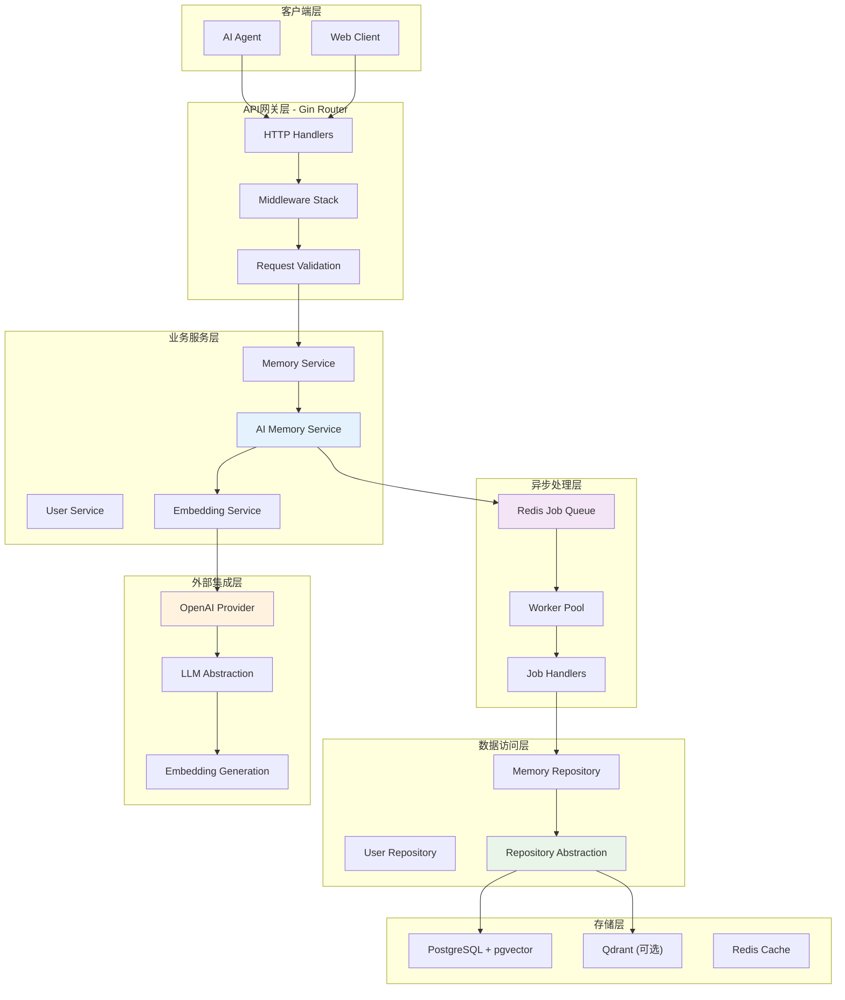
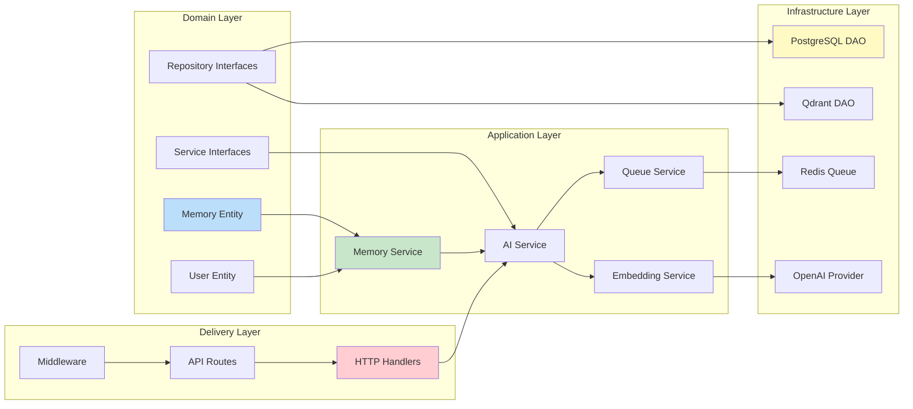
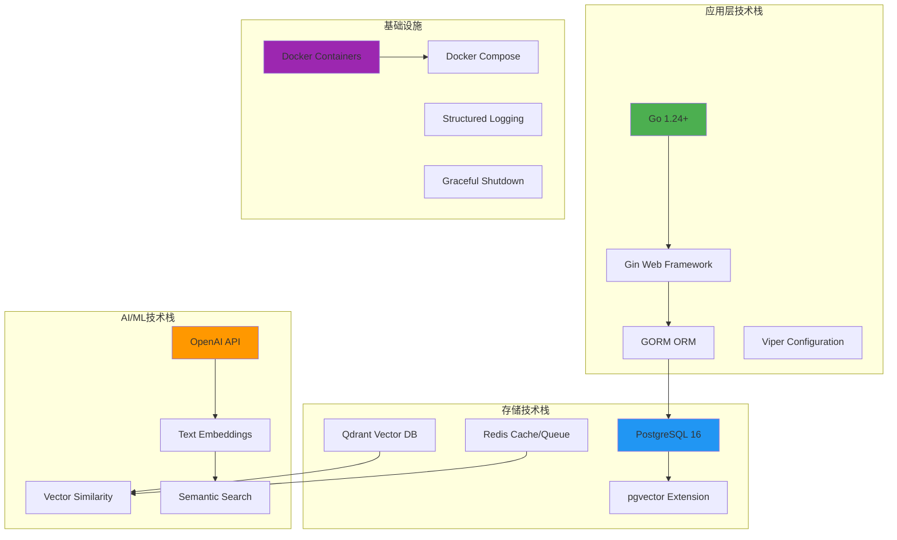
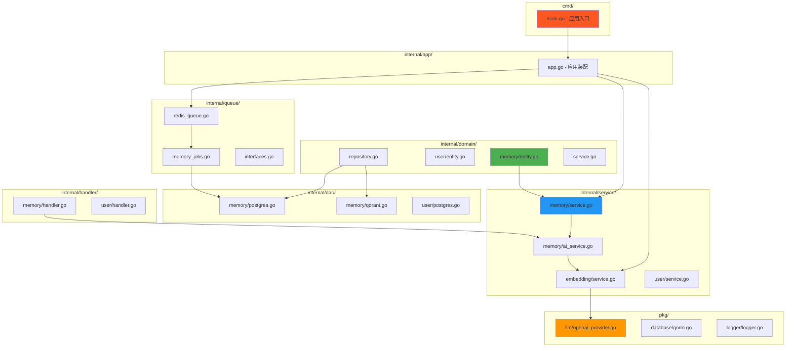
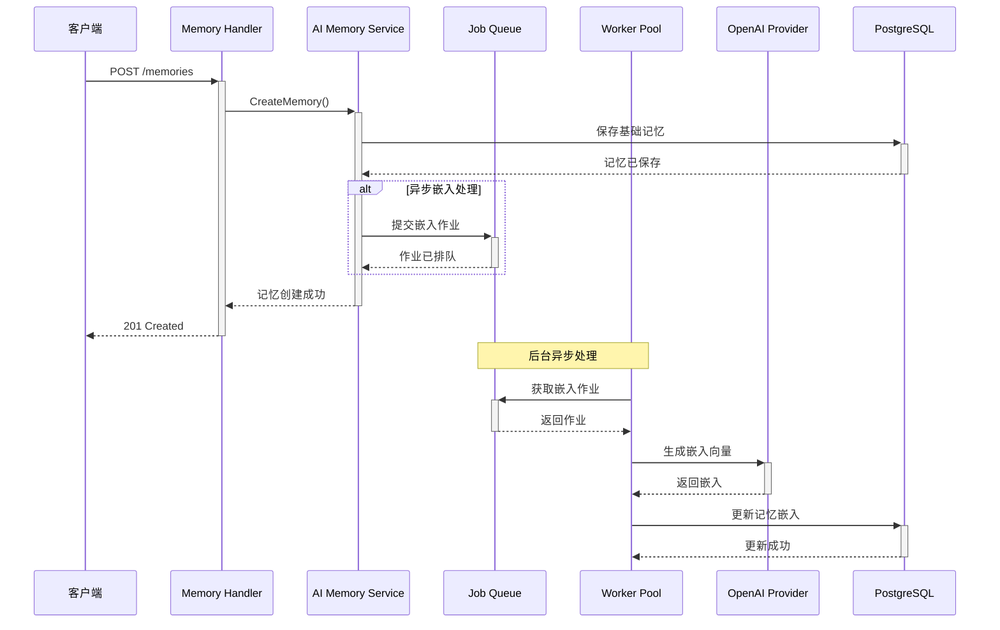
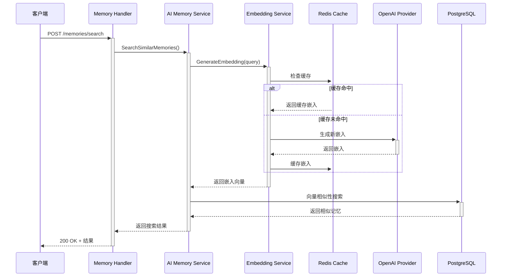
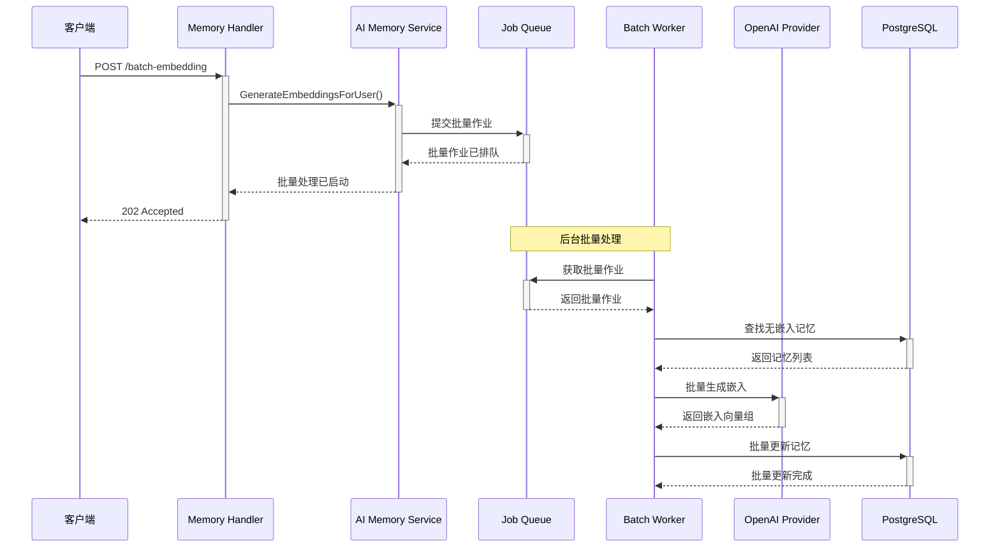
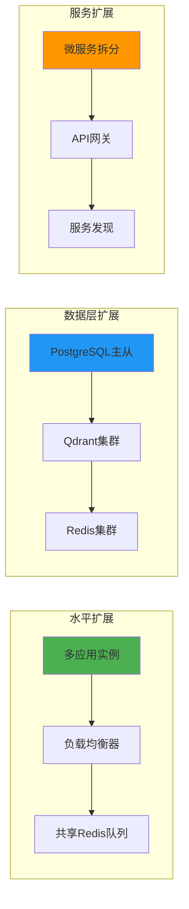
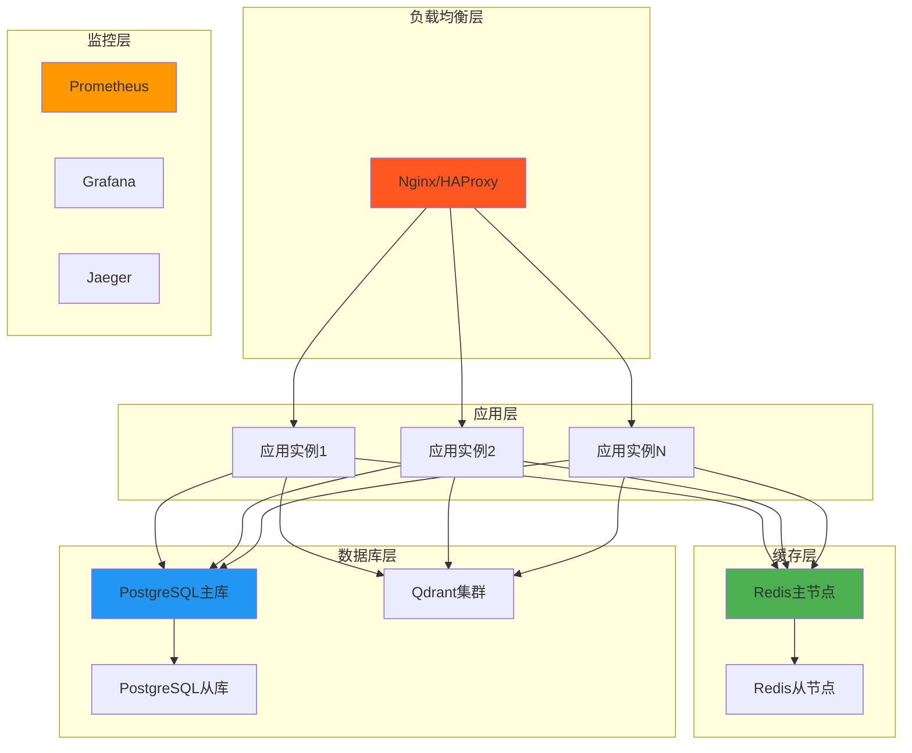

# Go-based AI内存银行系统架构分析报告

**文档版本**: 1.0  
**创建日期**: 2025-08-26  
**分析范围**: 当前实现与Stage2计划对比分析  
**项目状态**: 部分实现，接近Stage2目标

## 1. 执行摘要

### 1.1 分析概述

本报告对Go-based AI内存银行系统的当前实现进行了全面分析，并与Stage2智能化设计计划进行对比。系统采用Clean Architecture架构原则，实现了基础的AI记忆管理功能，包括异步处理、向量相似性搜索和LLM集成等核心特性。

### 1.2 主要发现

- **架构完整度**: 🟢 已实现约80%的Stage2计划功能
- **核心能力**: 🟡 基础AI功能完备，缺少智能决策引擎
- **技术栈**: 🟢 完全符合设计规范，使用现代化Go技术栈
- **扩展性**: 🟢 架构设计良好，支持多数据库后端切换
- **生产就绪度**: 🟡 具备基础生产特性，需要完善监控和错误处理

## 2. 系统整体架构分析

### 2.1 整体系统流程图



### 2.2 架构组件关系图



## 3. 当前实现状况详细分析

### 3.1 已实现的核心功能

#### 3.1.1 基础记忆管理
- ✅ **CRUD操作**: 完整的记忆创建、读取、更新、删除功能
- ✅ **用户隔离**: 基于用户ID的记忆隔离和权限控制
- ✅ **标签系统**: 支持记忆标签的管理和过滤
- ✅ **元数据存储**: 灵活的JSON元数据存储支持

#### 3.1.2 AI增强功能
- ✅ **向量嵌入**: 自动生成和管理记忆内容的向量嵌入
- ✅ **相似性搜索**: 基于向量相似度的记忆检索
- ✅ **混合搜索**: 结合文本搜索和语义搜索的混合检索
- ✅ **缓存机制**: Redis缓存优化嵌入生成性能

#### 3.1.3 异步处理系统
- ✅ **Job Queue**: 基于Redis的分布式作业队列
- ✅ **Worker Pool**: 多工作者并发处理机制
- ✅ **批量处理**: 支持批量嵌入生成和处理
- ✅ **错误重试**: 作业失败重试机制

#### 3.1.4 数据库抽象层
- ✅ **Repository模式**: 清晰的数据访问抽象
- ✅ **多数据库支持**: PostgreSQL和Qdrant双重支持
- ✅ **GORM集成**: 现代化的ORM支持
- ✅ **数据库迁移**: 版本化的数据库迁移管理

### 3.2 技术栈实现分析



### 3.3 配置管理系统

系统采用了完善的分层配置管理：

```yaml
# 配置示例结构
server:
  host: "0.0.0.0"
  port: 8080
  mode: "release"

database:
  host: "localhost"
  port: 5432
  user: "mem_bank_user"
  dbname: "mem_bank"
  
llm:
  provider: "openai"
  api_key: "${OPENAI_API_KEY}"
  embedding_model: "text-embedding-ada-002"
  
queue:
  queue_name: "memory_processing"
  max_retries: 3
  default_concurrency: 5
  
qdrant:
  enabled: false
  host: "localhost"
  port: 6333
```

## 4. Stage2计划对比分析

### 4.1 实现完成度评估

| 功能模块 | Stage2计划 | 当前实现 | 完成度 | 备注 |
|---------|-----------|---------|-------|------|
| **异步处理系统** | ✅ 完整设计 | ✅ 已实现 | 90% | 缺少高级作业调度 |
| **LLM工具调用** | ✅ 框架设计 | ⚠️ 部分实现 | 40% | 缺少工具调用框架 |
| **两阶段记忆管道** | ✅ 详细设计 | ❌ 未实现 | 10% | 仅有基础嵌入处理 |
| **智能决策引擎** | ✅ 完整规范 | ❌ 未实现 | 0% | 核心智能功能缺失 |
| **向量相似性搜索** | ✅ 多种策略 | ✅ 已实现 | 85% | 功能完整 |
| **批量处理API** | ✅ 完整设计 | ⚠️ 部分实现 | 60% | 基础批量功能 |
| **监控和可观测性** | ✅ 详细指标 | ⚠️ 基础实现 | 30% | 缺少详细监控 |

### 4.2 关键缺失功能分析

#### 4.2.1 智能记忆管道缺失
**Stage2计划**: 
- 阶段一：LLM驱动的记忆提取
- 阶段二：智能的记忆更新决策

**当前状态**: 
- ❌ 缺少LLM提取阶段
- ❌ 缺少智能决策引擎
- ✅ 仅实现基础嵌入生成

#### 4.2.2 LLM工具调用框架不完整
**Stage2计划**:
```go
// 计划中的工具调用框架
type Tool struct {
    Name        string      
    Description string      
    Parameters  *Parameters 
}

var MemoryUpdateTools = []Tool{
    {Name: "add_new_memory"},
    {Name: "update_existing_memory"}, 
    {Name: "delete_memory"},
    {Name: "no_operation"},
}
```

**当前状态**:
- ✅ 基础LLM接口已实现
- ❌ 缺少工具定义系统
- ❌ 缺少结构化工具调用

#### 4.2.3 记忆决策智能缺失
**Stage2计划**: 智能判断ADD/UPDATE/DELETE/NOOP操作  
**当前状态**: 只能进行简单的相似性搜索，缺少智能决策

## 5. 代码架构总览图



## 6. 各功能模块时序图

### 6.1 异步记忆创建流程



### 6.2 智能搜索流程



### 6.3 批量处理流程



## 7. 性能和扩展性分析

### 7.1 性能特征

| 性能指标 | 当前实现 | 优化建议 |
|---------|---------|----------|
| **并发处理** | ✅ 支持多工作者并发 | 可根据负载动态调整工作者数量 |
| **缓存策略** | ✅ Redis嵌入缓存 | 可增加查询结果缓存 |
| **批量操作** | ✅ 支持批量嵌入生成 | 可优化批量大小和处理策略 |
| **数据库连接** | ✅ 连接池管理 | 连接池配置可进一步优化 |

### 7.2 扩展性设计



## 8. 生产环境就绪度分析

### 8.1 生产特性检查清单

| 特性类别 | 功能 | 状态 | 备注 |
|---------|-----|------|------|
| **可靠性** | 优雅关闭 | ✅ | 支持graceful shutdown |
| | 错误恢复 | ⚠️ | 基础错误处理，可增强 |
| | 断路器 | ❌ | 缺少断路器模式 |
| **可观测性** | 结构化日志 | ✅ | 完整的日志系统 |
| | 指标收集 | ❌ | 缺少Prometheus指标 |
| | 链路追踪 | ❌ | 未实现分布式追踪 |
| **安全性** | API认证 | ⚠️ | 基础API Key认证 |
| | 输入验证 | ✅ | 完整的请求验证 |
| | 速率限制 | ❌ | 缺少速率限制 |
| **性能** | 连接池 | ✅ | 数据库连接池 |
| | 缓存策略 | ✅ | Redis缓存 |
| | 异步处理 | ✅ | 完整异步处理 |

### 8.2 部署架构建议



## 9. 关键风险和建议

### 9.1 技术风险

| 风险类别 | 风险描述 | 影响等级 | 缓解建议 |
|---------|---------|----------|----------|
| **架构风险** | 缺少智能决策引擎 | 🔴 高 | 优先实现LLM工具调用框架 |
| **性能风险** | LLM API调用延迟 | 🟡 中 | 实现请求缓存和批量处理 |
| **可靠性风险** | 单点故障 | 🟡 中 | 增加健康检查和断路器 |
| **安全风险** | API认证简单 | 🟡 中 | 实现JWT或OAuth2认证 |

### 9.2 优先改进建议

#### 9.2.1 短期目标（1-2月）
1. **实现智能决策引擎** - 核心AI功能
2. **完善LLM工具调用框架** - 结构化AI交互
3. **增加监控指标** - 生产环境可观测性
4. **强化错误处理** - 提升系统可靠性

#### 9.2.2 中期目标（3-6月）
1. **实现两阶段记忆管道** - 完整的AI记忆处理流程
2. **增加安全认证机制** - 企业级安全特性
3. **实现分布式追踪** - 复杂系统调试能力
4. **优化批量处理性能** - 大规模数据处理能力

#### 9.2.3 长期目标（6-12月）
1. **实现多租户支持** - 企业级多用户隔离
2. **增加图数据库集成** - 复杂关系推理能力
3. **实现智能记忆衰减** - 模拟人类记忆特征
4. **开发管理控制台** - 系统运维管理界面

## 10. 总结

### 10.1 整体评估

Go-based AI内存银行系统的当前实现展示了良好的架构设计和工程实践。系统采用了Clean Architecture原则，实现了核心的记忆管理、向量搜索和异步处理功能。代码质量高，结构清晰，具备良好的扩展性。

### 10.2 核心优势

1. **架构设计优秀**: 清晰的分层架构，良好的依赖倒置
2. **技术栈现代化**: Go 1.24+、Gin、GORM等现代化技术
3. **异步处理完备**: 基于Redis的分布式作业队列
4. **多数据库支持**: PostgreSQL和Qdrant的灵活切换
5. **AI集成良好**: OpenAI API的完整封装和抽象

### 10.3 关键不足

1. **智能功能缺失**: 缺少核心的AI决策引擎
2. **工具调用不完整**: LLM工具调用框架需要完善
3. **监控体系薄弱**: 缺少生产级监控和可观测性
4. **两阶段管道未实现**: 核心的智能记忆处理流程缺失

### 10.4 发展路径

系统已经建立了坚实的基础架构，接下来应该专注于实现核心的AI智能功能，特别是智能决策引擎和两阶段记忆管道。这将使系统从基础的记忆存储工具升级为真正的智能记忆管理系统。

**总体评分**: ⭐⭐⭐⭐⭐ (4/5) - 优秀的基础实现，有明确的改进方向

---

**文档状态**: 完成  
**最后更新**: 2025-08-26  
**相关文档**: [Stage2智能化设计](./stage2-intelligent-design.md), [架构蓝图](./arch.md)
